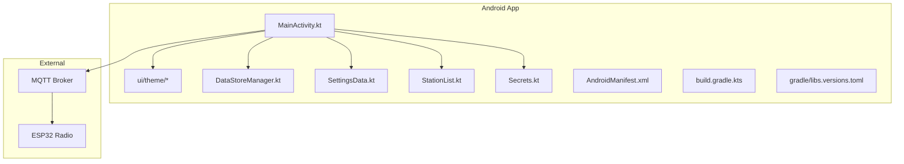
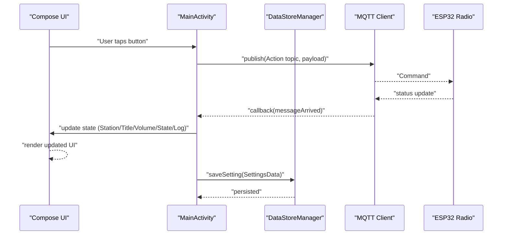
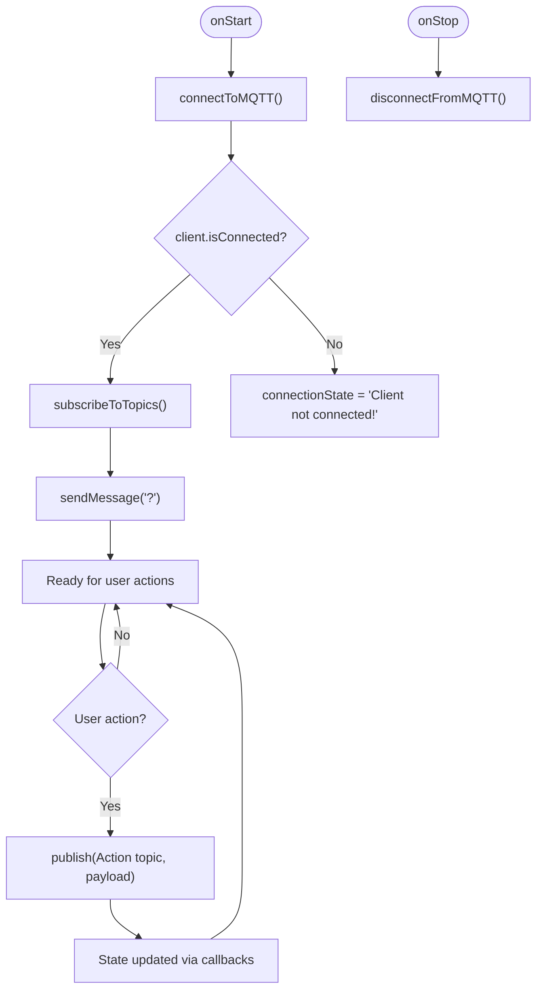
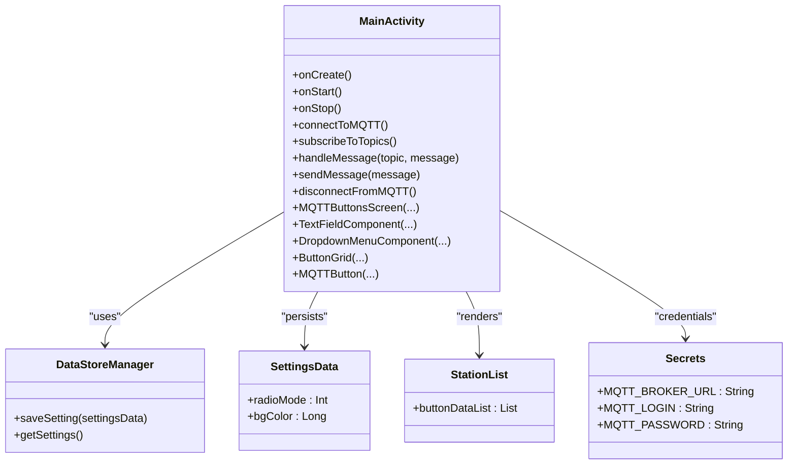
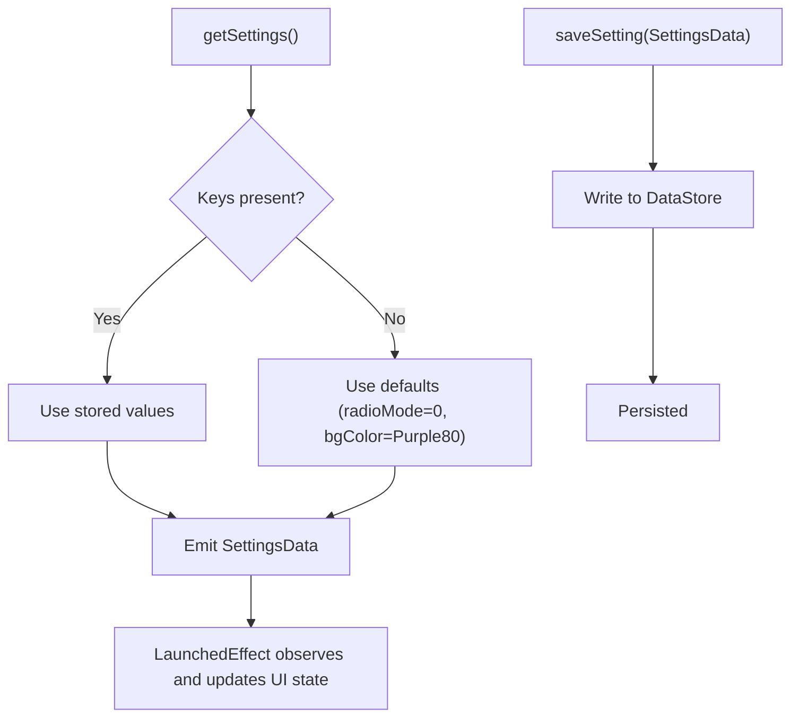
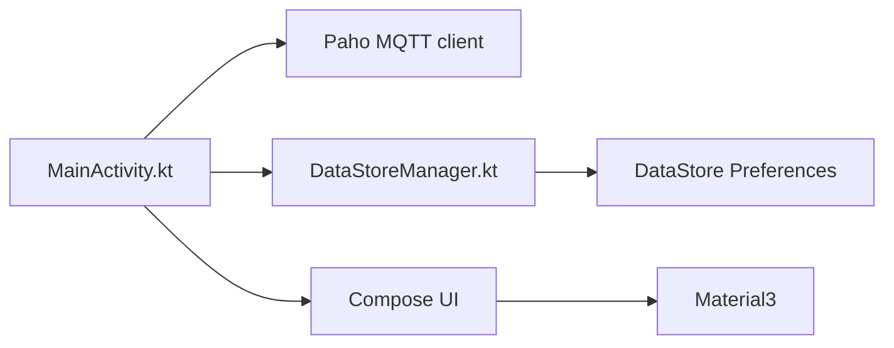

# Android Application

<cite>
**Referenced Files in This Document**
- [MainActivity.kt](file://WebRadio_android/app/src/main/java/com/dip16/webradio/MainActivity.kt)
- [DataStoreManager.kt](file://WebRadio_android/app/src/main/java/com/dip16/webradio/DataStoreManager.kt)
- [SettingsData.kt](file://WebRadio_android/app/src/main/java/com/dip16/webradio/SettingsData.kt)
- [StationList.kt](file://WebRadio_android/app/src/main/java/com/dip16/webradio/StationList.kt)
- [Secrets.kt](file://WebRadio_android/app/src/main/java/com/dip16/webradio/Secrets.kt)
- [Theme.kt](file://WebRadio_android/app/src/main/java/com/dip16/webradio/ui/theme/Theme.kt)
- [Color.kt](file://WebRadio_android/app/src/main/java/com/dip16/webradio/ui/theme/Color.kt)
- [Type.kt](file://WebRadio_android/app/src/main/java/com/dip16/webradio/ui/theme/Type.kt)
- [AndroidManifest.xml](file://WebRadio_android/app/src/main/AndroidManifest.xml)
- [build.gradle.kts](file://WebRadio_android/app/build.gradle.kts)
- [libs.versions.toml](file://WebRadio_android/gradle/libs.versions.toml)
- [settings.gradle.kts](file://WebRadio_android/settings.gradle.kts)
- [README.md](file://WebRadio_android/README.md)
- [README.md](file://README.md)
</cite>

## Table of Contents
1. [Introduction](#introduction)
2. [Project Structure](#project-structure)
3. [Core Components](#core-components)
4. [Architecture Overview](#architecture-overview)
5. [Detailed Component Analysis](#detailed-component-analysis)
6. [Dependency Analysis](#dependency-analysis)
7. [Performance Considerations](#performance-considerations)
8. [Troubleshooting Guide](#troubleshooting-guide)
9. [Conclusion](#conclusion)
10. [Appendices](#appendices)

## Introduction
This document describes the Android application component of the WebRadio IoT project. It is a Jetpack Compose-based remote control for an ESP32 internet radio, communicating with the device over MQTT. The app supports real-time status updates, persistent settings, multi-device switching, and a grid of station presets. It is designed as a single-Activity architecture with Compose UI and DataStore-backed settings.

## Project Structure
The Android app resides under WebRadio_android/app and follows a conventional Gradle Kotlin project layout. Key areas:
- UI theme and Compose components under ui/theme
- Application entry point MainActivity.kt
- DataStore-backed settings via DataStoreManager.kt and SettingsData.kt
- Station presets list in StationList.kt
- MQTT credentials in Secrets.kt
- Build configuration in build.gradle.kts and libs.versions.toml
- Manifest permissions and activity declaration in AndroidManifest.xml

**Diagram sources**
- [MainActivity.kt:102-133](file://WebRadio_android/app/src/main/java/com/dip16/webradio/MainActivity.kt#L102-L133)
- [Theme.kt:44-81](file://WebRadio_android/app/src/main/java/com/dip16/webradio/ui/theme/Theme.kt#L44-L81)
- [DataStoreManager.kt:16-42](file://WebRadio_android/app/src/main/java/com/dip16/webradio/DataStoreManager.kt#L16-L42)
- [SettingsData.kt:3-7](file://WebRadio_android/app/src/main/java/com/dip16/webradio/SettingsData.kt#L3-L7)
- [StationList.kt:5-168](file://WebRadio_android/app/src/main/java/com/dip16/webradio/StationList.kt#L5-L168)
- [Secrets.kt:7-11](file://WebRadio_android/app/src/main/java/com/dip16/webradio/Secrets.kt#L7-L11)
- [AndroidManifest.xml:17-27](file://WebRadio_android/app/src/main/AndroidManifest.xml#L17-L27)
- [build.gradle.kts:52-74](file://WebRadio_android/app/build.gradle.kts#L52-L74)
- [libs.versions.toml:17-36](file://WebRadio_android/gradle/libs.versions.toml#L17-L36)

**Section sources**
- [MainActivity.kt:102-133](file://WebRadio_android/app/src/main/java/com/dip16/webradio/MainActivity.kt#L102-L133)
- [AndroidManifest.xml:17-27](file://WebRadio_android/app/src/main/AndroidManifest.xml#L17-L27)
- [build.gradle.kts:52-74](file://WebRadio_android/app/build.gradle.kts#L52-L74)
- [libs.versions.toml:17-36](file://WebRadio_android/gradle/libs.versions.toml#L17-L36)

## Core Components
- MainActivity: Hosts the Compose UI, manages MQTT lifecycle, handles real-time updates, and orchestrates user actions.
- DataStoreManager: Persists and retrieves SettingsData (radio mode and background color).
- SettingsData: Immutable data holder for persisted settings.
- StationList: Provides a predefined list of ButtonData entries for the station grid.
- Secrets: Stores MQTT broker credentials.
- Theme: Defines Material3 color schemes and status bar behavior.

Key responsibilities:
- UI rendering and state management via Compose
- MQTT connection, subscription, publishing, and callback handling
- Persistent settings via DataStore
- Station presets and action dispatch

**Section sources**
- [MainActivity.kt:87-133](file://WebRadio_android/app/src/main/java/com/dip16/webradio/MainActivity.kt#L87-L133)
- [DataStoreManager.kt:16-42](file://WebRadio_android/app/src/main/java/com/dip16/webradio/DataStoreManager.kt#L16-L42)
- [SettingsData.kt:3-7](file://WebRadio_android/app/src/main/java/com/dip16/webradio/SettingsData.kt#L3-L7)
- [StationList.kt:5-168](file://WebRadio_android/app/src/main/java/com/dip16/webradio/StationList.kt#L5-L168)
- [Secrets.kt:7-11](file://WebRadio_android/app/src/main/java/com/dip16/webradio/Secrets.kt#L7-L11)
- [Theme.kt:44-81](file://WebRadio_android/app/src/main/java/com/dip16/webradio/ui/theme/Theme.kt#L44-L81)

## Architecture Overview
The app follows a single-Activity Compose architecture with reactive state and asynchronous operations. The Activity initializes Compose, sets up DataStore-backed settings, and manages MQTT lifecycle. UI composables render state and emit actions that trigger MQTT publishes. The ESP32 device publishes status updates to MQTT topics, which the app receives and reflects in the UI.

**Diagram sources**
- [MainActivity.kt:171-246](file://WebRadio_android/app/src/main/java/com/dip16/webradio/MainActivity.kt#L171-L246)
- [MainActivity.kt:257-296](file://WebRadio_android/app/src/main/java/com/dip16/webradio/MainActivity.kt#L257-L296)
- [MainActivity.kt:312-331](file://WebRadio_android/app/src/main/java/com/dip16/webradio/MainActivity.kt#L312-L331)
- [DataStoreManager.kt:18-25](file://WebRadio_android/app/src/main/java/com/dip16/webradio/DataStoreManager.kt#L18-L25)

**Section sources**
- [MainActivity.kt:171-246](file://WebRadio_android/app/src/main/java/com/dip16/webradio/MainActivity.kt#L171-L246)
- [MainActivity.kt:257-296](file://WebRadio_android/app/src/main/java/com/dip16/webradio/MainActivity.kt#L257-L296)
- [MainActivity.kt:312-331](file://WebRadio_android/app/src/main/java/com/dip16/webradio/MainActivity.kt#L312-L331)
- [DataStoreManager.kt:18-25](file://WebRadio_android/app/src/main/java/com/dip16/webradio/DataStoreManager.kt#L18-L25)

## Detailed Component Analysis

### MainActivity Implementation
Responsibilities:
- Initialize Compose theme and render the main screen
- Manage DataStore settings collection and persist selections
- Lifecycle-aware MQTT connection and disconnection
- Subscribe to status topics and update UI state
- Publish actions to control the radio
- Provide UI composables for text fields, dropdown menus, and buttons

Key UI flows:
- Settings loading: LaunchedEffect collects SettingsData and updates background color and radio mode
- MQTT lifecycle: onStart connects, onStop disconnects; callbacks update connectionState and handle reconnection
- Topic handling: handleMessage routes messages to state updates for Station, Title, Volume, State, Alarm, Log
- Action dispatch: Button clicks and menu selections publish payloads to Home/{radioName}/Action

**Diagram sources**
- [MainActivity.kt:135-162](file://WebRadio_android/app/src/main/java/com/dip16/webradio/MainActivity.kt#L135-L162)
- [MainActivity.kt:171-246](file://WebRadio_android/app/src/main/java/com/dip16/webradio/MainActivity.kt#L171-L246)
- [MainActivity.kt:257-296](file://WebRadio_android/app/src/main/java/com/dip16/webradio/MainActivity.kt#L257-L296)
- [MainActivity.kt:312-331](file://WebRadio_android/app/src/main/java/com/dip16/webradio/MainActivity.kt#L312-L331)

**Section sources**
- [MainActivity.kt:102-133](file://WebRadio_android/app/src/main/java/com/dip16/webradio/MainActivity.kt#L102-L133)
- [MainActivity.kt:135-162](file://WebRadio_android/app/src/main/java/com/dip16/webradio/MainActivity.kt#L135-L162)
- [MainActivity.kt:171-246](file://WebRadio_android/app/src/main/java/com/dip16/webradio/MainActivity.kt#L171-L246)
- [MainActivity.kt:257-296](file://WebRadio_android/app/src/main/java/com/dip16/webradio/MainActivity.kt#L257-L296)
- [MainActivity.kt:312-331](file://WebRadio_android/app/src/main/java/com/dip16/webradio/MainActivity.kt#L312-L331)

### UI Components and Interactions
- MQTTButtonsScreen: Top-level layout with status fields, dropdown menus, and a grid of station buttons
- TextFieldComponent, VolumeTextField, TitleTextField: Read-only text fields displaying Station, Volume/state, and Title/log
- DropdownMenuComponent, DropdownMenuComponent2: Menus for Alarm and Work Mode selection
- ButtonGrid and ButtonComponent: Controls for POWER, CHANNEL +/-, VOLUME +/-, SLEEP
- MQTTButton: Station selection with genre-based coloring and sound feedback

Data binding pattern:
- State variables (station, title, state, volume, logText, connectionState) drive UI updates
- LaunchedEffect observes DataStore settings and updates UI state accordingly
- Menu selections update selectedIndex and selectedIndex2, triggering saves and MQTT publishes

**Diagram sources**
- [MainActivity.kt:87-133](file://WebRadio_android/app/src/main/java/com/dip16/webradio/MainActivity.kt#L87-L133)
- [DataStoreManager.kt:16-42](file://WebRadio_android/app/src/main/java/com/dip16/webradio/DataStoreManager.kt#L16-L42)
- [SettingsData.kt:3-7](file://WebRadio_android/app/src/main/java/com/dip16/webradio/SettingsData.kt#L3-L7)
- [StationList.kt:5-168](file://WebRadio_android/app/src/main/java/com/dip16/webradio/StationList.kt#L5-L168)
- [Secrets.kt:7-11](file://WebRadio_android/app/src/main/java/com/dip16/webradio/Secrets.kt#L7-L11)

**Section sources**
- [MainActivity.kt:336-442](file://WebRadio_android/app/src/main/java/com/dip16/webradio/MainActivity.kt#L336-L442)
- [MainActivity.kt:453-631](file://WebRadio_android/app/src/main/java/com/dip16/webradio/MainActivity.kt#L453-L631)
- [MainActivity.kt:633-690](file://WebRadio_android/app/src/main/java/com/dip16/webradio/MainActivity.kt#L633-L690)
- [MainActivity.kt:743-848](file://WebRadio_android/app/src/main/java/com/dip16/webradio/MainActivity.kt#L743-L848)

### DataStoreManager and SettingsData
- DataStoreManager persists SettingsData with keys for radioMode and bgColor
- getSettings maps Preferences to SettingsData with defaults
- saveSetting writes values to DataStore

**Diagram sources**
- [DataStoreManager.kt:34-41](file://WebRadio_android/app/src/main/java/com/dip16/webradio/DataStoreManager.kt#L34-L41)
- [DataStoreManager.kt:18-25](file://WebRadio_android/app/src/main/java/com/dip16/webradio/DataStoreManager.kt#L18-L25)
- [SettingsData.kt:3-7](file://WebRadio_android/app/src/main/java/com/dip16/webradio/SettingsData.kt#L3-L7)

**Section sources**
- [DataStoreManager.kt:16-42](file://WebRadio_android/app/src/main/java/com/dip16/webradio/DataStoreManager.kt#L16-L42)
- [SettingsData.kt:3-7](file://WebRadio_android/app/src/main/java/com/dip16/webradio/SettingsData.kt#L3-L7)

### StationList Management
- buttonDataList defines station presets with name, genre, and URL
- Each station button publishes its URL payload to Home/{radioName}/Action
- Genre-based button colors enhance visual grouping

**Section sources**
- [StationList.kt:5-168](file://WebRadio_android/app/src/main/java/com/dip16/webradio/StationList.kt#L5-L168)
- [MainActivity.kt:761-848](file://WebRadio_android/app/src/main/java/com/dip16/webradio/MainActivity.kt#L761-L848)

### Theme and Design Principles
- WebRadioTheme applies Material3 color schemes and adjusts status bar appearance
- Typography and color assets are centralized for consistency
- UI uses rounded shapes, bold text, and constrained layouts for readability

**Section sources**
- [Theme.kt:44-81](file://WebRadio_android/app/src/main/java/com/dip16/webradio/ui/theme/Theme.kt#L44-L81)
- [Color.kt:5-11](file://WebRadio_android/app/src/main/java/com/dip16/webradio/ui/theme/Color.kt#L5-L11)
- [Type.kt:10-34](file://WebRadio_android/app/src/main/java/com/dip16/webradio/ui/theme/Type.kt#L10-L34)

### Build Configuration and Dependencies
- Gradle Kotlin DSL with Compose enabled
- Dependencies include AndroidX Compose BOM, Material3, Lifecycle Runtime KTX, Paho MQTT client, and DataStore preferences
- Version catalog defines library versions and aliases

**Section sources**
- [build.gradle.kts:52-74](file://WebRadio_android/app/build.gradle.kts#L52-L74)
- [libs.versions.toml:17-36](file://WebRadio_android/gradle/libs.versions.toml#L17-L36)
- [settings.gradle.kts:1-24](file://WebRadio_android/settings.gradle.kts#L1-L24)

## Dependency Analysis
External libraries and their roles:
- Paho MQTT client: Handles MQTT connection, callbacks, and message publishing/subscribing
- DataStore preferences: Stores user preferences (radio mode, background color)
- Jetpack Compose: Declarative UI toolkit
- Material3: Theming and components

**Diagram sources**
- [MainActivity.kt:171-246](file://WebRadio_android/app/src/main/java/com/dip16/webradio/MainActivity.kt#L171-L246)
- [DataStoreManager.kt:16-42](file://WebRadio_android/app/src/main/java/com/dip16/webradio/DataStoreManager.kt#L16-L42)
- [build.gradle.kts:52-74](file://WebRadio_android/app/build.gradle.kts#L52-L74)

**Section sources**
- [build.gradle.kts:52-74](file://WebRadio_android/app/build.gradle.kts#L52-L74)
- [libs.versions.toml:17-36](file://WebRadio_android/gradle/libs.versions.toml#L17-L36)

## Performance Considerations
- Keep UI updates on the main thread; background operations (MQTT, DataStore) run on Dispatchers.IO
- Minimize recompositions by using remember and immutable state
- Avoid frequent reconnects; the app disables automatic reconnection and reconnects only when active
- Use lazy grids for station lists to reduce layout overhead

## Troubleshooting Guide
Common issues and resolutions:
- MQTT connection failures
  - Verify broker URL, login, and password in Secrets.kt
  - Check network connectivity and firewall rules
  - Review logs for connectionState and error messages
- UI not updating with status
  - Ensure topics are subscribed and handleMessage routes messages to state updates
  - Confirm radioName matches the device identifier
- Settings not persisting
  - Confirm DataStore keys exist and DataStoreManager.saveSetting is invoked
  - Check for exceptions during write operations
- Buttons not responding
  - Ensure publish occurs on IO dispatcher and payloads match expected formats
  - Verify MediaPlayer resource availability for button sounds

**Section sources**
- [MainActivity.kt:188-246](file://WebRadio_android/app/src/main/java/com/dip16/webradio/MainActivity.kt#L188-L246)
- [MainActivity.kt:257-296](file://WebRadio_android/app/src/main/java/com/dip16/webradio/MainActivity.kt#L257-L296)
- [DataStoreManager.kt:18-25](file://WebRadio_android/app/src/main/java/com/dip16/webradio/DataStoreManager.kt#L18-L25)
- [Secrets.kt:7-11](file://WebRadio_android/app/src/main/java/com/dip16/webradio/Secrets.kt#L7-L11)

## Conclusion
The Android app provides a robust, state-driven UI for controlling an ESP32 internet radio over MQTT. It leverages Jetpack Compose for declarative UI, DataStore for persistence, and a clear separation of concerns within a single Activity. The architecture supports real-time updates, persistent settings, and extensible station presets.

## Appendices

### User Workflow: From Installation to Daily Use
- Install the app on an Android device
- Configure MQTT credentials in Secrets.kt
- Launch the app; it connects to the MQTT broker and subscribes to status topics
- View current station, title, volume, and connection status
- Select a station from the grid or use control buttons
- Set an alarm via the Alarm dropdown menu
- Switch between devices (e.g., WebRadio1/WebRadio2) using Work Mode
- Persisted settings are restored on subsequent launches

**Section sources**
- [README.md:29-60](file://WebRadio_android/README.md#L29-L60)
- [MainActivity.kt:111-120](file://WebRadio_android/app/src/main/java/com/dip16/webradio/MainActivity.kt#L111-L120)
- [MainActivity.kt:257-296](file://WebRadio_android/app/src/main/java/com/dip16/webradio/MainActivity.kt#L257-L296)
- [AndroidManifest.xml:5](file://WebRadio_android/app/src/main/AndroidManifest.xml#L5)

### MQTT Communication Patterns and Real-time Updates
- Published topics
  - Home/{radioName}/Action: Commands such as ?, b1, b2, b3, b4, vol+, vol-, s<seconds>, sAlarm OFF, and station URLs
- Subscribed topics
  - Home/{radioName}/State, /Station, /Title, /Volume, /Alarm, /Log
- Real-time updates
  - handleMessage updates UI state; connectionState indicates connection health
  - Alarm payloads are parsed and mapped to dropdown indices

**Section sources**
- [README.md:61-90](file://WebRadio_android/README.md#L61-L90)
- [MainActivity.kt:257-296](file://WebRadio_android/app/src/main/java/com/dip16/webradio/MainActivity.kt#L257-L296)
- [MainActivity.kt:298-310](file://WebRadio_android/app/src/main/java/com/dip16/webradio/MainActivity.kt#L298-L310)

### Customization and Extensibility
- Add new stations
  - Extend buttonDataList with new ButtonData entries
- Customize UI
  - Modify WebRadioTheme color scheme and typography
  - Adjust button colors and layouts in composables
- Add features
  - Introduce new topics and payloads; extend handleMessage and UI components
  - Persist new settings via DataStoreManager and SettingsData

**Section sources**
- [StationList.kt:5-168](file://WebRadio_android/app/src/main/java/com/dip16/webradio/StationList.kt#L5-L168)
- [Theme.kt:20-41](file://WebRadio_android/app/src/main/java/com/dip16/webradio/ui/theme/Theme.kt#L20-L41)
- [DataStoreManager.kt:18-25](file://WebRadio_android/app/src/main/java/com/dip16/webradio/DataStoreManager.kt#L18-L25)

### Debugging Tips
- Enable logging for MQTT events and DataStore operations
- Verify manifest permissions (INTERNET)
- Test broker accessibility and credentials
- Inspect LiveData/Flow emissions and state transitions in composables

**Section sources**
- [AndroidManifest.xml:5](file://WebRadio_android/app/src/main/AndroidManifest.xml#L5)
- [MainActivity.kt:171-246](file://WebRadio_android/app/src/main/java/com/dip16/webradio/MainActivity.kt#L171-L246)
- [DataStoreManager.kt:34-41](file://WebRadio_android/app/src/main/java/com/dip16/webradio/DataStoreManager.kt#L34-L41)