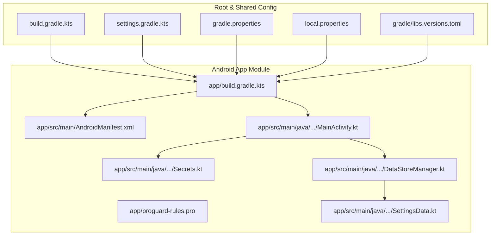
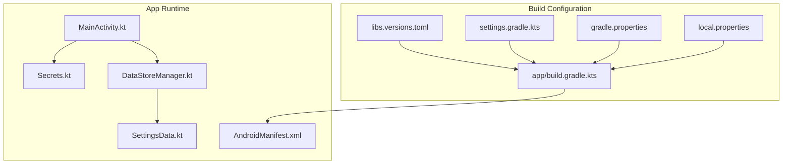
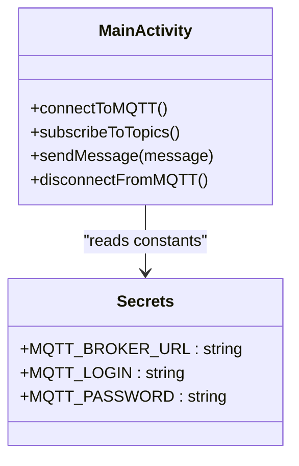
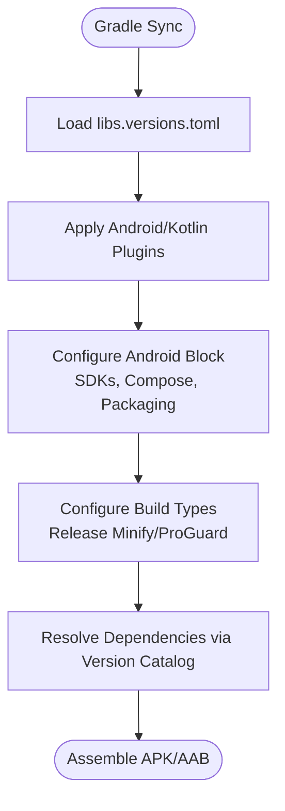
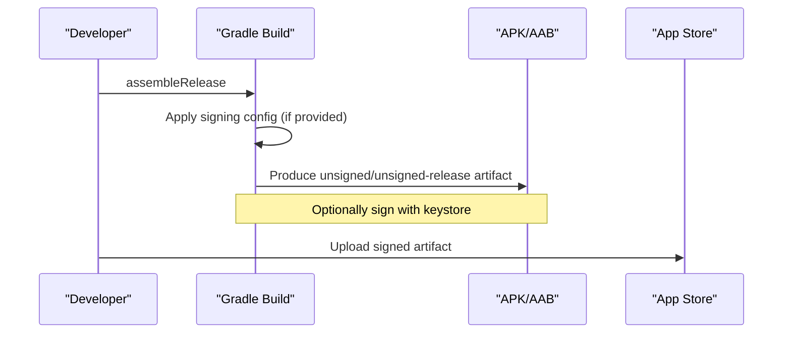
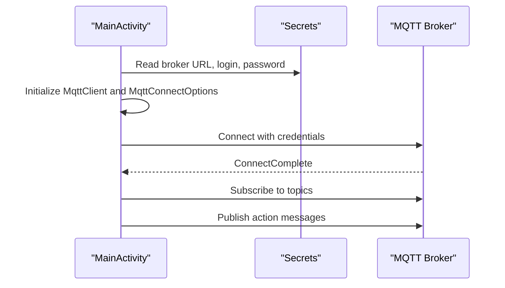
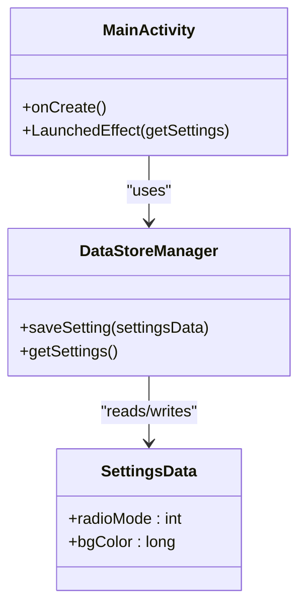
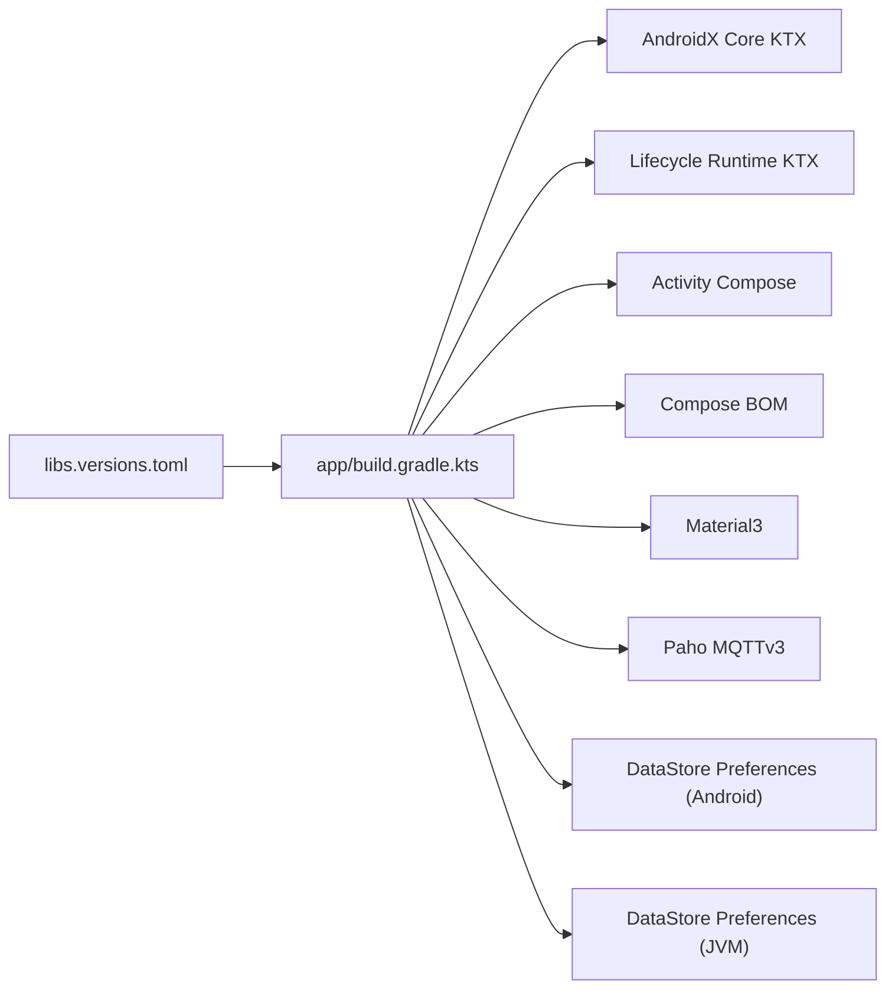

# Configuration & Build Setup

<cite>
**Referenced Files in This Document**
- [Secrets.kt](file://WebRadio_android/app/src/main/java/com/dip16/webradio/Secrets.kt)
- [Secrets.kt.example](file://WebRadio_android/app/src/main/java/com/dip16/webradio/Secrets.kt.example)
- [build.gradle.kts](file://WebRadio_android/app/build.gradle.kts)
- [build.gradle.kts](file://WebRadio_android/build.gradle.kts)
- [settings.gradle.kts](file://WebRadio_android/settings.gradle.kts)
- [gradle.properties](file://WebRadio_android/gradle.properties)
- [local.properties](file://WebRadio_android/local.properties)
- [libs.versions.toml](file://WebRadio_android/gradle/libs.versions.toml)
- [proguard-rules.pro](file://WebRadio_android/app/proguard-rules.pro)
- [AndroidManifest.xml](file://WebRadio_android/app/src/main/AndroidManifest.xml)
- [MainActivity.kt](file://WebRadio_android/app/src/main/java/com/dip16/webradio/MainActivity.kt)
- [DataStoreManager.kt](file://WebRadio_android/app/src/main/java/com/dip16/webradio/DataStoreManager.kt)
- [SettingsData.kt](file://WebRadio_android/app/src/main/java/com/dip16/webradio/SettingsData.kt)
- [signing-config-versions.json](file://WebRadio_android/app/build/intermediates/signing_config_versions/debug/writeDebugSigningConfigVersions/signing-config-versions.json)
</cite>

## Table of Contents
1. [Introduction](#introduction)
2. [Project Structure](#project-structure)
3. [Core Components](#core-components)
4. [Architecture Overview](#architecture-overview)
5. [Detailed Component Analysis](#detailed-component-analysis)
6. [Dependency Analysis](#dependency-analysis)
7. [Performance Considerations](#performance-considerations)
8. [Troubleshooting Guide](#troubleshooting-guide)
9. [Conclusion](#conclusion)
10. [Appendices](#appendices)

## Introduction
This document explains the application configuration and build setup for the Android app. It covers:
- The Secrets.kt configuration system for MQTT broker credentials, network settings, and device identifiers
- The example configuration template and security best practices for credential management
- The Gradle build configuration including dependencies (Jetpack Compose, Paho MQTT, Material3), compile/target SDK versions, and build features
- Build variants, signing configurations, and release preparation
- Dependency management for AndroidX libraries, Compose UI components, and MQTT client integration
- Troubleshooting common build issues, dependency conflicts, and version compatibility problems

## Project Structure
The Android application resides under WebRadio_android/app and uses Gradle Kotlin DSL. Key configuration areas:
- Build scripts define compile/target SDK, Compose support, packaging exclusions, and dependency versions
- Version catalogs centralize dependency versions and plugin IDs
- Manifest declares permissions and activity metadata
- Secrets.kt holds MQTT credentials; a template example is provided
- DataStore is used for lightweight preference storage

**Diagram sources**
- [build.gradle.kts:1-74](file://WebRadio_android/app/build.gradle.kts#L1-L74)
- [settings.gradle.kts:1-24](file://WebRadio_android/settings.gradle.kts#L1-L24)
- [gradle.properties:1-23](file://WebRadio_android/gradle.properties#L1-L23)
- [local.properties:1-9](file://WebRadio_android/local.properties#L1-L9)
- [libs.versions.toml:1-42](file://WebRadio_android/gradle/libs.versions.toml#L1-L42)
- [AndroidManifest.xml:1-30](file://WebRadio_android/app/src/main/AndroidManifest.xml#L1-L30)
- [Secrets.kt:1-11](file://WebRadio_android/app/src/main/java/com/dip16/webradio/Secrets.kt#L1-L11)
- [MainActivity.kt:1-922](file://WebRadio_android/app/src/main/java/com/dip16/webradio/MainActivity.kt#L1-L922)
- [DataStoreManager.kt:1-42](file://WebRadio_android/app/src/main/java/com/dip16/webradio/DataStoreManager.kt#L1-L42)
- [SettingsData.kt:1-7](file://WebRadio_android/app/src/main/java/com/dip16/webradio/SettingsData.kt#L1-L7)

**Section sources**
- [build.gradle.kts:1-74](file://WebRadio_android/app/build.gradle.kts#L1-L74)
- [settings.gradle.kts:1-24](file://WebRadio_android/settings.gradle.kts#L1-L24)
- [gradle.properties:1-23](file://WebRadio_android/gradle.properties#L1-L23)
- [local.properties:1-9](file://WebRadio_android/local.properties#L1-L9)
- [libs.versions.toml:1-42](file://WebRadio_android/gradle/libs.versions.toml#L1-L42)
- [AndroidManifest.xml:1-30](file://WebRadio_android/app/src/main/AndroidManifest.xml#L1-L30)

## Core Components
- Secrets.kt: Holds MQTT broker URL, login, and password constants. Used at runtime to connect to the MQTT broker.
- Secrets.kt.example: Template for developers to copy and customize locally; emphasizes keeping the real Secrets.kt out of version control.
- MainActivity: Orchestrates Compose UI, connects to MQTT using Secrets, subscribes to topics, and publishes messages.
- DataStoreManager and SettingsData: Persist and retrieve simple user settings (radio mode and background color) using AndroidX DataStore Preferences.

Security and configuration highlights:
- Credentials are stored in a dedicated object and accessed via imports in MainActivity.
- The example template instructs copying to Secrets.kt and adding it to .gitignore.
- The manifest declares INTERNET permission for network access.

**Section sources**
- [Secrets.kt:1-11](file://WebRadio_android/app/src/main/java/com/dip16/webradio/Secrets.kt#L1-L11)
- [Secrets.kt.example:1-12](file://WebRadio_android/app/src/main/java/com/dip16/webradio/Secrets.kt.example#L1-L12)
- [MainActivity.kt:171-246](file://WebRadio_android/app/src/main/java/com/dip16/webradio/MainActivity.kt#L171-L246)
- [DataStoreManager.kt:1-42](file://WebRadio_android/app/src/main/java/com/dip16/webradio/DataStoreManager.kt#L1-L42)
- [SettingsData.kt:1-7](file://WebRadio_android/app/src/main/java/com/dip16/webradio/SettingsData.kt#L1-L7)
- [AndroidManifest.xml:5-5](file://WebRadio_android/app/src/main/AndroidManifest.xml#L5-L5)

## Architecture Overview
The app’s runtime configuration and build architecture:

**Diagram sources**
- [libs.versions.toml:1-42](file://WebRadio_android/gradle/libs.versions.toml#L1-L42)
- [build.gradle.kts:1-74](file://WebRadio_android/app/build.gradle.kts#L1-L74)
- [settings.gradle.kts:1-24](file://WebRadio_android/settings.gradle.kts#L1-L24)
- [gradle.properties:1-23](file://WebRadio_android/gradle.properties#L1-L23)
- [local.properties:1-9](file://WebRadio_android/local.properties#L1-L9)
- [AndroidManifest.xml:1-30](file://WebRadio_android/app/src/main/AndroidManifest.xml#L1-L30)
- [MainActivity.kt:1-922](file://WebRadio_android/app/src/main/java/com/dip16/webradio/MainActivity.kt#L1-L922)
- [Secrets.kt:1-11](file://WebRadio_android/app/src/main/java/com/dip16/webradio/Secrets.kt#L1-L11)
- [DataStoreManager.kt:1-42](file://WebRadio_android/app/src/main/java/com/dip16/webradio/DataStoreManager.kt#L1-L42)
- [SettingsData.kt:1-7](file://WebRadio_android/app/src/main/java/com/dip16/webradio/SettingsData.kt#L1-L7)

## Detailed Component Analysis

### Secrets.kt Configuration System
- Purpose: Centralized, compile-time constants for MQTT broker URL, login, and password.
- Usage: Imported and referenced in MainActivity to establish MQTT connections.
- Security template: Secrets.kt.example demonstrates how to copy and replace placeholders with real values; advises adding the real Secrets.kt to .gitignore.

**Diagram sources**
- [Secrets.kt:7-11](file://WebRadio_android/app/src/main/java/com/dip16/webradio/Secrets.kt#L7-L11)
- [MainActivity.kt:171-246](file://WebRadio_android/app/src/main/java/com/dip16/webradio/MainActivity.kt#L171-L246)

**Section sources**
- [Secrets.kt:1-11](file://WebRadio_android/app/src/main/java/com/dip16/webradio/Secrets.kt#L1-L11)
- [Secrets.kt.example:1-12](file://WebRadio_android/app/src/main/java/com/dip16/webradio/Secrets.kt.example#L1-L12)
- [MainActivity.kt:171-246](file://WebRadio_android/app/src/main/java/com/dip16/webradio/MainActivity.kt#L171-L246)

### Gradle Build Configuration
- Android block:
  - Namespace, compileSdk, minSdk, targetSdk, versionCode/name, test runner, vector support
  - Compose enabled, Kotlin compiler extension version, packaging excludes
- Build types:
  - Release configured with minification disabled and custom ProGuard rules
- Dependencies managed via libs.versions.toml:
  - AndroidX Core KTX, Lifecycle Runtime KTX, Activity Compose
  - Jetpack Compose BOM, UI, UI Graphics, Tooling Preview, Material3
  - Paho MQTT client (org.eclipse.paho.client.mqttv3)
  - AndroidX DataStore Preferences (both JVM and Android variants)
  - Test and AndroidTest dependencies aligned with Compose BOM

**Diagram sources**
- [libs.versions.toml:1-42](file://WebRadio_android/gradle/libs.versions.toml#L1-L42)
- [build.gradle.kts:6-50](file://WebRadio_android/app/build.gradle.kts#L6-L50)
- [build.gradle.kts:52-74](file://WebRadio_android/app/build.gradle.kts#L52-L74)

**Section sources**
- [build.gradle.kts:1-74](file://WebRadio_android/app/build.gradle.kts#L1-L74)
- [libs.versions.toml:1-42](file://WebRadio_android/gradle/libs.versions.toml#L1-L42)

### Build Variants and Signing
- Debug signing configuration indicates V2 signing is enabled in the build cache.
- No explicit signingConfig is defined in the app build script; defaults apply for local builds.
- Release preparation:
  - Minification is disabled; enable it and tune ProGuard rules if optimizing for size/performance later.
  - Consider adding explicit signingConfig for release builds and CI automation.

**Diagram sources**
- [signing-config-versions.json:1-1](file://WebRadio_android/app/build/intermediates/signing_config_versions/debug/writeDebugSigningConfigVersions/signing-config-versions.json#L1-L1)
- [build.gradle.kts:23-31](file://WebRadio_android/app/build.gradle.kts#L23-L31)

**Section sources**
- [signing-config-versions.json:1-1](file://WebRadio_android/app/build/intermediates/signing_config_versions/debug/writeDebugSigningConfigVersions/signing-config-versions.json#L1-L1)
- [build.gradle.kts:23-31](file://WebRadio_android/app/build.gradle.kts#L23-L31)

### Network and Permissions
- The manifest declares INTERNET permission for MQTT connectivity.
- MainActivity establishes MQTT connections using Secrets and subscribes to topics under a device-specific path.

**Diagram sources**
- [AndroidManifest.xml:5-5](file://WebRadio_android/app/src/main/AndroidManifest.xml#L5-L5)
- [MainActivity.kt:171-246](file://WebRadio_android/app/src/main/java/com/dip16/webradio/MainActivity.kt#L171-L246)
- [Secrets.kt:7-11](file://WebRadio_android/app/src/main/java/com/dip16/webradio/Secrets.kt#L7-L11)

**Section sources**
- [AndroidManifest.xml:5-5](file://WebRadio_android/app/src/main/AndroidManifest.xml#L5-L5)
- [MainActivity.kt:171-246](file://WebRadio_android/app/src/main/java/com/dip16/webradio/MainActivity.kt#L171-L246)
- [Secrets.kt:7-11](file://WebRadio_android/app/src/main/java/com/dip16/webradio/Secrets.kt#L7-L11)

### DataStore Preferences Integration
- DataStoreManager persists and retrieves SettingsData (radio mode and background color) using AndroidX DataStore Preferences.
- MainActivity reads saved settings and applies them to UI state.

**Diagram sources**
- [SettingsData.kt:3-6](file://WebRadio_android/app/src/main/java/com/dip16/webradio/SettingsData.kt#L3-L6)
- [DataStoreManager.kt:16-41](file://WebRadio_android/app/src/main/java/com/dip16/webradio/DataStoreManager.kt#L16-L41)
- [MainActivity.kt:104-120](file://WebRadio_android/app/src/main/java/com/dip16/webradio/MainActivity.kt#L104-L120)

**Section sources**
- [SettingsData.kt:1-7](file://WebRadio_android/app/src/main/java/com/dip16/webradio/SettingsData.kt#L1-L7)
- [DataStoreManager.kt:1-42](file://WebRadio_android/app/src/main/java/com/dip16/webradio/DataStoreManager.kt#L1-L42)
- [MainActivity.kt:104-120](file://WebRadio_android/app/src/main/java/com/dip16/webradio/MainActivity.kt#L104-L120)

## Dependency Analysis
- Version catalog defines versions for AGP, Kotlin, Compose BOM, AndroidX libraries, DataStore, Paho MQTT, and testing frameworks.
- The app build script consumes these versions and groups dependencies accordingly.
- Compose BOM ensures consistent versions across UI artifacts; DataStore Preferences is included in both JVM and Android flavors.

**Diagram sources**
- [libs.versions.toml:1-42](file://WebRadio_android/gradle/libs.versions.toml#L1-L42)
- [build.gradle.kts:52-74](file://WebRadio_android/app/build.gradle.kts#L52-L74)

**Section sources**
- [libs.versions.toml:1-42](file://WebRadio_android/gradle/libs.versions.toml#L1-L42)
- [build.gradle.kts:52-74](file://WebRadio_android/app/build.gradle.kts#L52-L74)

## Performance Considerations
- Compose toolchain and BOM alignment help avoid overhead and ensure efficient rendering.
- DataStore Preferences is lightweight and suitable for small settings; avoid storing large binary blobs.
- MQTT connection options include clean session and controlled reconnection behavior; consider tuning for network stability.
- ProGuard minification is currently disabled; enabling it requires careful rule maintenance to preserve reflection and Compose internals.

## Troubleshooting Guide
Common build issues and resolutions:
- Version catalog resolution failures:
  - Ensure libs.versions.toml is valid and all referenced keys exist.
  - Verify Gradle sync completes without errors.
- Compose compiler extension mismatch:
  - Align composeOptions.kotlinCompilerExtensionVersion with the Compose BOM version.
- Kotlin/JVM target compatibility:
  - Keep Java/Kotlin JVM targets consistent (1.8) as configured.
- DataStore dependency duplication:
  - Use the single datastore-preferences artifact; avoid mixing JVM and Android variants unintentionally.
- MQTT client conflicts:
  - Use the specific Paho MQTT client dependency declared in the version catalog.
- ProGuard/minify issues:
  - Review proguard-rules.pro and ensure rules preserve required classes/methods.
- Signing and release:
  - If signing fails, add a signingConfig to the release build type and provide keystore properties.
- AndroidX migration:
  - Confirm android.useAndroidX=true and non-transitive R class are enabled per gradle.properties.

**Section sources**
- [libs.versions.toml:1-42](file://WebRadio_android/gradle/libs.versions.toml#L1-L42)
- [build.gradle.kts:32-44](file://WebRadio_android/app/build.gradle.kts#L32-L44)
- [gradle.properties:17-23](file://WebRadio_android/gradle.properties#L17-L23)
- [proguard-rules.pro:1-21](file://WebRadio_android/app/proguard-rules.pro#L1-L21)

## Conclusion
The Android app’s configuration and build system rely on a clear separation of concerns:
- Secrets.kt centralizes MQTT credentials with a secure example template
- libs.versions.toml standardizes dependency versions and plugins
- Compose BOM and AndroidX libraries provide a modern UI toolkit
- DataStore Preferences manage simple persistent settings
- Build scripts define SDK levels, Compose support, and packaging rules

Following the documented best practices and troubleshooting steps will help maintain a reliable, secure, and up-to-date build pipeline.

## Appendices

### Security Best Practices for Credentials
- Never commit Secrets.kt to version control; add it to .gitignore
- Use the example template to bootstrap local credentials
- Rotate MQTT credentials regularly and restrict broker access
- Prefer environment variables or secure secret stores for CI/CD pipelines
- Limit broker permissions and network exposure

**Section sources**
- [Secrets.kt.example:3-6](file://WebRadio_android/app/src/main/java/com/dip16/webradio/Secrets.kt.example#L3-L6)
- [Secrets.kt:3-6](file://WebRadio_android/app/src/main/java/com/dip16/webradio/Secrets.kt#L3-L6)