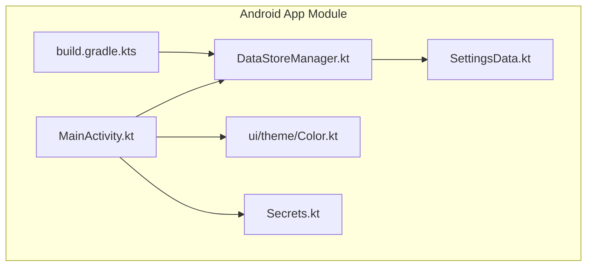
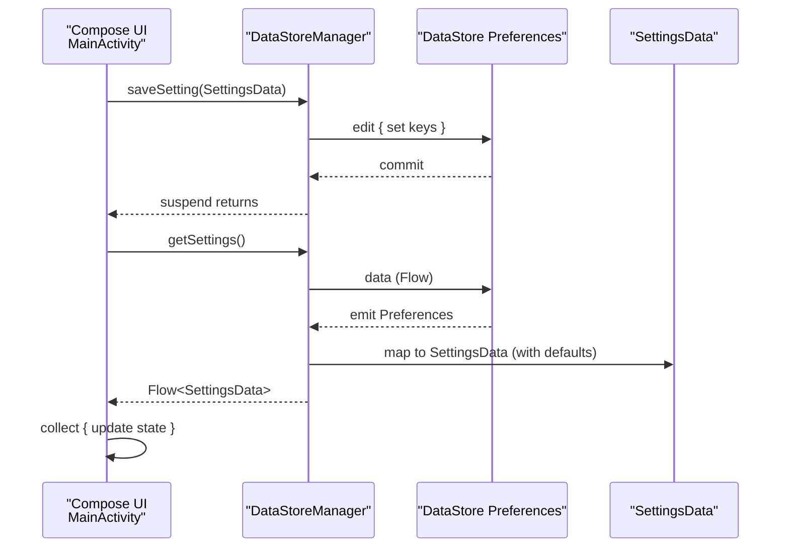
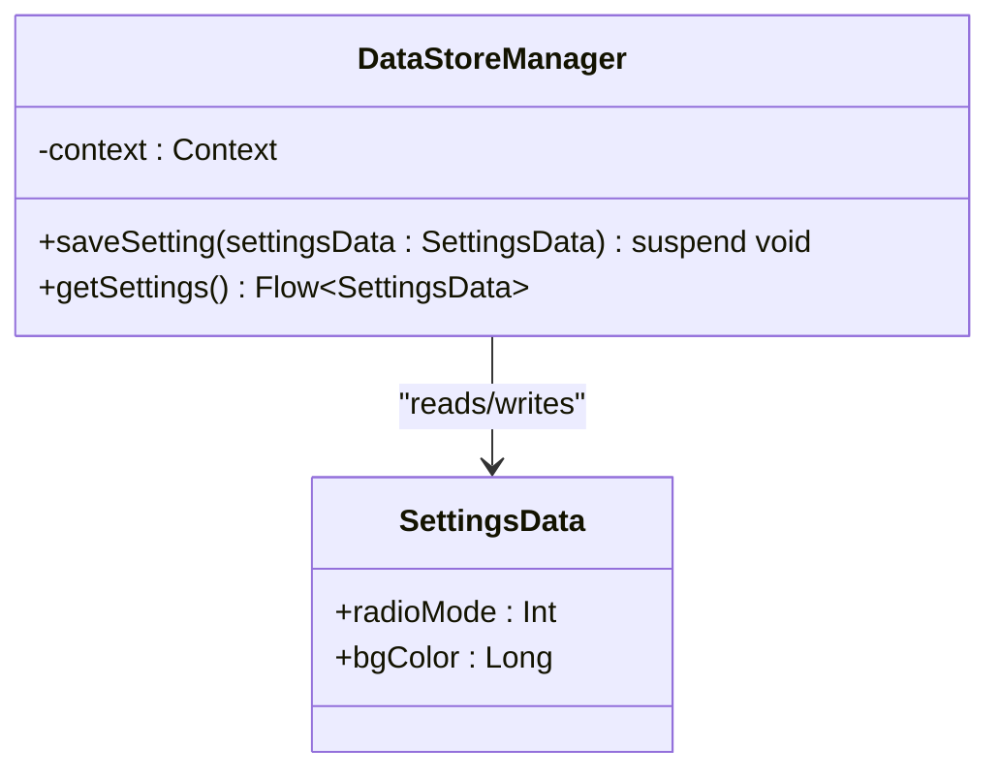
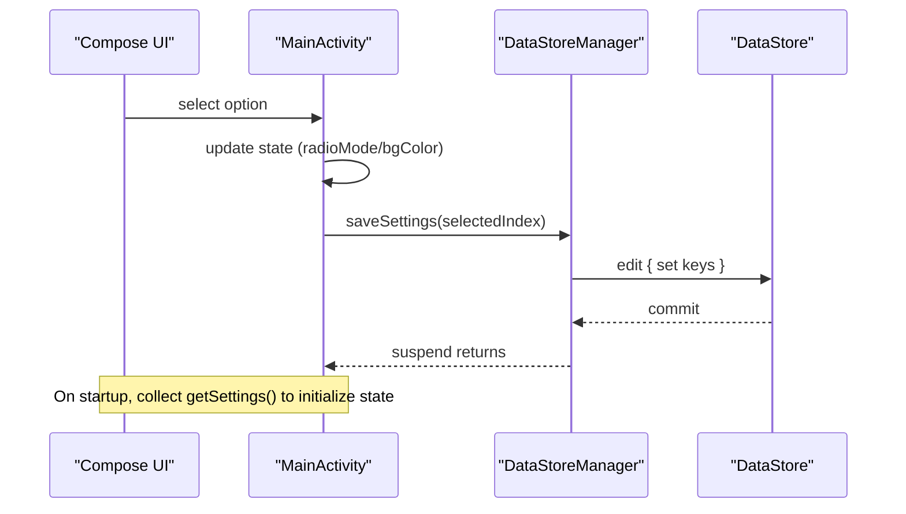
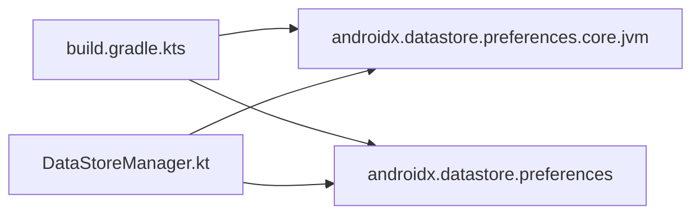

# Data Persistence & Settings Management

<cite>
**Referenced Files in This Document**
- [DataStoreManager.kt](file://WebRadio_android/app/src/main/java/com/dip16/webradio/DataStoreManager.kt)
- [SettingsData.kt](file://WebRadio_android/app/src/main/java/com/dip16/webradio/SettingsData.kt)
- [MainActivity.kt](file://WebRadio_android/app/src/main/java/com/dip16/webradio/MainActivity.kt)
- [Color.kt](file://WebRadio_android/app/src/main/java/com/dip16/webradio/ui/theme/Color.kt)
- [Secrets.kt](file://WebRadio_android/app/src/main/java/com/dip16/webradio/Secrets.kt)
- [build.gradle.kts](file://WebRadio_android/app/build.gradle.kts)
</cite>

## Table of Contents
1. [Introduction](#introduction)
2. [Project Structure](#project-structure)
3. [Core Components](#core-components)
4. [Architecture Overview](#architecture-overview)
5. [Detailed Component Analysis](#detailed-component-analysis)
6. [Dependency Analysis](#dependency-analysis)
7. [Performance Considerations](#performance-considerations)
8. [Troubleshooting Guide](#troubleshooting-guide)
9. [Conclusion](#conclusion)

## Introduction
This document explains the data persistence system using Android DataStore for storing user preferences and application settings in the WebRadio Android app. It covers the DataStoreManager implementation, the SettingsData model, reactive settings retrieval using StateFlow and collectAsState patterns, coroutine-based async operations for saving and loading settings, integration with Compose UI state, and considerations for data validation, default values, and error handling. It also outlines how to extend the system to support future migrations and additional settings.

## Project Structure
The Android app module contains the core persistence and UI integration code:
- DataStoreManager: Encapsulates DataStore access for preferences.
- SettingsData: Immutable data class representing persisted settings.
- MainActivity: Integrates DataStore with Compose UI state and triggers saves.
- ui/theme/Color.kt: Provides default theme colors used as fallback values.
- Secrets.kt: Contains externalized credentials used by other subsystems.
- build.gradle.kts: Declares DataStore dependencies.

**Diagram sources**
- [DataStoreManager.kt:1-42](file://WebRadio_android/app/src/main/java/com/dip16/webradio/DataStoreManager.kt#L1-L42)
- [SettingsData.kt:1-7](file://WebRadio_android/app/src/main/java/com/dip16/webradio/SettingsData.kt#L1-L7)
- [MainActivity.kt:102-133](file://WebRadio_android/app/src/main/java/com/dip16/webradio/MainActivity.kt#L102-L133)
- [Color.kt:1-11](file://WebRadio_android/app/src/main/java/com/dip16/webradio/ui/theme/Color.kt#L1-L11)
- [Secrets.kt:1-11](file://WebRadio_android/app/src/main/java/com/dip16/webradio/Secrets.kt#L1-L11)
- [build.gradle.kts:64-73](file://WebRadio_android/app/build.gradle.kts#L64-L73)

**Section sources**
- [DataStoreManager.kt:1-42](file://WebRadio_android/app/src/main/java/com/dip16/webradio/DataStoreManager.kt#L1-L42)
- [SettingsData.kt:1-7](file://WebRadio_android/app/src/main/java/com/dip16/webradio/SettingsData.kt#L1-L7)
- [MainActivity.kt:102-133](file://WebRadio_android/app/src/main/java/com/dip16/webradio/MainActivity.kt#L102-L133)
- [Color.kt:1-11](file://WebRadio_android/app/src/main/java/com/dip16/webradio/ui/theme/Color.kt#L1-L11)
- [Secrets.kt:1-11](file://WebRadio_android/app/src/main/java/com/dip16/webradio/Secrets.kt#L1-L11)
- [build.gradle.kts:64-73](file://WebRadio_android/app/build.gradle.kts#L64-L73)

## Core Components
- DataStoreManager: Provides suspend functions to save settings and a Flow-based getter to load settings reactively. It writes two preference keys: radio mode (Int) and background color (Long).
- SettingsData: Immutable data class holding the persisted fields.
- MainActivity: Initializes DataStoreManager, reads settings into Compose state, and saves settings when UI selections change.

Key behaviors:
- Reactive loading: getSettings returns a Flow that emits SettingsData whenever underlying preferences change.
- Default values: If a preference is missing, defaults are applied (e.g., radio mode 0, background color from theme).
- Asynchronous persistence: saveSetting is suspend and uses DataStore edit to write atomically.

**Section sources**
- [DataStoreManager.kt:16-42](file://WebRadio_android/app/src/main/java/com/dip16/webradio/DataStoreManager.kt#L16-L42)
- [SettingsData.kt:3-6](file://WebRadio_android/app/src/main/java/com/dip16/webradio/SettingsData.kt#L3-L6)
- [MainActivity.kt:111-120](file://WebRadio_android/app/src/main/java/com/dip16/webradio/MainActivity.kt#L111-L120)
- [MainActivity.kt:444-451](file://WebRadio_android/app/src/main/java/com/dip16/webradio/MainActivity.kt#L444-L451)

## Architecture Overview
The settings persistence architecture centers on AndroidX DataStore Preferences, which provides a type-safe, asynchronous, and reactive way to persist small amounts of structured data.

**Diagram sources**
- [DataStoreManager.kt:18-25](file://WebRadio_android/app/src/main/java/com/dip16/webradio/DataStoreManager.kt#L18-L25)
- [DataStoreManager.kt:34-41](file://WebRadio_android/app/src/main/java/com/dip16/webradio/DataStoreManager.kt#L34-L41)
- [MainActivity.kt:111-120](file://WebRadio_android/app/src/main/java/com/dip16/webradio/MainActivity.kt#L111-L120)
- [MainActivity.kt:444-451](file://WebRadio_android/app/src/main/java/com/dip16/webradio/MainActivity.kt#L444-L451)

## Detailed Component Analysis

### DataStoreManager
Responsibilities:
- Save settings asynchronously using DataStore edit.
- Load settings reactively using DataStore data mapped to SettingsData.
- Provide default values for missing preferences.

Implementation highlights:
- Uses preferencesDataStore delegate to create a typed DataStore<Preferences>.
- Keys: radio_mode (Int), bg_color (Long).
- Default values: radioMode defaults to 0; bg_color defaults to a theme color value when missing.
- Logging around save/load for observability.

**Diagram sources**
- [DataStoreManager.kt:16-42](file://WebRadio_android/app/src/main/java/com/dip16/webradio/DataStoreManager.kt#L16-L42)
- [SettingsData.kt:3-6](file://WebRadio_android/app/src/main/java/com/dip16/webradio/SettingsData.kt#L3-L6)

**Section sources**
- [DataStoreManager.kt:14-14](file://WebRadio_android/app/src/main/java/com/dip16/webradio/DataStoreManager.kt#L14-L14)
- [DataStoreManager.kt:18-25](file://WebRadio_android/app/src/main/java/com/dip16/webradio/DataStoreManager.kt#L18-L25)
- [DataStoreManager.kt:34-41](file://WebRadio_android/app/src/main/java/com/dip16/webradio/DataStoreManager.kt#L34-L41)

### SettingsData
Structure:
- radioMode: Int
- bgColor: Long

Usage:
- Constructed from loaded preferences with defaults.
- Passed to DataStoreManager.saveSetting and used to update Compose state.

Serialization pattern:
- No explicit serialization code is present. DataStore Preferences handles Int and Long primitives automatically.

**Section sources**
- [SettingsData.kt:3-6](file://WebRadio_android/app/src/main/java/com/dip16/webradio/SettingsData.kt#L3-L6)

### MainActivity Integration
Reactive settings retrieval:
- LaunchedEffect initializes a collection of getSettings() to update Compose state.
- Updates background color and radio mode state from emitted SettingsData.

Saving settings:
- When a UI selection changes, saveSettings constructs SettingsData and calls DataStoreManager.saveSetting.
- Uses Dispatchers.IO for background operations.

Compose state integration:
- Background color is stored in a mutable state initialized from theme color.
- Radio mode is stored in a mutable int state.

**Diagram sources**
- [MainActivity.kt:111-120](file://WebRadio_android/app/src/main/java/com/dip16/webradio/MainActivity.kt#L111-L120)
- [MainActivity.kt:424-451](file://WebRadio_android/app/src/main/java/com/dip16/webradio/MainActivity.kt#L424-L451)
- [DataStoreManager.kt:18-25](file://WebRadio_android/app/src/main/java/com/dip16/webradio/DataStoreManager.kt#L18-L25)

**Section sources**
- [MainActivity.kt:108-120](file://WebRadio_android/app/src/main/java/com/dip16/webradio/MainActivity.kt#L108-L120)
- [MainActivity.kt:424-451](file://WebRadio_android/app/src/main/java/com/dip16/webradio/MainActivity.kt#L424-L451)

### Default Values and Fallbacks
- radioMode defaults to 0 when missing.
- bg_color defaults to a theme color value when missing.
- These defaults ensure the app remains functional even if preferences are uninitialized.

**Section sources**
- [DataStoreManager.kt:35-38](file://WebRadio_android/app/src/main/java/com/dip16/webradio/DataStoreManager.kt#L35-L38)
- [MainActivity.kt:108-109](file://WebRadio_android/app/src/main/java/com/dip16/webradio/MainActivity.kt#L108-L109)

### Data Validation and Error Handling
Observed behavior:
- Loading uses safe access with default fallbacks.
- Saving is performed inside a suspend function; exceptions are not explicitly caught in the manager.
- UI collects Flow and updates state without explicit error handling in the collection scope.

Recommendations for improvement:
- Add try/catch around DataStore edit and map operations to capture and log errors.
- Consider adding validation for radioMode bounds before saving.
- Propagate errors to UI via a sealed result type or state flag.

**Section sources**
- [DataStoreManager.kt:18-25](file://WebRadio_android/app/src/main/java/com/dip16/webradio/DataStoreManager.kt#L18-L25)
- [DataStoreManager.kt:34-41](file://WebRadio_android/app/src/main/java/com/dip16/webradio/DataStoreManager.kt#L34-L41)
- [MainActivity.kt:111-120](file://WebRadio_android/app/src/main/java/com/dip16/webradio/MainActivity.kt#L111-L120)

### Migration Strategy
Current state:
- Two primitive keys are used; no explicit migration logic is present.

Recommended approach:
- Introduce a version field in preferences.
- On load, compare version and apply transformations for changed keys.
- Use a migration helper to update preferences atomically during edit.

Example outline:
- Add a version key and increment it when migrating.
- Provide a migration function that transforms old keys to new ones.
- Run migration once during app initialization before reading settings.

[No sources needed since this section proposes a general strategy]

## Dependency Analysis
External dependencies relevant to DataStore:
- DataStore Preferences Core (Jvm): Provides core APIs for preferences.
- DataStore Preferences: Provides Compose-friendly Flow-based access.

**Diagram sources**
- [build.gradle.kts:64-73](file://WebRadio_android/app/build.gradle.kts#L64-L73)
- [DataStoreManager.kt:5-10](file://WebRadio_android/app/src/main/java/com/dip16/webradio/DataStoreManager.kt#L5-L10)

**Section sources**
- [build.gradle.kts:64-73](file://WebRadio_android/app/build.gradle.kts#L64-L73)
- [DataStoreManager.kt:5-10](file://WebRadio_android/app/src/main/java/com/dip16/webradio/DataStoreManager.kt#L5-L10)

## Performance Considerations
- DataStore is optimized for small, structured data and provides asynchronous, non-blocking IO.
- Using Flow ensures efficient reactive updates without manual polling.
- Avoid frequent writes by debouncing UI changes or batching updates when extending the system.
- Consider using a single edit block to minimize write operations when adding more settings.

[No sources needed since this section provides general guidance]

## Troubleshooting Guide
Common issues and resolutions:
- Settings not persisting:
  - Verify DataStore edit completes without exceptions.
  - Ensure keys match between save and load.
- Defaults not applied:
  - Confirm missing keys are handled with default values in getSettings().
- UI not updating:
  - Ensure collect is invoked in a lifecycle-aware scope (e.g., LaunchedEffect).
  - Verify state updates occur on the main thread.
- Exceptions:
  - Wrap DataStore operations in try/catch and log errors.
  - Consider propagating errors to UI via a state flag.

**Section sources**
- [DataStoreManager.kt:18-25](file://WebRadio_android/app/src/main/java/com/dip16/webradio/DataStoreManager.kt#L18-L25)
- [DataStoreManager.kt:34-41](file://WebRadio_android/app/src/main/java/com/dip16/webradio/DataStoreManager.kt#L34-L41)
- [MainActivity.kt:111-120](file://WebRadio_android/app/src/main/java/com/dip16/webradio/MainActivity.kt#L111-L120)

## Conclusion
The WebRadio Android app uses Android DataStore Preferences to persist user preferences in a type-safe, reactive manner. DataStoreManager encapsulates persistence logic, SettingsData models the persisted data, and MainActivity integrates these components with Compose UI state. The system applies sensible defaults and uses coroutines for asynchronous operations. Extending the system to support additional settings, migrations, and robust error handling is straightforward given the current architecture.