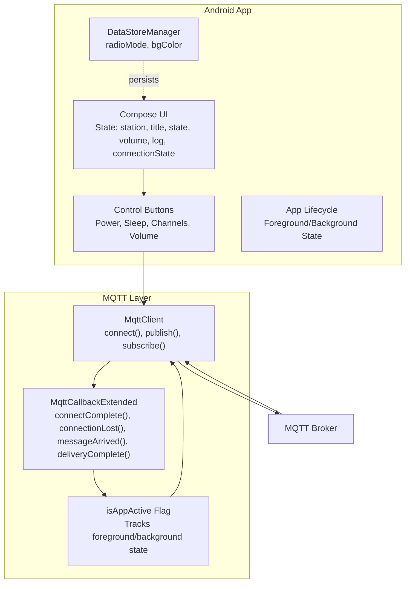
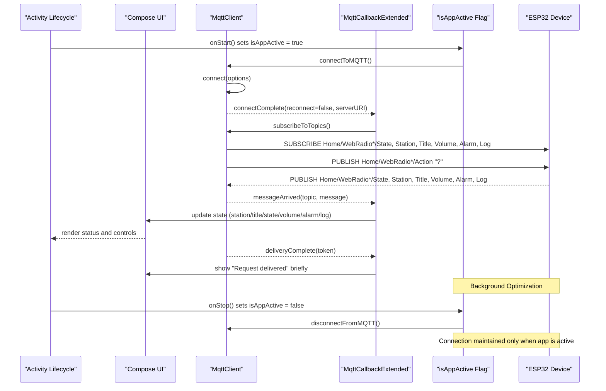
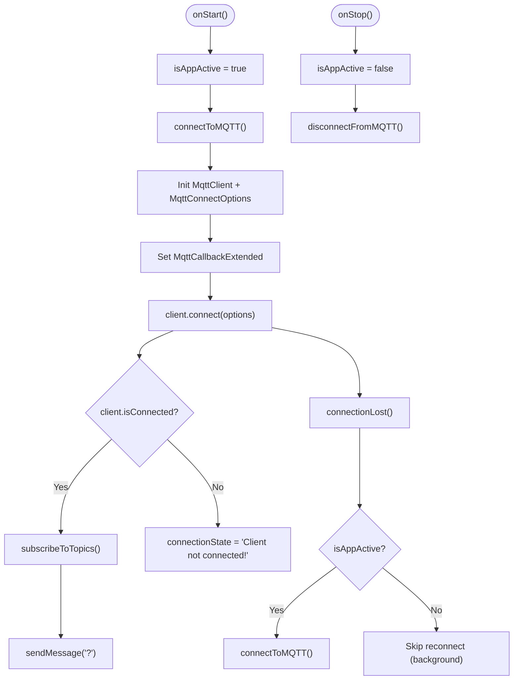
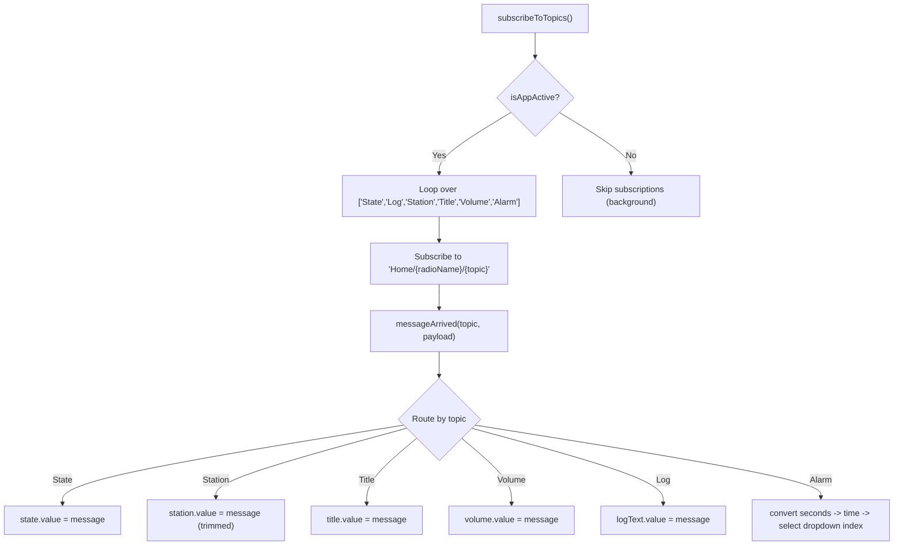
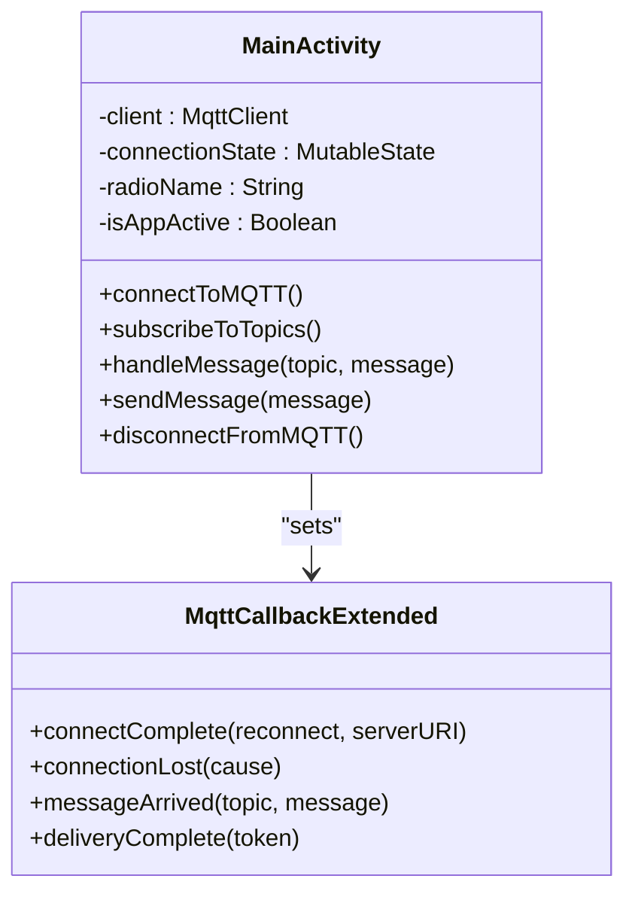
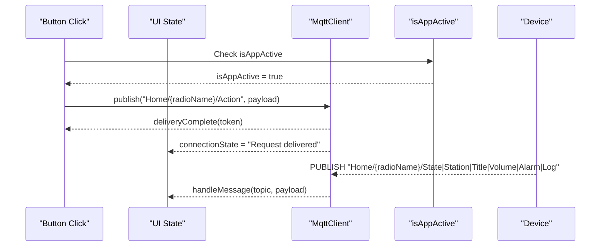
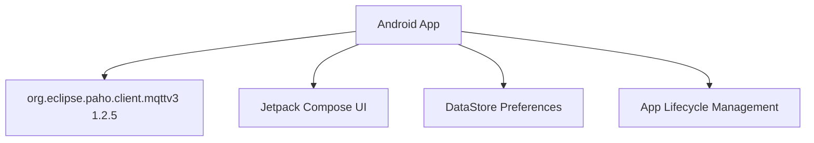

# MQTT Communication Layer

<cite>
**Referenced Files in This Document**
- [MainActivity.kt](file://WebRadio_android/app/src/main/java/com/dip16/webradio/MainActivity.kt)
- [DataStoreManager.kt](file://WebRadio_android/app/src/main/java/com/dip16/webradio/DataStoreManager.kt)
- [SettingsData.kt](file://WebRadio_android/app/src/main/java/com/dip16/webradio/SettingsData.kt)
- [Secrets.kt](file://WebRadio_android/app/src/main/java/com/dip16/webradio/Secrets.kt)
- [README.md](file://WebRadio_android/README.md)
</cite>

## Update Summary
**Changes Made**
- Enhanced connection lifecycle management with background/foreground state awareness
- Added intelligent reconnection logic that prevents unnecessary reconnection attempts when the app is in the background
- Improved battery life and reduced network traffic consumption through lifecycle-aware MQTT operations
- Updated connection state management with isAppActive flag tracking

## Table of Contents
1. [Introduction](#introduction)
2. [Project Structure](#project-structure)
3. [Core Components](#core-components)
4. [Architecture Overview](#architecture-overview)
5. [Detailed Component Analysis](#detailed-component-analysis)
6. [Dependency Analysis](#dependency-analysis)
7. [Performance Considerations](#performance-considerations)
8. [Troubleshooting Guide](#troubleshooting-guide)
9. [Conclusion](#conclusion)

## Introduction
This document describes the MQTT communication layer used by the Android remote application to control and monitor an ESP32-based internet radio device. It explains the Paho MQTT client integration, connection lifecycle management, topic subscription patterns, callback handlers, message formats, and real-time status updates. The implementation now features enhanced lifecycle-aware connection handling that intelligently manages MQTT connections based on app foreground/background state, preventing unnecessary reconnection attempts and optimizing battery life.

## Project Structure
The Android application integrates MQTT via the Eclipse Paho client and exposes a Compose UI for device control. Key elements:
- MQTT client initialization and callbacks with lifecycle-aware state management
- Topic subscriptions for real-time status updates
- Publishing actions to control the device
- DataStore-backed persistent settings
- UI state updates driven by MQTT events
- Intelligent reconnection logic based on app activity state

**Diagram sources**
- [MainActivity.kt:87-331](file://WebRadio_android/app/src/main/java/com/dip16/webradio/MainActivity.kt#L87-L331)
- [DataStoreManager.kt:16-42](file://WebRadio_android/app/src/main/java/com/dip16/webradio/DataStoreManager.kt#L16-L42)

**Section sources**
- [MainActivity.kt:87-331](file://WebRadio_android/app/src/main/java/com/dip16/webradio/MainActivity.kt#L87-L331)
- [README.md:61-90](file://WebRadio_android/README.md#L61-L90)

## Core Components
- MqttClient and connection options with lifecycle-aware state management
- MqttCallbackExtended implementation with intelligent reconnection logic
- Topic subscription and message routing with background optimization
- Publishing actions to the device with state validation
- Real-time status updates for station, title, state, volume, alarm, and logs
- Persistent settings and UI state management with lifecycle awareness
- Foreground/background state tracking for optimal resource usage

**Section sources**
- [MainActivity.kt:89-331](file://WebRadio_android/app/src/main/java/com/dip16/webradio/MainActivity.kt#L89-L331)
- [README.md:61-90](file://WebRadio_android/README.md#L61-L90)

## Architecture Overview
The app connects to an MQTT broker, subscribes to device state topics, publishes action commands, and updates UI state reactively. The connection lifecycle is managed around Activity lifecycle events with intelligent background/foreground state awareness, preventing unnecessary reconnection attempts when the app is not in use.

**Diagram sources**
- [MainActivity.kt:135-162](file://WebRadio_android/app/src/main/java/com/dip16/webradio/MainActivity.kt#L135-L162)
- [MainActivity.kt:171-246](file://WebRadio_android/app/src/main/java/com/dip16/webradio/MainActivity.kt#L171-L246)
- [MainActivity.kt:195-204](file://WebRadio_android/app/src/main/java/com/dip16/webradio/MainActivity.kt#L195-L204)
- [MainActivity.kt:257-264](file://WebRadio_android/app/src/main/java/com/dip16/webradio/MainActivity.kt#L257-L264)
- [MainActivity.kt:266-296](file://WebRadio_android/app/src/main/java/com/dip16/webradio/MainActivity.kt#L266-L296)
- [MainActivity.kt:312-316](file://WebRadio_android/app/src/main/java/com/dip16/webradio/MainActivity.kt#L312-L316)

## Detailed Component Analysis

### Enhanced MQTT Client and Lifecycle Management
**Updated** The connection lifecycle now includes intelligent state management with foreground/background awareness. The `isAppActive` flag tracks whether the app is in the foreground, enabling or disabling automatic reconnection attempts.

- Client creation with a generated client ID and memory persistence
- Connection options include credentials, clean session, and disabled automatic reconnect
- Foreground/background state tracking via `isAppActive` flag
- Connection state is tracked in a dedicated state variable and updated in callbacks
- Reconnection logic checks `isAppActive` before attempting reconnection
- Automatic disconnection on app stop to conserve resources

**Diagram sources**
- [MainActivity.kt:135-162](file://WebRadio_android/app/src/main/java/com/dip16/webradio/MainActivity.kt#L135-L162)
- [MainActivity.kt:171-246](file://WebRadio_android/app/src/main/java/com/dip16/webradio/MainActivity.kt#L171-L246)
- [MainActivity.kt:195-204](file://WebRadio_android/app/src/main/java/com/dip16/webradio/MainActivity.kt#L195-L204)
- [MainActivity.kt:156-162](file://WebRadio_android/app/src/main/java/com/dip16/webradio/MainActivity.kt#L156-L162)

**Section sources**
- [MainActivity.kt:171-246](file://WebRadio_android/app/src/main/java/com/dip16/webradio/MainActivity.kt#L171-L246)
- [MainActivity.kt:195-204](file://WebRadio_android/app/src/main/java/com/dip16/webradio/MainActivity.kt#L195-L204)
- [MainActivity.kt:135-162](file://WebRadio_android/app/src/main/java/com/dip16/webradio/MainActivity.kt#L135-L162)
- [MainActivity.kt:156-162](file://WebRadio_android/app/src/main/java/com/dip16/webradio/MainActivity.kt#L156-L162)

### Topic Subscription Patterns and Message Routing
- Subscriptions for State, Station, Title, Volume, Alarm, and Log under the base topic pattern "Home/{radioName}/{suffix}"
- Incoming messages are routed to dedicated handlers that update UI state
- Alarm messages are parsed to select the appropriate UI option
- Background optimization ensures subscriptions are only active when app is foreground

**Diagram sources**
- [MainActivity.kt:257-264](file://WebRadio_android/app/src/main/java/com/dip16/webradio/MainActivity.kt#L257-L264)
- [MainActivity.kt:266-296](file://WebRadio_android/app/src/main/java/com/dip16/webradio/MainActivity.kt#L266-L296)
- [MainActivity.kt:298-310](file://WebRadio_android/app/src/main/java/com/dip16/webradio/MainActivity.kt#L298-L310)

**Section sources**
- [MainActivity.kt:257-296](file://WebRadio_android/app/src/main/java/com/dip16/webradio/MainActivity.kt#L257-L296)
- [README.md:80-89](file://WebRadio_android/README.md#L80-L89)

### Enhanced MQTT Callback Handlers
**Updated** The callback handlers now include intelligent reconnection logic that respects app foreground/background state.

- connectComplete: sets connection state and resubscribes when reconnecting
- connectionLost: updates state and attempts reconnect only if the app is active
- messageArrived: logs and routes incoming messages to UI state
- deliveryComplete: briefly shows "Request delivered" and clears it after a delay

**Diagram sources**
- [MainActivity.kt:188-223](file://WebRadio_android/app/src/main/java/com/dip16/webradio/MainActivity.kt#L188-L223)
- [MainActivity.kt:171-246](file://WebRadio_android/app/src/main/java/com/dip16/webradio/MainActivity.kt#L171-L246)

**Section sources**
- [MainActivity.kt:188-223](file://WebRadio_android/app/src/main/java/com/dip16/webradio/MainActivity.kt#L188-L223)

### Topic Structure and Message Formats
- Base topic: "Home/{radioName}/"
- Action topic published by the app: "Home/{radioName}/Action"
- Status topics subscribed by the app:
  - "Home/{radioName}/State": power state
  - "Home/{radioName}/Station": current station name
  - "Home/{radioName}/Title": current track title
  - "Home/{radioName}/Volume": volume level
  - "Home/{radioName}/Alarm": alarm time in seconds from midnight or "Alarm OFF"
  - "Home/{radioName}/Log": device logs

Action payloads supported by the app:
- "?": request current status
- "b1": toggle power
- "b2": activate sleep timer
- "b3": next channel
- "b4": previous channel
- "vol+": increase volume
- "vol-": decrease volume
- "s<seconds>": set alarm (seconds from midnight)
- "sAlarm OFF": disable alarm
- "<station_url>": play a specific station by URL

**Section sources**
- [README.md:61-90](file://WebRadio_android/README.md#L61-L90)

### Real-time Status Updates
- The app requests initial status immediately after connecting and subscribes to all state topics
- UI state variables are updated upon receiving messages, reflected instantly in the Compose UI
- Logs are displayed for debugging and monitoring
- Background optimization ensures status updates only occur when app is active

**Section sources**
- [MainActivity.kt:229-238](file://WebRadio_android/app/src/main/java/com/dip16/webradio/MainActivity.kt#L229-L238)
- [MainActivity.kt:266-296](file://WebRadio_android/app/src/main/java/com/dip16/webradio/MainActivity.kt#L266-L296)

### Sending Commands and Acknowledgment Handling
- Commands are published to "Home/{radioName}/Action" with the appropriate payload
- Delivery completion callback updates connection state briefly to indicate acknowledgment
- Buttons trigger publishing via sendMessage() or direct publish in specific cases
- State validation ensures commands are only sent when app is in foreground

**Diagram sources**
- [MainActivity.kt:312-316](file://WebRadio_android/app/src/main/java/com/dip16/webradio/MainActivity.kt#L312-L316)
- [MainActivity.kt:210-222](file://WebRadio_android/app/src/main/java/com/dip16/webradio/MainActivity.kt#L210-L222)
- [MainActivity.kt:266-296](file://WebRadio_android/app/src/main/java/com/dip16/webradio/MainActivity.kt#L266-L296)

**Section sources**
- [MainActivity.kt:312-316](file://WebRadio_android/app/src/main/java/com/dip16/webradio/MainActivity.kt#L312-L316)
- [MainActivity.kt:210-222](file://WebRadio_android/app/src/main/java/com/dip16/webradio/MainActivity.kt#L210-L222)

### Threading and Concurrency Considerations
- Background operations for MQTT tasks are executed on Dispatchers.IO
- UI updates occur on the main thread; the callback uses a Handler targeting Looper.getMainLooper() to clear transient state after a delay
- DataStore operations are performed off the main thread and exposed as Flow for reactive UI updates
- Lifecycle-aware threading ensures background operations are suspended when app is not active

**Section sources**
- [MainActivity.kt:139-142](file://WebRadio_android/app/src/main/java/com/dip16/webradio/MainActivity.kt#L139-L142)
- [MainActivity.kt:697-711](file://WebRadio_android/app/src/main/java/com/dip16/webradio/MainActivity.kt#L697-L711)
- [MainActivity.kt:862-881](file://WebRadio_android/app/src/main/java/com/dip16/webradio/MainActivity.kt#L862-L881)
- [MainActivity.kt:214-221](file://WebRadio_android/app/src/main/java/com/dip16/webradio/MainActivity.kt#L214-L221)
- [DataStoreManager.kt:18-41](file://WebRadio_android/app/src/main/java/com/dip16/webradio/DataStoreManager.kt#L18-L41)

### Managing Concurrent Operations
- Separate coroutine scopes are used for button presses and settings persistence
- Publishing and subscribing are handled concurrently with lifecycle state validation
- Message routing ensures thread-safe state updates only when app is active
- DataStore reads/writes are asynchronous and mapped to UI state via collect

**Section sources**
- [MainActivity.kt:760-848](file://WebRadio_android/app/src/main/java/com/dip16/webradio/MainActivity.kt#L760-L848)
- [DataStoreManager.kt:34-41](file://WebRadio_android/app/src/main/java/com/dip16/webradio/DataStoreManager.kt#L34-L41)

## Dependency Analysis
The app depends on the Eclipse Paho MQTT client library and Compose for UI. Versioning is managed via libs.versions.toml.

**Diagram sources**
- [build.gradle.kts:62-63](file://WebRadio_android/app/build.gradle.kts#L62-L63)
- [libs.versions.toml:14](file://WebRadio_android/gradle/libs.versions.toml#L14)

**Section sources**
- [build.gradle.kts:62-63](file://WebRadio_android/app/build.gradle.kts#L62-L63)
- [libs.versions.toml:17-36](file://WebRadio_android/gradle/libs.versions.toml#L17-L36)

## Performance Considerations
**Updated** Enhanced performance through lifecycle-aware optimizations:

- Using Dispatchers.IO for network-bound operations prevents blocking the main thread
- MemoryPersistence reduces disk overhead for the MQTT client
- Minimal message parsing and UI updates keep latency low
- Intelligent reconnection logic prevents unnecessary reconnections when app is in background
- Automatic disconnection on app stop conserves battery life and reduces network traffic
- Lifecycle-aware subscriptions ensure MQTT topics are only active when needed
- Avoid unnecessary reconnections by checking activity state before reconnecting

## Troubleshooting Guide
Common issues and remedies:
- Connection failures: Verify broker URL, credentials, and network connectivity; inspect logs for exceptions
- No real-time updates: Ensure subscriptions are called after successful connection; confirm topic names match the device configuration
- UI not updating: Confirm messageArrived is invoked and handleMessage updates state; verify main thread updates are applied
- Reconnection loops: The app disables automatic reconnect; ensure manual reconnect logic respects app foreground/background state
- Delivery acknowledgment: deliveryComplete briefly indicates successful publish; if not visible, check for publish errors
- Background connection issues: Verify isAppActive flag is properly managed; ensure onStop() disconnects to conserve resources

**Section sources**
- [MainActivity.kt:240-245](file://WebRadio_android/app/src/main/java/com/dip16/webradio/MainActivity.kt#L240-L245)
- [MainActivity.kt:195-204](file://WebRadio_android/app/src/main/java/com/dip16/webradio/MainActivity.kt#L195-L204)
- [MainActivity.kt:210-222](file://WebRadio_android/app/src/main/java/com/dip16/webradio/MainActivity.kt#L210-L222)
- [MainActivity.kt:156-162](file://WebRadio_android/app/src/main/java/com/dip16/webradio/MainActivity.kt#L156-L162)

## Conclusion
The MQTT communication layer integrates seamlessly with the Android UI through Compose and Kotlin Coroutines, featuring enhanced lifecycle-aware connection management. The implementation now provides intelligent background/foreground state awareness that prevents unnecessary reconnection attempts, significantly improving battery life and reducing network traffic consumption. The documented patterns support safe concurrent operations, lifecycle-aware resource management, and straightforward extension for additional commands or topics while maintaining optimal performance characteristics.