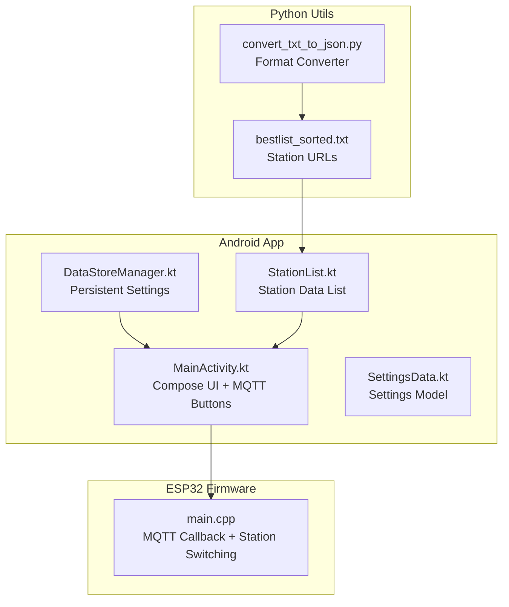
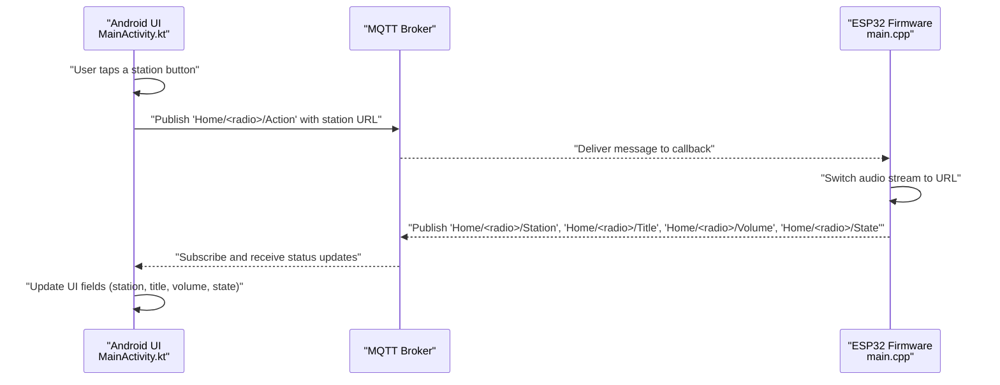
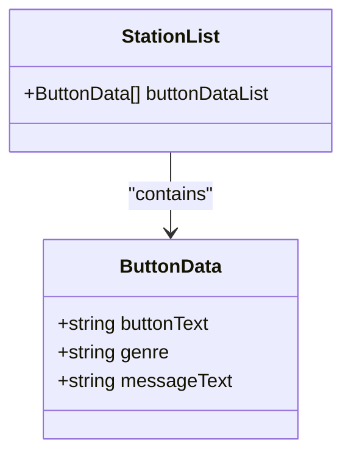
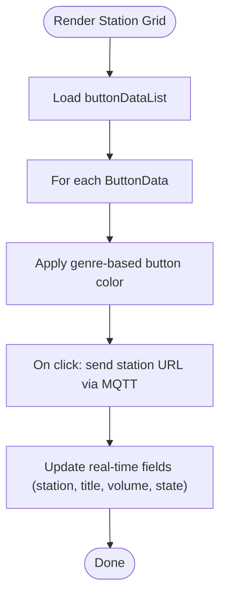
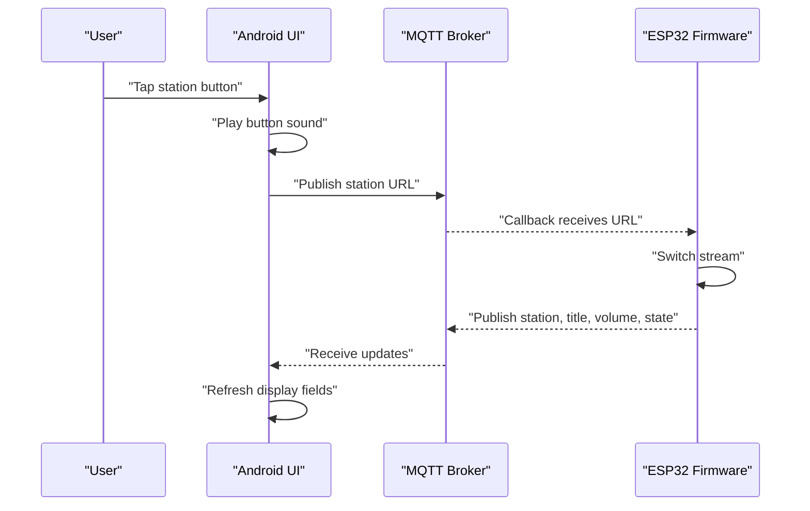
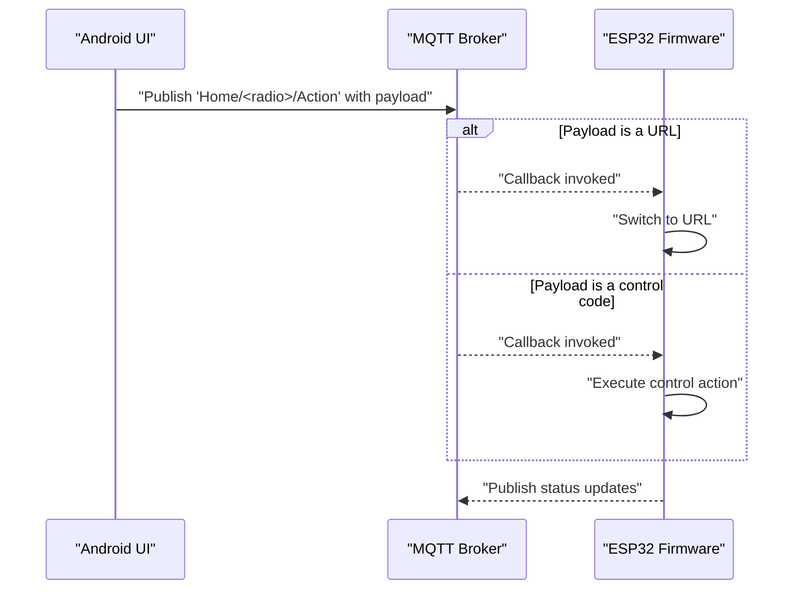
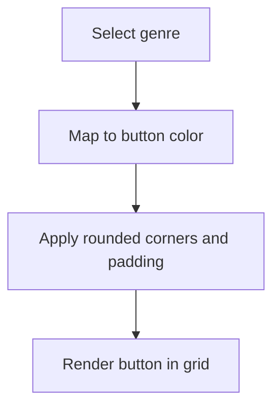
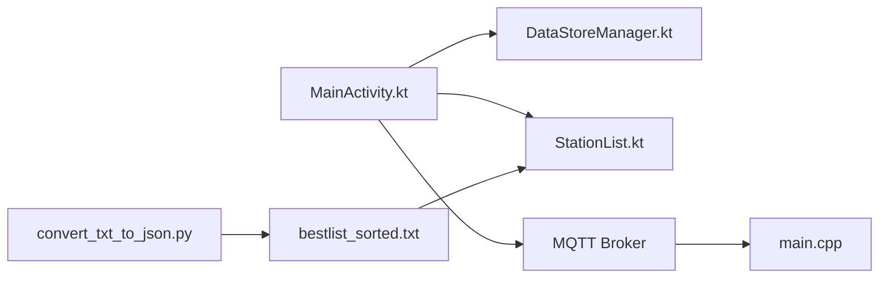

# Station List & Management

<cite>
**Referenced Files in This Document**
- [StationList.kt](file://WebRadio_android/app/src/main/java/com/dip16/webradio/StationList.kt)
- [MainActivity.kt](file://WebRadio_android/app/src/main/java/com/dip16/webradio/MainActivity.kt)
- [DataStoreManager.kt](file://WebRadio_android/app/src/main/java/com/dip16/webradio/DataStoreManager.kt)
- [SettingsData.kt](file://WebRadio_android/app/src/main/java/com/dip16/webradio/SettingsData.kt)
- [strings.xml](file://WebRadio_android/app/src/main/res/values/strings.xml)
- [main.cpp](file://WebRadio_ESP32_S3/src/main.cpp)
- [bestlist_sorted.txt](file://WebRadio_python_utils/bestlist_sorted.txt)
- [convert_txt_to_json.py](file://WebRadio_python_utils/convert_txt_to_json.py)
- [README.md](file://WebRadio_python_utils/README.md)
</cite>

## Table of Contents
1. [Introduction](#introduction)
2. [Project Structure](#project-structure)
3. [Core Components](#core-components)
4. [Architecture Overview](#architecture-overview)
5. [Detailed Component Analysis](#detailed-component-analysis)
6. [Dependency Analysis](#dependency-analysis)
7. [Performance Considerations](#performance-considerations)
8. [Troubleshooting Guide](#troubleshooting-guide)
9. [Conclusion](#conclusion)
10. [Appendices](#appendices)

## Introduction
This document explains the station management system for the internet radio application, focusing on the Android UI’s station list and dynamic button generation, the station data model, category filtering, and the integration with the ESP32 firmware via MQTT. It covers how stations are organized, how users navigate categories and select stations, how real-time station information is displayed, and how the Android app communicates with the ESP32 device to switch stations and control playback.

## Project Structure
The station management spans three major parts:
- Android UI: Compose-based screen with a grid of station buttons, category-aware styling, and MQTT-driven controls.
- ESP32 firmware: Receives MQTT commands, manages station lists, switches streams, and publishes live status.
- Python utilities: Tools to manage station lists and convert between formats.

**Diagram sources**
- [MainActivity.kt:1-922](file://WebRadio_android/app/src/main/java/com/dip16/webradio/MainActivity.kt#L1-L922)
- [StationList.kt:1-168](file://WebRadio_android/app/src/main/java/com/dip16/webradio/StationList.kt#L1-L168)
- [DataStoreManager.kt:1-42](file://WebRadio_android/app/src/main/java/com/dip16/webradio/DataStoreManager.kt#L1-L42)
- [SettingsData.kt:1-7](file://WebRadio_android/app/src/main/java/com/dip16/webradio/SettingsData.kt#L1-L7)
- [main.cpp:1-2103](file://WebRadio_ESP32_S3/src/main.cpp#L1-L2103)
- [bestlist_sorted.txt:1-80](file://WebRadio_python_utils/bestlist_sorted.txt#L1-L80)
- [convert_txt_to_json.py:1-18](file://WebRadio_python_utils/convert_txt_to_json.py#L1-L18)

**Section sources**
- [MainActivity.kt:1-922](file://WebRadio_android/app/src/main/java/com/dip16/webradio/MainActivity.kt#L1-L922)
- [StationList.kt:1-168](file://WebRadio_android/app/src/main/java/com/dip16/webradio/StationList.kt#L1-L168)
- [main.cpp:1-2103](file://WebRadio_ESP32_S3/src/main.cpp#L1-L2103)
- [bestlist_sorted.txt:1-80](file://WebRadio_python_utils/bestlist_sorted.txt#L1-L80)
- [convert_txt_to_json.py:1-18](file://WebRadio_python_utils/convert_txt_to_json.py#L1-L18)

## Core Components
- Station data model and list:
  - The station list is defined as a typed list of ButtonData entries, each containing a display name, a genre tag, and a stream URL. The list is declared globally and consumed by the UI grid.
- Android UI:
  - A Compose screen renders a grid of station buttons. Each button is styled according to its genre and sends an MQTT message upon selection.
  - Real-time status fields (station name, title, volume, state) are updated via MQTT subscriptions.
- ESP32 firmware:
  - Subscribes to MQTT topics and reacts to commands to switch stations, adjust volume, toggle power, and set alarms.
  - Publishes live station metadata and device state back to the Android app.

**Section sources**
- [StationList.kt:5-168](file://WebRadio_android/app/src/main/java/com/dip16/webradio/StationList.kt#L5-L168)
- [MainActivity.kt:333-848](file://WebRadio_android/app/src/main/java/com/dip16/webradio/MainActivity.kt#L333-L848)
- [main.cpp:274-650](file://WebRadio_ESP32_S3/src/main.cpp#L274-L650)

## Architecture Overview
The station management system integrates an Android UI with an ESP32-based radio player over MQTT. The Android app displays a categorized grid of stations and sends commands to the ESP32 to switch streams. The ESP32 executes the command, updates the audio stream, and publishes real-time status back to the Android app.

**Diagram sources**
- [MainActivity.kt:760-848](file://WebRadio_android/app/src/main/java/com/dip16/webradio/MainActivity.kt#L760-L848)
- [main.cpp:274-650](file://WebRadio_ESP32_S3/src/main.cpp#L274-L650)

## Detailed Component Analysis

### Station Data Model and List
- Data structure:
  - Each station is represented as ButtonData with fields for display text, genre, and stream URL.
- List composition:
  - The global list is a predefined collection of stations with associated genres. Genres include rock, jazz, radio, relax, ambient, lounge, electronic, country, reggae, and nature.
- Usage:
  - The list is passed into the UI grid rendering function to create dynamic buttons.

**Diagram sources**
- [StationList.kt:5-168](file://WebRadio_android/app/src/main/java/com/dip16/webradio/StationList.kt#L5-L168)
- [MainActivity.kt:333](file://WebRadio_android/app/src/main/java/com/dip16/webradio/MainActivity.kt#L333)

**Section sources**
- [StationList.kt:5-168](file://WebRadio_android/app/src/main/java/com/dip16/webradio/StationList.kt#L5-L168)
- [MainActivity.kt:333](file://WebRadio_android/app/src/main/java/com/dip16/webradio/MainActivity.kt#L333)

### Category Filtering and Dynamic Button Generation
- Genre-based styling:
  - Each button applies a distinct background color based on its genre. This provides immediate visual feedback for category navigation.
- Grid layout:
  - The UI uses a lazy vertical grid with a fixed column count to arrange buttons in a responsive layout.
- Dynamic generation:
  - The grid iterates over the station list and creates a button for each entry, binding the click handler to send the station URL via MQTT.

**Diagram sources**
- [MainActivity.kt:412-422](file://WebRadio_android/app/src/main/java/com/dip16/webradio/MainActivity.kt#L412-L422)
- [MainActivity.kt:760-848](file://WebRadio_android/app/src/main/java/com/dip16/webradio/MainActivity.kt#L760-L848)

**Section sources**
- [MainActivity.kt:412-422](file://WebRadio_android/app/src/main/java/com/dip16/webradio/MainActivity.kt#L412-L422)
- [MainActivity.kt:760-848](file://WebRadio_android/app/src/main/java/com/dip16/webradio/MainActivity.kt#L760-L848)

### Station Selection Workflow and Real-Time Information Display
- Selection:
  - Tapping a station button triggers an asynchronous operation that plays a sound effect and sends the station URL to the ESP32 via MQTT.
- Real-time updates:
  - The Android app subscribes to topics for station name, title, volume, and state. These fields are updated whenever the ESP32 publishes new values.
- Power and control:
  - Dedicated buttons send control messages (power on/off, channel up/down, volume up/down) and trigger UI resets for station and title fields.

**Diagram sources**
- [MainActivity.kt:760-848](file://WebRadio_android/app/src/main/java/com/dip16/webradio/MainActivity.kt#L760-L848)
- [main.cpp:274-650](file://WebRadio_ESP32_S3/src/main.cpp#L274-L650)

**Section sources**
- [MainActivity.kt:760-848](file://WebRadio_android/app/src/main/java/com/dip16/webradio/MainActivity.kt#L760-L848)
- [main.cpp:274-650](file://WebRadio_ESP32_S3/src/main.cpp#L274-L650)

### Integration Between Station Data and MQTT Command System
- Command format:
  - The Android app sends the station URL string as the MQTT payload to the ESP32. The ESP32 recognizes this as a direct stream URL and switches to it.
- Control commands:
  - Additional control messages (e.g., power on/off, channel up/down, volume adjustments) are sent as short identifiers and handled by the ESP32’s callback.
- Topic naming:
  - Topics follow a consistent pattern: Home/<radio>/Action for commands and Home/<radio>/Station, Home/<radio>/Title, Home/<radio>/Volume, Home/<radio>/State for status.

**Diagram sources**
- [MainActivity.kt:800-821](file://WebRadio_android/app/src/main/java/com/dip16/webradio/MainActivity.kt#L800-L821)
- [main.cpp:274-650](file://WebRadio_ESP32_S3/src/main.cpp#L274-L650)

**Section sources**
- [MainActivity.kt:800-821](file://WebRadio_android/app/src/main/java/com/dip16/webradio/MainActivity.kt#L800-L821)
- [main.cpp:274-650](file://WebRadio_ESP32_S3/src/main.cpp#L274-L650)

### Button Styling Based on Music Genres and Grid Layout
- Genre-based colors:
  - Each genre maps to a specific button background color, enabling quick visual identification of station categories.
- Grid layout:
  - A fixed-column grid ensures consistent button sizing and spacing across devices.

**Diagram sources**
- [MainActivity.kt:769-787](file://WebRadio_android/app/src/main/java/com/dip16/webradio/MainActivity.kt#L769-L787)
- [MainActivity.kt:412-422](file://WebRadio_android/app/src/main/java/com/dip16/webradio/MainActivity.kt#L412-L422)

**Section sources**
- [MainActivity.kt:769-787](file://WebRadio_android/app/src/main/java/com/dip16/webradio/MainActivity.kt#L769-L787)
- [MainActivity.kt:412-422](file://WebRadio_android/app/src/main/java/com/dip16/webradio/MainActivity.kt#L412-L422)

### Managing Large Station Lists Efficiently
- Predefined list:
  - Stations are defined as a static list in Kotlin, suitable for moderate sizes. For larger lists, consider pagination or filtering by category to reduce render overhead.
- Lazy grid:
  - Jetpack Compose’s LazyVerticalGrid efficiently recycles off-screen items, minimizing memory usage during scrolling.
- External station sources:
  - Python utilities provide tools to manage station lists and convert formats, supporting scalable maintenance of large collections.

**Section sources**
- [StationList.kt:5-168](file://WebRadio_android/app/src/main/java/com/dip16/webradio/StationList.kt#L5-L168)
- [MainActivity.kt:412-422](file://WebRadio_android/app/src/main/java/com/dip16/webradio/MainActivity.kt#L412-L422)
- [bestlist_sorted.txt:1-80](file://WebRadio_python_utils/bestlist_sorted.txt#L1-L80)
- [convert_txt_to_json.py:1-18](file://WebRadio_python_utils/convert_txt_to_json.py#L1-L18)

## Dependency Analysis
- Android app dependencies:
  - MainActivity depends on DataStoreManager for persistent settings and uses the global station list.
  - MQTT callbacks update UI state, which is then reflected in the Compose UI.
- ESP32 firmware dependencies:
  - The firmware subscribes to MQTT topics and reacts to incoming messages, updating audio playback and publishing status.
- Python utilities:
  - Provide conversion and sorting tools for station lists, feeding into the Android station list.

**Diagram sources**
- [MainActivity.kt:104-120](file://WebRadio_android/app/src/main/java/com/dip16/webradio/MainActivity.kt#L104-L120)
- [DataStoreManager.kt:18-41](file://WebRadio_android/app/src/main/java/com/dip16/webradio/DataStoreManager.kt#L18-L41)
- [StationList.kt:5-168](file://WebRadio_android/app/src/main/java/com/dip16/webradio/StationList.kt#L5-L168)
- [main.cpp:1291-1306](file://WebRadio_ESP32_S3/src/main.cpp#L1291-L1306)
- [convert_txt_to_json.py:1-18](file://WebRadio_python_utils/convert_txt_to_json.py#L1-L18)
- [bestlist_sorted.txt:1-80](file://WebRadio_python_utils/bestlist_sorted.txt#L1-L80)

**Section sources**
- [MainActivity.kt:104-120](file://WebRadio_android/app/src/main/java/com/dip16/webradio/MainActivity.kt#L104-L120)
- [DataStoreManager.kt:18-41](file://WebRadio_android/app/src/main/java/com/dip16/webradio/DataStoreManager.kt#L18-L41)
- [StationList.kt:5-168](file://WebRadio_android/app/src/main/java/com/dip16/webradio/StationList.kt#L5-L168)
- [main.cpp:1291-1306](file://WebRadio_ESP32_S3/src/main.cpp#L1291-L1306)
- [convert_txt_to_json.py:1-18](file://WebRadio_python_utils/convert_txt_to_json.py#L1-L18)
- [bestlist_sorted.txt:1-80](file://WebRadio_python_utils/bestlist_sorted.txt#L1-L80)

## Performance Considerations
- UI rendering:
  - Use LazyVerticalGrid to minimize recomposition and memory usage for large station lists.
- Network reliability:
  - The Android app handles MQTT connection states and retries, ensuring robustness during transient failures.
- Audio streaming:
  - The ESP32 firmware monitors stream health and publishes status updates, allowing the UI to reflect real-time conditions.

[No sources needed since this section provides general guidance]

## Troubleshooting Guide
- MQTT connection issues:
  - The Android app logs connection attempts and automatically reconnects when active. Verify broker credentials and network connectivity.
- Station switching problems:
  - Confirm the payload is a valid URL and that the ESP32’s callback recognizes it as a stream URL. Check status topics for error messages.
- Persistent settings:
  - DataStoreManager persists radio mode and background color; verify settings are saved and restored correctly.

**Section sources**
- [MainActivity.kt:171-246](file://WebRadio_android/app/src/main/java/com/dip16/webradio/MainActivity.kt#L171-L246)
- [DataStoreManager.kt:18-41](file://WebRadio_android/app/src/main/java/com/dip16/webradio/DataStoreManager.kt#L18-L41)
- [main.cpp:274-650](file://WebRadio_ESP32_S3/src/main.cpp#L274-L650)

## Conclusion
The station management system combines a genre-aware, dynamically styled station grid on Android with a robust MQTT-driven ESP32 firmware. Users can browse stations by category, select any station to stream instantly, and observe real-time playback information. The system scales with external utilities for list management and maintains reliability through structured MQTT messaging and persistent settings.

[No sources needed since this section summarizes without analyzing specific files]

## Appendices

### Adding New Stations
- Define a new ButtonData entry with a display name, genre, and stream URL.
- Place the entry in the global station list so it appears in the grid.
- Optionally, use Python utilities to manage and convert station lists for consistency.

**Section sources**
- [StationList.kt:5-168](file://WebRadio_android/app/src/main/java/com/dip16/webradio/StationList.kt#L5-L168)
- [convert_txt_to_json.py:1-18](file://WebRadio_python_utils/convert_txt_to_json.py#L1-L18)

### Categorizing Content
- Assign a genre tag to each station entry. The UI maps genres to button colors for intuitive navigation.

**Section sources**
- [MainActivity.kt:769-787](file://WebRadio_android/app/src/main/java/com/dip16/webradio/MainActivity.kt#L769-L787)

### Handling Large Station Lists
- Use pagination or category filters to limit visible items.
- Leverage LazyVerticalGrid for efficient rendering.
- Maintain station lists externally and convert formats as needed.

**Section sources**
- [MainActivity.kt:412-422](file://WebRadio_android/app/src/main/java/com/dip16/webradio/MainActivity.kt#L412-L422)
- [bestlist_sorted.txt:1-80](file://WebRadio_python_utils/bestlist_sorted.txt#L1-L80)
- [convert_txt_to_json.py:1-18](file://WebRadio_python_utils/convert_txt_to_json.py#L1-L18)