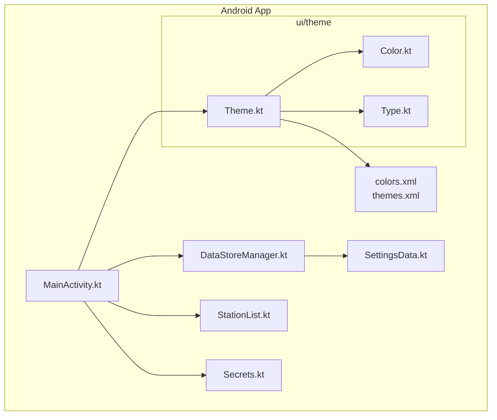
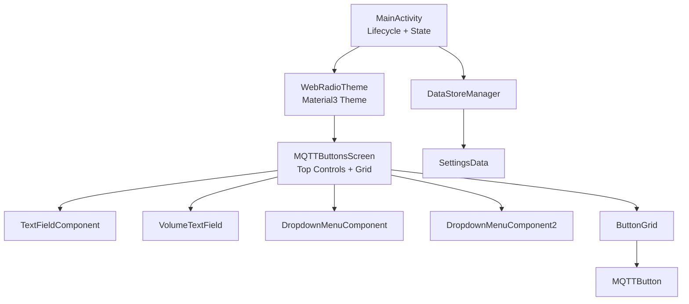
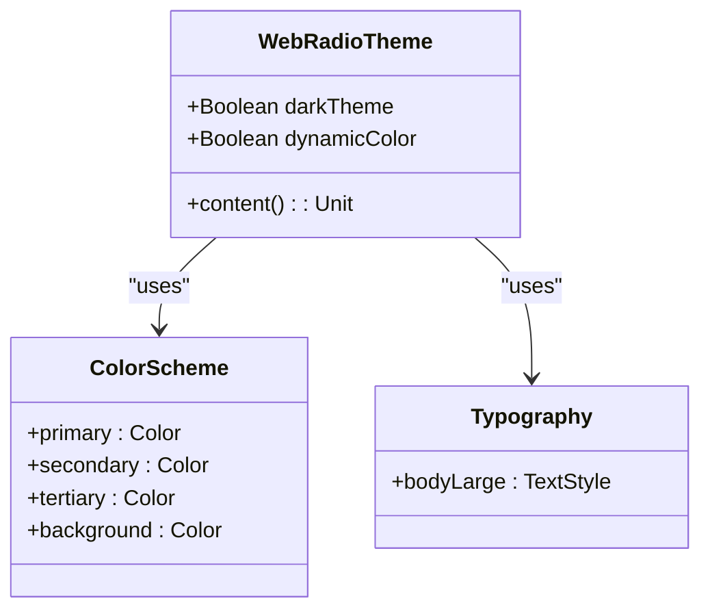
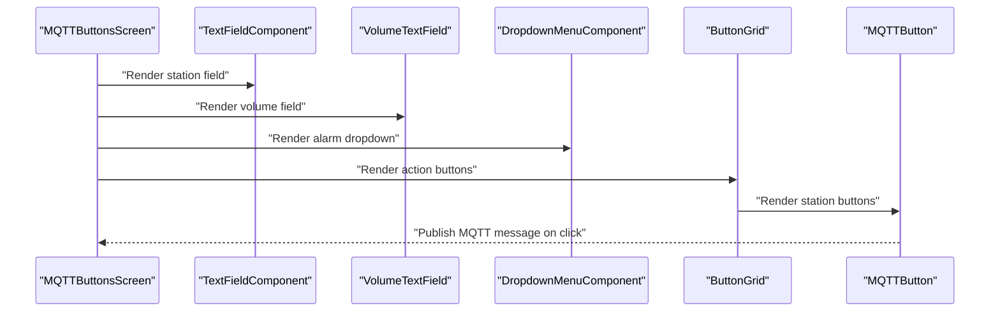
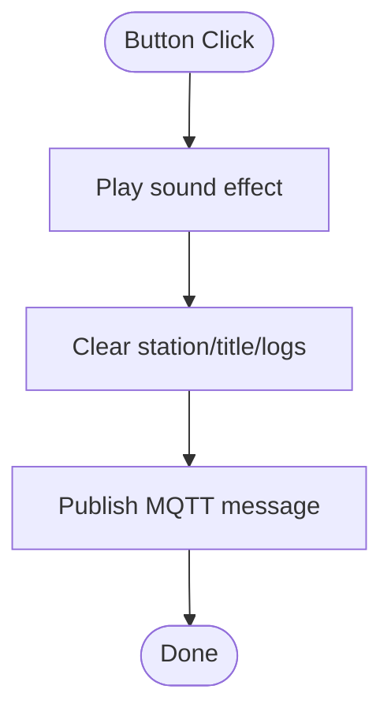
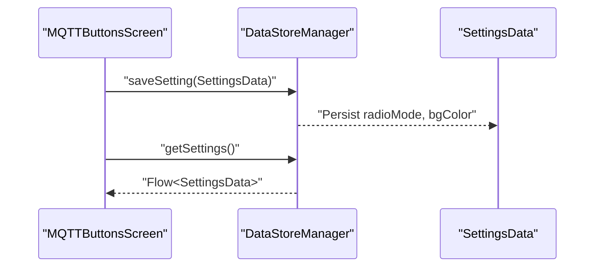
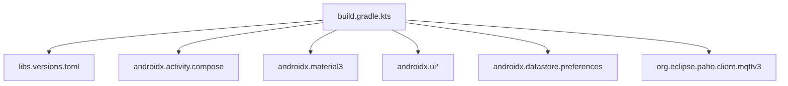

# UI Architecture & Jetpack Compose

<cite>
**Referenced Files in This Document**
- [MainActivity.kt](file://WebRadio_android/app/src/main/java/com/dip16/webradio/MainActivity.kt)
- [Theme.kt](file://WebRadio_android/app/src/main/java/com/dip16/webradio/ui/theme/Theme.kt)
- [Color.kt](file://WebRadio_android/app/src/main/java/com/dip16/webradio/ui/theme/Color.kt)
- [Type.kt](file://WebRadio_android/app/src/main/java/com/dip16/webradio/ui/theme/Type.kt)
- [DataStoreManager.kt](file://WebRadio_android/app/src/main/java/com/dip16/webradio/DataStoreManager.kt)
- [SettingsData.kt](file://WebRadio_android/app/src/main/java/com/dip16/webradio/SettingsData.kt)
- [StationList.kt](file://WebRadio_android/app/src/main/java/com/dip16/webradio/StationList.kt)
- [Secrets.kt](file://WebRadio_android/app/src/main/java/com/dip16/webradio/Secrets.kt)
- [build.gradle.kts](file://WebRadio_android/app/build.gradle.kts)
- [libs.versions.toml](file://WebRadio_android/gradle/libs.versions.toml)
- [colors.xml](file://WebRadio_android/app/src/main/res/values/colors.xml)
- [themes.xml](file://WebRadio_android/app/src/main/res/values/themes.xml)
</cite>

## Table of Contents
1. [Introduction](#introduction)
2. [Project Structure](#project-structure)
3. [Core Components](#core-components)
4. [Architecture Overview](#architecture-overview)
5. [Detailed Component Analysis](#detailed-component-analysis)
6. [Dependency Analysis](#dependency-analysis)
7. [Performance Considerations](#performance-considerations)
8. [Troubleshooting Guide](#troubleshooting-guide)
9. [Conclusion](#conclusion)
10. [Appendices](#appendices)

## Introduction
This document explains the Android application’s UI architecture built with Jetpack Compose. It focuses on declarative UI patterns, component composition, state management using Compose primitives, and the main screen layout centered around the MQTTButtonsScreen composable. It documents custom UI components such as TextFieldComponent, VolumeTextField, DropdownMenuComponent, and MQTTButton, and explains state hoisting, mutable state management, and coroutine integration for asynchronous operations. Theming, color schemes, and responsive layout patterns are covered, along with composable parameters, modifiers, and layout composition techniques used throughout the application.

## Project Structure
The Android application is organized into:
- UI theme modules under ui/theme for colors, typography, and theme composition
- Application entry point MainActivity.kt containing the main composable screen and state orchestration
- Data persistence via DataStoreManager and SettingsData model
- Static station list definition in StationList.kt
- MQTT configuration in Secrets.kt
- Gradle configuration enabling Compose and declaring dependencies

**Diagram sources**
- [MainActivity.kt:106-132](file://WebRadio_android/app/src/main/java/com/dip16/webradio/MainActivity.kt#L106-L132)
- [Theme.kt:44-81](file://WebRadio_android/app/src/main/java/com/dip16/webradio/ui/theme/Theme.kt#L44-L81)
- [DataStoreManager.kt:16-42](file://WebRadio_android/app/src/main/java/com/dip16/webradio/DataStoreManager.kt#L16-L42)
- [SettingsData.kt:3-7](file://WebRadio_android/app/src/main/java/com/dip16/webradio/SettingsData.kt#L3-L7)
- [StationList.kt:5-168](file://WebRadio_android/app/src/main/java/com/dip16/webradio/StationList.kt#L5-L168)
- [Secrets.kt:7-11](file://WebRadio_android/app/src/main/java/com/dip16/webradio/Secrets.kt#L7-L11)
- [colors.xml:1-10](file://WebRadio_android/app/src/main/res/values/colors.xml#L1-L10)
- [themes.xml:1-5](file://WebRadio_android/app/src/main/res/values/themes.xml#L1-L5)

**Section sources**
- [MainActivity.kt:106-132](file://WebRadio_android/app/src/main/java/com/dip16/webradio/MainActivity.kt#L106-L132)
- [Theme.kt:44-81](file://WebRadio_android/app/src/main/java/com/dip16/webradio/ui/theme/Theme.kt#L44-L81)
- [DataStoreManager.kt:16-42](file://WebRadio_android/app/src/main/java/com/dip16/webradio/DataStoreManager.kt#L16-L42)
- [SettingsData.kt:3-7](file://WebRadio_android/app/src/main/java/com/dip16/webradio/SettingsData.kt#L3-L7)
- [StationList.kt:5-168](file://WebRadio_android/app/src/main/java/com/dip16/webradio/StationList.kt#L5-L168)
- [Secrets.kt:7-11](file://WebRadio_android/app/src/main/java/com/dip16/webradio/Secrets.kt#L7-L11)
- [colors.xml:1-10](file://WebRadio_android/app/src/main/res/values/colors.xml#L1-L10)
- [themes.xml:1-5](file://WebRadio_android/app/src/main/res/values/themes.xml#L1-L5)

## Core Components
- WebRadioTheme: Provides Material3-based theme with dynamic color support and status bar appearance adjustments.
- MQTTButtonsScreen: Main screen composable orchestrating top controls (text fields, dropdown menus), action buttons, and the grid of station buttons.
- Custom components:
  - TextFieldComponent: Read-only text field for station and title display
  - VolumeTextField: Read-only text field with trailing icon triggering alarm dropdown
  - DropdownMenuComponent/DropdownMenuComponent2: Alarm selection and work mode selection menus
  - ButtonGrid: Two-row action buttons (POWER, CH +, VOL +, SLEEP, CH -, VOL -)
  - MQTTButton: Grid button representing a station with genre-based coloring and MQTT messaging
- State management:
  - Mutable state for connection state, station, title, volume, logs, and selected indices
  - Hoisted state via parameters and DataStore-backed persistence
- Asynchronous operations:
  - Coroutines for MQTT operations and media playback
  - LaunchedEffect for reacting to state changes and saving settings

**Section sources**
- [Theme.kt:44-81](file://WebRadio_android/app/src/main/java/com/dip16/webradio/ui/theme/Theme.kt#L44-L81)
- [MainActivity.kt:336-442](file://WebRadio_android/app/src/main/java/com/dip16/webradio/MainActivity.kt#L336-L442)
- [MainActivity.kt:454-505](file://WebRadio_android/app/src/main/java/com/dip16/webradio/MainActivity.kt#L454-L505)
- [MainActivity.kt:508-600](file://WebRadio_android/app/src/main/java/com/dip16/webradio/MainActivity.kt#L508-L600)
- [MainActivity.kt:604-631](file://WebRadio_android/app/src/main/java/com/dip16/webradio/MainActivity.kt#L604-L631)
- [MainActivity.kt:634-689](file://WebRadio_android/app/src/main/java/com/dip16/webradio/MainActivity.kt#L634-L689)
- [MainActivity.kt:761-848](file://WebRadio_android/app/src/main/java/com/dip16/webradio/MainActivity.kt#L761-L848)
- [DataStoreManager.kt:16-42](file://WebRadio_android/app/src/main/java/com/dip16/webradio/DataStoreManager.kt#L16-L42)

## Architecture Overview
The application follows a declarative UI architecture:
- MainActivity hosts the UI tree and manages global state and lifecycle
- WebRadioTheme wraps the content with Material3 theme and dynamic color support
- MQTTButtonsScreen composes top controls and the station grid
- Custom composables encapsulate UI concerns and expose parameters for state and behavior
- DataStoreManager persists user preferences (radio mode and background color)
- MQTT callbacks update reactive state, driving UI updates

**Diagram sources**
- [MainActivity.kt:106-132](file://WebRadio_android/app/src/main/java/com/dip16/webradio/MainActivity.kt#L106-L132)
- [MainActivity.kt:336-442](file://WebRadio_android/app/src/main/java/com/dip16/webradio/MainActivity.kt#L336-L442)
- [MainActivity.kt:454-505](file://WebRadio_android/app/src/main/java/com/dip16/webradio/MainActivity.kt#L454-L505)
- [MainActivity.kt:508-600](file://WebRadio_android/app/src/main/java/com/dip16/webradio/MainActivity.kt#L508-L600)
- [MainActivity.kt:634-689](file://WebRadio_android/app/src/main/java/com/dip16/webradio/MainActivity.kt#L634-L689)
- [MainActivity.kt:761-848](file://WebRadio_android/app/src/main/java/com/dip16/webradio/MainActivity.kt#L761-L848)
- [DataStoreManager.kt:16-42](file://WebRadio_android/app/src/main/java/com/dip16/webradio/DataStoreManager.kt#L16-L42)
- [SettingsData.kt:3-7](file://WebRadio_android/app/src/main/java/com/dip16/webradio/SettingsData.kt#L3-L7)

## Detailed Component Analysis

### WebRadioTheme and Material Design
- Defines dark/light color schemes and supports dynamic color on Android 12+
- Applies status bar color and adjusts light/dark status bar icons based on theme
- Exposes a composable that wraps content with MaterialTheme and Typography

**Diagram sources**
- [Theme.kt:20-41](file://WebRadio_android/app/src/main/java/com/dip16/webradio/ui/theme/Theme.kt#L20-L41)
- [Theme.kt:10-17](file://WebRadio_android/app/src/main/java/com/dip16/webradio/ui/theme/Theme.kt#L10-L17)
- [Type.kt:10-17](file://WebRadio_android/app/src/main/java/com/dip16/webradio/ui/theme/Type.kt#L10-L17)

**Section sources**
- [Theme.kt:44-81](file://WebRadio_android/app/src/main/java/com/dip16/webradio/ui/theme/Theme.kt#L44-L81)
- [Color.kt:5-11](file://WebRadio_android/app/src/main/java/com/dip16/webradio/ui/theme/Color.kt#L5-L11)
- [Type.kt:10-17](file://WebRadio_android/app/src/main/java/com/dip16/webradio/ui/theme/Type.kt#L10-L17)

### MQTTButtonsScreen Layout and Composition
- Top row: TextFieldComponent for station, VolumeTextField for volume/state, and DropdownMenuComponent for alarm selection
- Title area: TitleTextField with dropdown menu for work mode
- Action buttons: ButtonGrid with two rows of control buttons
- Station grid: LazyVerticalGrid with fixed column count and items rendered by MQTTButton
- State hoisting: Uses parameters for DataStoreManager and radioMode; maintains internal mutable state for UI selections and MQTT values

**Diagram sources**
- [MainActivity.kt:336-442](file://WebRadio_android/app/src/main/java/com/dip16/webradio/MainActivity.kt#L336-L442)
- [MainActivity.kt:454-505](file://WebRadio_android/app/src/main/java/com/dip16/webradio/MainActivity.kt#L454-L505)
- [MainActivity.kt:508-600](file://WebRadio_android/app/src/main/java/com/dip16/webradio/MainActivity.kt#L508-L600)
- [MainActivity.kt:634-689](file://WebRadio_android/app/src/main/java/com/dip16/webradio/MainActivity.kt#L634-L689)
- [MainActivity.kt:761-848](file://WebRadio_android/app/src/main/java/com/dip16/webradio/MainActivity.kt#L761-L848)

**Section sources**
- [MainActivity.kt:336-442](file://WebRadio_android/app/src/main/java/com/dip16/webradio/MainActivity.kt#L336-L442)

### Custom UI Components

#### TextFieldComponent
- Purpose: Read-only text field for displaying station and title information
- Parameters: value, label, enabled flag, optional modifier, iconColor
- Behavior: Disables input, applies theme-aware text style and shape

**Section sources**
- [MainActivity.kt:454-475](file://WebRadio_android/app/src/main/java/com/dip16/webradio/MainActivity.kt#L454-L475)

#### VolumeTextField
- Purpose: Read-only volume/state indicator with trailing icon to open alarm dropdown
- Parameters: value, label, optional modifier, iconColor, onExpand callback
- Behavior: Trailing icon triggers expansion of DropdownMenuComponent

**Section sources**
- [MainActivity.kt:478-505](file://WebRadio_android/app/src/main/java/com/dip16/webradio/MainActivity.kt#L478-L505)

#### DropdownMenuComponent and DropdownMenuComponent2
- Purpose: Selection menus for alarm times and work modes
- Parameters: expanded state, onDismissRequest, screenWidth, selectedIndex1/workMode
- Behavior: Renders selectable items with checkmarks for current selection; updates selected index and dismisses menu

**Section sources**
- [MainActivity.kt:508-563](file://WebRadio_android/app/src/main/java/com/dip16/webradio/MainActivity.kt#L508-L563)
- [MainActivity.kt:566-600](file://WebRadio_android/app/src/main/java/com/dip16/webradio/MainActivity.kt#L566-L600)

#### TitleTextField
- Purpose: Read-only title/log display with trailing menu icon
- Parameters: value, onExpand callback
- Behavior: Opens DropdownMenuComponent2 for work mode selection

**Section sources**
- [MainActivity.kt:604-631](file://WebRadio_android/app/src/main/java/com/dip16/webradio/MainActivity.kt#L604-L631)

#### ButtonGrid
- Purpose: Two-row action buttons for power, channel/volume controls
- Parameters: context
- Behavior: Uses weighted Row arrangements and ButtonComponent for each control

**Section sources**
- [MainActivity.kt:634-689](file://WebRadio_android/app/src/main/java/com/dip16/webradio/MainActivity.kt#L634-L689)

#### MQTTButton
- Purpose: Grid button representing a station with genre-based coloring
- Parameters: buttonData, index
- Behavior: On click, plays sound effect, clears station/title/logs, sends MQTT message, and updates state

**Diagram sources**
- [MainActivity.kt:761-848](file://WebRadio_android/app/src/main/java/com/dip16/webradio/MainActivity.kt#L761-L848)

**Section sources**
- [MainActivity.kt:761-848](file://WebRadio_android/app/src/main/java/com/dip16/webradio/MainActivity.kt#L761-L848)

### State Management and Hoisting
- Mutable state: connectionState, station, title, volume, logText, selectedIndex, selectedIndex2
- Hoisted state: radioMode passed into MQTTButtonsScreen; DataStoreManager persists settings
- Reactive updates: LaunchedEffect reacts to selected indices to send MQTT commands and persist settings
- DataStore integration: DataStoreManager saves and reads SettingsData (radioMode, bgColor)

**Diagram sources**
- [MainActivity.kt:444-451](file://WebRadio_android/app/src/main/java/com/dip16/webradio/MainActivity.kt#L444-L451)
- [DataStoreManager.kt:18-25](file://WebRadio_android/app/src/main/java/com/dip16/webradio/DataStoreManager.kt#L18-L25)
- [DataStoreManager.kt:34-41](file://WebRadio_android/app/src/main/java/com/dip16/webradio/DataStoreManager.kt#L34-L41)
- [SettingsData.kt:3-7](file://WebRadio_android/app/src/main/java/com/dip16/webradio/SettingsData.kt#L3-L7)

**Section sources**
- [MainActivity.kt:92-99](file://WebRadio_android/app/src/main/java/com/dip16/webradio/MainActivity.kt#L92-L99)
- [MainActivity.kt:424-441](file://WebRadio_android/app/src/main/java/com/dip16/webradio/MainActivity.kt#L424-L441)
- [DataStoreManager.kt:18-41](file://WebRadio_android/app/src/main/java/com/dip16/webradio/DataStoreManager.kt#L18-L41)
- [SettingsData.kt:3-7](file://WebRadio_android/app/src/main/java/com/dip16/webradio/SettingsData.kt#L3-L7)

### Coroutine Integration and Asynchronous Operations
- IO dispatchers: MQTT operations and media playback run on Dispatchers.IO
- LaunchedEffect: Reacts to selected indices to send MQTT messages and persist settings
- Handler/Runnable pattern: Used to clear connectionState after a delay in MQTT callback
- Scope usage: rememberCoroutineScope for UI-triggered coroutines; CoroutineScope(Dispatchers.IO) for background tasks

**Section sources**
- [MainActivity.kt:139-142](file://WebRadio_android/app/src/main/java/com/dip16/webradio/MainActivity.kt#L139-L142)
- [MainActivity.kt:214-222](file://WebRadio_android/app/src/main/java/com/dip16/webradio/MainActivity.kt#L214-L222)
- [MainActivity.kt:691-713](file://WebRadio_android/app/src/main/java/com/dip16/webradio/MainActivity.kt#L691-L713)
- [MainActivity.kt:715-740](file://WebRadio_android/app/src/main/java/com/dip16/webradio/MainActivity.kt#L715-L740)
- [MainActivity.kt:792-821](file://WebRadio_android/app/src/main/java/com/dip16/webradio/MainActivity.kt#L792-L821)

### Theming, Color Schemes, and Responsive Design
- Theme: WebRadioTheme defines dark/light color schemes and dynamic color support
- Colors: Purple/Pink/PurpleGrey palette defined in Color.kt
- Typography: Material defaults customized in Type.kt
- Status bar: Adjusted via SideEffect to set statusBarColor and light/dark icons
- Responsive layout: GridCells.Fixed for station grid; weights for row layouts; screenWidth-derived offsets for dropdowns

**Section sources**
- [Theme.kt:20-41](file://WebRadio_android/app/src/main/java/com/dip16/webradio/ui/theme/Theme.kt#L20-L41)
- [Theme.kt:59-74](file://WebRadio_android/app/src/main/java/com/dip16/webradio/ui/theme/Theme.kt#L59-L74)
- [Color.kt:5-11](file://WebRadio_android/app/src/main/java/com/dip16/webradio/ui/theme/Color.kt#L5-L11)
- [Type.kt:10-17](file://WebRadio_android/app/src/main/java/com/dip16/webradio/ui/theme/Type.kt#L10-L17)
- [MainActivity.kt:412-421](file://WebRadio_android/app/src/main/java/com/dip16/webradio/MainActivity.kt#L412-L421)
- [MainActivity.kt:518](file://WebRadio_android/app/src/main/java/com/dip16/webradio/MainActivity.kt#L518)
- [MainActivity.kt:575](file://WebRadio_android/app/src/main/java/com/dip16/webradio/MainActivity.kt#L575)

## Dependency Analysis
Compose and related libraries are declared in Gradle, including Compose BOM, Material3, and DataStore Preferences. MQTT client is included via Paho.

**Diagram sources**
- [build.gradle.kts:52-74](file://WebRadio_android/app/build.gradle.kts#L52-L74)
- [libs.versions.toml:17-36](file://WebRadio_android/gradle/libs.versions.toml#L17-L36)

**Section sources**
- [build.gradle.kts:52-74](file://WebRadio_android/app/build.gradle.kts#L52-L74)
- [libs.versions.toml:17-36](file://WebRadio_android/gradle/libs.versions.toml#L17-L36)

## Performance Considerations
- Use Dispatchers.IO for network and media operations to avoid blocking the main thread
- Prefer LazyVerticalGrid for large lists to recycle off-screen items
- Minimize recompositions by hoisting state and using remember appropriately
- Avoid heavy computations in UI threads; delegate to background scopes
- Keep dropdown offsets and layout calculations lightweight

## Troubleshooting Guide
- MQTT connectivity issues: Check broker URL, credentials, and network permissions; monitor connectionState updates
- Reconnection behavior: The MQTT callback attempts reconnection when active; verify isAppActive flag during lifecycle transitions
- Settings persistence: Ensure DataStore keys match saved values; confirm SettingsData fields are persisted correctly
- UI state drift: Verify LaunchedEffect keys and hoisted parameters to prevent unintended recompositions

**Section sources**
- [MainActivity.kt:188-246](file://WebRadio_android/app/src/main/java/com/dip16/webradio/MainActivity.kt#L188-L246)
- [MainActivity.kt:444-451](file://WebRadio_android/app/src/main/java/com/dip16/webradio/MainActivity.kt#L444-L451)
- [DataStoreManager.kt:18-41](file://WebRadio_android/app/src/main/java/com/dip16/webradio/DataStoreManager.kt#L18-L41)

## Conclusion
The application demonstrates a clean Jetpack Compose architecture with declarative UI, robust state hoisting, and asynchronous operations integrated via coroutines. The main screen composes top controls and a grid of station buttons, with persistent settings and a cohesive theme. Custom components encapsulate UI concerns, and Material3 theming provides a consistent look-and-feel across devices.

## Appendices

### Composable Function Parameters and Modifiers
- Parameters: value, label, enabled, modifier, iconColor, onExpand, context, message, isIconVisible, toggleIconVisibility
- Modifiers: weight for proportional layouts, fillMaxWidth/fillMaxSize, padding, background, shape, contentPadding
- Layouts: Column, Row, Box, LazyVerticalGrid with GridCells.Fixed

**Section sources**
- [MainActivity.kt:454-505](file://WebRadio_android/app/src/main/java/com/dip16/webradio/MainActivity.kt#L454-L505)
- [MainActivity.kt:508-600](file://WebRadio_android/app/src/main/java/com/dip16/webradio/MainActivity.kt#L508-L600)
- [MainActivity.kt:604-631](file://WebRadio_android/app/src/main/java/com/dip16/webradio/MainActivity.kt#L604-L631)
- [MainActivity.kt:634-689](file://WebRadio_android/app/src/main/java/com/dip16/webradio/MainActivity.kt#L634-L689)
- [MainActivity.kt:761-848](file://WebRadio_android/app/src/main/java/com/dip16/webradio/MainActivity.kt#L761-L848)