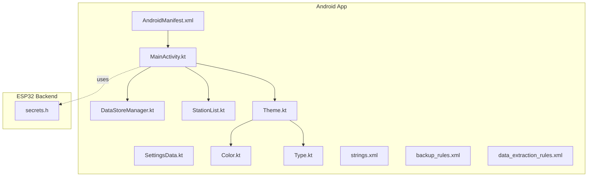
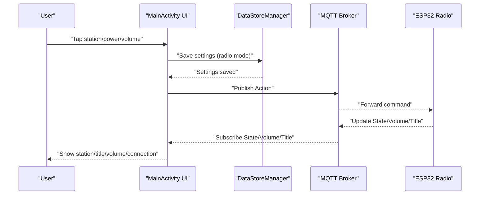
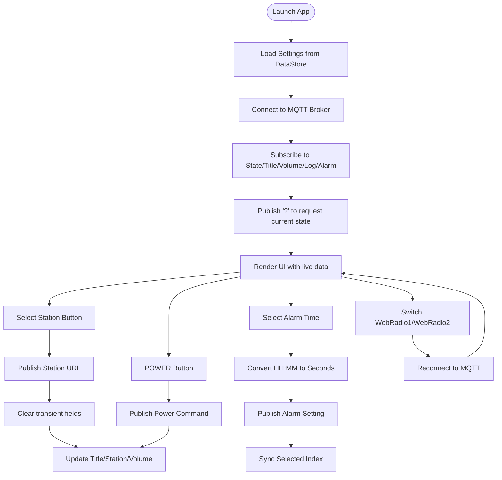
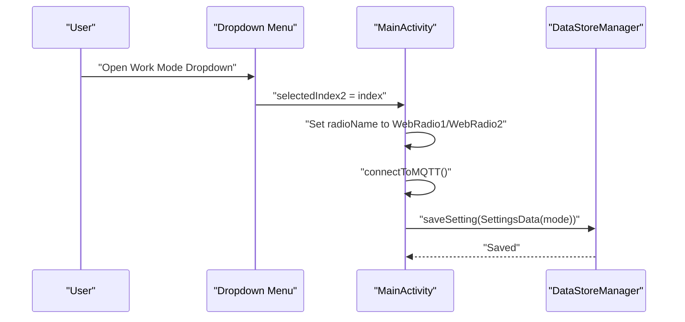
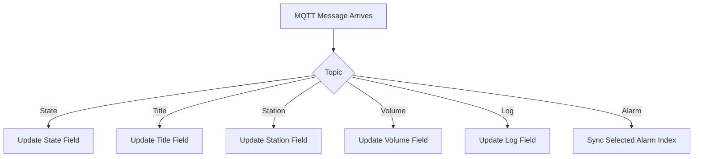
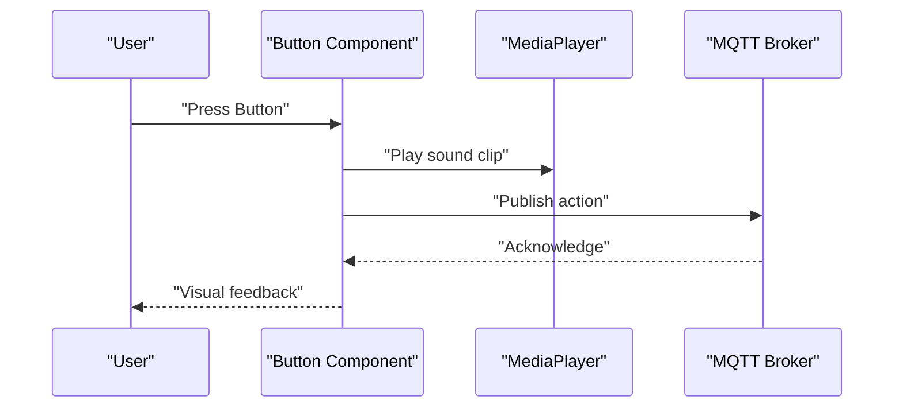
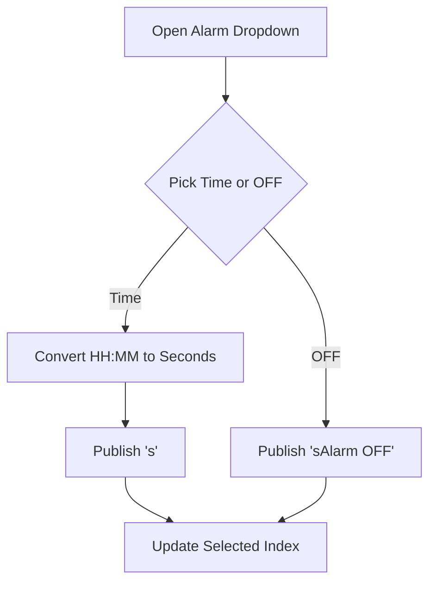
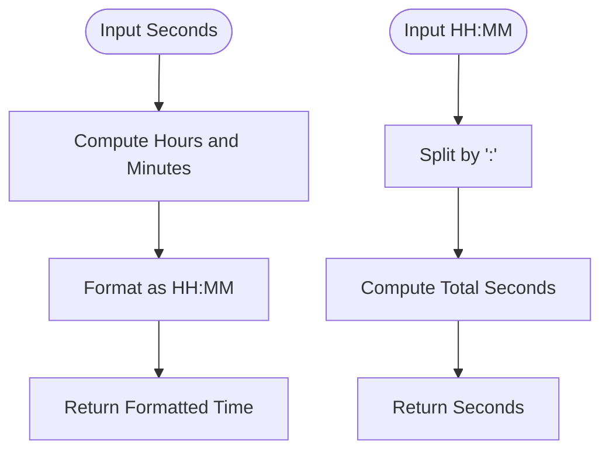
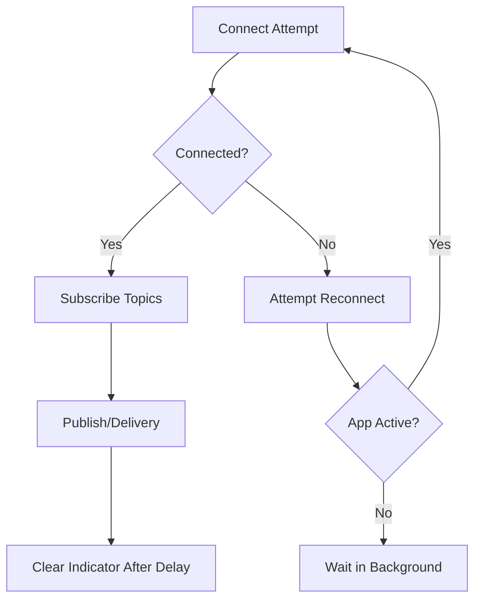

# User Workflows & Interaction Patterns

<cite>
**Referenced Files in This Document**
- [MainActivity.kt](file://WebRadio_android/app/src/main/java/com/dip16/webradio/MainActivity.kt)
- [DataStoreManager.kt](file://WebRadio_android/app/src/main/java/com/dip16/webradio/DataStoreManager.kt)
- [SettingsData.kt](file://WebRadio_android/app/src/main/java/com/dip16/webradio/SettingsData.kt)
- [StationList.kt](file://WebRadio_android/app/src/main/java/com/dip16/webradio/StationList.kt)
- [AndroidManifest.xml](file://WebRadio_android/app/src/main/AndroidManifest.xml)
- [Theme.kt](file://WebRadio_android/app/src/main/java/com/dip16/webradio/ui/theme/Theme.kt)
- [Color.kt](file://WebRadio_android/app/src/main/java/com/dip16/webradio/ui/theme/Color.kt)
- [Type.kt](file://WebRadio_android/app/src/main/java/com/dip16/webradio/ui/theme/Type.kt)
- [strings.xml](file://WebRadio_android/app/src/main/res/values/strings.xml)
- [backup_rules.xml](file://WebRadio_android/app/src/main/res/xml/backup_rules.xml)
- [data_extraction_rules.xml](file://WebRadio_android/app/src/main/res/xml/data_extraction_rules.xml)
- [secrets.h](file://WebRadio_ESP32_S3/src/secrets.h)
</cite>

## Table of Contents
1. [Introduction](#introduction)
2. [Project Structure](#project-structure)
3. [Core Components](#core-components)
4. [Architecture Overview](#architecture-overview)
5. [Daily Usage Workflows](#daily-usage-workflows)
6. [Multi-Device Operation Modes](#multi-device-operation-modes)
7. [Real-Time Feedback Mechanisms](#real-time-feedback-mechanisms)
8. [Gesture-Based Interactions and Audio Feedback](#gesture-based-interactions-and-audio-feedback)
9. [Alarm Scheduling Workflow](#alarm-scheduling-workflow)
10. [Time Conversion Utilities](#time-conversion-utilities)
11. [Sleep Timer Functionality](#sleep-timer-functionality)
12. [Troubleshooting Guide](#troubleshooting-guide)
13. [Accessibility Considerations](#accessibility-considerations)
14. [Integration with System Features](#integration-with-system-features)
15. [Conclusion](#conclusion)

## Introduction
This document explains the complete user interaction patterns and workflow scenarios for the Android application. It covers app launch through station selection, volume control, alarm configuration, multi-device operation modes, real-time feedback, gesture-based interactions, audio feedback, alarm scheduling, time conversions, sleep timer, troubleshooting, accessibility, and system integrations.

## Project Structure
The Android app is organized around a single-activity Compose UI that manages MQTT-driven radio controls. Supporting components include persistent settings storage, theme definitions, and a curated station list.

**Diagram sources**
- [MainActivity.kt:1-922](file://WebRadio_android/app/src/main/java/com/dip16/webradio/MainActivity.kt#L1-L922)
- [DataStoreManager.kt:1-42](file://WebRadio_android/app/src/main/java/com/dip16/webradio/DataStoreManager.kt#L1-L42)
- [SettingsData.kt:1-7](file://WebRadio_android/app/src/main/java/com/dip16/webradio/SettingsData.kt#L1-L7)
- [StationList.kt:1-168](file://WebRadio_android/app/src/main/java/com/dip16/webradio/StationList.kt#L1-L168)
- [AndroidManifest.xml:1-30](file://WebRadio_android/app/src/main/AndroidManifest.xml#L1-L30)
- [Theme.kt:1-81](file://WebRadio_android/app/src/main/java/com/dip16/webradio/ui/theme/Theme.kt#L1-L81)
- [Color.kt:1-11](file://WebRadio_android/app/src/main/java/com/dip16/webradio/ui/theme/Color.kt#L1-L11)
- [Type.kt:1-34](file://WebRadio_android/app/src/main/java/com/dip16/webradio/ui/theme/Type.kt#L1-L34)
- [strings.xml:1-3](file://WebRadio_android/app/src/main/res/values/strings.xml#L1-L3)
- [backup_rules.xml:1-13](file://WebRadio_android/app/src/main/res/xml/backup_rules.xml#L1-L13)
- [data_extraction_rules.xml:1-19](file://WebRadio_android/app/src/main/res/xml/data_extraction_rules.xml#L1-L19)
- [secrets.h:1-23](file://WebRadio_ESP32_S3/src/secrets.h#L1-L23)

**Section sources**
- [MainActivity.kt:1-922](file://WebRadio_android/app/src/main/java/com/dip16/webradio/MainActivity.kt#L1-L922)
- [AndroidManifest.xml:1-30](file://WebRadio_android/app/src/main/AndroidManifest.xml#L1-L30)

## Core Components
- MainActivity orchestrates UI, MQTT connectivity, state updates, and user actions.
- DataStoreManager persists and retrieves user settings (radio mode and background color).
- SettingsData defines the persisted settings model.
- StationList provides the grid of selectable stations.
- Theme, Color, and Type define UI appearance and typography.
- AndroidManifest declares app metadata and permissions.

**Section sources**
- [MainActivity.kt:87-133](file://WebRadio_android/app/src/main/java/com/dip16/webradio/MainActivity.kt#L87-L133)
- [DataStoreManager.kt:16-42](file://WebRadio_android/app/src/main/java/com/dip16/webradio/DataStoreManager.kt#L16-L42)
- [SettingsData.kt:3-7](file://WebRadio_android/app/src/main/java/com/dip16/webradio/SettingsData.kt#L3-L7)
- [StationList.kt:5-168](file://WebRadio_android/app/src/main/java/com/dip16/webradio/StationList.kt#L5-L168)
- [Theme.kt:44-81](file://WebRadio_android/app/src/main/java/com/dip16/webradio/ui/theme/Theme.kt#L44-L81)
- [Color.kt:5-11](file://WebRadio_android/app/src/main/java/com/dip16/webradio/ui/theme/Color.kt#L5-L11)
- [Type.kt:10-34](file://WebRadio_android/app/src/main/java/com/dip16/webradio/ui/theme/Type.kt#L10-L34)
- [AndroidManifest.xml:17-27](file://WebRadio_android/app/src/main/AndroidManifest.xml#L17-L27)

## Architecture Overview
The app follows a reactive UI pattern with Compose. It subscribes to MQTT topics for live updates and publishes actions to control remote radios. Persistent settings are stored via DataStore.

**Diagram sources**
- [MainActivity.kt:102-133](file://WebRadio_android/app/src/main/java/com/dip16/webradio/MainActivity.kt#L102-L133)
- [MainActivity.kt:171-246](file://WebRadio_android/app/src/main/java/com/dip16/webradio/MainActivity.kt#L171-L246)
- [MainActivity.kt:257-296](file://WebRadio_android/app/src/main/java/com/dip16/webradio/MainActivity.kt#L257-L296)
- [DataStoreManager.kt:18-25](file://WebRadio_android/app/src/main/java/com/dip16/webradio/DataStoreManager.kt#L18-L25)

## Daily Usage Workflows
- App launch: Activity initializes, reads persisted settings, connects to MQTT, subscribes to topics, requests current state, and renders UI.
- Station selection: User taps a station button; the app publishes the station URL to the action topic and clears transient fields.
- Volume control: Dedicated power and channel up/down buttons send commands; volume updates appear in the UI.
- Alarm configuration: User selects an alarm time from a dropdown; the app converts time to seconds and sends the setting.
- Multi-device switching: User chooses WebRadio1 or WebRadio2; the app switches the target device and reconnects.

**Diagram sources**
- [MainActivity.kt:102-133](file://WebRadio_android/app/src/main/java/com/dip16/webradio/MainActivity.kt#L102-L133)
- [MainActivity.kt:171-246](file://WebRadio_android/app/src/main/java/com/dip16/webradio/MainActivity.kt#L171-L246)
- [MainActivity.kt:257-296](file://WebRadio_android/app/src/main/java/com/dip16/webradio/MainActivity.kt#L257-L296)
- [MainActivity.kt:691-740](file://WebRadio_android/app/src/main/java/com/dip16/webradio/MainActivity.kt#L691-L740)
- [MainActivity.kt:715-740](file://WebRadio_android/app/src/main/java/com/dip16/webradio/MainActivity.kt#L715-L740)

**Section sources**
- [MainActivity.kt:102-133](file://WebRadio_android/app/src/main/java/com/dip16/webradio/MainActivity.kt#L102-L133)
- [MainActivity.kt:336-442](file://WebRadio_android/app/src/main/java/com/dip16/webradio/MainActivity.kt#L336-L442)
- [MainActivity.kt:634-689](file://WebRadio_android/app/src/main/java/com/dip16/webradio/MainActivity.kt#L634-L689)
- [MainActivity.kt:691-740](file://WebRadio_android/app/src/main/java/com/dip16/webradio/MainActivity.kt#L691-L740)
- [MainActivity.kt:715-740](file://WebRadio_android/app/src/main/java/com/dip16/webradio/MainActivity.kt#L715-L740)

## Multi-Device Operation Modes
The app supports two operational modes (WebRadio1/WebRadio2) controlled by a dropdown menu. Switching updates the target device and triggers a reconnect to MQTT.

- Mode selection UI: A dropdown presents "Kusa" and "Chel".
- Behavior: Selecting an option updates the radioName variable and reconnects to MQTT under the new device topic namespace.
- Persistence: The selected mode is saved to DataStore and restored on startup.

**Diagram sources**
- [MainActivity.kt:566-600](file://WebRadio_android/app/src/main/java/com/dip16/webradio/MainActivity.kt#L566-L600)
- [MainActivity.kt:715-740](file://WebRadio_android/app/src/main/java/com/dip16/webradio/MainActivity.kt#L715-L740)
- [DataStoreManager.kt:18-25](file://WebRadio_android/app/src/main/java/com/dip16/webradio/DataStoreManager.kt#L18-L25)

**Section sources**
- [MainActivity.kt:82-85](file://WebRadio_android/app/src/main/java/com/dip16/webradio/MainActivity.kt#L82-L85)
- [MainActivity.kt:566-600](file://WebRadio_android/app/src/main/java/com/dip16/webradio/MainActivity.kt#L566-L600)
- [MainActivity.kt:715-740](file://WebRadio_android/app/src/main/java/com/dip16/webradio/MainActivity.kt#L715-L740)
- [DataStoreManager.kt:18-25](file://WebRadio_android/app/src/main/java/com/dip16/webradio/DataStoreManager.kt#L18-L25)

## Real-Time Feedback Mechanisms
- Live state updates: The app subscribes to State, Title, Station, Volume, Log, and Alarm topics. Incoming messages update UI fields immediately.
- Connection indicators: Temporary connection state messages appear briefly after publish/delivery events.
- Status updates: The Log topic displays backend logs; the Title field shows now-playing info.
- Volume state: Volume updates are reflected in the dedicated UI field.

**Diagram sources**
- [MainActivity.kt:257-296](file://WebRadio_android/app/src/main/java/com/dip16/webradio/MainActivity.kt#L257-L296)

**Section sources**
- [MainActivity.kt:171-246](file://WebRadio_android/app/src/main/java/com/dip16/webradio/MainActivity.kt#L171-L246)
- [MainActivity.kt:257-296](file://WebRadio_android/app/src/main/java/com/dip16/webradio/MainActivity.kt#L257-L296)

## Gesture-Based Interactions and Audio Feedback
- Buttons: POWER, CH +, CH -, VOL +, VOL - trigger immediate actions and play a short sound effect.
- Station buttons: Each station publishes its URL; a sound effect plays on press.
- Visual feedback: Buttons change appearance during press; icons indicate selections in dropdown menus.
- Audio feedback: Short sound clips are played on button presses to confirm actions.

**Diagram sources**
- [MainActivity.kt:851-899](file://WebRadio_android/app/src/main/java/com/dip16/webradio/MainActivity.kt#L851-L899)
- [MainActivity.kt:760-848](file://WebRadio_android/app/src/main/java/com/dip16/webradio/MainActivity.kt#L760-L848)

**Section sources**
- [MainActivity.kt:851-899](file://WebRadio_android/app/src/main/java/com/dip16/webradio/MainActivity.kt#L851-L899)
- [MainActivity.kt:760-848](file://WebRadio_android/app/src/main/java/com/dip16/webradio/MainActivity.kt#L760-L848)

## Alarm Scheduling Workflow
- Selection: User opens the alarm dropdown and picks a time or "Alarm OFF".
- Conversion: Selected time is converted to total seconds.
- Publishing: The app publishes either the seconds value or an "Alarm OFF" command.
- Sync: The UI reflects the selected alarm by highlighting the chosen item.

**Diagram sources**
- [MainActivity.kt:83-84](file://WebRadio_android/app/src/main/java/com/dip16/webradio/MainActivity.kt#L83-L84)
- [MainActivity.kt:691-713](file://WebRadio_android/app/src/main/java/com/dip16/webradio/MainActivity.kt#L691-L713)
- [MainActivity.kt:298-310](file://WebRadio_android/app/src/main/java/com/dip16/webradio/MainActivity.kt#L298-L310)

**Section sources**
- [MainActivity.kt:83-84](file://WebRadio_android/app/src/main/java/com/dip16/webradio/MainActivity.kt#L83-L84)
- [MainActivity.kt:691-713](file://WebRadio_android/app/src/main/java/com/dip16/webradio/MainActivity.kt#L691-L713)
- [MainActivity.kt:298-310](file://WebRadio_android/app/src/main/java/com/dip16/webradio/MainActivity.kt#L298-L310)

## Time Conversion Utilities
- Converting seconds to HH:MM: The app formats seconds into a readable time string.
- Converting HH:MM to seconds: Used for alarm scheduling; ensures correct payload formatting.

**Diagram sources**
- [MainActivity.kt:164-169](file://WebRadio_android/app/src/main/java/com/dip16/webradio/MainActivity.kt#L164-L169)
- [MainActivity.kt:752-757](file://WebRadio_android/app/src/main/java/com/dip16/webradio/MainActivity.kt#L752-L757)

**Section sources**
- [MainActivity.kt:164-169](file://WebRadio_android/app/src/main/java/com/dip16/webradio/MainActivity.kt#L164-L169)
- [MainActivity.kt:752-757](file://WebRadio_android/app/src/main/java/com/dip16/webradio/MainActivity.kt#L752-L757)

## Sleep Timer Functionality
- The app exposes a SLEEP button in the control row. Pressing it triggers a sleep-related action via MQTT publishing.
- No explicit sleep countdown UI is present; the effect depends on backend behavior.

**Section sources**
- [MainActivity.kt:664-670](file://WebRadio_android/app/src/main/java/com/dip16/webradio/MainActivity.kt#L664-L670)
- [MainActivity.kt:877-878](file://WebRadio_android/app/src/main/java/com/dip16/webradio/MainActivity.kt#L877-L878)

## Troubleshooting Guide
- Connection issues:
  - The app attempts to reconnect automatically when the connection is lost and the app is active.
  - Connection state messages appear briefly after delivery completion.
- Recovery patterns:
  - On stop, the app disconnects from MQTT to free resources.
  - On resume/start, it reconnects and resubscribes.
- Common user scenarios:
  - Broker unreachable: UI shows "Connection Failed!" temporarily; reconnect occurs when active.
  - No response: Publishing triggers a "Request delivered" indicator; clearing after delay indicates completion.
  - Settings not persisting: Verify DataStore operations succeed; ensure settings are saved on mode change.

**Diagram sources**
- [MainActivity.kt:171-246](file://WebRadio_android/app/src/main/java/com/dip16/webradio/MainActivity.kt#L171-L246)
- [MainActivity.kt:188-223](file://WebRadio_android/app/src/main/java/com/dip16/webradio/MainActivity.kt#L188-L223)
- [MainActivity.kt:156-162](file://WebRadio_android/app/src/main/java/com/dip16/webradio/MainActivity.kt#L156-L162)

**Section sources**
- [MainActivity.kt:171-246](file://WebRadio_android/app/src/main/java/com/dip16/webradio/MainActivity.kt#L171-L246)
- [MainActivity.kt:188-223](file://WebRadio_android/app/src/main/java/com/dip16/webradio/MainActivity.kt#L188-L223)
- [MainActivity.kt:156-162](file://WebRadio_android/app/src/main/java/com/dip16/webradio/MainActivity.kt#L156-L162)

## Accessibility Considerations
- Visual contrast: Theme adapts to dark/light modes; status bar icons invert appropriately for readability.
- Text sizing: Typography uses consistent sizes suitable for small screens.
- Focus and navigation: Buttons are large and clearly labeled; dropdown menus provide visible selection indicators.
- Audio cues: Short sound effects accompany button presses to aid tactile feedback.

**Section sources**
- [Theme.kt:44-81](file://WebRadio_android/app/src/main/java/com/dip16/webradio/ui/theme/Theme.kt#L44-L81)
- [Type.kt:10-34](file://WebRadio_android/app/src/main/java/com/dip16/webradio/ui/theme/Type.kt#L10-L34)
- [MainActivity.kt:851-899](file://WebRadio_android/app/src/main/java/com/dip16/webradio/MainActivity.kt#L851-L899)

## Integration with System Features
- Permissions: The app requests INTERNET permission for MQTT connectivity.
- Backup and restore: XML rules define backup and extraction policies; the app uses DataStore for settings persistence.
- Notifications: While not explicitly used in the UI shown, the app includes a notification icon in the volume field, indicating potential future notification integration.

**Section sources**
- [AndroidManifest.xml:5](file://WebRadio_android/app/src/main/AndroidManifest.xml#L5)
- [AndroidManifest.xml:17-27](file://WebRadio_android/app/src/main/AndroidManifest.xml#L17-L27)
- [backup_rules.xml:8-12](file://WebRadio_android/app/src/main/res/xml/backup_rules.xml#L8-L12)
- [data_extraction_rules.xml:7-17](file://WebRadio_android/app/src/main/res/xml/data_extraction_rules.xml#L7-L17)
- [MainActivity.kt:489-493](file://WebRadio_android/app/src/main/java/com/dip16/webradio/MainActivity.kt#L489-L493)

## Conclusion
The Android app provides a streamlined, reactive interface for controlling WebRadio devices over MQTT. Users can switch between devices, select stations, adjust volume, configure alarms, and receive real-time feedback. The UI integrates audio cues, persistent settings, and robust connection handling to support reliable daily usage.