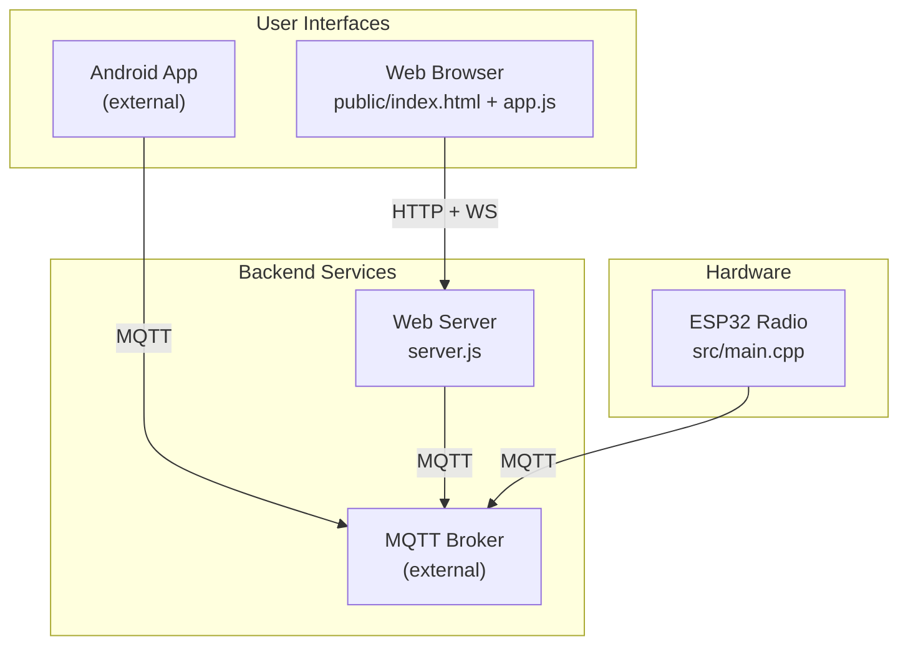
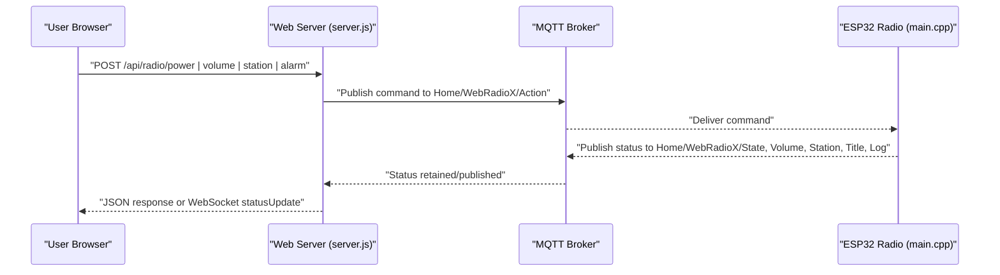
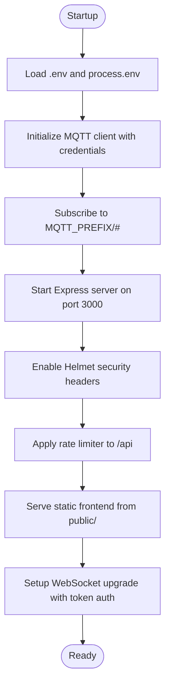
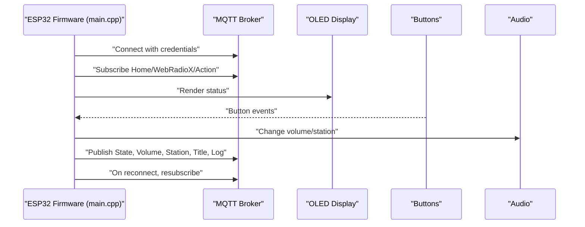
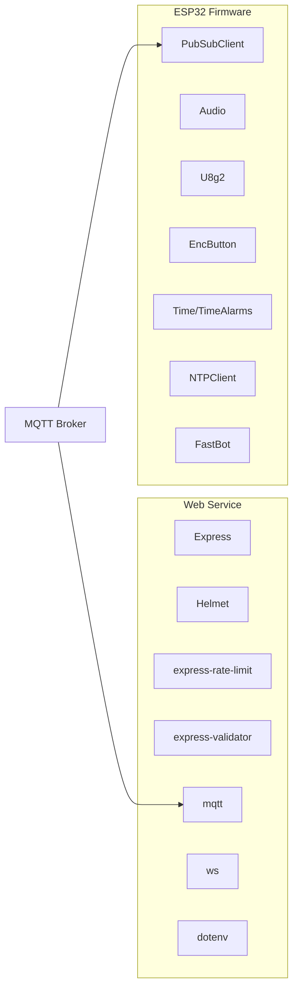

# Deployment & Production

<cite>
**Referenced Files in This Document**
- [Dockerfile](file://WebRadio_web/Dockerfile)
- [docker-compose.yml](file://WebRadio_web/docker-compose.yml)
- [server.js](file://WebRadio_web/server.js)
- [webradio-web.service](file://WebRadio_web/webradio-web.service)
- [package.json](file://WebRadio_web/package.json)
- [index.html](file://WebRadio_web/public/index.html)
- [app.js](file://WebRadio_web/public/app.js)
- [style.css](file://WebRadio_web/public/style.css)
- [README.md](file://WebRadio_web/README.md)
- [README.md](file://WebRadio_ESP32_S3/README.md)
- [platformio.ini](file://WebRadio_ESP32_S3/platformio.ini)
- [main.cpp](file://WebRadio_ESP32_S3/src/main.cpp)
- [secrets.h.example](file://WebRadio_ESP32_S3/src/secrets.h.example)
- [secrets.h](file://WebRadio_ESP32_S3/src/secrets.h)
- [README.md](file://README.md)
</cite>

## Table of Contents
1. [Introduction](#introduction)
2. [Project Structure](#project-structure)
3. [Core Components](#core-components)
4. [Architecture Overview](#architecture-overview)
5. [Detailed Component Analysis](#detailed-component-analysis)
6. [Dependency Analysis](#dependency-analysis)
7. [Performance Considerations](#performance-considerations)
8. [Troubleshooting Guide](#troubleshooting-guide)
9. [Conclusion](#conclusion)
10. [Appendices](#appendices)

## Introduction
This document provides comprehensive deployment and production guidance for the WebRadio system. It covers containerization with Docker, orchestration with docker-compose, systemd service management, environment configuration, security hardening, performance optimization, networking and SSL/TLS, monitoring and logging, health checks, alerting, scaling and high availability, backup and recovery, CI/CD integration, and cloud/hybrid deployment options. The goal is to enable reliable, secure, and scalable production deployments for both the WebRadio web interface and the ESP32 hardware radio.

## Project Structure
The WebRadio system comprises:
- Web interface backend (Node.js/Express) with embedded static frontend assets
- ESP32 firmware that communicates over MQTT to a central broker
- Android app (external to this repository) that also communicates over MQTT
- Python utilities for station list management

**Diagram sources**
- [server.js:1-267](file://WebRadio_web/server.js#L1-L267)
- [index.html:1-61](file://WebRadio_web/public/index.html#L1-L61)
- [app.js:1-366](file://WebRadio_web/public/app.js#L1-L366)
- [README.md:61-91](file://README.md#L61-L91)

**Section sources**
- [README.md:1-113](file://README.md#L1-L113)

## Core Components
- Web server and API gateway
  - Express server with Helmet, rate limiting, and WebSocket bridge to MQTT
  - Static hosting for the React-like SPA
  - Environment-driven configuration for MQTT and token-based auth
- ESP32 radio firmware
  - MQTT client, audio streaming, OLED display, button handling, alarms, and EEPROM persistence
  - Configurable via secrets.h for WiFi, Telegram, and MQTT
- Android app (external)
  - MQTT-based control and status subscription
- Python utilities
  - Station list conversion and sorting helpers

Key production deployment artifacts:
- Dockerfile for containerized web service
- docker-compose.yml for orchestrated deployment with Traefik
- systemd unit for bare-metal service management
- Package dependencies and scripts for Node.js

**Section sources**
- [server.js:1-267](file://WebRadio_web/server.js#L1-L267)
- [Dockerfile:1-28](file://WebRadio_web/Dockerfile#L1-L28)
- [docker-compose.yml:1-25](file://WebRadio_web/docker-compose.yml#L1-L25)
- [webradio-web.service:1-14](file://WebRadio_web/webradio-web.service#L1-L14)
- [package.json:1-26](file://WebRadio_web/package.json#L1-L26)
- [README.md:1-75](file://WebRadio_web/README.md#L1-L75)
- [README.md:1-127](file://WebRadio_ESP32_S3/README.md#L1-L127)
- [platformio.ini:1-71](file://WebRadio_ESP32_S3/platformio.ini#L1-L71)
- [main.cpp:1-800](file://WebRadio_ESP32_S3/src/main.cpp#L1-L800)
- [secrets.h.example:1-32](file://WebRadio_ESP32_S3/src/secrets.h.example#L1-L32)
- [secrets.h:1-23](file://WebRadio_ESP32_S3/src/secrets.h#L1-L23)

## Architecture Overview
The system uses a hybrid control model:
- Web UI controls via HTTP API and WebSocket
- ESP32 firmware subscribes to MQTT topics and publishes status
- Android app also publishes commands to MQTT
- Central MQTT broker mediates communication

**Diagram sources**
- [server.js:100-203](file://WebRadio_web/server.js#L100-L203)
- [main.cpp:274-650](file://WebRadio_ESP32_S3/src/main.cpp#L274-L650)

**Section sources**
- [README.md:61-91](file://README.md#L61-L91)

## Detailed Component Analysis

### Web Server and API Gateway
Production deployment focuses on:
- Containerization with a non-root user and minimal base image
- Reverse proxy integration (Traefik) for TLS termination and routing
- Environment-driven configuration for MQTT and authentication
- Security headers and rate limiting
- WebSocket upgrade with token-based authentication

**Diagram sources**
- [server.js:33-97](file://WebRadio_web/server.js#L33-L97)
- [server.js:100-203](file://WebRadio_web/server.js#L100-L203)
- [server.js:208-267](file://WebRadio_web/server.js#L208-L267)

**Section sources**
- [Dockerfile:1-28](file://WebRadio_web/Dockerfile#L1-L28)
- [docker-compose.yml:1-25](file://WebRadio_web/docker-compose.yml#L1-L25)
- [server.js:1-267](file://WebRadio_web/server.js#L1-L267)
- [README.md:21-75](file://WebRadio_web/README.md#L21-L75)

### ESP32 Radio Firmware
Production considerations:
- Secure credentials via secrets.h (not committed)
- Reliable MQTT reconnection and status publishing
- Persistent alarm settings in EEPROM
- NTP synchronization and display updates

**Diagram sources**
- [main.cpp:274-650](file://WebRadio_ESP32_S3/src/main.cpp#L274-L650)
- [main.cpp:652-690](file://WebRadio_ESP32_S3/src/main.cpp#L652-L690)
- [README.md:89-118](file://WebRadio_ESP32_S3/README.md#L89-L118)

**Section sources**
- [README.md:1-127](file://WebRadio_ESP32_S3/README.md#L1-L127)
- [platformio.ini:1-71](file://WebRadio_ESP32_S3/platformio.ini#L1-L71)
- [main.cpp:1-800](file://WebRadio_ESP32_S3/src/main.cpp#L1-L800)
- [secrets.h.example:1-32](file://WebRadio_ESP32_S3/src/secrets.h.example#L1-L32)
- [secrets.h:1-23](file://WebRadio_ESP32_S3/src/secrets.h#L1-L23)

### Android App (External)
- Communicates with the MQTT broker to send commands and receive status
- Integrates with the same topic structure as the web interface
- Requires MQTT broker configuration and optional Telegram bot integration

**Section sources**
- [README.md:24-36](file://README.md#L24-L36)
- [README.md:89-112](file://README.md#L89-L112)

## Dependency Analysis
Runtime dependencies and build-time metadata:
- Web service depends on Express, Helmet, rate-limit, express-validator, MQTT, and WebSocket libraries
- ESP32 firmware depends on Arduino framework, PubSubClient, Audio, U8g2, EncButton, Time, TimeAlarms, NTPClient, FastBot

**Diagram sources**
- [package.json:15-24](file://WebRadio_web/package.json#L15-L24)
- [platformio.ini:36-70](file://WebRadio_ESP32_S3/platformio.ini#L36-L70)

**Section sources**
- [package.json:1-26](file://WebRadio_web/package.json#L1-L26)
- [platformio.ini:1-71](file://WebRadio_ESP32_S3/platformio.ini#L1-L71)

## Performance Considerations
- Network and streaming
  - Use a wired Ethernet connection for the ESP32 if possible to reduce latency and packet loss
  - Choose stable radio streams with appropriate bitrate to minimize buffering
  - Monitor RSSI and handle reconnection gracefully
- MQTT throughput
  - Keep topic names concise and hierarchical to optimize broker performance
  - Use retained messages sparingly; rely on periodic publishes for status
- Web server
  - Enable compression and caching for static assets
  - Tune rate limits and keep-alive timeouts for WebSocket connections
  - Use a reverse proxy (Traefik) to offload TLS and handle concurrent connections efficiently
- Resource usage
  - Monitor free heap on ESP32 and avoid frequent allocations
  - Persist critical settings (e.g., alarm) in EEPROM to survive resets

[No sources needed since this section provides general guidance]

## Troubleshooting Guide
Common operational issues and resolutions:
- Authentication failures
  - Verify SECRET_TOKEN matches between the browser prompt, .env, and WebSocket URL
  - Confirm X-Auth-Token header is present for HTTP API calls
- MQTT connectivity
  - Check MQTT_BROKER_URL, MQTT_USER, and MQTT_PASSWORD in .env
  - Ensure the broker is reachable from the container/host and firewall rules allow port 1883
- WebSocket upgrades
  - Confirm token is passed via URL query parameter and matches SECRET_TOKEN
  - Inspect browser console for WebSocket handshake errors
- ESP32 status
  - Validate WiFi credentials in secrets.h
  - Confirm MQTT broker address and credentials in secrets.h
  - Check OLED display and button wiring if UI does not reflect status

**Section sources**
- [README.md:60-75](file://WebRadio_web/README.md#L60-L75)
- [server.js:102-110](file://WebRadio_web/server.js#L102-L110)
- [server.js:224-238](file://WebRadio_web/server.js#L224-L238)
- [secrets.h.example:1-32](file://WebRadio_ESP32_S3/src/secrets.h.example#L1-L32)
- [secrets.h:1-23](file://WebRadio_ESP32_S3/src/secrets.h#L1-L23)

## Conclusion
The WebRadio system can be deployed securely and scalably using containerization, orchestration, and robust configuration management. By enforcing strong authentication, leveraging reverse proxies for TLS, and implementing resilient MQTT communication, the system achieves reliability and maintainability. Extending to multiple ESP32 radios and integrating monitoring/alerting completes a production-grade deployment suitable for home automation or small-scale IoT installations.

[No sources needed since this section summarizes without analyzing specific files]

## Appendices

### A. Production Deployment Strategies

- Containerization with Docker
  - Use the provided Dockerfile to build a minimal Alpine-based image
  - Run as a non-root user and expose port 3000
  - Mount persistent volumes for logs and configuration if needed

- Orchestration with docker-compose
  - Use the provided docker-compose.yml to integrate with Traefik
  - Configure Traefik labels for domain routing, TLS, and entrypoints
  - Externalize the network to an existing bridge for service discovery

- Systemd service management
  - Use the provided unit file to run the Node.js server on bare metal
  - Ensure proper permissions and environment variables are loaded
  - Enable automatic restarts and configure log rotation externally

**Section sources**
- [Dockerfile:1-28](file://WebRadio_web/Dockerfile#L1-L28)
- [docker-compose.yml:1-25](file://WebRadio_web/docker-compose.yml#L1-L25)
- [webradio-web.service:1-14](file://WebRadio_web/webradio-web.service#L1-L14)

### B. Environment Configuration

- Web service
  - SECRET_TOKEN: Long, random token for API and WebSocket authentication
  - MQTT_BROKER_URL: Host or host.docker.internal when broker runs on the same host
  - MQTT_USER, MQTT_PASSWORD: Optional credentials for secured brokers

- ESP32 firmware
  - secrets.h: WiFi SSID/password arrays, Telegram bot token and admin chat ID, MQTT server and credentials

**Section sources**
- [README.md:38-51](file://WebRadio_web/README.md#L38-L51)
- [secrets.h.example:1-32](file://WebRadio_ESP32_S3/src/secrets.h.example#L1-L32)
- [secrets.h:1-23](file://WebRadio_ESP32_S3/src/secrets.h#L1-L23)

### C. Security Hardening Measures

- Transport and access control
  - Use HTTPS with TLS termination at Traefik
  - Enforce token-based authentication for WebSocket and API endpoints
  - Restrict API exposure behind a reverse proxy and firewall

- Container and OS hardening
  - Run containers as non-root users
  - Minimize image surface area and keep dependencies updated
  - Limit exposed ports and disable unnecessary capabilities

- Secrets management
  - Never commit secrets.h or .env files
  - Use environment injection or secret managers in production

**Section sources**
- [README.md:69-75](file://WebRadio_web/README.md#L69-L75)
- [server.js:14-15](file://WebRadio_web/server.js#L14-L15)
- [server.js:20-29](file://WebRadio_web/server.js#L20-L29)

### D. Network Configuration, Firewall, and SSL/TLS

- Network
  - Place the MQTT broker on a dedicated internal network segment
  - Ensure DNS resolution for host.docker.internal when using Docker host networking

- Firewall
  - Open TCP/1883 for MQTT clients
  - Open TCP/80/443 for web traffic routed through Traefik

- SSL/TLS
  - Configure Traefik with a certificate resolver and ACME challenge
  - Ensure router rules specify TLS and entrypoints

**Section sources**
- [docker-compose.yml:13-18](file://WebRadio_web/docker-compose.yml#L13-L18)
- [README.md:21-58](file://WebRadio_web/README.md#L21-L58)

### E. Monitoring, Logging, Health Checks, and Alerting

- Logging
  - Capture stdout/stderr from containers and forward to centralized logging
  - For systemd, use journald and export logs to a collector

- Health checks
  - Expose a simple GET endpoint for readiness and liveness probes
  - Monitor WebSocket connection counts and MQTT publish/subscribe success rates

- Alerting
  - Trigger alerts on MQTT connection drops, repeated publish failures, or low free heap on ESP32
  - Integrate with monitoring dashboards (e.g., Grafana) and alert managers (e.g., Alertmanager)

**Section sources**
- [server.js:56-80](file://WebRadio_web/server.js#L56-L80)

### F. Scaling, Load Balancing, and High Availability

- Horizontal scaling
  - Run multiple instances behind a load balancer or Traefik
  - Ensure stateless web servers; persist configuration externally

- High availability
  - Deploy the MQTT broker in HA mode or use a managed broker
  - Use redundant network paths and failover DNS records

**Section sources**
- [docker-compose.yml:7-10](file://WebRadio_web/docker-compose.yml#L7-L10)

### G. Backup and Recovery, Data Persistence, and Disaster Recovery

- Data persistence
  - Store station lists and configuration in versioned files
  - Persist alarm settings in EEPROM on ESP32; back up EEPROM images periodically

- Backup and recovery
  - Back up secrets.h and .env out-of-band
  - Snapshot broker storage and database backups (if applicable)
  - Test restore procedures regularly

**Section sources**
- [README.md:22-28](file://WebRadio_ESP32_S3/README.md#L22-L28)
- [secrets.h.example:1-32](file://WebRadio_ESP32_S3/src/secrets.h.example#L1-L32)

### H. CI/CD Pipeline Integration

- Build and test
  - Build Docker images on merge to main branch
  - Run lint and tests for the web service

- Release management
  - Tag releases and push images to a registry
  - Use blue/green or rolling deployments with rollback capability

- ESP32 firmware
  - Build and flash via PlatformIO in CI
  - Automate OTA updates through Telegram or HTTP endpoints

**Section sources**
- [platformio.ini:1-71](file://WebRadio_ESP32_S3/platformio.ini#L1-L71)
- [README.md:120-127](file://WebRadio_ESP32_S3/README.md#L120-L127)

### I. Cloud, Edge, and Hybrid Deployment

- Cloud
  - Host the web service on managed containers or VMs
  - Use managed MQTT services or deploy a broker on Kubernetes

- Edge
  - Run ESP32 radios at remote locations with local MQTT brokers
  - Use cellular or satellite links with appropriate routing

- Hybrid
  - Combine cloud-hosted web control with edge devices
  - Use VPN or mesh networking for secure inter-device communication

**Section sources**
- [README.md:61-91](file://README.md#L61-L91)