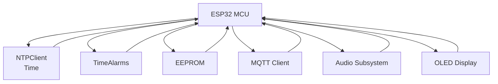
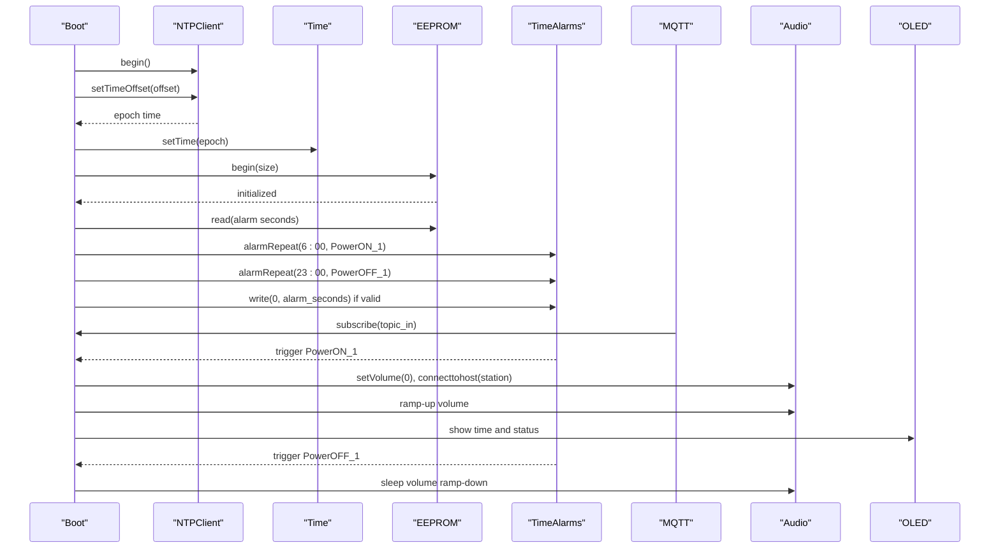
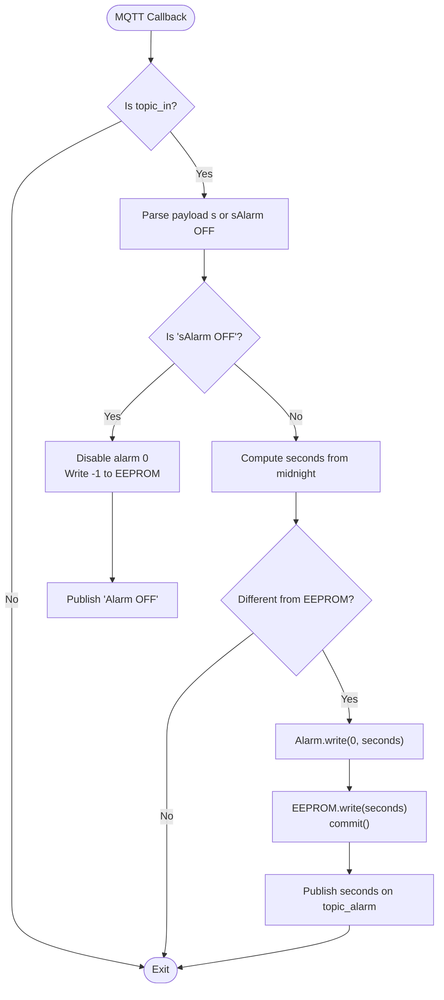
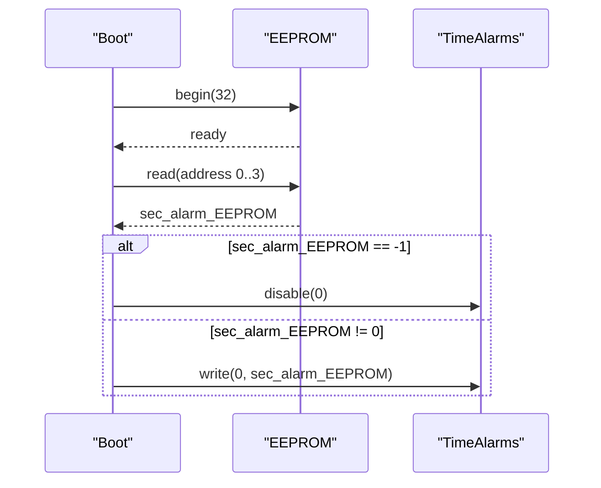
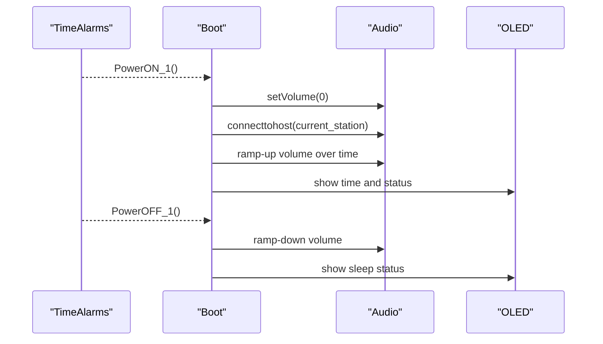
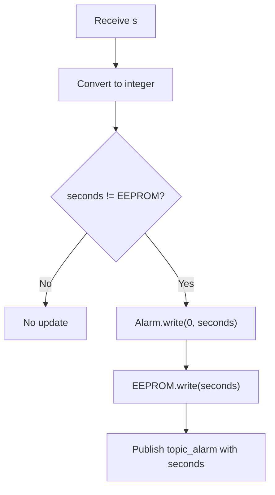
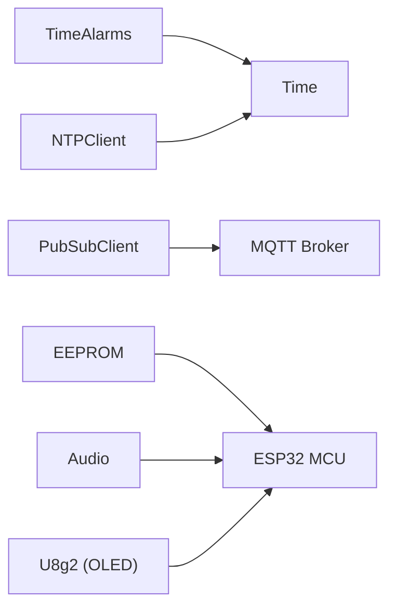

# Alarm and Time Management

<cite>
**Referenced Files in This Document**
- [main.cpp](file://WebRadio_ESP32_S3/src/main.cpp)
- [secrets.h](file://WebRadio_ESP32_S3/src/secrets.h)
- [platformio.ini](file://WebRadio_ESP32_S3/platformio.ini)
- [README.md](file://WebRadio_ESP32_S3/README.md)
</cite>

## Table of Contents
1. [Introduction](#introduction)
2. [Project Structure](#project-structure)
3. [Core Components](#core-components)
4. [Architecture Overview](#architecture-overview)
5. [Detailed Component Analysis](#detailed-component-analysis)
6. [Dependency Analysis](#dependency-analysis)
7. [Performance Considerations](#performance-considerations)
8. [Troubleshooting Guide](#troubleshooting-guide)
9. [Conclusion](#conclusion)

## Introduction
This document explains the alarm and time management system implemented in the ESP32-based Web Radio project. It covers:
- Time synchronization via NTPClient and Time/TimeAlarms libraries
- Alarm configuration and persistence using EEPROM
- MQTT-based alarm control and status reporting
- Power-on automation triggered by alarms
- Integration with the audio subsystem and display
- Time zone offset configuration and NTP server settings
- Practical examples and troubleshooting guidance

## Project Structure
The alarm and time management logic is implemented in the main application source file, with configuration and dependencies declared in platformio.ini and secrets.h. The system integrates:
- NTPClient for time synchronization
- Time/TimeAlarms for scheduled events
- EEPROM for persistent alarm settings
- MQTT for remote control and status publishing
- Audio subsystem for power-on automation and volume ramp-up
- OLED display for time and status

**Diagram sources**
- [main.cpp:63-64](file://WebRadio_ESP32_S3/src/main.cpp#L63-L64)
- [main.cpp:8-14](file://WebRadio_ESP32_S3/src/main.cpp#L8-L14)
- [main.cpp:1210-1219](file://WebRadio_ESP32_S3/src/main.cpp#L1210-L1219)
- [main.cpp:1242](file://WebRadio_ESP32_S3/src/main.cpp#L1242)
- [main.cpp:1265-1277](file://WebRadio_ESP32_S3/src/main.cpp#L1265-L1277)
- [main.cpp:1291-1306](file://WebRadio_ESP32_S3/src/main.cpp#L1291-L1306)

**Section sources**
- [main.cpp:1-15](file://WebRadio_ESP32_S3/src/main.cpp#L1-L15)
- [platformio.ini:36-44](file://WebRadio_ESP32_S3/platformio.ini#L36-L44)

## Core Components
- NTPClient and Time: Used to synchronize epoch time and configure a time zone offset.
- TimeAlarms: Provides scheduled alarm events for power-on and power-off automation.
- EEPROM: Stores the persisted alarm setting (seconds from midnight) across reboots.
- MQTT: Receives alarm commands and publishes alarm status and system state.
- Audio: Handles power-on automation and volume ramp-up when alarms trigger.
- OLED: Displays current time and status during power-on sequences.

**Section sources**
- [main.cpp:8-14](file://WebRadio_ESP32_S3/src/main.cpp#L8-L14)
- [main.cpp:63-73](file://WebRadio_ESP32_S3/src/main.cpp#L63-L73)
- [main.cpp:136](file://WebRadio_ESP32_S3/src/main.cpp#L136)
- [main.cpp:1210-1219](file://WebRadio_ESP32_S3/src/main.cpp#L1210-L1219)
- [main.cpp:1242](file://WebRadio_ESP32_S3/src/main.cpp#L1242)
- [main.cpp:1265-1277](file://WebRadio_ESP32_S3/src/main.cpp#L1265-L1277)
- [main.cpp:1291-1306](file://WebRadio_ESP32_S3/src/main.cpp#L1291-L1306)

## Architecture Overview
The system initializes WiFi, connects to an NTP server, sets the local time with a configured offset, and loads the persisted alarm from EEPROM. Alarms are registered to trigger power-on and power-off actions. MQTT subscriptions handle alarm configuration commands and publish status updates. On alarm trigger, the audio subsystem is engaged with a controlled volume ramp-up.

**Diagram sources**
- [main.cpp:1210-1219](file://WebRadio_ESP32_S3/src/main.cpp#L1210-L1219)
- [main.cpp:1242](file://WebRadio_ESP32_S3/src/main.cpp#L1242)
- [main.cpp:1265-1277](file://WebRadio_ESP32_S3/src/main.cpp#L1265-L1277)
- [main.cpp:1291-1306](file://WebRadio_ESP32_S3/src/main.cpp#L1291-L1306)
- [main.cpp:1358](file://WebRadio_ESP32_S3/src/main.cpp#L1358)
- [main.cpp:1947-1984](file://WebRadio_ESP32_S3/src/main.cpp#L1947-L1984)
- [main.cpp:1987-1996](file://WebRadio_ESP32_S3/src/main.cpp#L1987-L1996)

## Detailed Component Analysis

### Time Synchronization and Time Zone Offset
- NTPClient is started and configured with a time zone offset (in seconds). The offset is defined as a compile-time constant and applied to the NTP response to derive local epoch time.
- The system waits for a successful NTP update and then sets the Arduino Time library’s internal time.

Key behaviors:
- Time zone offset is applied via setTimeOffset.
- Epoch time is converted to local time and displayed on the OLED.
- The offset is used to compute alarm times as seconds from midnight.

**Section sources**
- [main.cpp:31](file://WebRadio_ESP32_S3/src/main.cpp#L31)
- [main.cpp:1210-1219](file://WebRadio_ESP32_S3/src/main.cpp#L1210-L1219)
- [main.cpp:746-752](file://WebRadio_ESP32_S3/src/main.cpp#L746-L752)

### Alarm Configuration via MQTT
- Alarm configuration is handled through MQTT topic_in. The payload format is s<seconds>, where seconds is the number of seconds from midnight (e.g., s3600 for 01:00).
- Disabling the alarm is supported via sAlarm OFF, which writes a sentinel value to EEPROM and disables the alarm.

Processing logic:
- Parse the incoming message to extract seconds.
- If seconds differ from the previously stored value, update the alarm and persist to EEPROM.
- Publish current alarm status on topic_alarm.

**Diagram sources**
- [main.cpp:275-650](file://WebRadio_ESP32_S3/src/main.cpp#L275-L650)
- [main.cpp:542-648](file://WebRadio_ESP32_S3/src/main.cpp#L542-L648)

**Section sources**
- [README.md:101-102](file://WebRadio_ESP32_S3/README.md#L101-L102)
- [main.cpp:542-648](file://WebRadio_ESP32_S3/src/main.cpp#L542-L648)

### EEPROM Storage for Alarm Persistence
- EEPROM is initialized with a small size suitable for storing a 32-bit integer representing seconds from midnight.
- On boot, the system reads the stored value and either disables or reconfigures alarm 0 accordingly.
- When configuring alarms via MQTT, the seconds value is written to EEPROM in four bytes and committed.

**Diagram sources**
- [main.cpp:1242](file://WebRadio_ESP32_S3/src/main.cpp#L1242)
- [main.cpp:1265-1277](file://WebRadio_ESP32_S3/src/main.cpp#L1265-L1277)

**Section sources**
- [main.cpp:1242](file://WebRadio_ESP32_S3/src/main.cpp#L1242)
- [main.cpp:1265-1277](file://WebRadio_ESP32_S3/src/main.cpp#L1265-L1277)
- [main.cpp:561-572](file://WebRadio_ESP32_S3/src/main.cpp#L561-L572)
- [main.cpp:614-624](file://WebRadio_ESP32_S3/src/main.cpp#L614-L624)

### Alarm Trigger Mechanism and Power-On Automation
- Two alarms are registered at boot:
  - Power-on alarm at 06:00:00 (seconds from midnight)
  - Power-off alarm at 23:00:00 (seconds from midnight)
- When an alarm triggers, the corresponding function executes:
  - PowerON_1: turns on power, sets initial volume, connects to the current station, and starts a volume ramp-up.
  - PowerOFF_1: activates sleep mode to gradually reduce volume.

**Diagram sources**
- [main.cpp:1265-1266](file://WebRadio_ESP32_S3/src/main.cpp#L1265-L1266)
- [main.cpp:1947-1984](file://WebRadio_ESP32_S3/src/main.cpp#L1947-L1984)
- [main.cpp:1987-1996](file://WebRadio_ESP32_S3/src/main.cpp#L1987-L1996)

**Section sources**
- [main.cpp:1265-1266](file://WebRadio_ESP32_S3/src/main.cpp#L1265-L1266)
- [main.cpp:1947-1984](file://WebRadio_ESP32_S3/src/main.cpp#L1947-L1984)
- [main.cpp:1987-1996](file://WebRadio_ESP32_S3/src/main.cpp#L1987-L1996)

### Time Calculation Logic
- Alarm seconds are computed from the payload s<seconds>. The system converts the string to an integer representing seconds from midnight.
- The display logic uses timeStatus() and hour()/minute() to render the current time on the OLED.
- Time zone offset is applied to NTP responses to derive local epoch time.

**Diagram sources**
- [main.cpp:576-624](file://WebRadio_ESP32_S3/src/main.cpp#L576-L624)
- [main.cpp:746-752](file://WebRadio_ESP32_S3/src/main.cpp#L746-L752)

**Section sources**
- [main.cpp:576-624](file://WebRadio_ESP32_S3/src/main.cpp#L576-L624)
- [main.cpp:746-752](file://WebRadio_ESP32_S3/src/main.cpp#L746-L752)

### MQTT Status Updates and Telegram Integration
- The system publishes state and status updates to MQTT topics, including alarm status.
- The callback handles the “?” command to publish current state, station, title, volume, and alarm status.
- Telegram integration is present for administrative commands and OTA updates, though it does not directly control alarms.

**Section sources**
- [main.cpp:344-361](file://WebRadio_ESP32_S3/src/main.cpp#L344-L361)
- [main.cpp:1291-1306](file://WebRadio_ESP32_S3/src/main.cpp#L1291-L1306)
- [README.md:113-118](file://WebRadio_ESP32_S3/README.md#L113-L118)

## Dependency Analysis
The alarm and time management system depends on several libraries and configuration values:

**Diagram sources**
- [platformio.ini:36-44](file://WebRadio_ESP32_S3/platformio.ini#L36-L44)
- [main.cpp:8-14](file://WebRadio_ESP32_S3/src/main.cpp#L8-L14)

**Section sources**
- [platformio.ini:36-44](file://WebRadio_ESP32_S3/platformio.ini#L36-L44)
- [main.cpp:8-14](file://WebRadio_ESP32_S3/src/main.cpp#L8-L14)

## Performance Considerations
- NTP synchronization occurs once at boot; subsequent updates are not performed automatically. If precise time drift is required, consider periodic updates or a periodic NTP refresh cycle.
- EEPROM writes occur on alarm changes; ensure infrequent writes to prolong EEPROM lifespan.
- Alarm service runs continuously in loop; keep alarm count minimal to reduce overhead.
- Volume ramp-up uses a simple loop with millis timing; adjust intervals and steps for desired ramp characteristics.

## Troubleshooting Guide
Common issues and resolutions:
- Time not synchronized:
  - Verify WiFi connectivity and NTP server reachability.
  - Confirm time zone offset is correct for your region.
  - Check NTP update loop for failure conditions.

- Alarm not triggering:
  - Ensure alarm seconds are valid and differ from EEPROM value.
  - Confirm alarm is enabled and not disabled by sAlarm OFF.
  - Verify TimeAlarms service is called in loop.

- MQTT commands not recognized:
  - Confirm subscription to topic_in and correct payload format s<seconds>.
  - Check MQTT broker connectivity and credentials.

- EEPROM corruption or unexpected values:
  - Validate EEPROM initialization size and read/write sequence.
  - Ensure commit() is called after writes.

**Section sources**
- [main.cpp:1210-1219](file://WebRadio_ESP32_S3/src/main.cpp#L1210-L1219)
- [main.cpp:542-648](file://WebRadio_ESP32_S3/src/main.cpp#L542-L648)
- [main.cpp:1291-1306](file://WebRadio_ESP32_S3/src/main.cpp#L1291-L1306)
- [main.cpp:1242](file://WebRadio_ESP32_S3/src/main.cpp#L1242)

## Conclusion
The alarm and time management system integrates NTP-based time synchronization, persistent alarm storage, and scheduled automation to provide reliable power-on and power-off routines. MQTT enables remote configuration and status visibility, while the audio subsystem ensures a smooth user experience during transitions. Proper configuration of time zone offsets and NTP servers, along with careful handling of EEPROM writes, ensures robust operation across reboots.