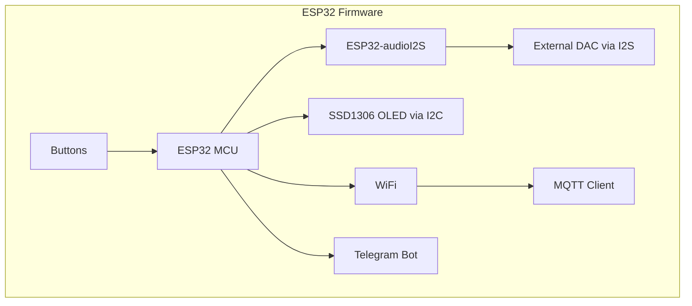
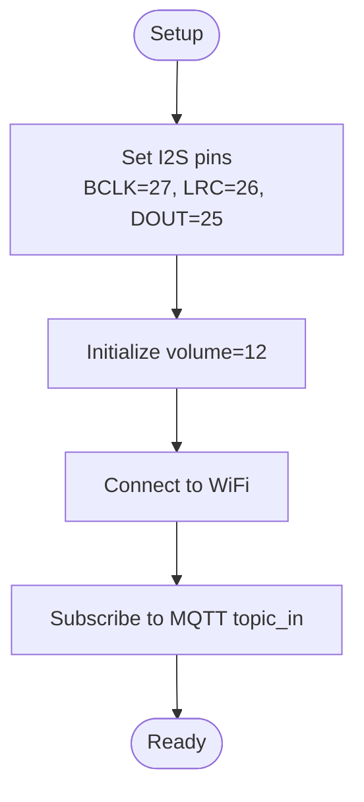
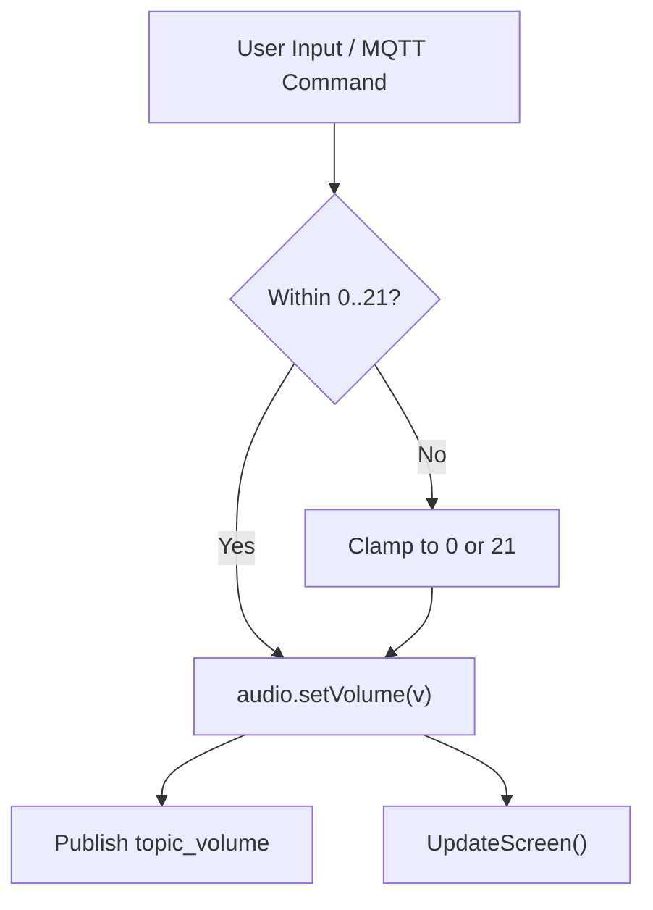
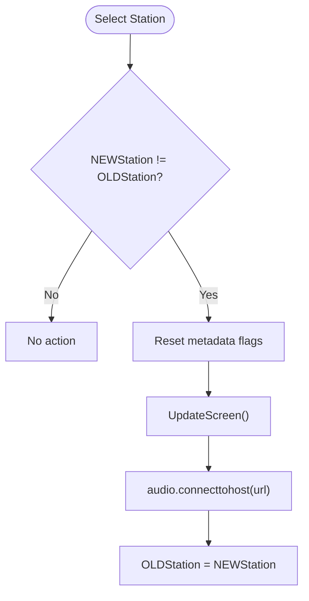
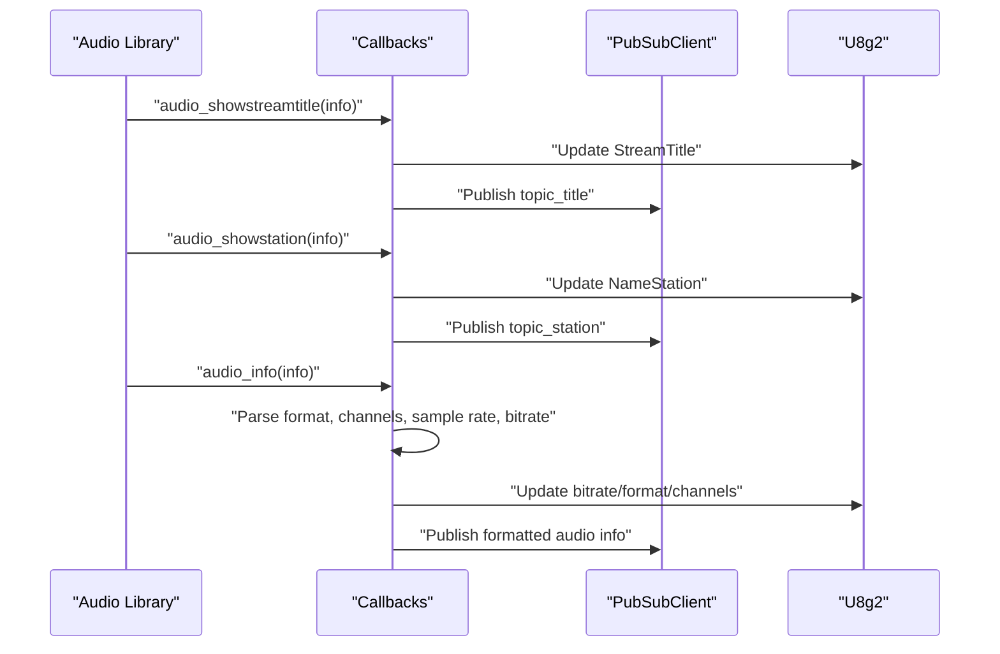
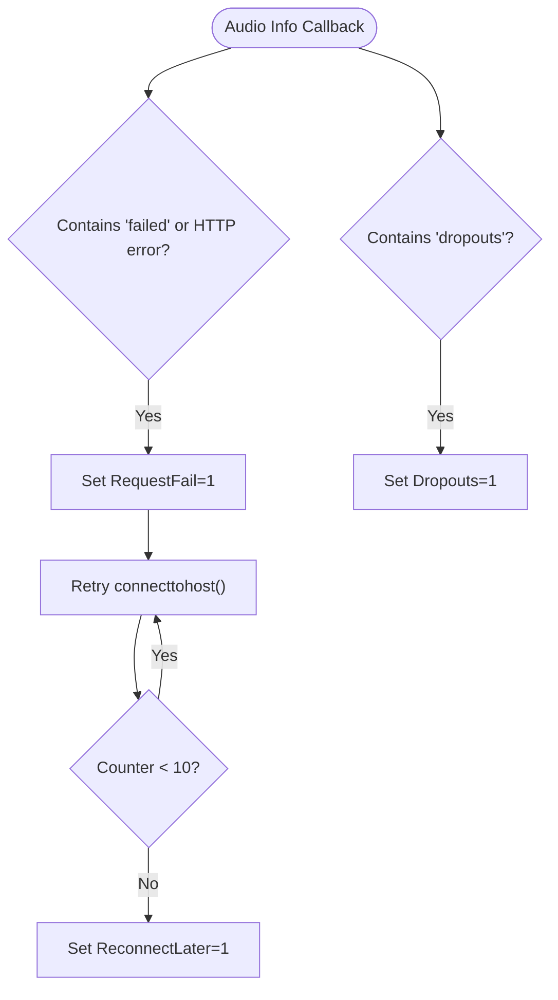
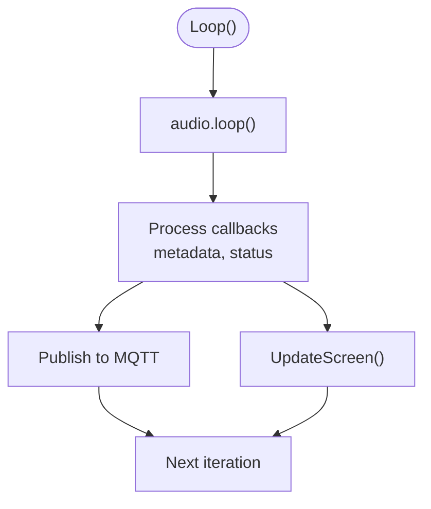
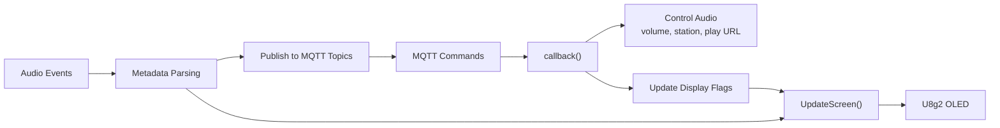
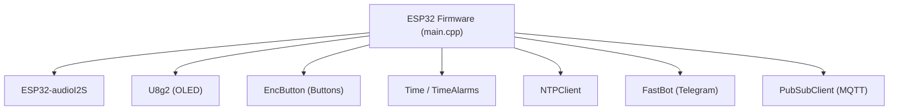

# Audio Processing System

<cite>
**Referenced Files in This Document**
- [README.md](file://WebRadio_ESP32_S3/README.md)
- [platformio.ini](file://WebRadio_ESP32_S3/platformio.ini)
- [main.cpp](file://WebRadio_ESP32_S3/src/main.cpp)
- [secrets.h](file://WebRadio_ESP32_S3/src/secrets.h)
</cite>

## Table of Contents
1. [Introduction](#introduction)
2. [Project Structure](#project-structure)
3. [Core Components](#core-components)
4. [Architecture Overview](#architecture-overview)
5. [Detailed Component Analysis](#detailed-component-analysis)
6. [Dependency Analysis](#dependency-analysis)
7. [Performance Considerations](#performance-considerations)
8. [Troubleshooting Guide](#troubleshooting-guide)
9. [Conclusion](#conclusion)
10. [Appendices](#appendices)

## Introduction
This document explains the audio processing system for the ESP32-based internet radio player. It focuses on the ESP32-audioI2S implementation, I2S pin configuration, audio streaming pipeline, initialization and runtime behavior, volume control, station switching, metadata extraction, error handling, dropout detection, and the integration with MQTT and display rendering.

## Project Structure
The audio system lives in the ESP32 firmware project under WebRadio_ESP32_S3. Key elements:
- Hardware pin assignments for I2S and peripherals
- Audio library initialization and streaming callbacks
- Station list management and dynamic selection
- Metadata parsing and display updates
- MQTT integration for status and control
- Display rendering via U8g2



**Diagram sources**
- [main.cpp:1098-1100](file://WebRadio_ESP32_S3/src/main.cpp#L1098-L1100)
- [main.cpp:1344-1635](file://WebRadio_ESP32_S3/src/main.cpp#L1344-L1635)
- [platformio.ini:37](file://WebRadio_ESP32_S3/platformio.ini#L37)

**Section sources**
- [README.md:38-55](file://WebRadio_ESP32_S3/README.md#L38-L55)
- [platformio.ini:36-44](file://WebRadio_ESP32_S3/platformio.ini#L36-L44)

## Core Components
- I2S pin configuration: DOUT (Data Out), BCLK (Bit Clock), LRC (Left/Right Clock)
- Audio object initialization and volume control (0–21 scale)
- Streaming pipeline using ESP32-audioI2S
- Station list management (predefined arrays and dynamic selection)
- Metadata extraction (StreamTitle, bitrate, format, channels)
- Error handling for stream failures and dropout detection
- Audio processing loop, buffer management, and quality settings
- Integration with MQTT status updates and display rendering

**Section sources**
- [main.cpp:16-18](file://WebRadio_ESP32_S3/src/main.cpp#L16-L18)
- [main.cpp:61](file://WebRadio_ESP32_S3/src/main.cpp#L61)
- [main.cpp:1098-1100](file://WebRadio_ESP32_S3/src/main.cpp#L1098-L1100)
- [main.cpp:1492-1511](file://WebRadio_ESP32_S3/src/main.cpp#L1492-L1511)
- [main.cpp:1638-1835](file://WebRadio_ESP32_S3/src/main.cpp#L1638-L1835)
- [main.cpp:1344-1635](file://WebRadio_ESP32_S3/src/main.cpp#L1344-L1635)

## Architecture Overview
The audio subsystem initializes the I2S pins, connects to a WiFi network, subscribes to MQTT topics, and starts streaming audio. The loop periodically handles button events, updates the display, publishes MQTT status, and manages volume and sleep modes. Audio metadata is parsed and forwarded to MQTT and the display.

```mermaid
sequenceDiagram
participant Setup as "Setup()"
participant Audio as "Audio Object"
participant WiFi as "WiFiClient"
participant MQTT as "PubSubClient"
participant Loop as "Loop()"
participant Display as "U8g2 OLED"
Setup->>Audio : "setPinout(BCLK,LRC,DOUT)"
Setup->>Audio : "setVolume(initial)"
Setup->>WiFi : "connect SSID/password"
Setup->>MQTT : "connect(server,1883)"
Setup->>MQTT : "subscribe(topic_in)"
Loop->>Audio : "loop()"
Loop->>Display : "UpdateScreen()"
Loop->>MQTT : "publish(topic_volume, topic_station, topic_title, topic_state)"
Loop->>Audio : "connecttohost(url) on station change"
```

**Diagram sources**
- [main.cpp:1098-1100](file://WebRadio_ESP32_S3/src/main.cpp#L1098-L1100)
- [main.cpp:1344-1635](file://WebRadio_ESP32_S3/src/main.cpp#L1344-L1635)
- [main.cpp:1638-1835](file://WebRadio_ESP32_S3/src/main.cpp#L1638-L1835)

## Detailed Component Analysis

### I2S Pin Configuration and Initialization
- Pins used:
  - DOUT: GPIO 25
  - BCLK: GPIO 27
  - LRC: GPIO 26
- Initialization:
  - The audio object sets I2S pins and initial volume during setup.
  - Volume is constrained to 0–21 scale.



**Diagram sources**
- [main.cpp:16-18](file://WebRadio_ESP32_S3/src/main.cpp#L16-L18)
- [main.cpp:1098-1100](file://WebRadio_ESP32_S3/src/main.cpp#L1098-L1100)

**Section sources**
- [main.cpp:16-18](file://WebRadio_ESP32_S3/src/main.cpp#L16-L18)
- [main.cpp:1098-1100](file://WebRadio_ESP32_S3/src/main.cpp#L1098-L1100)

### Audio Object Initialization and Volume Control
- The Audio object is declared globally.
- Volume control uses a 0–21 scale; the system enforces bounds and publishes updates.
- Fast volume ramp-up is supported during power-on sequences.



**Diagram sources**
- [main.cpp:379-402](file://WebRadio_ESP32_S3/src/main.cpp#L379-L402)
- [main.cpp:1401-1422](file://WebRadio_ESP32_S3/src/main.cpp#L1401-L1422)
- [main.cpp:1492-1511](file://WebRadio_ESP32_S3/src/main.cpp#L1492-L1511)

**Section sources**
- [main.cpp:61](file://WebRadio_ESP32_S3/src/main.cpp#L61)
- [main.cpp:379-402](file://WebRadio_ESP32_S3/src/main.cpp#L379-L402)
- [main.cpp:1401-1422](file://WebRadio_ESP32_S3/src/main.cpp#L1401-L1422)
- [main.cpp:1492-1511](file://WebRadio_ESP32_S3/src/main.cpp#L1492-L1511)

### Station List Management and Dynamic Selection
- Two station lists are defined: a smaller list and a larger list.
- Dynamic selection supports:
  - Increment/decrement station index
  - Switching to a specific station number
  - Playing a custom URL
- On station change, the system resets metadata flags and reconnects to the new host.



**Diagram sources**
- [main.cpp:1538-1558](file://WebRadio_ESP32_S3/src/main.cpp#L1538-L1558)
- [main.cpp:1009-1028](file://WebRadio_ESP32_S3/src/main.cpp#L1009-L1028)
- [main.cpp:497-526](file://WebRadio_ESP32_S3/src/main.cpp#L497-L526)
- [main.cpp:528-540](file://WebRadio_ESP32_S3/src/main.cpp#L528-L540)

**Section sources**
- [main.cpp:141-247](file://WebRadio_ESP32_S3/src/main.cpp#L141-L247)
- [main.cpp:1009-1028](file://WebRadio_ESP32_S3/src/main.cpp#L1009-L1028)
- [main.cpp:1538-1558](file://WebRadio_ESP32_S3/src/main.cpp#L1538-L1558)
- [main.cpp:497-526](file://WebRadio_ESP32_S3/src/main.cpp#L497-L526)
- [main.cpp:528-540](file://WebRadio_ESP32_S3/src/main.cpp#L528-L540)

### Audio Streaming Pipeline and Metadata Extraction
- The audio library emits callbacks for:
  - Stream title (track name)
  - Station name
  - Bitrate, format, channels, sample rate, bits per sample
  - Dropouts and request failures
- These are parsed and published to MQTT topics and displayed on the OLED.



**Diagram sources**
- [main.cpp:1638-1835](file://WebRadio_ESP32_S3/src/main.cpp#L1638-L1835)
- [main.cpp:1850-1890](file://WebRadio_ESP32_S3/src/main.cpp#L1850-L1890)
- [main.cpp:1891-1921](file://WebRadio_ESP32_S3/src/main.cpp#L1891-L1921)

**Section sources**
- [main.cpp:1638-1835](file://WebRadio_ESP32_S3/src/main.cpp#L1638-L1835)
- [main.cpp:1850-1890](file://WebRadio_ESP32_S3/src/main.cpp#L1850-L1890)
- [main.cpp:1891-1921](file://WebRadio_ESP32_S3/src/main.cpp#L1891-L1921)

### Error Handling for Stream Failures and Dropout Detection
- Failure detection:
  - Strings indicating failure or HTTP errors trigger a failure flag and periodic retries.
  - After several failed attempts, the system switches to reconnect-on-timer mode.
- Dropout detection:
  - A dedicated flag is set when dropouts are reported by the audio library.



**Diagram sources**
- [main.cpp:1650-1672](file://WebRadio_ESP32_S3/src/main.cpp#L1650-L1672)
- [main.cpp:1825-1828](file://WebRadio_ESP32_S3/src/main.cpp#L1825-L1828)
- [main.cpp:1348-1354](file://WebRadio_ESP32_S3/src/main.cpp#L1348-L1354)

**Section sources**
- [main.cpp:1650-1672](file://WebRadio_ESP32_S3/src/main.cpp#L1650-L1672)
- [main.cpp:1825-1828](file://WebRadio_ESP32_S3/src/main.cpp#L1825-L1828)
- [main.cpp:1348-1354](file://WebRadio_ESP32_S3/src/main.cpp#L1348-L1354)

### Audio Processing Loop, Buffer Management, and Quality Settings
- The loop calls the audio library’s loop method to process buffers.
- Buffer management is handled by the underlying audio library; the firmware reacts to metadata and status changes.
- Quality settings are inferred from metadata (format, channels, sample rate, bitrate) and displayed/published accordingly.



**Diagram sources**
- [main.cpp:1574](file://WebRadio_ESP32_S3/src/main.cpp#L1574)
- [main.cpp:1638-1835](file://WebRadio_ESP32_S3/src/main.cpp#L1638-L1835)

**Section sources**
- [main.cpp:1574](file://WebRadio_ESP32_S3/src/main.cpp#L1574)
- [main.cpp:1638-1835](file://WebRadio_ESP32_S3/src/main.cpp#L1638-L1835)

### Relationship with MQTT and Display Rendering
- MQTT:
  - Incoming commands control power, sleep, volume, station selection, and manual URL playback.
  - Outgoing topics report state, station, title, volume, heap, and formatted audio info.
- Display:
  - The OLED shows station number/name, stream title, bitrate, time, volume bar, and status indicators (sleep, reconnect, dropouts).



**Diagram sources**
- [main.cpp:275-650](file://WebRadio_ESP32_S3/src/main.cpp#L275-L650)
- [main.cpp:692-865](file://WebRadio_ESP32_S3/src/main.cpp#L692-L865)
- [main.cpp:1344-1635](file://WebRadio_ESP32_S3/src/main.cpp#L1344-L1635)

**Section sources**
- [main.cpp:275-650](file://WebRadio_ESP32_S3/src/main.cpp#L275-L650)
- [main.cpp:692-865](file://WebRadio_ESP32_S3/src/main.cpp#L692-L865)
- [main.cpp:1344-1635](file://WebRadio_ESP32_S3/src/main.cpp#L1344-L1635)

## Dependency Analysis
- The project depends on ESP32-audioI2S for I2S audio streaming.
- Additional libraries support display (U8g2), buttons (EncButton), timekeeping (Time, TimeAlarms), NTP (NTPClient), Telegram bot (FastBot), and MQTT (PubSubClient).
- Build flags configure PSRAM and board-specific macros.



**Diagram sources**
- [platformio.ini:36-44](file://WebRadio_ESP32_S3/platformio.ini#L36-L44)
- [main.cpp:1-14](file://WebRadio_ESP32_S3/src/main.cpp#L1-L14)

**Section sources**
- [platformio.ini:36-44](file://WebRadio_ESP32_S3/platformio.ini#L36-L44)
- [main.cpp:1-14](file://WebRadio_ESP32_S3/src/main.cpp#L1-L14)

## Performance Considerations
- I2S pin assignment and wiring directly impact audio quality; ensure clean connections and proper grounding.
- PSRAM-related build flags improve stability for audio buffering on ESP32 boards with PSRAM.
- Volume ramp-up reduces audible clicks during startup.
- Periodic reconnect logic prevents indefinite stalls on transient network issues.
- Publishing heap telemetry helps monitor memory pressure during operation.

[No sources needed since this section provides general guidance]

## Troubleshooting Guide
Common issues and remedies:
- No audio output:
  - Verify I2S wiring (DOUT, BCLK, LRC) match the configured pins.
  - Confirm the external DAC is powered and compatible.
- Intermittent audio or dropouts:
  - Monitor “dropouts” indicator and bitrate display; reduce bitrate expectations or improve WiFi signal.
  - Enable reconnect-on-timer mode for transient failures.
- Stream fails with HTTP errors:
  - Check RequestFail logs; the system retries automatically up to a limit, then schedules reconnects.
- Volume does not change:
  - Ensure volume commands are within 0–21 range and that MQTT topic subscriptions are active.
- Station does not change:
  - Confirm NEWStation vs OLDStation logic and that connecttohost is invoked after a change.

**Section sources**
- [main.cpp:1650-1672](file://WebRadio_ESP32_S3/src/main.cpp#L1650-L1672)
- [main.cpp:1825-1828](file://WebRadio_ESP32_S3/src/main.cpp#L1825-L1828)
- [main.cpp:1348-1354](file://WebRadio_ESP32_S3/src/main.cpp#L1348-L1354)
- [main.cpp:1401-1422](file://WebRadio_ESP32_S3/src/main.cpp#L1401-L1422)
- [main.cpp:1538-1558](file://WebRadio_ESP32_S3/src/main.cpp#L1538-L1558)

## Conclusion
The audio processing system integrates ESP32-audioI2S with robust station management, metadata extraction, error handling, and real-time UI/MQTT feedback. Proper I2S configuration, careful volume control, and resilient reconnect logic deliver reliable streaming performance across diverse network conditions.

[No sources needed since this section summarizes without analyzing specific files]

## Appendices

### Practical Examples
- Initialize audio with I2S pins and set volume:
  - See [main.cpp:1098-1100](file://WebRadio_ESP32_S3/src/main.cpp#L1098-L1100)
- Switch to a predefined station by index:
  - See [main.cpp:1538-1558](file://WebRadio_ESP32_S3/src/main.cpp#L1538-L1558)
- Play a custom URL:
  - See [main.cpp:528-540](file://WebRadio_ESP32_S3/src/main.cpp#L528-L540)
- Increase/decrease volume:
  - See [main.cpp:1401-1422](file://WebRadio_ESP32_S3/src/main.cpp#L1401-L1422)
- Retrieve current status via MQTT:
  - See [main.cpp:301-361](file://WebRadio_ESP32_S3/src/main.cpp#L301-L361)

### Configuration References
- Hardware pinout and MQTT topics:
  - See [README.md:38-55](file://WebRadio_ESP32_S3/README.md#L38-L55)
- Library dependencies and build flags:
  - See [platformio.ini:36-44](file://WebRadio_ESP32_S3/platformio.ini#L36-L44)
- WiFi credentials and MQTT broker settings:
  - See [secrets.h:8-23](file://WebRadio_ESP32_S3/src/secrets.h#L8-L23)