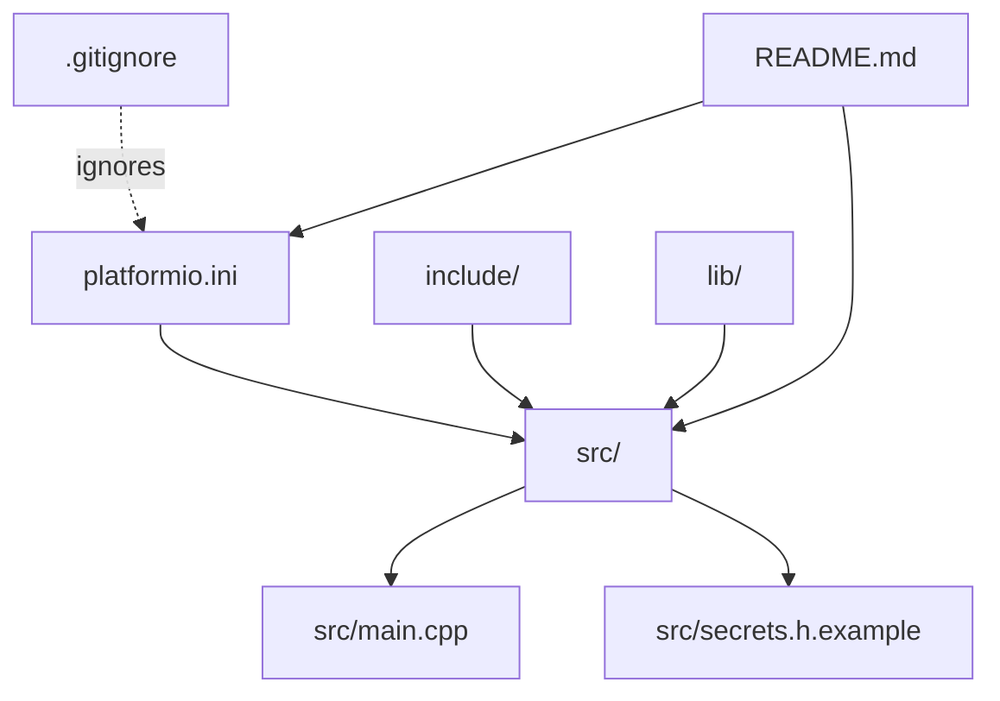
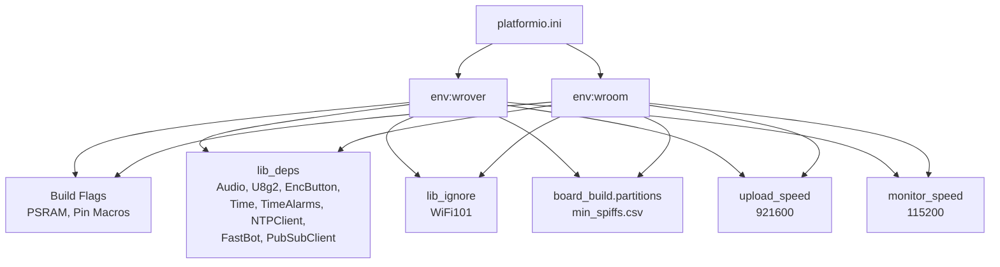
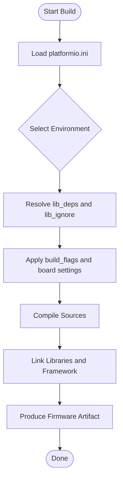
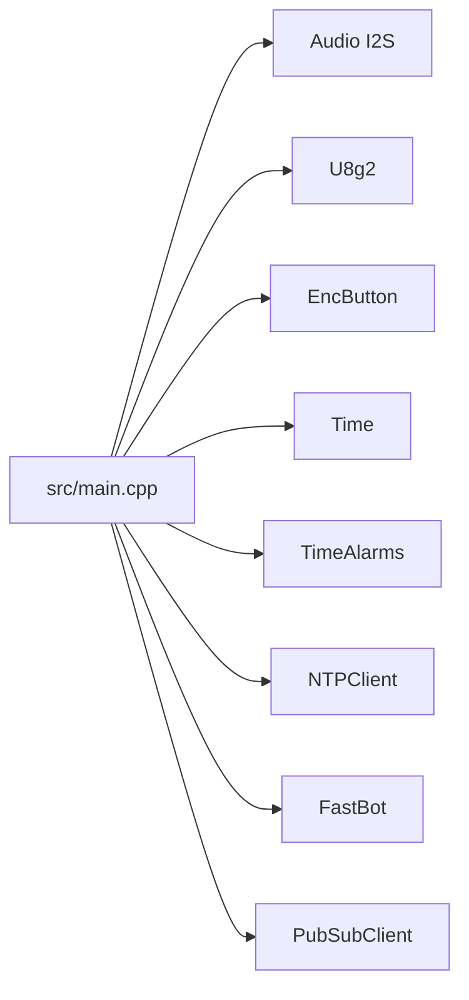

# Build Configuration and Dependencies

<cite>
**Referenced Files in This Document**
- [platformio.ini](file://WebRadio_ESP32_S3/platformio.ini)
- [main.cpp](file://WebRadio_ESP32_S3/src/main.cpp)
- [secrets.h.example](file://WebRadio_ESP32_S3/src/secrets.h.example)
- [.gitignore](file://WebRadio_ESP32_S3/.gitignore)
- [README.md](file://WebRadio_ESP32_S3/README.md)
- [include/README](file://WebRadio_ESP32_S3/include/README)
- [lib/README](file://WebRadio_ESP32_S3/lib/README)
- [bestlist_sorted.txt](file://WebRadio_ESP32_S3/bestlist_sorted.txt)
</cite>

## Table of Contents
1. [Introduction](#introduction)
2. [Project Structure](#project-structure)
3. [Core Components](#core-components)
4. [Architecture Overview](#architecture-overview)
5. [Detailed Component Analysis](#detailed-component-analysis)
6. [Dependency Analysis](#dependency-analysis)
7. [Performance Considerations](#performance-considerations)
8. [Troubleshooting Guide](#troubleshooting-guide)
9. [Conclusion](#conclusion)
10. [Appendices](#appendices)

## Introduction
This document explains the build configuration and dependency management system for the ESP32 Web Radio project. It focuses on the PlatformIO configuration, library dependencies, compilation process, and environment setup. It also covers how build flags and board targets influence hardware-specific features, how to manage libraries and include paths, and how to modify the build configuration safely. Practical examples demonstrate adding libraries, adjusting build flags, and resolving common compilation issues.

## Project Structure
The ESP32 Web Radio project is organized around PlatformIO’s conventions:
- Source code under src/
- Private headers under include/
- Private libraries under lib/
- PlatformIO configuration in platformio.ini
- Build artifacts stored under .pio/ (ignored by Git)
- Secrets configuration under src/secrets.h (copied from src/secrets.h.example)

**Diagram sources**
- [platformio.ini](file://WebRadio_ESP32_S3/platformio.ini)
- [main.cpp](file://WebRadio_ESP32_S3/src/main.cpp)
- [secrets.h.example](file://WebRadio_ESP32_S3/src/secrets.h.example)
- [.gitignore](file://WebRadio_ESP32_S3/.gitignore)
- [README.md](file://WebRadio_ESP32_S3/README.md)

**Section sources**
- [platformio.ini](file://WebRadio_ESP32_S3/platformio.ini)
- [main.cpp](file://WebRadio_ESP32_S3/src/main.cpp)
- [include/README](file://WebRadio_ESP32_S3/include/README)
- [lib/README](file://WebRadio_ESP32_S3/lib/README)
- [.gitignore](file://WebRadio_ESP32_S3/.gitignore)
- [README.md](file://WebRadio_ESP32_S3/README.md)

## Core Components
- PlatformIO configuration defines environments for different boards, sets build flags, and declares library dependencies.
- The Arduino framework is used with Espressif ESP32 platform.
- Two environments are defined: wrover and wroom, each targeting a specific board and pin mapping.
- Library dependencies are declared explicitly to ensure reproducible builds.
- Build flags enable PSRAM usage and set hardware pin macros for both environments.

Key configuration highlights:
- Default environment selection
- Board and framework per environment
- Build flags for PSRAM and pin assignments
- Partition scheme selection
- Library dependencies and ignored libraries
- Upload and monitor speeds

**Section sources**
- [platformio.ini](file://WebRadio_ESP32_S3/platformio.ini)

## Architecture Overview
The build pipeline integrates PlatformIO configuration, library resolution, and compilation into a deterministic process. The diagram below maps the configuration to the resulting environment and dependencies.

**Diagram sources**
- [platformio.ini](file://WebRadio_ESP32_S3/platformio.ini)

## Detailed Component Analysis

### PlatformIO Configuration and Environments
- Default environment is set for convenience.
- Two environments define board targets and framework:
  - wrover: esp-wrover-kit with Arduino framework
  - wroom: upesy_wroom with Arduino framework
- Build flags:
  - Enable PSRAM and fix cache-related issues
  - Define pin macros for LEDs, relays, keys, and FM transmitter
  - Macro indicating Wrover board variant
- Partition scheme is configured to a small SPIFFS image
- Upload and monitor speeds are tuned for performance and diagnostics
- Ignored library prevents legacy WiFi101 from interfering
- Explicit library dependencies ensure reproducibility

Hardware-specific implications:
- Pin macros differ between wrover and wroom environments
- PSRAM flags optimize memory usage for audio and display tasks
- Partition scheme affects storage allocation for filesystem and OTA updates

**Section sources**
- [platformio.ini](file://WebRadio_ESP32_S3/platformio.ini)

### Library Dependencies and Version Management
Declared dependencies include:
- Audio I2S for streaming playback
- U8g2 for OLED display rendering
- EncButton for button handling
- Time and TimeAlarms for scheduling
- NTPClient for time synchronization
- FastBot for Telegram bot integration
- PubSubClient for MQTT communication

Version constraints and alpha releases are expressed inline. PlatformIO resolves these dependencies automatically during build.

Integration points:
- main.cpp includes headers for each library, aligning with lib_deps
- The project relies on Arduino framework and ESP32 platform packages

**Section sources**
- [platformio.ini](file://WebRadio_ESP32_S3/platformio.ini)
- [main.cpp](file://WebRadio_ESP32_S3/src/main.cpp)

### Include Path Configuration and Header Organization
- Private headers belong under include/. The directory exists for project-specific header files.
- The project includes standard Arduino and third-party headers in main.cpp.
- No custom include paths are configured in platformio.ini; PlatformIO locates libraries via lib_deps and standard include search paths.

Best practices:
- Place reusable declarations in include/ and use angle brackets for project headers
- Keep third-party includes in main.cpp or dedicated headers in include/ for clarity

**Section sources**
- [include/README](file://WebRadio_ESP32_S3/include/README)
- [main.cpp](file://WebRadio_ESP32_S3/src/main.cpp)

### Private Libraries and Custom Integration
- The lib/ directory is reserved for private libraries. Each library resides in its own subdirectory with optional library.json for custom build options.
- PlatformIO’s Library Dependency Finder scans source files to discover dependencies automatically.

Guidelines:
- Structure private libraries under lib/<LibraryName>/src/
- Use library.json if you need custom flags or sources
- Keep private libraries minimal and focused

**Section sources**
- [lib/README](file://WebRadio_ESP32_S3/lib/README)

### Build Flags and Compilation Process
- PSRAM-related flags improve stability and performance for audio and display tasks
- Pin macros are defined per environment to match hardware variants
- Partition scheme influences filesystem layout and OTA behavior
- Upload and monitor speeds balance throughput and debug visibility

Compilation flow:
- PlatformIO reads platformio.ini and selects the active environment
- It resolves lib_deps and lib_ignore entries
- It compiles sources with build_flags and framework-specific compiler/linker options
- Artifacts are produced under .pio/build/<env>

**Section sources**
- [platformio.ini](file://WebRadio_ESP32_S3/platformio.ini)

### Secrets and Environment Setup
- Secrets are stored in src/secrets.h, copied from src/secrets.h.example
- The example demonstrates Wi-Fi credentials, Telegram bot token, admin chat ID, and MQTT broker settings
- The file is ignored by Git to prevent secrets leakage

Workflow:
- Copy secrets.h.example to secrets.h
- Fill in real credentials
- Build and flash via PlatformIO

**Section sources**
- [secrets.h.example](file://WebRadio_ESP32_S3/src/secrets.h.example)
- [.gitignore](file://WebRadio_ESP32_S3/.gitignore)

### Practical Examples

#### Modify Build Flags
- To add a new compiler flag, append it to the build_flags list in the desired environment
- To adjust PSRAM behavior, modify the PSRAM cache fix and strategy flags
- To change partition scheme, update board_build.partitions to another CSV file

Impact:
- Flags affect memory layout, performance, and hardware compatibility
- Ensure flags are appropriate for the selected board and framework

**Section sources**
- [platformio.ini](file://WebRadio_ESP32_S3/platformio.ini)

#### Add a New Library Dependency
- Add the library specification to lib_deps under the relevant environment
- Optionally specify a version constraint or commit hash
- Run a clean build to resolve and link the new dependency

Verification:
- Include the library header in main.cpp
- Confirm successful compilation and runtime behavior

**Section sources**
- [platformio.ini](file://WebRadio_ESP32_S3/platformio.ini)
- [main.cpp](file://WebRadio_ESP32_S3/src/main.cpp)

#### Switch Between Hardware Variants
- Select the environment matching your board (wrover or wroom)
- Verify pin macros and hardware connections align with the chosen environment
- Rebuild and flash to apply changes

**Section sources**
- [platformio.ini](file://WebRadio_ESP32_S3/platformio.ini)

#### Adjust Partition Scheme
- Change board_build.partitions to a different CSV file suited to your storage needs
- Rebuild to regenerate partition tables and filesystem images

**Section sources**
- [platformio.ini](file://WebRadio_ESP32_S3/platformio.ini)

### Conceptual Overview
The build system orchestrates configuration, dependency resolution, and compilation into a repeatable workflow. Developers can tailor environments, flags, and libraries to meet hardware constraints and feature requirements.

[No sources needed since this diagram shows conceptual workflow, not actual code structure]

## Dependency Analysis
The project’s runtime dependencies are declared in platformio.ini and consumed by main.cpp. The diagram below maps the declared libraries to their usage in the code.

**Diagram sources**
- [platformio.ini](file://WebRadio_ESP32_S3/platformio.ini)
- [main.cpp](file://WebRadio_ESP32_S3/src/main.cpp)

**Section sources**
- [platformio.ini](file://WebRadio_ESP32_S3/platformio.ini)
- [main.cpp](file://WebRadio_ESP32_S3/src/main.cpp)

## Performance Considerations
- PSRAM flags improve reliability for audio decoding and display buffering
- Partition scheme impacts filesystem performance and OTA update feasibility
- Upload and monitor speeds balance flashing throughput and serial diagnostics
- Using explicit library versions avoids unexpected breaking changes

[No sources needed since this section provides general guidance]

## Troubleshooting Guide
Common issues and resolutions:
- Missing secrets: Ensure secrets.h exists and is filled; it is ignored by Git
- Library conflicts: Use lib_ignore to exclude incompatible libraries
- PSRAM errors: Verify PSRAM-related build flags match the board
- Partition mismatch: Align board_build.partitions with your board’s capabilities
- Build artifacts: Clean builds after major configuration changes

**Section sources**
- [.gitignore](file://WebRadio_ESP32_S3/.gitignore)
- [platformio.ini](file://WebRadio_ESP32_S3/platformio.ini)
- [README.md](file://WebRadio_ESP32_S3/README.md)

## Conclusion
The ESP32 Web Radio build system leverages PlatformIO to provide reproducible builds across hardware variants. By configuring environments, build flags, and library dependencies explicitly, developers can tailor the firmware to specific boards and features. Following the documented practices ensures reliable compilation, maintainable code, and smooth development workflows.

[No sources needed since this section summarizes without analyzing specific files]

## Appendices

### Appendix A: Board and Pin Mapping Reference
- wrover environment uses ESP-WROVER-KIT with PSRAM and specific pin macros
- wroom environment targets upesy_wroom with alternative pin assignments
- Both environments share common libraries and build flags

**Section sources**
- [platformio.ini](file://WebRadio_ESP32_S3/platformio.ini)

### Appendix B: Example Station List Source
- The station list is embedded in main.cpp for convenience
- A curated list is also available as bestlist_sorted.txt

**Section sources**
- [main.cpp](file://WebRadio_ESP32_S3/src/main.cpp)
- [bestlist_sorted.txt](file://WebRadio_ESP32_S3/bestlist_sorted.txt)