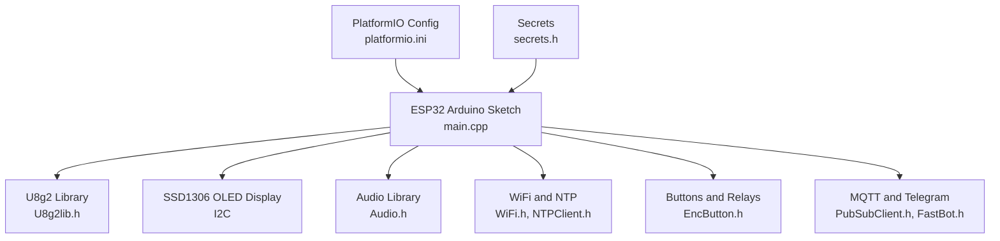
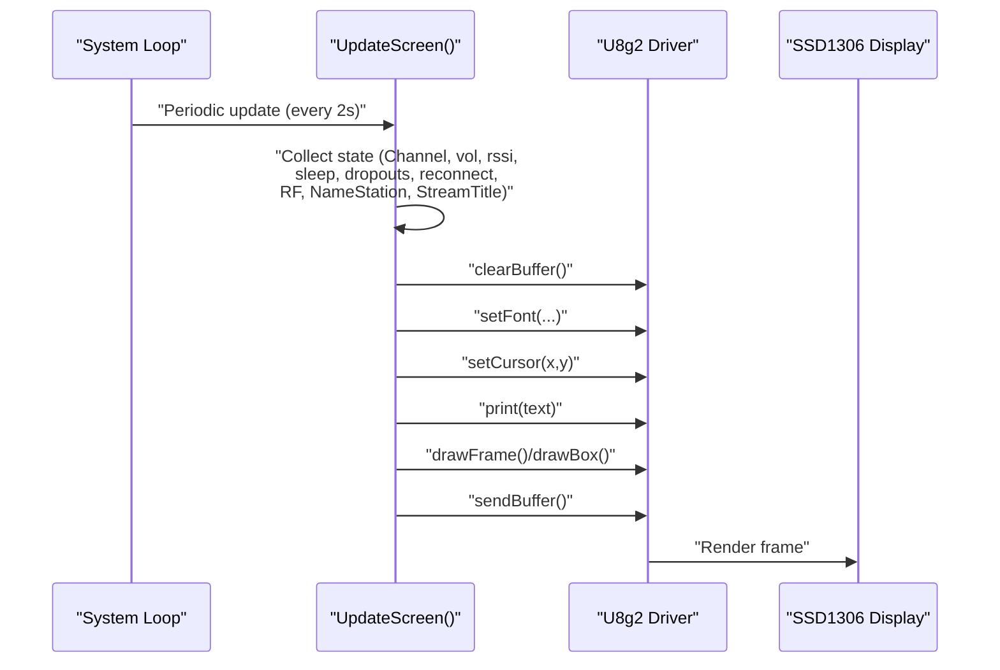
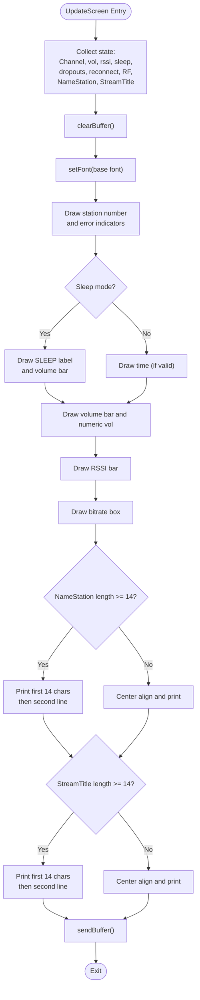
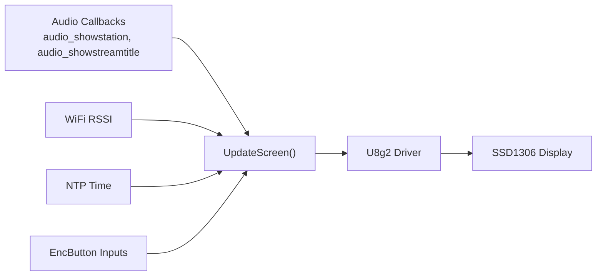

# Display and User Interface

<cite>
**Referenced Files in This Document**
- [main.cpp](file://WebRadio_ESP32_S3/src/main.cpp)
- [secrets.h](file://WebRadio_ESP32_S3/src/secrets.h)
- [platformio.ini](file://WebRadio_ESP32_S3/platformio.ini)
- [README.md](file://WebRadio_ESP32_S3/README.md)
</cite>

## Table of Contents
1. [Introduction](#introduction)
2. [Project Structure](#project-structure)
3. [Core Components](#core-components)
4. [Architecture Overview](#architecture-overview)
5. [Detailed Component Analysis](#detailed-component-analysis)
6. [Dependency Analysis](#dependency-analysis)
7. [Performance Considerations](#performance-considerations)
8. [Troubleshooting Guide](#troubleshooting-guide)
9. [Conclusion](#conclusion)

## Introduction
This document explains the display and user interface system for the ESP32-based internet radio player. It focuses on the U8g2 library integration with an SSD1306 OLED display, covering initialization, font configuration, drawing operations, and the UpdateScreen function. It documents how station numbers, volume indicators, status symbols, audio metadata (StreamTitle), WiFi signal strength, and system status (sleep mode, dropouts, reconnect) are rendered. It also explains the coordinate system, font sizing, layout optimization for limited display space, visual feedback mechanisms, and performance considerations for frequent screen updates and battery life.

## Project Structure
The display and UI logic resides primarily in the ESP32 Arduino sketch. The project uses PlatformIO for building and depends on U8g2 for rendering and SSD1306 hardware configuration.

**Diagram sources**
- [main.cpp:1-15](file://WebRadio_ESP32_S3/src/main.cpp#L1-L15)
- [platformio.ini:36-44](file://WebRadio_ESP32_S3/platformio.ini#L36-L44)

**Section sources**
- [README.md:1-127](file://WebRadio_ESP32_S3/README.md#L1-L127)
- [platformio.ini:1-71](file://WebRadio_ESP32_S3/platformio.ini#L1-L71)

## Core Components
- U8g2 SSD1306 display driver initialized with hardware I2C and configured for 128x64 resolution.
- UpdateScreen function orchestrating all display updates at a controlled interval.
- UpdateScreen1 function for a simplified clock-only display when powered off.
- Font selection and cursor positioning for station number, time, volume bar, RSSI indicator, bitrate, station name, and stream title.
- Status indicators for sleep mode, dropouts, reconnect countdown, and RF transmit mode.
- Layout optimization for compact text wrapping and centered alignment.

**Section sources**
- [main.cpp:137-140](file://WebRadio_ESP32_S3/src/main.cpp#L137-L140)
- [main.cpp:692-865](file://WebRadio_ESP32_S3/src/main.cpp#L692-L865)
- [main.cpp:867-904](file://WebRadio_ESP32_S3/src/main.cpp#L867-L904)

## Architecture Overview
The display subsystem integrates with the audio pipeline and system state machine. The UpdateScreen function reads current state (channel, volume, RSSI, sleep mode, dropouts, reconnect flag, RF status, station name, stream title) and renders a structured layout onto the OLED buffer, then sends it to the display.

**Diagram sources**
- [main.cpp:692-865](file://WebRadio_ESP32_S3/src/main.cpp#L692-L865)

## Detailed Component Analysis

### U8g2 Initialization and SSD1306 Setup
- Hardware I2C pins are used for SDA/SCL connections to the OLED.
- The display is initialized with a constructor specifying rotation and reset pin.
- The display is cleared and a startup message is shown during boot.

Practical notes:
- Ensure I2C pull-ups are present on the SDA/SCL lines.
- Verify the display orientation matches the physical mounting.

**Section sources**
- [main.cpp:137-140](file://WebRadio_ESP32_S3/src/main.cpp#L137-L140)
- [main.cpp:1101-1110](file://WebRadio_ESP32_S3/src/main.cpp#L1101-L1110)

### UpdateScreen Function: Rendering the Main Display
UpdateScreen consolidates all UI elements:
- Station number and optional error indicators
- Sleep mode overlay with volume bar
- Time display (when not in sleep)
- Volume bar visualization
- RSSI bar visualization
- Bitrate display
- Station name (wrapped to two lines if needed)
- Stream title (wrapped to two lines if needed)
- Status overlays for request failures, reconnect countdown, and RF transmit mode

Rendering flow:
- Clear the buffer and set base font.
- Draw station number and error indicators.
- Conditionally draw sleep mode elements or time.
- Render volume bar and numeric volume.
- Render RSSI bar.
- Draw bitrate box.
- Render station name and stream title with wrapping and centering.
- Send the buffer to the display.

**Diagram sources**
- [main.cpp:692-865](file://WebRadio_ESP32_S3/src/main.cpp#L692-L865)

**Section sources**
- [main.cpp:692-865](file://WebRadio_ESP32_S3/src/main.cpp#L692-L865)

### UpdateScreen1 Function: Clock-Only Display (Powered Off)
When the device is powered off, a simplified clock-only display is shown. The font size and cursor positions differ slightly depending on the board variant.

**Section sources**
- [main.cpp:867-904](file://WebRadio_ESP32_S3/src/main.cpp#L867-L904)

### Coordinate System, Fonts, and Layout
- Coordinate system origin is top-left (0,0).
- Cursor position is set with setCursor(x,y) before printing.
- Font selection uses u8g2.setFont(...). Multiple fonts are used for different elements:
  - VCR_OSD_mn for station number
  - crox2hb_tn for time
  - 5x7_tr for small text (volume numeric, bitrate, RSSI)
  - 8x13B_tr for “SLEEP” label
  - 9x18B_tr for status messages and some labels
- Layout optimization:
  - Two-line station name and stream title with substring wrapping and centering.
  - Volume bar drawn as a framed box with a filled box proportional to volume.
  - RSSI bar drawn as stacked frames with a filled box mapped from RSSI range.
  - Bitrate box with a surrounding frame.

Practical customization tips:
- Replace font constants with others from U8g2’s font catalog to adjust readability.
- Adjust setCursor positions to shift elements horizontally or vertically.
- Modify drawFrame/drawBox parameters to change bar widths and heights.

**Section sources**
- [main.cpp:704-707](file://WebRadio_ESP32_S3/src/main.cpp#L704-L707)
- [main.cpp:744-758](file://WebRadio_ESP32_S3/src/main.cpp#L744-L758)
- [main.cpp:801-805](file://WebRadio_ESP32_S3/src/main.cpp#L801-L805)
- [main.cpp:836-862](file://WebRadio_ESP32_S3/src/main.cpp#L836-L862)

### Real-Time Metadata and Status Indicators
- StreamTitle updates are handled by audio callbacks and trigger a display refresh.
- WiFi RSSI is sampled and visualized as a vertical bar.
- Dropouts and request failures are indicated with special glyphs and flags.
- Reconnect countdown is shown when the system attempts periodic reconnection.
- Sleep mode reduces volume gradually and displays a “SLEEP” overlay with a volume bar.
- RF transmit mode toggles a “TX” indicator.

**Section sources**
- [main.cpp:1836-1890](file://WebRadio_ESP32_S3/src/main.cpp#L1836-L1890)
- [main.cpp:692-865](file://WebRadio_ESP32_S3/src/main.cpp#L692-L865)
- [main.cpp:1582-1627](file://WebRadio_ESP32_S3/src/main.cpp#L1582-L1627)

### Visual Feedback Mechanisms
- Power on/off messages are displayed briefly and then the display is cleared.
- Contrast can be adjusted via button actions when powered off.
- Sleep mode transitions are visually indicated with overlay and volume reduction.
- Error states (request failed, reconnect countdown) are highlighted with dedicated messages and counters.

**Section sources**
- [main.cpp:929-933](file://WebRadio_ESP32_S3/src/main.cpp#L929-L933)
- [main.cpp:966-970](file://WebRadio_ESP32_S3/src/main.cpp#L966-L970)
- [main.cpp:1395-1428](file://WebRadio_ESP32_S3/src/main.cpp#L1395-L1428)
- [main.cpp:818-832](file://WebRadio_ESP32_S3/src/main.cpp#L818-L832)

### Practical Examples: Customization and Layout Modifications
- Change font for station name: replace the font constant used for station name rendering with another U8g2 font.
- Adjust volume bar width/height: modify drawFrame and drawBox parameters for the volume bar.
- Customize RSSI bar appearance: adjust the stacked frames and mapping range.
- Modify layout margins: adjust setCursor positions for labels and bars.
- Add new indicators: define new glyphs or text markers and render them conditionally.

Note: Refer to the U8g2 font catalog and method signatures in the source for exact constants and APIs.

**Section sources**
- [main.cpp:704-707](file://WebRadio_ESP32_S3/src/main.cpp#L704-L707)
- [main.cpp:756-757](file://WebRadio_ESP32_S3/src/main.cpp#L756-L757)
- [main.cpp:801-805](file://WebRadio_ESP32_S3/src/main.cpp#L801-L805)
- [main.cpp:836-862](file://WebRadio_ESP32_S3/src/main.cpp#L836-L862)

## Dependency Analysis
The display system depends on:
- U8g2 for rendering primitives and fonts.
- Audio callbacks for dynamic metadata updates.
- WiFi and NTP for RSSI and time.
- EncButton for user input affecting display updates.
- MQTT/Telegram for remote control impacting state and display.

**Diagram sources**
- [main.cpp:1836-1890](file://WebRadio_ESP32_S3/src/main.cpp#L1836-L1890)
- [main.cpp:692-865](file://WebRadio_ESP32_S3/src/main.cpp#L692-L865)

**Section sources**
- [main.cpp:1836-1890](file://WebRadio_ESP32_S3/src/main.cpp#L1836-L1890)
- [main.cpp:692-865](file://WebRadio_ESP32_S3/src/main.cpp#L692-L865)

## Performance Considerations
- Update interval: The display is refreshed every 2 seconds when powered on and every 2 seconds when powered off. This balance minimizes CPU and I2C bus usage while keeping the UI responsive.
- Buffering: U8g2 uses a video buffer; clearing and sending the buffer is efficient for small displays.
- Font choice: Using smaller fonts reduces rendering time and improves perceived responsiveness.
- Conditional rendering: Only changed elements are redrawn; errors and status overlays are shown conditionally.
- Battery life: Lowering contrast and reducing refresh frequency can help conserve power. The display contrast can be reduced when powered off.

Recommendations:
- Keep the update interval at 2 seconds unless UI responsiveness requires more frequent updates.
- Avoid unnecessary font switches within a single frame.
- Consider disabling non-critical status indicators (e.g., reconnect countdown) when not needed.

**Section sources**
- [main.cpp:114-115](file://WebRadio_ESP32_S3/src/main.cpp#L114-L115)
- [main.cpp:1456-1472](file://WebRadio_ESP32_S3/src/main.cpp#L1456-L1472)
- [main.cpp:1475-1489](file://WebRadio_ESP32_S3/src/main.cpp#L1475-L1489)
- [main.cpp:1397-1398](file://WebRadio_ESP32_S3/src/main.cpp#L1397-L1398)
- [main.cpp:1425-1427](file://WebRadio_ESP32_S3/src/main.cpp#L1425-L1427)

## Troubleshooting Guide
Common issues and remedies:
- Display blank or garbled:
  - Verify I2C wiring and pull-ups.
  - Ensure the display is powered and the reset pin is not interfering.
  - Confirm the correct constructor and rotation setting.
- Incorrect or missing text:
  - Check font constants and availability in the U8g2 library.
  - Verify setCursor positions and wrapping logic for long strings.
- Volume bar or RSSI bar not updating:
  - Confirm that vol and rssi are being updated by the audio and WiFi subsystems.
  - Ensure UpdateScreen is invoked periodically.
- Sleep mode not functioning:
  - Verify sleep state transitions and volume decrement logic.
  - Confirm that UpdateScreen reflects sleep mode overlays.

**Section sources**
- [main.cpp:137-140](file://WebRadio_ESP32_S3/src/main.cpp#L137-L140)
- [main.cpp:692-865](file://WebRadio_ESP32_S3/src/main.cpp#L692-L865)
- [main.cpp:1582-1627](file://WebRadio_ESP32_S3/src/main.cpp#L1582-L1627)

## Conclusion
The display and user interface system leverages U8g2 to efficiently render essential information on a 128x64 SSD1306 OLED. The UpdateScreen function organizes station metadata, time, volume, RSSI, and status indicators into a compact, readable layout. With careful font selection, cursor positioning, and conditional rendering, the UI remains responsive while minimizing resource usage. The system’s modular design allows straightforward customization of fonts, layouts, and visual feedback for different operational states.