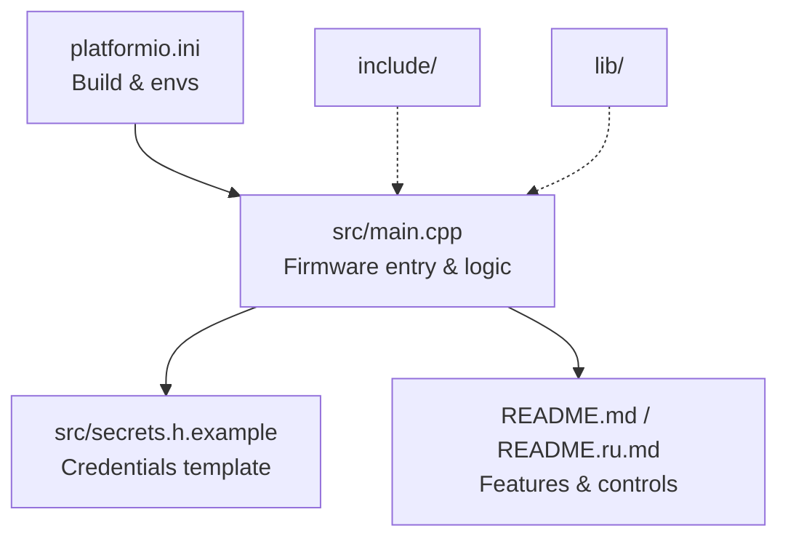
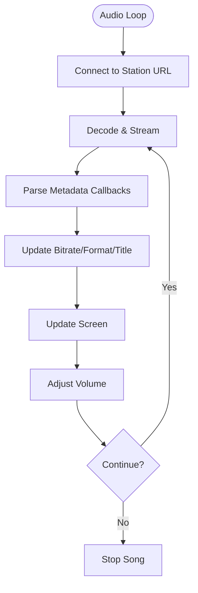
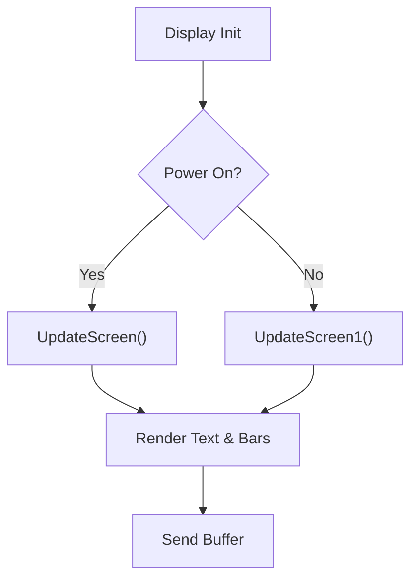
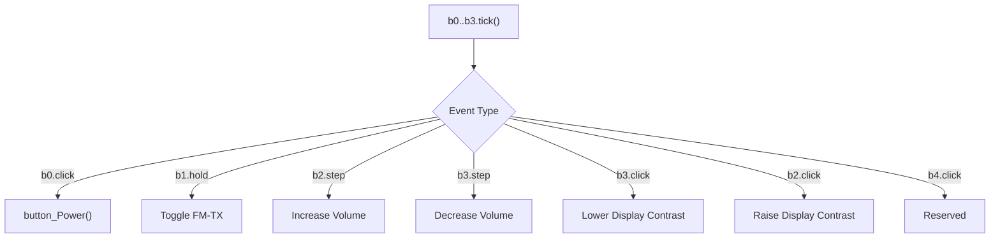
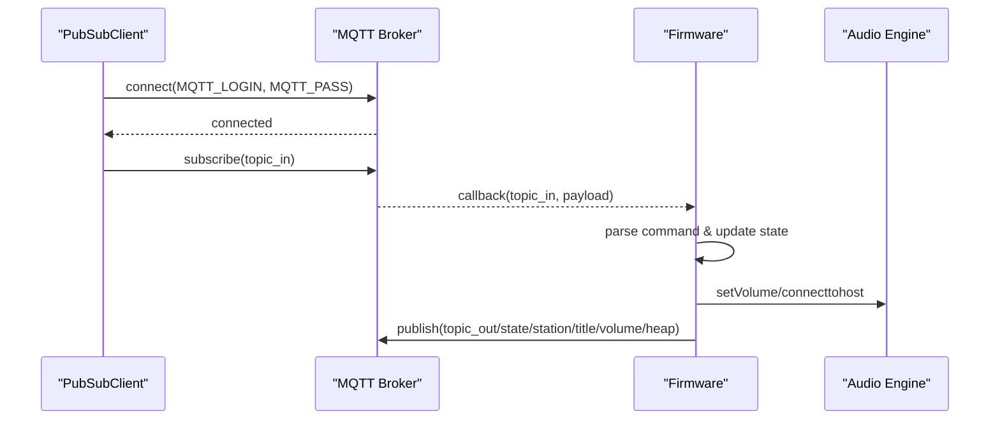
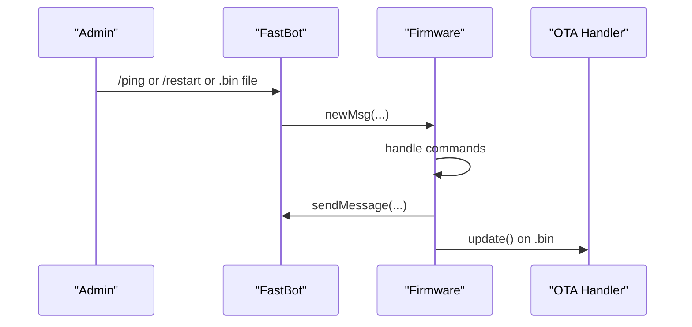
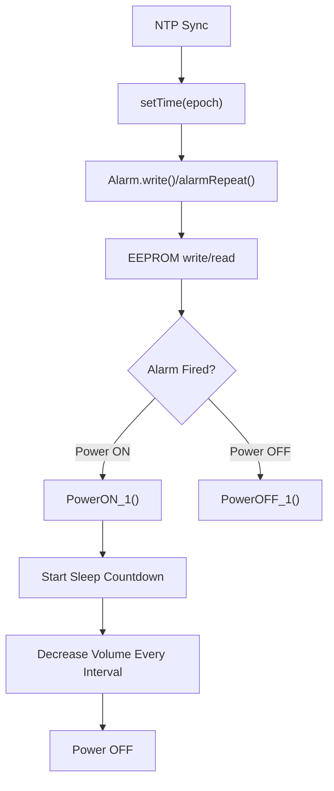
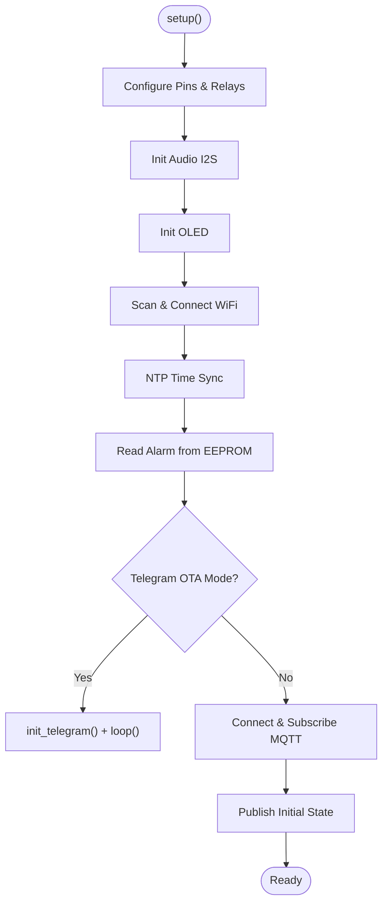
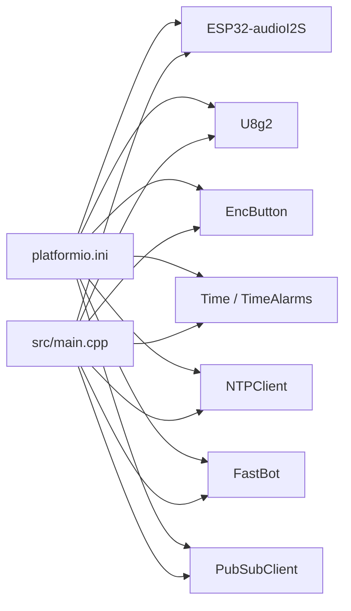

# ESP32 Firmware

<cite>
**Referenced Files in This Document**
- [main.cpp](file://WebRadio_ESP32_S3/src/main.cpp)
- [platformio.ini](file://WebRadio_ESP32_S3/platformio.ini)
- [README.md](file://WebRadio_ESP32_S3/README.md)
- [README.ru.md](file://WebRadio_ESP32_S3/README.ru.md)
- [secrets.h.example](file://WebRadio_ESP32_S3/src/secrets.h.example)
</cite>

## Table of Contents
1. [Introduction](#introduction)
2. [Project Structure](#project-structure)
3. [Core Components](#core-components)
4. [Architecture Overview](#architecture-overview)
5. [Detailed Component Analysis](#detailed-component-analysis)
6. [Dependency Analysis](#dependency-analysis)
7. [Performance Considerations](#performance-considerations)
8. [Troubleshooting Guide](#troubleshooting-guide)
9. [Conclusion](#conclusion)
10. [Appendices](#appendices)

## Introduction
This document describes the ESP32 firmware that powers a multifunctional internet radio player. It integrates audio streaming over I2S, an OLED display, physical buttons, MQTT-based remote control, and a Telegram bot for diagnostics and OTA updates. The firmware acts as the central controller coordinating WiFi connectivity, audio playback, display rendering, MQTT messaging, and time/alarm management.

## Project Structure
The firmware resides under the WebRadio_ESP32_S3 directory. Key elements:
- Source code: src/main.cpp, src/secrets.h.example
- Build configuration: platformio.ini
- Documentation: README.md and README.ru.md
- Header/library directories: include/, lib/ (ignored by git; private libraries go here)



**Diagram sources**
- [platformio.ini:1-71](file://WebRadio_ESP32_S3/platformio.ini#L1-L71)
- [main.cpp:1-200](file://WebRadio_ESP32_S3/src/main.cpp#L1-L200)
- [README.md:1-127](file://WebRadio_ESP32_S3/README.md#L1-L127)
- [README.ru.md:1-127](file://WebRadio_ESP32_S3/README.ru.md#L1-L127)

**Section sources**
- [platformio.ini:1-71](file://WebRadio_ESP32_S3/platformio.ini#L1-L71)
- [README.md:1-127](file://WebRadio_ESP32_S3/README.md#L1-L127)
- [README.ru.md:1-127](file://WebRadio_ESP32_S3/README.ru.md#L1-L127)

## Core Components
- Audio subsystem: I2S DAC control, volume ramp-up, stream metadata callbacks
- Display: U8g2-driven SSD1306 OLED for status and scrolling text
- Buttons: EncButton-based physical controls for power, sleep, channel up/down, and combined actions
- Connectivity: WiFi scan/connect, NTP time sync, PubSubClient MQTT, FastBot Telegram
- Automation: TimeAlarms for scheduled power on/off, EEPROM-backed alarm persistence
- Initialization: Setup sequence for pins, audio, display, WiFi, time, EEPROM, MQTT, and optional Telegram OTA

**Section sources**
- [main.cpp:1066-1342](file://WebRadio_ESP32_S3/src/main.cpp#L1066-L1342)
- [main.cpp:1344-1635](file://WebRadio_ESP32_S3/src/main.cpp#L1344-L1635)
- [main.cpp:1638-1928](file://WebRadio_ESP32_S3/src/main.cpp#L1638-L1928)
- [main.cpp:1946-1997](file://WebRadio_ESP32_S3/src/main.cpp#L1946-L1997)

## Architecture Overview
The firmware follows an event-driven loop with periodic tasks and interrupt-style button handling. The central control flow:
- Startup initializes hardware, WiFi, time, EEPROM, MQTT, and optional Telegram OTA
- Loop handles MQTT client, alarms, button ticks, display updates, audio loop, and sleep timer
- Audio callbacks update metadata and trigger display refresh
- MQTT topics control power, sleep, station selection, volume, and alarm configuration

```mermaid
sequenceDiagram
participant Boot as "Setup()"
participant WiFi as "WiFi Connect"
participant Time as "NTP Sync"
participant EEPROM as "EEPROM"
participant MQTT as "MQTT Client"
participant Loop as "loop()"
participant Btn as "Buttons"
participant Audio as "Audio Engine"
participant Disp as "OLED Display"
Boot->>WiFi : Scan & connect
Boot->>Time : Init & set time
Boot->>EEPROM : Load alarm
Boot->>MQTT : Connect & subscribe
Loop->>Btn : Tick & handle events
Loop->>Audio : loop()
Loop->>Disp : UpdateScreen()
Audio-->>Loop : Metadata callbacks
Loop->>MQTT : Publish status
```

**Diagram sources**
- [main.cpp:1066-1342](file://WebRadio_ESP32_S3/src/main.cpp#L1066-L1342)
- [main.cpp:1344-1635](file://WebRadio_ESP32_S3/src/main.cpp#L1344-L1635)

## Detailed Component Analysis

### Audio Streaming Pipeline
- I2S pin configuration and initial volume set during setup
- Audio engine connects to a station URL from the internal list
- Continuous loop() invokes audio.loop() to decode and stream
- Audio callbacks parse stream metadata (format, channels, sample rate, bitrate, stream title, station name) and update state and display
- Volume ramp-up on power-on and manual volume steps



**Diagram sources**
- [main.cpp:1098-1100](file://WebRadio_ESP32_S3/src/main.cpp#L1098-L1100)
- [main.cpp:1574-1575](file://WebRadio_ESP32_S3/src/main.cpp#L1574-L1575)
- [main.cpp:1638-1928](file://WebRadio_ESP32_S3/src/main.cpp#L1638-L1928)

**Section sources**
- [main.cpp:1098-1100](file://WebRadio_ESP32_S3/src/main.cpp#L1098-L1100)
- [main.cpp:1574-1575](file://WebRadio_ESP32_S3/src/main.cpp#L1574-L1575)
- [main.cpp:1638-1928](file://WebRadio_ESP32_S3/src/main.cpp#L1638-L1928)

### Display Management
- U8g2 SSD1306 driver initialized in setup
- Two primary screens:
  - UpdateScreen(): shows station number/name, stream title, time, volume bar, RSSI, flags (dropouts, reconnect later, sleep)
  - UpdateScreen1(): large clock during operational hours
- Scrolling and multi-line text rendering for long station and title names



**Diagram sources**
- [main.cpp:1101-1102](file://WebRadio_ESP32_S3/src/main.cpp#L1101-L1102)
- [main.cpp:692-865](file://WebRadio_ESP32_S3/src/main.cpp#L692-L865)
- [main.cpp:867-904](file://WebRadio_ESP32_S3/src/main.cpp#L867-L904)

**Section sources**
- [main.cpp:692-865](file://WebRadio_ESP32_S3/src/main.cpp#L692-L865)
- [main.cpp:867-904](file://WebRadio_ESP32_S3/src/main.cpp#L867-L904)

### Physical Button Handling
- Four physical buttons configured with pull-ups and mapped to macros
- EncButton library manages click/hold/step events and a virtual combined button
- Actions:
  - POWER: toggles power, relays, LED, initiates volume ramp-up
  - SLEEP: toggles sleep timer; holds toggles FM transmitter
  - CH+/CH-: select next/previous station; held adjusts volume
  - Combined CH+/CH-: reserved for future use



**Diagram sources**
- [main.cpp:1360-1366](file://WebRadio_ESP32_S3/src/main.cpp#L1360-L1366)
- [main.cpp:1368-1445](file://WebRadio_ESP32_S3/src/main.cpp#L1368-L1445)
- [main.cpp:906-978](file://WebRadio_ESP32_S3/src/main.cpp#L906-L978)
- [main.cpp:979-1008](file://WebRadio_ESP32_S3/src/main.cpp#L979-L1008)

**Section sources**
- [main.cpp:1360-1366](file://WebRadio_ESP32_S3/src/main.cpp#L1360-L1366)
- [main.cpp:1368-1445](file://WebRadio_ESP32_S3/src/main.cpp#L1368-L1445)
- [main.cpp:906-978](file://WebRadio_ESP32_S3/src/main.cpp#L906-L978)
- [main.cpp:979-1008](file://WebRadio_ESP32_S3/src/main.cpp#L979-L1008)

### MQTT Communication
- Topics vary by hardware variant via macro; incoming topic receives commands, outgoing topics publish status
- Commands include status requests, power on/off, sleep toggle, station selection, volume adjustment, alarm configuration
- Reconnection logic with retry attempts and periodic checks
- Publishing periodic status updates (volume, heap, state, station/title)



**Diagram sources**
- [main.cpp:275-650](file://WebRadio_ESP32_S3/src/main.cpp#L275-L650)
- [main.cpp:1291-1307](file://WebRadio_ESP32_S3/src/main.cpp#L1291-L1307)
- [main.cpp:1448-1472](file://WebRadio_ESP32_S3/src/main.cpp#L1448-L1472)

**Section sources**
- [main.cpp:275-650](file://WebRadio_ESP32_S3/src/main.cpp#L275-L650)
- [main.cpp:1291-1307](file://WebRadio_ESP32_S3/src/main.cpp#L1291-L1307)
- [main.cpp:1448-1472](file://WebRadio_ESP32_S3/src/main.cpp#L1448-L1472)

### Telegram Bot Integration
- FastBot integration for admin commands and OTA firmware updates
- Commands: /start, /ping, /restart, sending a .bin file for OTA
- Optional boot mode: holding CH+ during startup enables firmware update mode with countdown display



**Diagram sources**
- [main.cpp:1030-1064](file://WebRadio_ESP32_S3/src/main.cpp#L1030-L1064)
- [main.cpp:1278-1282](file://WebRadio_ESP32_S3/src/main.cpp#L1278-L1282)
- [main.cpp:2014-2102](file://WebRadio_ESP32_S3/src/main.cpp#L2014-L2102)

**Section sources**
- [main.cpp:1030-1064](file://WebRadio_ESP32_S3/src/main.cpp#L1030-L1064)
- [main.cpp:1278-1282](file://WebRadio_ESP32_S3/src/main.cpp#L1278-L1282)
- [main.cpp:2014-2102](file://WebRadio_ESP32_S3/src/main.cpp#L2014-L2102)

### Time and Alarms
- NTPClient synchronizes time; Time and TimeAlarms manage scheduling
- EEPROM persists alarm seconds since midnight; alarms trigger power on/off routines
- Sleep timer gradually reduces volume and powers off after threshold



**Diagram sources**
- [main.cpp:1210-1219](file://WebRadio_ESP32_S3/src/main.cpp#L1210-L1219)
- [main.cpp:1265-1277](file://WebRadio_ESP32_S3/src/main.cpp#L1265-L1277)
- [main.cpp:1241-1263](file://WebRadio_ESP32_S3/src/main.cpp#L1241-L1263)
- [main.cpp:1946-1997](file://WebRadio_ESP32_S3/src/main.cpp#L1946-L1997)
- [main.cpp:1582-1627](file://WebRadio_ESP32_S3/src/main.cpp#L1582-L1627)

**Section sources**
- [main.cpp:1210-1219](file://WebRadio_ESP32_S3/src/main.cpp#L1210-L1219)
- [main.cpp:1265-1277](file://WebRadio_ESP32_S3/src/main.cpp#L1265-L1277)
- [main.cpp:1241-1263](file://WebRadio_ESP32_S3/src/main.cpp#L1241-L1263)
- [main.cpp:1946-1997](file://WebRadio_ESP32_S3/src/main.cpp#L1946-L1997)
- [main.cpp:1582-1627](file://WebRadio_ESP32_S3/src/main.cpp#L1582-L1627)

### Initialization Sequence
- Serial, pins, relays, LED, FMTX power
- Audio I2S pinout and initial volume
- Display begin and initial status
- WiFi scan/connect with retry and reset on failure
- NTP time sync and error handling
- EEPROM read alarm setting
- Optional Telegram OTA mode
- MQTT connect and subscribe, initial publish



**Diagram sources**
- [main.cpp:1066-1342](file://WebRadio_ESP32_S3/src/main.cpp#L1066-L1342)
- [main.cpp:1284-1338](file://WebRadio_ESP32_S3/src/main.cpp#L1284-L1338)

**Section sources**
- [main.cpp:1066-1342](file://WebRadio_ESP32_S3/src/main.cpp#L1066-L1342)
- [main.cpp:1284-1338](file://WebRadio_ESP32_S3/src/main.cpp#L1284-L1338)

## Dependency Analysis
- PlatformIO environments define board, framework, PSRAM flags, and pin macros
- Library dependencies include ESP32-audioI2S, U8g2, EncButton, Time/TimeAlarms, NTPClient, FastBot, PubSubClient
- Build flags enable PSRAM and cache fixes for ESP32-S3/Wrover boards



**Diagram sources**
- [platformio.ini:36-71](file://WebRadio_ESP32_S3/platformio.ini#L36-L71)
- [main.cpp:1-15](file://WebRadio_ESP32_S3/src/main.cpp#L1-L15)

**Section sources**
- [platformio.ini:36-71](file://WebRadio_ESP32_S3/platformio.ini#L36-L71)
- [main.cpp:1-15](file://WebRadio_ESP32_S3/src/main.cpp#L1-L15)

## Performance Considerations
- Memory usage:
  - Free heap published periodically to MQTT for monitoring
  - EEPROM used for persistent alarm storage
- Audio processing:
  - I2S DAC with configurable volume; ramp-up on power-on
  - Metadata parsing overhead handled in callbacks
- Display:
  - Double-buffered rendering with U8g2; minimal flicker
- Network:
  - WiFi reconnect with retry; automatic stream reconnect after failures
- Power management:
  - Sleep timer reduces volume gradually and powers off
- Build optimizations:
  - PSRAM enabled and cache fixes for ESP32-S3/Wrover boards

[No sources needed since this section provides general guidance]

## Troubleshooting Guide
- WiFi connection issues:
  - Device prints dots while connecting; after retries, restarts if fails
  - Verify SSID/password arrays and credentials file
- MQTT connectivity:
  - Reconnect attempts with exponential back-off; verify broker address and credentials
  - Subscribe to outgoing topics to monitor status
- Audio dropouts/failures:
  - Firmware publishes “Request failed!” and “dropouts” markers; attempts reconnect after a delay
  - Check network stability and station URL accessibility
- Display anomalies:
  - Contrast can be toggled via buttons; ensure I2C wiring is correct
- Telegram OTA:
  - Holding CH+ during boot enters OTA mode; send .bin file to initiate update
- Logging:
  - Serial output provides verbose logs for debugging; use serial monitor at configured baud rate

**Section sources**
- [main.cpp:1146-1161](file://WebRadio_ESP32_S3/src/main.cpp#L1146-L1161)
- [main.cpp:1650-1672](file://WebRadio_ESP32_S3/src/main.cpp#L1650-L1672)
- [main.cpp:1348-1354](file://WebRadio_ESP32_S3/src/main.cpp#L1348-L1354)
- [main.cpp:1030-1064](file://WebRadio_ESP32_S3/src/main.cpp#L1030-L1064)

## Conclusion
The ESP32 firmware orchestrates a robust, user-friendly internet radio with multiple control modalities and reliable automation. Its modular design, clear initialization sequence, and comprehensive MQTT/Telegram integrations make it adaptable to various hardware configurations and deployment scenarios.

[No sources needed since this section summarizes without analyzing specific files]

## Appendices

### Build Configuration via PlatformIO
- Environments:
  - wrover: ESP32-Wrover kit with PSRAM and cache fixes
  - wroom: ESP32-Wroom module with standard pin mapping
- Board partitions and upload speeds configured
- Dependencies declared in lib_deps; ignored WiFi101 library

**Section sources**
- [platformio.ini:14-71](file://WebRadio_ESP32_S3/platformio.ini#L14-L71)

### Hardware Integration and Pin Configurations
- I2S DAC pins: BCLK, LRC, DOUT
- Buttons: POWER, SLEEP, CH+, CH-
- Relays and LED: controlled via macros
- OLED I2C: SDA/SCL
- Optional FM-TX power control

**Section sources**
- [README.md:38-55](file://WebRadio_ESP32_S3/README.md#L38-L55)
- [README.ru.md:38-55](file://WebRadio_ESP32_S3/README.ru.md#L38-L55)

### Customization Guide
- Secrets:
  - Copy secrets.h.example to secrets.h and fill in WiFi, Telegram, and MQTT credentials
- Station list:
  - Modify the station URL arrays in main.cpp to match desired streams
- Hardware variants:
  - Define ESP_WROVER macro to switch topics and pin mappings
- Build targets:
  - Select environment (wrover/wroom) and flash via PlatformIO

**Section sources**
- [secrets.h.example:1-32](file://WebRadio_ESP32_S3/src/secrets.h.example#L1-L32)
- [main.cpp:142-247](file://WebRadio_ESP32_S3/src/main.cpp#L142-L247)
- [platformio.ini:14-31](file://WebRadio_ESP32_S3/platformio.ini#L14-L31)