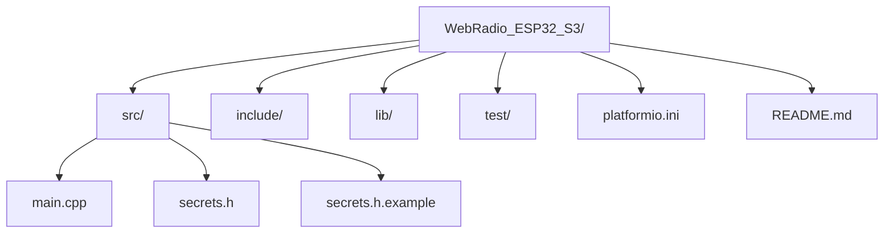
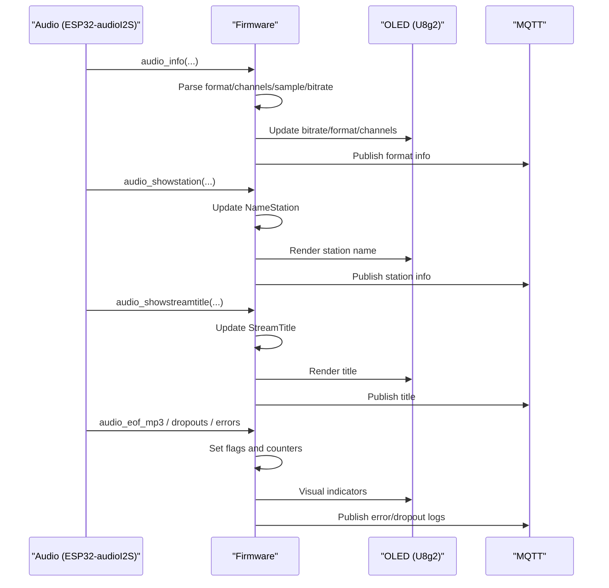
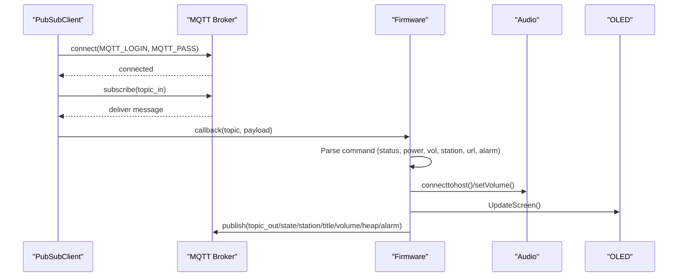
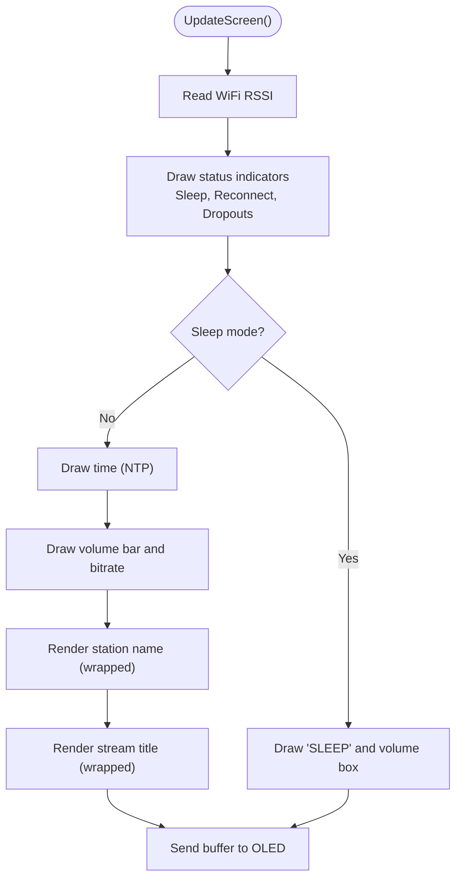
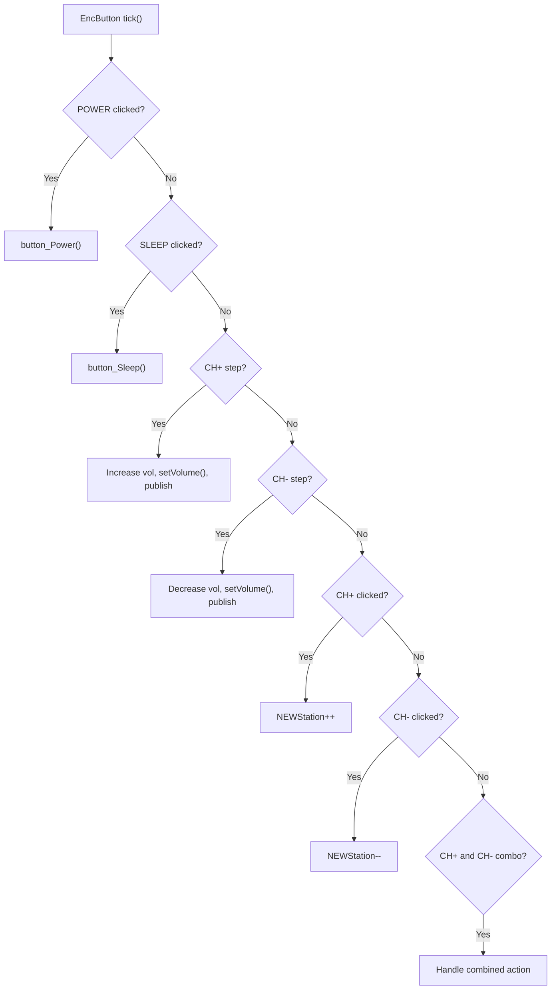
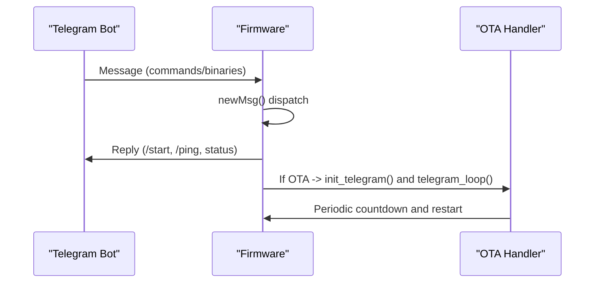
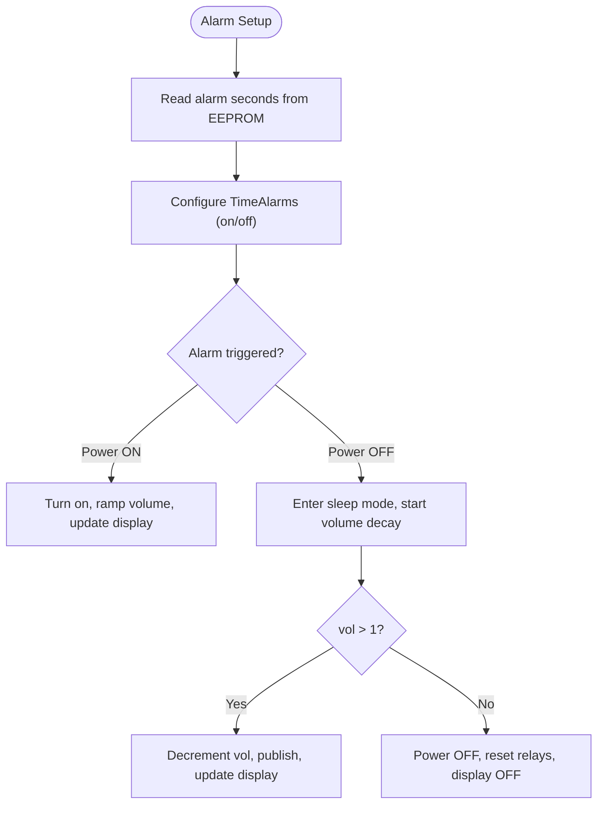
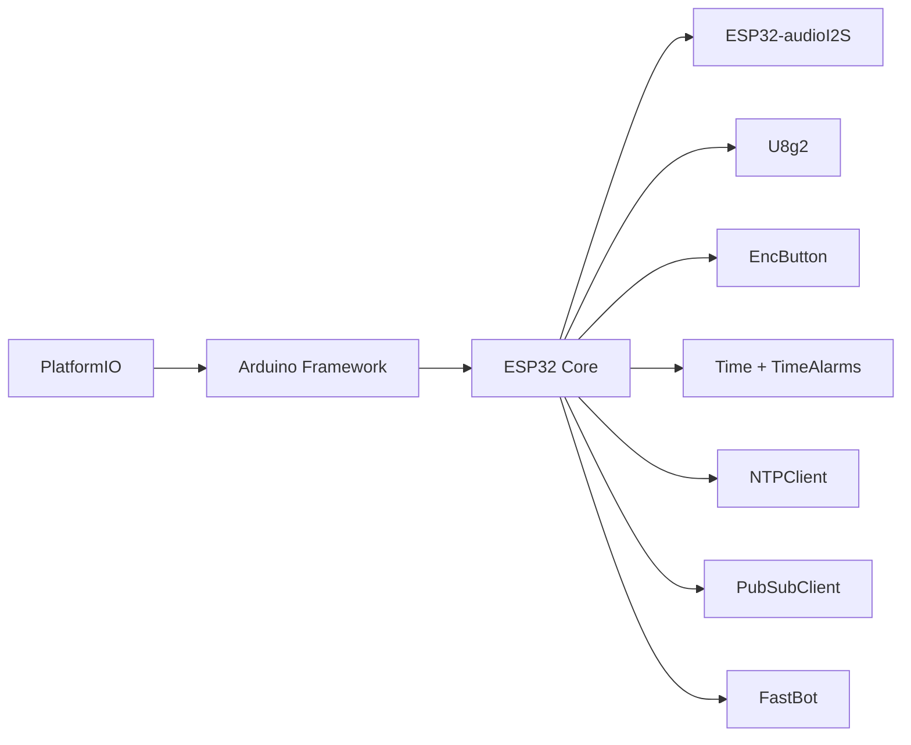

# Firmware Overview

<cite>
**Referenced Files in This Document**
- [main.cpp](file://WebRadio_ESP32_S3/src/main.cpp)
- [platformio.ini](file://WebRadio_ESP32_S3/platformio.ini)
- [README.md](file://WebRadio_ESP32_S3/README.md)
- [secrets.h.example](file://WebRadio_ESP32_S3/src/secrets.h.example)
</cite>

## Table of Contents
1. [Introduction](#introduction)
2. [Project Structure](#project-structure)
3. [Core Components](#core-components)
4. [Architecture Overview](#architecture-overview)
5. [Detailed Component Analysis](#detailed-component-analysis)
6. [Dependency Analysis](#dependency-analysis)
7. [Performance Considerations](#performance-considerations)
8. [Troubleshooting Guide](#troubleshooting-guide)
9. [Conclusion](#conclusion)
10. [Appendices](#appendices)

## Introduction
This firmware is the central controller for an ESP32-based internet radio system. It orchestrates audio streaming over I2S, manages a real-time OLED display, handles physical controls, synchronizes time via NTP, and integrates MQTT and Telegram for remote control and monitoring. Built on the Arduino framework for ESP32, it provides robust streaming, automation (alarms), and reliability features such as automatic reconnection and persistent alarm settings.

## Project Structure
The firmware resides under the WebRadio_ESP32_S3 directory with a conventional layout:
- src: Application entry point and implementation
- include: Header files (placeholder)
- lib: Private libraries (placeholder)
- test: Tests (placeholder)
- platformio.ini: Build configuration and environment definitions
- README.md: High-level project documentation



**Diagram sources**
- [platformio.ini:1-71](file://WebRadio_ESP32_S3/platformio.ini#L1-L71)
- [README.md:1-127](file://WebRadio_ESP32_S3/README.md#L1-L127)

**Section sources**
- [platformio.ini:1-71](file://WebRadio_ESP32_S3/platformio.ini#L1-L71)
- [README.md:1-127](file://WebRadio_ESP32_S3/README.md#L1-L127)

## Core Components
- Audio subsystem: I2S streaming via ESP32-audioI2S, with callbacks for stream metadata and bitrate.
- Display: U8g2-driven SSD1306 OLED for status, station info, and time.
- Controls: EncButton-based physical buttons for power, sleep, and channel/volume control.
- Connectivity: WiFi for streaming and NTP time sync; MQTT for remote control/status; Telegram for commands and OTA updates.
- Automation: TimeAlarms for scheduled power-on/power-off; EEPROM-backed alarm persistence.
- Initialization: Setup routine performs pin configuration, WiFi scan/connect, NTP time sync, EEPROM load, alarm setup, MQTT connect, and initial display state.

**Section sources**
- [main.cpp:1066-1342](file://WebRadio_ESP32_S3/src/main.cpp#L1066-L1342)
- [main.cpp:1638-1929](file://WebRadio_ESP32_S3/src/main.cpp#L1638-L1929)
- [README.md:56-80](file://WebRadio_ESP32_S3/README.md#L56-L80)

## Architecture Overview
The firmware follows a cooperative multitasking model within the Arduino loop(). Subsystems are event-driven:
- Audio events trigger callbacks that update state and display.
- Buttons are polled via EncButton tick() and mapped to actions.
- MQTT client runs in loop() to service incoming commands and periodic status publishing.
- Alarms schedule power-on/power-off transitions.
- Telegram bot ticks continuously during OTA update mode or periodically otherwise.

```mermaid
graph TB
subgraph "System"
MCU["ESP32 MCU"]
PSRAM["PSRAM (Wrover variant)"]
end
subgraph "Audio"
I2S["I2S DAC"]
AUDIO["ESP32-audioI2S"]
end
subgraph "Display"
OLED["SSD1306 OLED"]
U8G2["U8g2 Library"]
end
subgraph "Controls"
BTN["EncButton"]
PINS["GPIO Pins"]
end
subgraph "Connectivity"
WIFI["WiFi"]
NTP["NTPClient"]
MQTT["PubSubClient"]
TG["FastBot (Telegram)"]
end
subgraph "Automation"
TIME["Time + TimeAlarms"]
EEPROM["EEPROM"]
end
MCU --> I2S
MCU --> OLED
MCU --> BTN
MCU --> WIFI
WIFI --> NTP
MCU --> MQTT
MCU --> TG
MCU --> TIME
TIME --> EEPROM
AUDIO --> I2S
OLED --> U8G2
BTN --> PINS
MCU <- --> PSRAM
```

**Diagram sources**
- [main.cpp:1066-1342](file://WebRadio_ESP32_S3/src/main.cpp#L1066-L1342)
- [platformio.ini:14-71](file://WebRadio_ESP32_S3/platformio.ini#L14-L71)

## Detailed Component Analysis

### Entry Point and Initialization Sequence
- Entry point: setup() configures pins, initializes audio, OLED, scans and connects to WiFi, sets time via NTP, loads alarm from EEPROM, connects to MQTT, and displays initial state.
- Loop: continuously services MQTT, alarms, button ticks, screen updates, volume ramp-up, sleep timer, and audio playback.

```mermaid
sequenceDiagram
participant Boot as "Boot"
participant Setup as "setup()"
participant WiFi as "WiFi Scan/Connect"
participant NTP as "NTP Sync"
participant EEPROM as "EEPROM Load"
participant MQTT as "MQTT Connect"
participant Loop as "loop()"
Boot->>Setup : Start
Setup->>Setup : Configure pins and peripherals
Setup->>WiFi : Scan and connect
WiFi-->>Setup : Connected or restart
Setup->>NTP : Update time
NTP-->>Setup : Epoch time
Setup->>EEPROM : Read alarm seconds
Setup->>MQTT : Connect and subscribe
MQTT-->>Setup : Ready or error
Setup-->>Loop : Enter loop()
Loop->>MQTT : client.loop()
Loop->>Loop : Button ticks and handlers
Loop->>Loop : Screen updates and status publish
Loop->>Loop : Audio loop and callbacks
Loop->>Loop : Alarms and sleep timer
```

**Diagram sources**
- [main.cpp:1066-1342](file://WebRadio_ESP32_S3/src/main.cpp#L1066-L1342)
- [main.cpp:1344-1635](file://WebRadio_ESP32_S3/src/main.cpp#L1344-L1635)

**Section sources**
- [main.cpp:1066-1342](file://WebRadio_ESP32_S3/src/main.cpp#L1066-L1342)
- [main.cpp:1344-1635](file://WebRadio_ESP32_S3/src/main.cpp#L1344-L1635)

### Audio Streaming and Metadata
- I2S configuration and volume control are managed by the audio subsystem.
- Callbacks handle stream info (format, channels, sample rate, bitrate), ID3 metadata, and transient states (dropouts, failures).
- Display reflects current station, title, bitrate, and audio quality.



**Diagram sources**
- [main.cpp:1638-1929](file://WebRadio_ESP32_S3/src/main.cpp#L1638-L1929)
- [main.cpp:692-865](file://WebRadio_ESP32_S3/src/main.cpp#L692-L865)

**Section sources**
- [main.cpp:1638-1929](file://WebRadio_ESP32_S3/src/main.cpp#L1638-L1929)
- [main.cpp:692-865](file://WebRadio_ESP32_S3/src/main.cpp#L692-L865)

### MQTT Communication
- Topics vary by device variant (WebRadio1 vs WebRadio2) and include action, logging, station, title, state, free heap, volume, and alarm.
- Incoming messages emulate button presses, adjust volume, switch stations, play arbitrary URLs, and configure alarms.
- Outgoing messages publish status, audio info, and runtime metrics.



**Diagram sources**
- [main.cpp:275-650](file://WebRadio_ESP32_S3/src/main.cpp#L275-L650)
- [main.cpp:1291-1307](file://WebRadio_ESP32_S3/src/main.cpp#L1291-L1307)

**Section sources**
- [main.cpp:275-650](file://WebRadio_ESP32_S3/src/main.cpp#L275-L650)
- [README.md:89-112](file://WebRadio_ESP32_S3/README.md#L89-L112)

### Display Management
- U8g2 renders station number/name, stream title, time (via NTP), volume bar, RSSI, and status indicators (sleep, reconnect countdown).
- Two rendering modes: compact status when powered on, and large clock when enabled by button or alarm.



**Diagram sources**
- [main.cpp:692-865](file://WebRadio_ESP32_S3/src/main.cpp#L692-L865)
- [main.cpp:867-904](file://WebRadio_ESP32_S3/src/main.cpp#L867-L904)

**Section sources**
- [main.cpp:692-865](file://WebRadio_ESP32_S3/src/main.cpp#L692-L865)
- [main.cpp:867-904](file://WebRadio_ESP32_S3/src/main.cpp#L867-L904)

### Physical Controls
- Four tactile buttons: POWER, SLEEP, CH+, CH-.
- Hold actions: POWER hold reboots; SLEEP hold toggles optional FM transmitter; CH+ hold increases volume; CH- hold decreases volume.
- Simultaneous press of CH+ and CH- triggers special handling.



**Diagram sources**
- [main.cpp:1344-1635](file://WebRadio_ESP32_S3/src/main.cpp#L1344-L1635)
- [main.cpp:906-1028](file://WebRadio_ESP32_S3/src/main.cpp#L906-L1028)

**Section sources**
- [main.cpp:1344-1635](file://WebRadio_ESP32_S3/src/main.cpp#L1344-L1635)
- [main.cpp:906-1028](file://WebRadio_ESP32_S3/src/main.cpp#L906-L1028)

### Telegram Integration
- FastBot handles commands: /start, /ping, /restart, and OTA firmware updates via binary file send.
- During OTA update mode (detected by holding CH+ on boot), the device enters a dedicated loop updating the display and restarting after a countdown.



**Diagram sources**
- [main.cpp:1030-1064](file://WebRadio_ESP32_S3/src/main.cpp#L1030-L1064)
- [main.cpp:2014-2103](file://WebRadio_ESP32_S3/src/main.cpp#L2014-L2103)

**Section sources**
- [main.cpp:1030-1064](file://WebRadio_ESP32_S3/src/main.cpp#L1030-L1064)
- [main.cpp:2014-2103](file://WebRadio_ESP32_S3/src/main.cpp#L2014-L2103)

### Alarms and Sleep Timer
- TimeAlarms schedules daily power-on and power-off events; EEPROM persists configured alarm seconds.
- Sleep timer gradually reduces volume and powers off when volume reaches zero.



**Diagram sources**
- [main.cpp:1241-1277](file://WebRadio_ESP32_S3/src/main.cpp#L1241-L1277)
- [main.cpp:1946-1997](file://WebRadio_ESP32_S3/src/main.cpp#L1946-L1997)
- [main.cpp:1582-1627](file://WebRadio_ESP32_S3/src/main.cpp#L1582-L1627)

**Section sources**
- [main.cpp:1241-1277](file://WebRadio_ESP32_S3/src/main.cpp#L1241-L1277)
- [main.cpp:1946-1997](file://WebRadio_ESP32_S3/src/main.cpp#L1946-L1997)
- [main.cpp:1582-1627](file://WebRadio_ESP32_S3/src/main.cpp#L1582-L1627)

## Dependency Analysis
- Build system: PlatformIO with Arduino framework for ESP32.
- Libraries: ESP32-audioI2S, U8g2, EncButton, Time/TimeAlarms, NTPClient, PubSubClient, FastBot.
- Hardware variants: ESP-WROVER and UPEasy WROOM environments differ in pin defines and relay pins.



**Diagram sources**
- [platformio.ini:14-71](file://WebRadio_ESP32_S3/platformio.ini#L14-L71)

**Section sources**
- [platformio.ini:14-71](file://WebRadio_ESP32_S3/platformio.ini#L14-L71)

## Performance Considerations
- Memory: PSRAM-enabled Wrover builds improve stability for audio buffering and display rendering. Partition scheme uses minimal SPIFFS to accommodate audio streaming.
- CPU scheduling: Cooperative multitasking relies on frequent client.loop(), button ticks, and tight loop() iterations; keep display and MQTT work within short intervals.
- Network resilience: Automatic reconnection attempts and delayed retries prevent UI stalls; bitrate and format info help diagnose connectivity issues.
- Power ramp: Volume ramp-up prevents audible clicks during startup.

[No sources needed since this section provides general guidance]

## Troubleshooting Guide
- WiFi connection failures: The setup routine prints connection attempts and restarts after a timeout; verify credentials and network availability.
- MQTT disconnects: The loop periodically checks connection and reconnects; ensure broker accessibility and credentials.
- Audio dropouts/failures: Flags and counters track failures; the firmware retries and switches to periodic reconnects after repeated failures.
- Display anomalies: Clear buffer and redraw routines mitigate flicker; contrast and sleep mode indicators aid diagnostics.
- Telegram OTA: Ensure correct chat ID and binary file sent; the device counts down and restarts after OTA.

**Section sources**
- [main.cpp:1117-1176](file://WebRadio_ESP32_S3/src/main.cpp#L1117-L1176)
- [main.cpp:1344-1472](file://WebRadio_ESP32_S3/src/main.cpp#L1344-L1472)
- [main.cpp:1560-1573](file://WebRadio_ESP32_S3/src/main.cpp#L1560-L1573)
- [main.cpp:1030-1064](file://WebRadio_ESP32_S3/src/main.cpp#L1030-L1064)

## Conclusion
The firmware integrates audio streaming, display, controls, and remote management into a cohesive ESP32-based internet radio. Its modular design, robust connectivity handling, and automation features make it suitable for home automation and embedded audio applications.

[No sources needed since this section summarizes without analyzing specific files]

## Appendices

### Build Configuration and Environment Selection
- Default environment is Wrover; Wroom environment targets different board and pin mapping.
- PSRAM-related build flags optimize memory-critical operations.
- Partition scheme uses minimal SPIFFS; upload and monitor speeds are tuned for performance.

**Section sources**
- [platformio.ini:11-35](file://WebRadio_ESP32_S3/platformio.ini#L11-L35)
- [platformio.ini:46-71](file://WebRadio_ESP32_S3/platformio.ini#L46-L71)

### Secrets and Credentials
- WiFi credentials, Telegram bot token, admin chat ID, and MQTT broker details are configured in a secrets.h file copied from the example.

**Section sources**
- [secrets.h.example:1-32](file://WebRadio_ESP32_S3/src/secrets.h.example#L1-L32)

### System Requirements and Hardware Notes
- I2S DAC (e.g., MAX98357A or PCM5102) for audio output.
- SSD1306 OLED over I2C for display.
- Four tactile buttons and optional relays/FM transmitter control.
- ESP-WROVER or UPEasy WROOM boards supported.

**Section sources**
- [README.md:30-55](file://WebRadio_ESP32_S3/README.md#L30-L55)