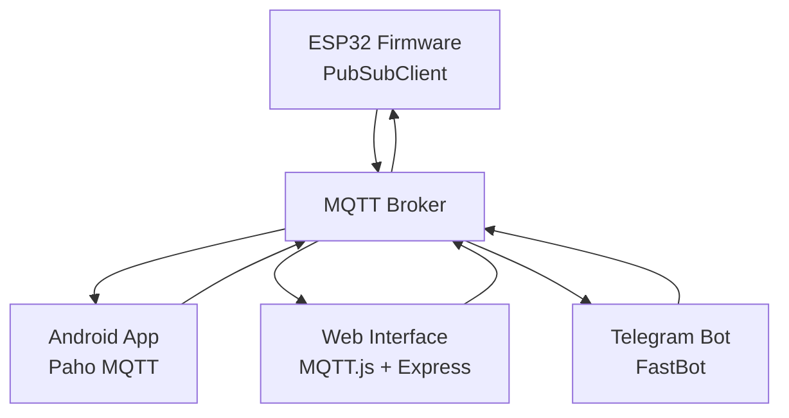
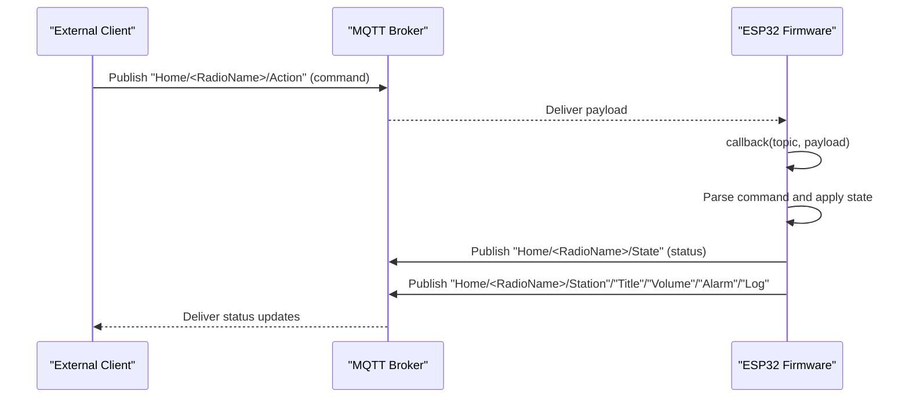
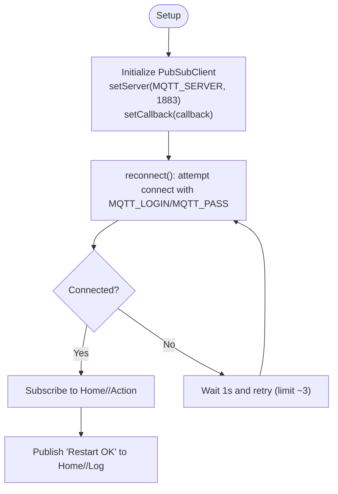
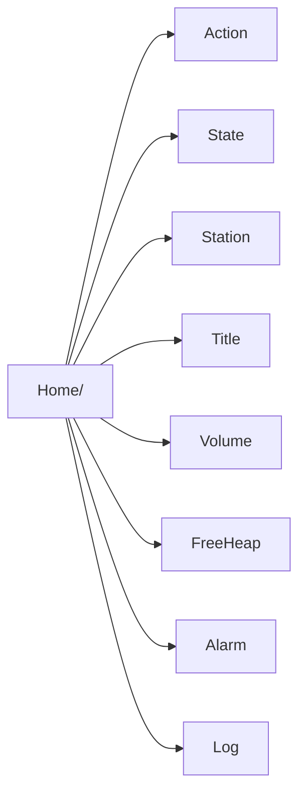
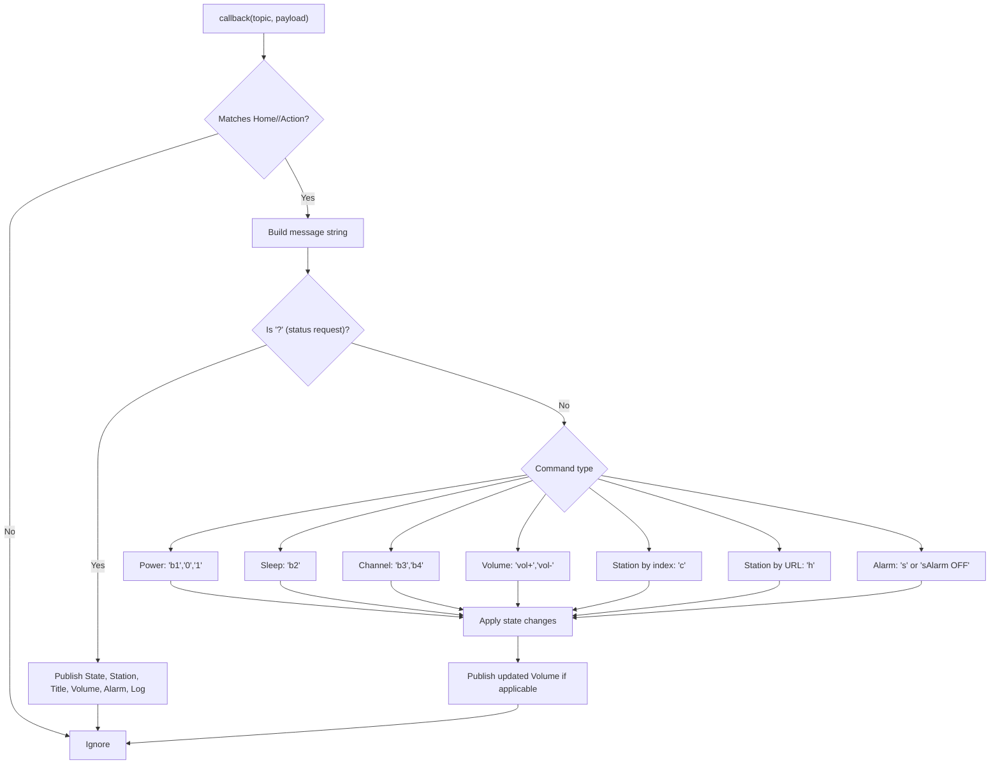
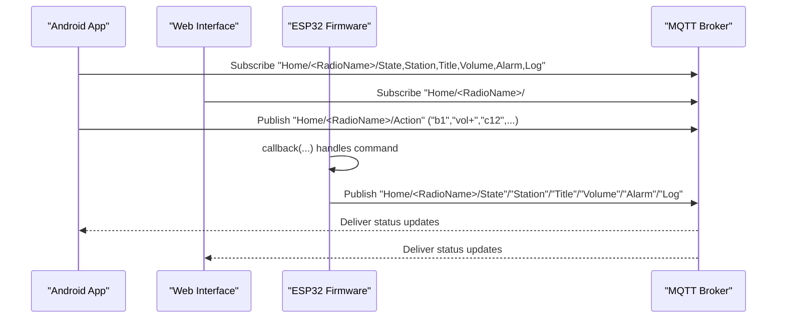
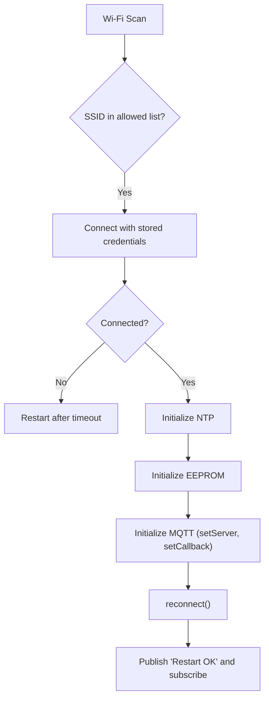
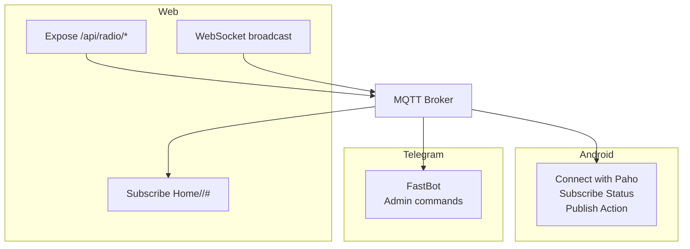
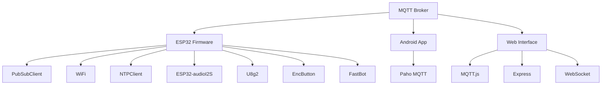

# MQTT Communication Layer

<cite>
**Referenced Files in This Document**
- [main.cpp](file://WebRadio_ESP32_S3/src/main.cpp)
- [secrets.h](file://WebRadio_ESP32_S3/src/secrets.h)
- [platformio.ini](file://WebRadio_ESP32_S3/platformio.ini)
- [MainActivity.kt](file://WebRadio_android/app/src/main/java/com/dip16/Webradio/MainActivity.kt)
- [Secrets.kt](file://WebRadio_android/app/src/main/java/com/dip16/webradio/Secrets.kt)
- [server.js](file://WebRadio_web/server.js)
</cite>

## Table of Contents
1. [Introduction](#introduction)
2. [Project Structure](#project-structure)
3. [Core Components](#core-components)
4. [Architecture Overview](#architecture-overview)
5. [Detailed Component Analysis](#detailed-component-analysis)
6. [Dependency Analysis](#dependency-analysis)
7. [Performance Considerations](#performance-considerations)
8. [Troubleshooting Guide](#troubleshooting-guide)
9. [Conclusion](#conclusion)
10. [Appendices](#appendices)

## Introduction
This document explains the MQTT communication layer used by the Webradio project. It covers the PubSubClient implementation on the ESP32, connection and reconnection logic, topic hierarchy and naming conventions, callback and message parsing, bidirectional communication flows, authentication and network configuration, and integration with external clients (Android app, web interface, Telegram bot). Practical examples of message formats, subscriptions, and status publishing are included, along with error handling, timeouts, and debugging techniques.

## Project Structure
The MQTT layer spans three primary components:
- ESP32 firmware (Arduino + PubSubClient) publishes status and subscribes to commands
- Android app (Paho MQTT) subscribes to status topics and publishes commands
- Web interface (Node.js + MQTT.js) bridges MQTT to HTTP/WebSocket APIs
- Telegram bot integration via FastBot for administrative actions

**Diagram sources**
- [main.cpp:1291-1306](file://WebRadio_ESP32_S3/src/main.cpp#L1291-L1306)
- [MainActivity.kt:171-246](file://WebRadio_android/app/src/main/java/com/dip16/Webradio/MainActivity.kt#L171-L246)
- [server.js:48-97](file://WebRadio_web/server.js#L48-L97)

**Section sources**
- [main.cpp:1291-1306](file://WebRadio_ESP32_S3/src/main.cpp#L1291-L1306)
- [MainActivity.kt:171-246](file://WebRadio_android/app/src/main/java/com/dip16/Webradio/MainActivity.kt#L171-L246)
- [server.js:48-97](file://WebRadio_web/server.js#L48-L97)

## Core Components
- PubSubClient on ESP32 manages MQTT connection, subscriptions, and publishing
- Topic hierarchy follows a consistent pattern: Home/<RadioName>/<Topic>
- Callback decodes incoming commands and controls hardware/audio
- Status publishing occurs periodically for State, Station, Title, Volume, FreeHeap, Alarm
- Authentication is configured via secrets.h with MQTT_SERVER, MQTT_LOGIN, MQTT_PASS
- Network configuration includes Wi-Fi scanning and connection with fallbacks

**Section sources**
- [main.cpp:29-53](file://WebRadio_ESP32_S3/src/main.cpp#L29-L53)
- [main.cpp:275-650](file://WebRadio_ESP32_S3/src/main.cpp#L275-L650)
- [main.cpp:652-690](file://WebRadio_ESP32_S3/src/main.cpp#L652-L690)
- [main.cpp:1448-1490](file://WebRadio_ESP32_S3/src/main.cpp#L1448-L1490)
- [secrets.h:20-23](file://WebRadio_ESP32_S3/src/secrets.h#L20-L23)

## Architecture Overview
The system uses a publish-subscribe model:
- ESP32 publishes status updates to Home/<RadioName>/State, Station, Title, Volume, FreeHeap, Alarm, Log
- Clients subscribe to status topics to reflect live state
- Clients publish commands to Home/<RadioName>/Action for control
- ESP32’s callback interprets commands and executes actions

**Diagram sources**
- [main.cpp:275-650](file://WebRadio_ESP32_S3/src/main.cpp#L275-L650)
- [main.cpp:1448-1490](file://WebRadio_ESP32_S3/src/main.cpp#L1448-L1490)

## Detailed Component Analysis

### PubSubClient Implementation and Connection Management
- ESP32 initializes PubSubClient with WiFiClient and sets server and callback
- Initial connection attempts with reconnect() and logs connection state
- Periodic reconnection checks occur in loop() when MQTT_available is true
- On successful connect, publishes “Restart OK” and subscribes to Home/<RadioName>/Action

**Diagram sources**
- [main.cpp:1291-1306](file://WebRadio_ESP32_S3/src/main.cpp#L1291-L1306)
- [main.cpp:652-690](file://WebRadio_ESP32_S3/src/main.cpp#L652-L690)

**Section sources**
- [main.cpp:1291-1306](file://WebRadio_ESP32_S3/src/main.cpp#L1291-L1306)
- [main.cpp:652-690](file://WebRadio_ESP32_S3/src/main.cpp#L652-L690)

### Topic Structure and Naming Conventions
- Base: Home/<RadioName>
- Action: Home/<RadioName>/Action (commands published by clients)
- Status: Home/<RadioName>/State, Station, Title, Volume, FreeHeap, Alarm, Log (published by ESP32)
- RadioName differs by board variant (WebRadio1 vs WebRadio2)

**Diagram sources**
- [main.cpp:29-53](file://WebRadio_ESP32_S3/src/main.cpp#L29-L53)

**Section sources**
- [main.cpp:29-53](file://WebRadio_ESP32_S3/src/main.cpp#L29-L53)

### Callback Function, Message Parsing, and Command Processing
- The callback receives topic, payload, and length
- If topic matches Home/<RadioName>/Action, parses message and applies commands:
  - Status request (“?”) publishes current State, Station, Title, Volume, Alarm, and formatted Log
  - Power control (“b1”, “0”, “1”), sleep (“b2”), channel up/down (“b3”, “b4”)
  - Volume adjust (“vol+”, “vol-”)
  - Turn on specific station by index (“c<number>”) or by URL (“h<URL>”)
  - Alarm configuration (“s<seconds>” or “sAlarm OFF”)
- Audio control and hardware relays are toggled accordingly

**Diagram sources**
- [main.cpp:275-650](file://WebRadio_ESP32_S3/src/main.cpp#L275-L650)

**Section sources**
- [main.cpp:275-650](file://WebRadio_ESP32_S3/src/main.cpp#L275-L650)

### Bidirectional Communication Flow
- Clients publish commands to Home/<RadioName>/Action
- ESP32 responds by publishing status updates to Home/<RadioName>/State, Station, Title, Volume, FreeHeap, Alarm, Log
- Android app subscribes to all status topics and displays real-time updates
- Web interface subscribes to all status topics and exposes them via HTTP and WebSocket

**Diagram sources**
- [MainActivity.kt:257-264](file://WebRadio_android/app/src/main/java/com/dip16/Webradio/MainActivity.kt#L257-L264)
- [server.js:59-97](file://WebRadio_web/server.js#L59-L97)
- [main.cpp:1448-1490](file://WebRadio_ESP32_S3/src/main.cpp#L1448-L1490)

**Section sources**
- [MainActivity.kt:257-264](file://WebRadio_android/app/src/main/java/com/dip16/Webradio/MainActivity.kt#L257-L264)
- [server.js:59-97](file://WebRadio_web/server.js#L59-L97)
- [main.cpp:1448-1490](file://WebRadio_ESP32_S3/src/main.cpp#L1448-L1490)

### Authentication, Connection Parameters, and Network Configuration
- MQTT credentials and broker address are defined in secrets.h
- ESP32 scans Wi-Fi networks and connects to the first match from configured lists
- After Wi-Fi success, it initializes NTP, EEPROM, alarms, and connects to MQTT
- Reconnection logic retries up to a small limit with short delays

**Diagram sources**
- [main.cpp:1117-1176](file://WebRadio_ESP32_S3/src/main.cpp#L1117-L1176)
- [main.cpp:1210-1223](file://WebRadio_ESP32_S3/src/main.cpp#L1210-L1223)
- [main.cpp:1291-1306](file://WebRadio_ESP32_S3/src/main.cpp#L1291-L1306)
- [main.cpp:652-690](file://WebRadio_ESP32_S3/src/main.cpp#L652-L690)
- [secrets.h:8-23](file://WebRadio_ESP32_S3/src/secrets.h#L8-L23)

**Section sources**
- [main.cpp:1117-1176](file://WebRadio_ESP32_S3/src/main.cpp#L1117-L1176)
- [main.cpp:1210-1223](file://WebRadio_ESP32_S3/src/main.cpp#L1210-L1223)
- [main.cpp:1291-1306](file://WebRadio_ESP32_S3/src/main.cpp#L1291-L1306)
- [main.cpp:652-690](file://WebRadio_ESP32_S3/src/main.cpp#L652-L690)
- [secrets.h:8-23](file://WebRadio_ESP32_S3/src/secrets.h#L8-L23)

### Practical Examples
- Command publishing (Android/Web):
  - Power on/off: “b1”, “0”
  - Channel up/down: “b3”, “b4”
  - Volume up/down: “vol+”, “vol-”
  - Select station by index: “c12”
  - Select station by URL: “h<full_stream_url>”
  - Alarm: “s32400” (seconds since midnight), “sAlarm OFF”
  - Status request: “?”
- Subscription patterns:
  - Android subscribes to Home/<RadioName>/State, Station, Title, Volume, Alarm, Log
  - Web subscribes to Home/<RadioName>/#
- Status publishing intervals:
  - Every 5 seconds when connected, including FreeHeap

**Section sources**
- [MainActivity.kt:312-316](file://WebRadio_android/app/src/main/java/com/dip16/Webradio/MainActivity.kt#L312-L316)
- [MainActivity.kt:257-264](file://WebRadio_android/app/src/main/java/com/dip16/Webradio/MainActivity.kt#L257-L264)
- [server.js:123-134](file://WebRadio_web/server.js#L123-L134)
- [main.cpp:1448-1490](file://WebRadio_ESP32_S3/src/main.cpp#L1448-L1490)

### Integration with External Clients
- Android app:
  - Connects with Paho MQTT, authenticates, subscribes to status topics, publishes to Action
  - Handles connection loss by attempting reconnect when app is active
- Web interface:
  - Bridges MQTT to HTTP and WebSocket, exposing status and accepting commands
  - Subscribes to all status topics and forwards updates to clients
- Telegram bot:
  - Uses FastBot to send/receive messages and trigger administrative actions

**Diagram sources**
- [MainActivity.kt:171-246](file://WebRadio_android/app/src/main/java/com/dip16/Webradio/MainActivity.kt#L171-L246)
- [server.js:48-97](file://WebRadio_web/server.js#L48-L97)
- [server.js:123-134](file://WebRadio_web/server.js#L123-L134)
- [main.cpp:55-57](file://WebRadio_ESP32_S3/src/main.cpp#L55-L57)

**Section sources**
- [MainActivity.kt:171-246](file://WebRadio_android/app/src/main/java/com/dip16/Webradio/MainActivity.kt#L171-L246)
- [server.js:48-97](file://WebRadio_web/server.js#L48-L97)
- [server.js:123-134](file://WebRadio_web/server.js#L123-L134)
- [main.cpp:55-57](file://WebRadio_ESP32_S3/src/main.cpp#L55-L57)

## Dependency Analysis
- ESP32 firmware depends on PubSubClient, WiFi, NTP, TimeAlarms, Audio, U8g2, EncButton, FastBot
- Android app depends on Paho MQTT client
- Web interface depends on MQTT.js, Express, WebSocket, Helmet, rate limit middleware
- All components share the same topic namespace and authentication credentials

**Diagram sources**
- [platformio.ini:36-71](file://WebRadio_ESP32_S3/platformio.ini#L36-L71)
- [MainActivity.kt:29-32](file://WebRadio_android/app/src/main/java/com/dip16/Webradio/MainActivity.kt#L29-L32)
- [server.js:1-8](file://WebRadio_web/server.js#L1-L8)

**Section sources**
- [platformio.ini:36-71](file://WebRadio_ESP32_S3/platformio.ini#L36-L71)
- [MainActivity.kt:29-32](file://WebRadio_android/app/src/main/java/com/dip16/Webradio/MainActivity.kt#L29-L32)
- [server.js:1-8](file://WebRadio_web/server.js#L1-L8)

## Performance Considerations
- MQTT reconnection is retried with bounded attempts and short delays to avoid blocking
- Status updates are published at controlled intervals (every 5 seconds) to balance responsiveness and bandwidth
- Audio metadata parsing extracts bitrate, format, channels, and sample rate to inform UI and diagnostics
- Free heap is published periodically to monitor memory pressure

[No sources needed since this section provides general guidance]

## Troubleshooting Guide
Common issues and remedies:
- Connection failures:
  - Verify MQTT_SERVER, MQTT_LOGIN, MQTT_PASS in secrets.h
  - Confirm Wi-Fi credentials and availability; ESP32 restarts after timeout if unable to connect
- No status updates:
  - Ensure clients subscribe to Home/<RadioName>/State, Station, Title, Volume, Alarm, Log
  - Check broker connectivity and firewall rules
- Commands not applied:
  - Validate command format (e.g., “b1”, “vol+”, “c12”, “h<URL>”, “s<seconds>”)
  - Confirm topic Home/<RadioName>/Action is used for commands
- Reconnection loops:
  - Reduce publish frequency or increase reconnect intervals
  - Inspect broker logs for authentication or ACL issues
- Debugging:
  - Enable serial logging on ESP32 for MQTT state and callbacks
  - Use mosquitto_sub/mosquitto_pub or MQTT Explorer to inspect topics
  - Monitor Android/Web logs for MQTT errors and connection state transitions

**Section sources**
- [secrets.h:20-23](file://WebRadio_ESP32_S3/src/secrets.h#L20-L23)
- [main.cpp:1117-1176](file://WebRadio_ESP32_S3/src/main.cpp#L1117-L1176)
- [main.cpp:652-690](file://WebRadio_ESP32_S3/src/main.cpp#L652-L690)
- [MainActivity.kt:195-204](file://WebRadio_android/app/src/main/java/com/dip16/Webradio/MainActivity.kt#L195-L204)

## Conclusion
The Webradio MQTT layer provides a robust, bidirectional communication backbone connecting the ESP32 device with Android, web, and Telegram clients. PubSubClient manages reliable messaging, the topic hierarchy ensures predictable routing, and the callback-driven command processing enables responsive control. With clear authentication, periodic status publishing, and resilient reconnection logic, the system supports real-time monitoring and remote operation across diverse clients.

[No sources needed since this section summarizes without analyzing specific files]

## Appendices

### Appendix A: Topic Reference
- Home/<RadioName>/Action: Commands from clients to ESP32
- Home/<RadioName>/State: Device power/state
- Home/<RadioName>/Station: Selected station index and name
- Home/<RadioName>/Title: Current stream title
- Home/<RadioName>/Volume: Current volume level
- Home/<RadioName>/FreeHeap: Available heap memory
- Home/<RadioName>/Alarm: Active alarm time or “Alarm OFF”
- Home/<RadioName>/Log: Operational logs and diagnostics

**Section sources**
- [main.cpp:29-53](file://WebRadio_ESP32_S3/src/main.cpp#L29-L53)

### Appendix B: Android MQTT Integration Notes
- Subscribes to all status topics under Home/<RadioName>/*
- Publishes commands to Home/<RadioName>/Action
- Handles connection loss and reconnects when the app is active

**Section sources**
- [MainActivity.kt:257-264](file://WebRadio_android/app/src/main/java/com/dip16/Webradio/MainActivity.kt#L257-L264)
- [MainActivity.kt:195-204](file://WebRadio_android/app/src/main/java/com/dip16/Webradio/MainActivity.kt#L195-L204)

### Appendix C: Web Interface MQTT Bridge
- Subscribes to Home/<RadioName>/#
- Exposes HTTP API (/api/radio/*) and WebSocket endpoint for status and commands

**Section sources**
- [server.js:59-97](file://WebRadio_web/server.js#L59-L97)
- [server.js:123-134](file://WebRadio_web/server.js#L123-L134)