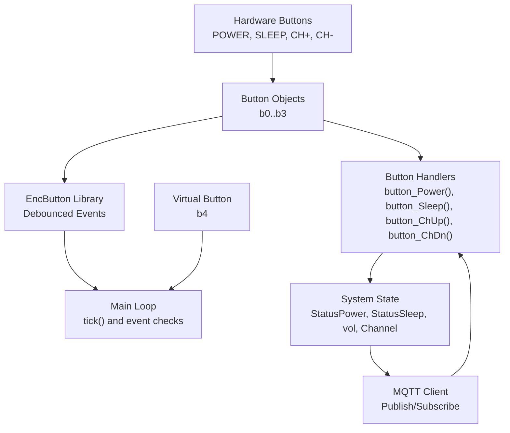
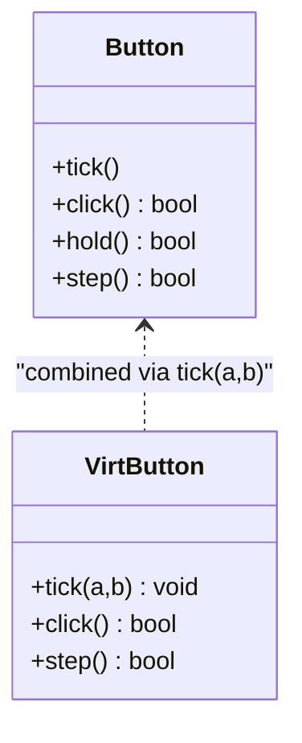
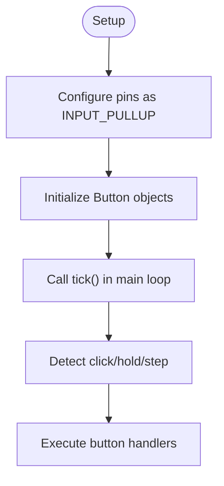
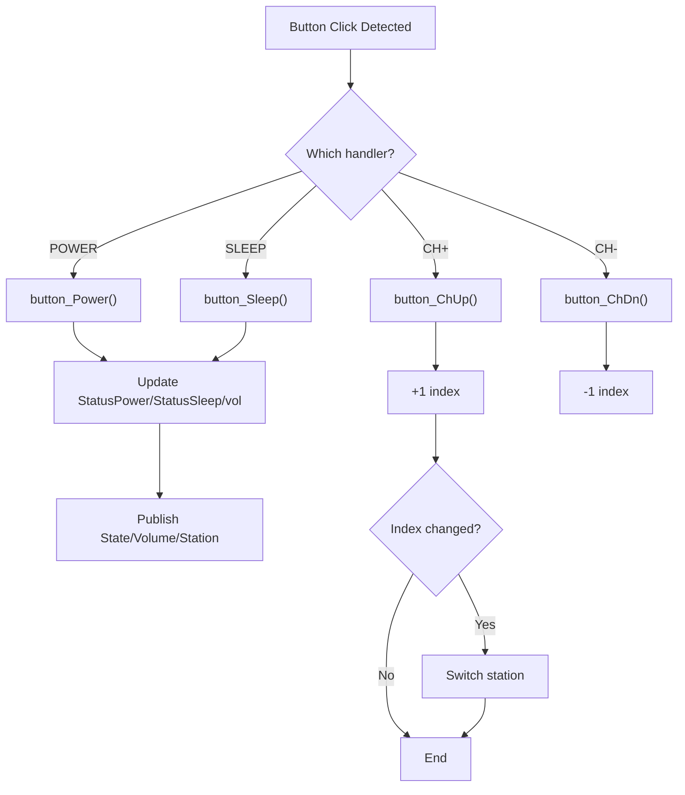
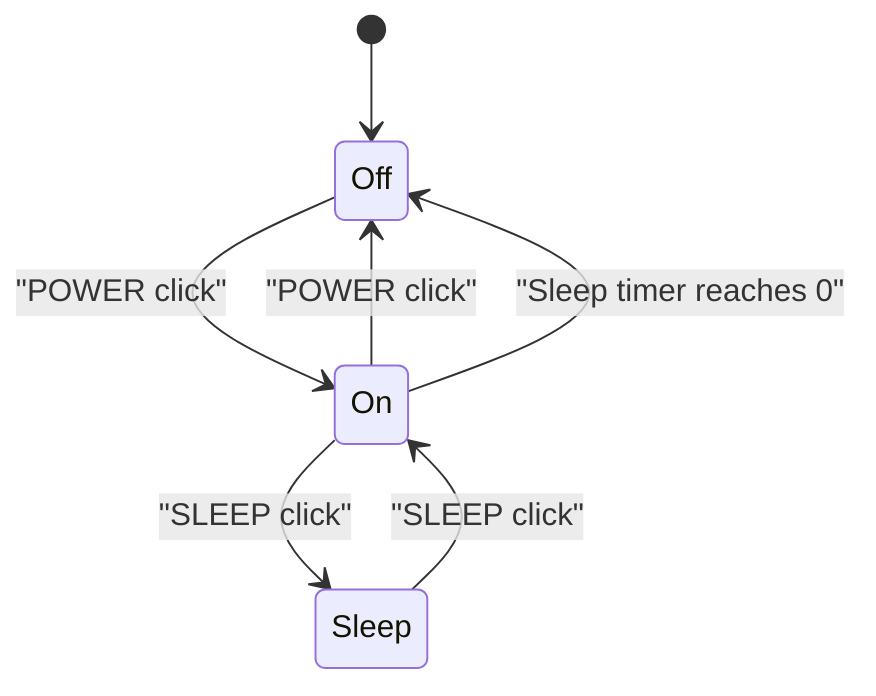
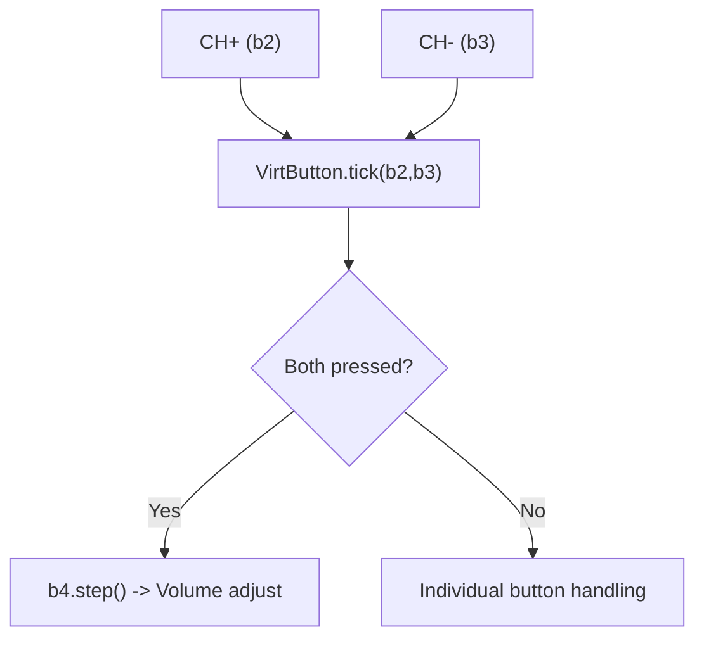
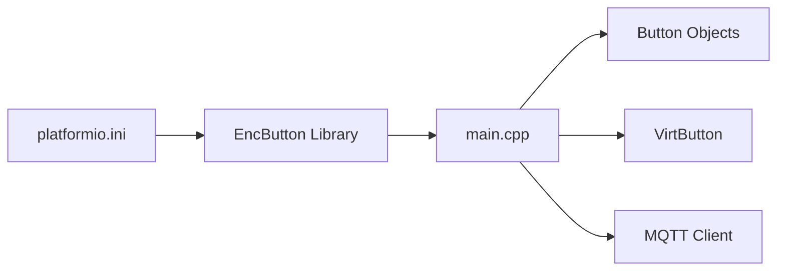

# Physical Button Controls

<cite>
**Referenced Files in This Document**
- [main.cpp](file://WebRadio_ESP32_S3/src/main.cpp)
- [platformio.ini](file://WebRadio_ESP32_S3/platformio.ini)
- [README.md](file://WebRadio_ESP32_S3/README.md)
- [README.ru.md](file://WebRadio_ESP32_S3/README.ru.md)
- [secrets.h](file://WebRadio_ESP32_S3/src/secrets.h)
</cite>

## Table of Contents
1. [Introduction](#introduction)
2. [Project Structure](#project-structure)
3. [Core Components](#core-components)
4. [Architecture Overview](#architecture-overview)
5. [Detailed Component Analysis](#detailed-component-analysis)
6. [Dependency Analysis](#dependency-analysis)
7. [Performance Considerations](#performance-considerations)
8. [Troubleshooting Guide](#troubleshooting-guide)
9. [Conclusion](#conclusion)

## Introduction
This document explains the physical button control system for the ESP32-based Internet radio project. It covers the integration of the EncButton library, pin assignments for power, sleep, channel up, and channel down buttons, the button handling functions, debouncing and state management, interrupt-free operation, and the relationship between physical button presses and MQTT command generation. It also documents the virtual button implementation and how it fits into the control system, along with practical examples for configuration, custom mappings, and extending the button interface.

## Project Structure
The button control logic is implemented in the ESP32 firmware under the WebRadio_ESP32_S3 project. Key elements:
- EncButton library integration for robust button event handling
- Four physical buttons mapped to pins defined via build flags
- A virtual button combining two physical buttons for combined actions
- MQTT integration to emit state changes and accept emulated button commands



**Diagram sources**
- [main.cpp:66-70](file://WebRadio_ESP32_S3/src/main.cpp#L66-L70)
- [main.cpp:1359-1367](file://WebRadio_ESP32_S3/src/main.cpp#L1359-L1367)
- [main.cpp:1512-1537](file://WebRadio_ESP32_S3/src/main.cpp#L1512-L1537)
- [main.cpp:274-378](file://WebRadio_ESP32_S3/src/main.cpp#L274-L378)

**Section sources**
- [main.cpp:66-70](file://WebRadio_ESP32_S3/src/main.cpp#L66-L70)
- [main.cpp:1066-1076](file://WebRadio_ESP32_S3/src/main.cpp#L1066-L1076)
- [platformio.ini:25-29](file://WebRadio_ESP32_S3/platformio.ini#L25-L29)
- [README.md:81-87](file://WebRadio_ESP32_S3/README.md#L81-L87)

## Core Components
- EncButton library: Provides debounced button events and multi-click/hold support.
- Button objects:
  - b0: POWER
  - b1: SLEEP
  - b2: CH+ (UP)
  - b3: CH- (DOWN)
  - b4: Virtual button combining CH+ and CH- for combined actions
- Button handlers:
  - button_Power(): toggles power and manages fast volume ramp-up
  - button_Sleep(): toggles sleep mode and volume ramp-down
  - button_ChUp()/button_ChDn(): advance or reverse station selection
- Interrupt-free operation: Uses INPUT_PULLUP pins and polling via EncButton.tick() in the main loop.

**Section sources**
- [main.cpp:66-70](file://WebRadio_ESP32_S3/src/main.cpp#L66-L70)
- [main.cpp:906-1028](file://WebRadio_ESP32_S3/src/main.cpp#L906-L1028)
- [main.cpp:1359-1367](file://WebRadio_ESP32_S3/src/main.cpp#L1359-L1367)
- [main.cpp:1071-1076](file://WebRadio_ESP32_S3/src/main.cpp#L1071-L1076)

## Architecture Overview
The button control architecture centers on EncButton’s event model and the main loop’s periodic tick(). Each button is polled continuously, and the resulting events trigger handler functions or state changes. The system publishes MQTT topics reflecting state transitions and accepts incoming MQTT commands that emulate button presses.

```mermaid
sequenceDiagram
participant HW as "Hardware Button"
participant ENC as "EncButton.tick()"
participant LOOP as "Main Loop"
participant HANDLER as "Button Handler"
participant STATE as "System State"
participant MQTT as "MQTT Client"
HW->>ENC : "Press/Release"
ENC-->>LOOP : "click(), hold(), step()"
LOOP->>HANDLER : "button_Power()/button_Sleep()/button_ChUp()/button_ChDn()"
HANDLER->>STATE : "Update StatusPower/StatusSleep/vol/Channel"
STATE->>MQTT : "Publish State/Volume/Station"
MQTT-->>LOOP : "callback() receives 'b1'/'b2'/'b3'/'b4'"
LOOP->>HANDLER : "Invoke handler equivalent to received command"
```

**Diagram sources**
- [main.cpp:1359-1367](file://WebRadio_ESP32_S3/src/main.cpp#L1359-L1367)
- [main.cpp:1512-1537](file://WebRadio_ESP32_S3/src/main.cpp#L1512-L1537)
- [main.cpp:274-378](file://WebRadio_ESP32_S3/src/main.cpp#L274-L378)
- [main.cpp:906-1028](file://WebRadio_ESP32_S3/src/main.cpp#L906-L1028)

## Detailed Component Analysis

### EncButton Library Integration
- EncButton is included and used to manage four physical buttons and one virtual combination.
- Each button object is constructed with the pin number defined via build flags.
- The main loop calls tick() on each button object to process events.
- Combined actions are handled via a virtual button that monitors CH+ and CH- simultaneously.



**Diagram sources**
- [main.cpp:66-70](file://WebRadio_ESP32_S3/src/main.cpp#L66-L70)
- [main.cpp:1359-1367](file://WebRadio_ESP32_S3/src/main.cpp#L1359-L1367)

**Section sources**
- [main.cpp:66-70](file://WebRadio_ESP32_S3/src/main.cpp#L66-L70)
- [main.cpp:1359-1367](file://WebRadio_ESP32_S3/src/main.cpp#L1359-L1367)

### Pin Assignments and Hardware Setup
- Pins are configured via build flags in platformio.ini:
  - KEY_POWER: GPIO 19
  - KEY_SLEEP: GPIO 15
  - KEY_UP (CH+): GPIO 18
  - KEY_DOWN (CH-): GPIO 4
- All buttons are configured as INPUT_PULLUP in setup().
- No interrupts are used; polling via EncButton.tick() is sufficient.



**Diagram sources**
- [platformio.ini:25-29](file://WebRadio_ESP32_S3/platformio.ini#L25-L29)
- [main.cpp:1071-1076](file://WebRadio_ESP32_S3/src/main.cpp#L1071-L1076)
- [main.cpp:1359-1367](file://WebRadio_ESP32_S3/src/main.cpp#L1359-L1367)

**Section sources**
- [platformio.ini:25-29](file://WebRadio_ESP32_S3/platformio.ini#L25-L29)
- [main.cpp:1071-1076](file://WebRadio_ESP32_S3/src/main.cpp#L1071-L1076)

### Button Handling Functions
- button_Power():
  - Toggles power state, controls relays and LED, initializes volume and fast ramp-up.
  - Publishes state changes to MQTT.
- button_Sleep():
  - Starts/stops sleep mode, adjusts volume gradually to zero.
  - Publishes state changes to MQTT.
- button_ChUp()/button_ChDn():
  - Advance or reverse the station index in the list.
  - Trigger station change when the index changes.



**Diagram sources**
- [main.cpp:1512-1537](file://WebRadio_ESP32_S3/src/main.cpp#L1512-L1537)
- [main.cpp:906-1028](file://WebRadio_ESP32_S3/src/main.cpp#L906-L1028)
- [main.cpp:1538-1558](file://WebRadio_ESP32_S3/src/main.cpp#L1538-L1558)

**Section sources**
- [main.cpp:906-1028](file://WebRadio_ESP32_S3/src/main.cpp#L906-L1028)
- [main.cpp:1512-1537](file://WebRadio_ESP32_S3/src/main.cpp#L1512-L1537)
- [main.cpp:1538-1558](file://WebRadio_ESP32_S3/src/main.cpp#L1538-L1558)

### Debouncing Mechanisms and State Management
- Debouncing: EncButton handles debouncing internally during tick().
- State flags:
  - StatusPower: Tracks power state
  - StatusSleep: Tracks sleep mode
  - KeyPowerTrigger/KeySleepTrigger: Legacy flags retained in code
- Event-driven updates:
  - click(): Immediate action
  - hold(): Long-press behavior (e.g., reboot, toggle FM TX)
  - step(): Continuous action while held (volume adjustment)



**Diagram sources**
- [main.cpp:906-1028](file://WebRadio_ESP32_S3/src/main.cpp#L906-L1028)
- [main.cpp:1582-1627](file://WebRadio_ESP32_S3/src/main.cpp#L1582-L1627)

**Section sources**
- [main.cpp:1368-1393](file://WebRadio_ESP32_S3/src/main.cpp#L1368-L1393)
- [main.cpp:1582-1627](file://WebRadio_ESP32_S3/src/main.cpp#L1582-L1627)

### Interrupt Handling
- No interrupts are used for button handling.
- All button polling is done via EncButton.tick() in the main loop.
- This simplifies wiring and avoids interrupt latency concerns.

**Section sources**
- [main.cpp:1359-1367](file://WebRadio_ESP32_S3/src/main.cpp#L1359-L1367)
- [main.cpp:1071-1076](file://WebRadio_ESP32_S3/src/main.cpp#L1071-L1076)

### Relationship Between Physical Buttons and MQTT Command Generation
- Physical button actions publish state updates to MQTT topics.
- Incoming MQTT commands (e.g., “b1”, “b2”, “b3”, “b4”) are processed in the MQTT callback and invoke the corresponding button handlers.
- This enables remote control and automation via MQTT.

```mermaid
sequenceDiagram
participant User as "User"
participant HW as "Hardware Button"
participant LOOP as "Main Loop"
participant MQTT as "MQTT Client"
participant Remote as "Remote Control"
User->>HW : "Press button"
HW->>LOOP : "Event detected"
LOOP->>MQTT : "Publish State/Volume/Station"
Remote->>MQTT : "Send 'b1'/'b2'/'b3'/'b4'"
MQTT-->>LOOP : "callback() invoked"
LOOP->>LOOP : "Invoke button handler"
LOOP->>MQTT : "Publish State/Volume/Station"
```

**Diagram sources**
- [main.cpp:274-378](file://WebRadio_ESP32_S3/src/main.cpp#L274-L378)
- [main.cpp:1512-1537](file://WebRadio_ESP32_S3/src/main.cpp#L1512-L1537)

**Section sources**
- [main.cpp:274-378](file://WebRadio_ESP32_S3/src/main.cpp#L274-L378)
- [main.cpp:1512-1537](file://WebRadio_ESP32_S3/src/main.cpp#L1512-L1537)

### Virtual Button Implementation
- b4 is initialized as a virtual button and ticked with b2 and b3 to detect combined CH+/CH- actions.
- Combined actions:
  - b4.click(): Reserved for future combined behavior
  - b4.step(): Used for volume changes when CH+ and CH- are held together



**Diagram sources**
- [main.cpp:69-70](file://WebRadio_ESP32_S3/src/main.cpp#L69-L70)
- [main.cpp:1365-1367](file://WebRadio_ESP32_S3/src/main.cpp#L1365-L1367)
- [main.cpp:1439-1445](file://WebRadio_ESP32_S3/src/main.cpp#L1439-L1445)

**Section sources**
- [main.cpp:69-70](file://WebRadio_ESP32_S3/src/main.cpp#L69-L70)
- [main.cpp:1365-1367](file://WebRadio_ESP32_S3/src/main.cpp#L1365-L1367)
- [main.cpp:1439-1445](file://WebRadio_ESP32_S3/src/main.cpp#L1439-L1445)

### Practical Examples

#### Example 1: Button Configuration
- Define pins via build flags in platformio.ini (e.g., KEY_POWER=19, KEY_SLEEP=15, KEY_UP=18, KEY_DOWN=4).
- Ensure pins are configured as INPUT_PULLUP in setup().

**Section sources**
- [platformio.ini:25-29](file://WebRadio_ESP32_S3/platformio.ini#L25-L29)
- [main.cpp:1071-1076](file://WebRadio_ESP32_S3/src/main.cpp#L1071-L1076)

#### Example 2: Custom Button Mappings
- To remap buttons, change the build flags and update the Button constructor arguments accordingly.
- Keep the same event names (click/hold/step) to preserve behavior.

**Section sources**
- [platformio.ini:25-29](file://WebRadio_ESP32_S3/platformio.ini#L25-L29)
- [main.cpp:66-70](file://WebRadio_ESP32_S3/src/main.cpp#L66-L70)

#### Example 3: Extending the Button Interface
- Add a new Button object and initialize it in setup().
- Call tick() on the new object in the main loop.
- Add event checks and a corresponding handler function.
- Integrate with system state and MQTT publishing as needed.

**Section sources**
- [main.cpp:66-70](file://WebRadio_ESP32_S3/src/main.cpp#L66-L70)
- [main.cpp:1359-1367](file://WebRadio_ESP32_S3/src/main.cpp#L1359-L1367)
- [main.cpp:906-1028](file://WebRadio_ESP32_S3/src/main.cpp#L906-L1028)

### Timing Considerations
- EncButton tick() is called frequently in the main loop to ensure responsive event detection.
- Fast volume ramp-up uses millis() timing to increment volume at a controlled rate.
- Sleep mode uses a fixed interval to decrement volume gradually.
- MQTT keepalive and reconnect logic runs periodically to maintain connectivity.

**Section sources**
- [main.cpp:1359-1367](file://WebRadio_ESP32_S3/src/main.cpp#L1359-L1367)
- [main.cpp:1492-1511](file://WebRadio_ESP32_S3/src/main.cpp#L1492-L1511)
- [main.cpp:1582-1627](file://WebRadio_ESP32_S3/src/main.cpp#L1582-L1627)
- [main.cpp:1447-1453](file://WebRadio_ESP32_S3/src/main.cpp#L1447-L1453)

### Button Press Detection and Integration with System State
- Press detection relies on EncButton’s event model.
- State changes are reflected immediately in system variables and published to MQTT.
- Station changes occur when the NEWStation index differs from OLDStation.

**Section sources**
- [main.cpp:1512-1537](file://WebRadio_ESP32_S3/src/main.cpp#L1512-L1537)
- [main.cpp:1538-1558](file://WebRadio_ESP32_S3/src/main.cpp#L1538-L1558)

## Dependency Analysis
- EncButton library is declared in platformio.ini and used throughout the firmware.
- The main loop depends on EncButton tick() to process button events.
- MQTT integration depends on button handlers to publish state changes.
- Build flags define pin assignments, which propagate to the firmware.



**Diagram sources**
- [platformio.ini:42](file://WebRadio_ESP32_S3/platformio.ini#L42)
- [main.cpp:6](file://WebRadio_ESP32_S3/src/main.cpp#L6)
- [main.cpp:66-70](file://WebRadio_ESP32_S3/src/main.cpp#L66-L70)

**Section sources**
- [platformio.ini:42](file://WebRadio_ESP32_S3/platformio.ini#L42)
- [main.cpp:6](file://WebRadio_ESP32_S3/src/main.cpp#L6)

## Performance Considerations
- Polling via EncButton.tick() is lightweight and suitable for this application.
- Debouncing is handled internally by EncButton, avoiding manual delays.
- Fast volume ramp-up and sleep-mode volume decay use millis() timing to minimize CPU overhead.
- Avoid heavy operations inside button event handlers; delegate to the main loop where possible.

[No sources needed since this section provides general guidance]

## Troubleshooting Guide
- Buttons feel unresponsive:
  - Ensure pins are configured as INPUT_PULLUP and that the buttons pull to ground when pressed.
  - Verify EncButton.tick() is called on each button object in the main loop.
- Debouncing artifacts:
  - EncButton handles debouncing; confirm that tick() is called frequently enough.
- Mixed button behavior:
  - For combined actions, ensure VirtButton.tick(b2, b3) is called and that b4.click()/b4.step() are used appropriately.
- MQTT not reflecting state:
  - Confirm that button handlers publish to the appropriate MQTT topics.
  - Check that the MQTT client is connected and subscribed to the input topic.

**Section sources**
- [main.cpp:1071-1076](file://WebRadio_ESP32_S3/src/main.cpp#L1071-L1076)
- [main.cpp:1359-1367](file://WebRadio_ESP32_S3/src/main.cpp#L1359-L1367)
- [main.cpp:1439-1445](file://WebRadio_ESP32_S3/src/main.cpp#L1439-L1445)
- [main.cpp:274-378](file://WebRadio_ESP32_S3/src/main.cpp#L274-L378)

## Conclusion
The physical button control system integrates EncButton for reliable, debounced event handling and uses a straightforward polling approach to avoid interrupts. The POWER, SLEEP, CH+, and CH- buttons are mapped to configurable pins, with handlers that update system state and publish MQTT messages. A virtual button enables combined actions. The design balances simplicity, reliability, and extensibility, allowing easy customization and integration with remote control via MQTT.