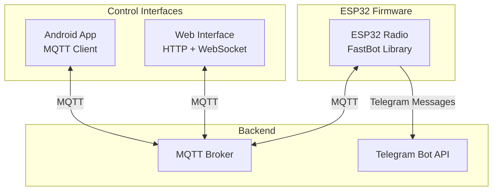
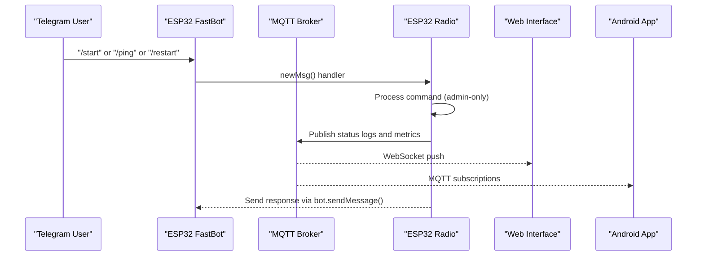
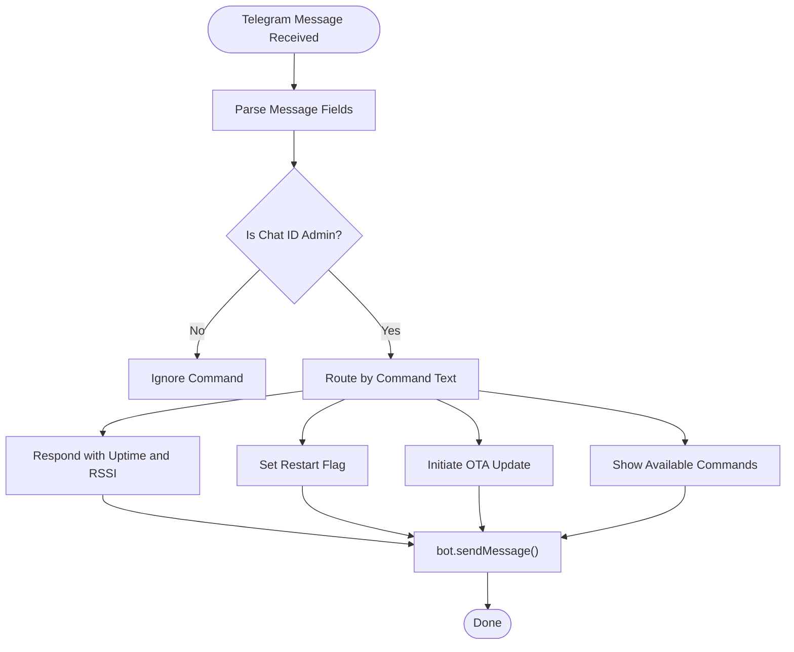
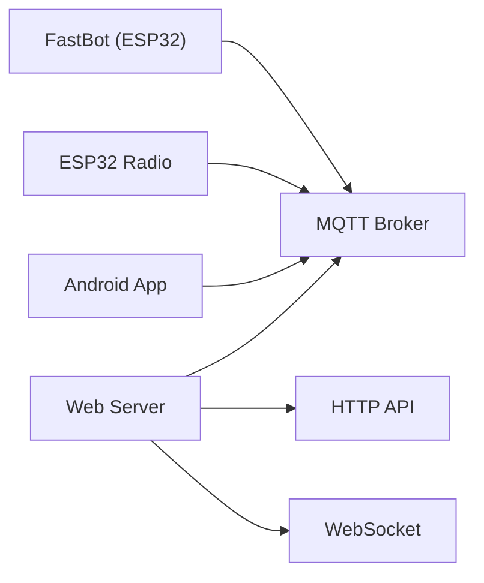

# Telegram Bot Integration

<cite>
**Referenced Files in This Document**
- [README.md](file://README.md)
- [main.cpp](file://WebRadio_ESP32_S3/src/main.cpp)
- [secrets.h](file://WebRadio_ESP32_S3/src/secrets.h)
- [secrets.h.example](file://WebRadio_ESP32_S3/src/secrets.h.example)
- [server.js](file://WebRadio_web/server.js)
- [Secrets.kt](file://WebRadio_android/app/src/main/java/com/dip16/webradio/Secrets.kt)
- [MainActivity.kt](file://WebRadio_android/app/src/main/java/com/dip16/webradio/MainActivity.kt)
</cite>

## Table of Contents
1. [Introduction](#introduction)
2. [Project Structure](#project-structure)
3. [Core Components](#core-components)
4. [Architecture Overview](#architecture-overview)
5. [Detailed Component Analysis](#detailed-component-analysis)
6. [Dependency Analysis](#dependency-analysis)
7. [Performance Considerations](#performance-considerations)
8. [Troubleshooting Guide](#troubleshooting-guide)
9. [Conclusion](#conclusion)
10. [Appendices](#appendices)

## Introduction
This document explains the Telegram bot integration for the WebRadio IoT project. It covers the FastBot library usage on the ESP32 firmware, bot token and admin chat ID configuration, command processing, message handling, and response generation. It also documents the MQTT integration for real-time status updates and command forwarding, along with administrative functions, user interaction patterns, and security considerations such as rate limiting and DDOS protection. Practical configuration examples, command syntax, and troubleshooting steps are included.

## Project Structure
The Telegram bot integration spans three primary areas:
- ESP32 firmware that runs the radio and hosts the Telegram bot
- Android app that communicates with the MQTT broker and relays commands
- Web server that bridges HTTP APIs to MQTT and exposes WebSocket connections

**Diagram sources**
- [README.md:61-91](file://README.md#L61-L91)
- [main.cpp:1291-1306](file://WebRadio_ESP32_S3/src/main.cpp#L1291-L1306)
- [server.js:47-66](file://WebRadio_web/server.js#L47-L66)
- [Secrets.kt:7-11](file://WebRadio_android/app/src/main/java/com/dip16/webradio/Secrets.kt#L7-L11)

**Section sources**
- [README.md:61-91](file://README.md#L61-L91)

## Core Components
- FastBot library on ESP32: Provides Telegram bot capabilities, message handling, and admin-only commands.
- Bot configuration: Tokens and admin chat ID are defined in the secrets header.
- MQTT bridge: The ESP32 subscribes to MQTT topics and publishes status updates; the web server mirrors MQTT state to clients.
- Android app: Subscribes to MQTT topics and publishes control commands.

Key implementation references:
- Bot initialization and handlers: [init_telegram:1999-2011](file://WebRadio_ESP32_S3/src/main.cpp#L1999-L2011), [newMsg:2014-2102](file://WebRadio_ESP32_S3/src/main.cpp#L2014-L2102)
- Bot token and admin chat ID: [secrets.h:11-18](file://WebRadio_ESP32_S3/src/secrets.h#L11-L18)
- MQTT subscription and publishing: [callback:275-650](file://WebRadio_ESP32_S3/src/main.cpp#L275-L650), [reconnect:652-690](file://WebRadio_ESP32_S3/src/main.cpp#L652-L690)
- Web server MQTT bridge: [server.js:47-97](file://WebRadio_web/server.js#L47-L97), [publishMqttCommand:123-134](file://WebRadio_web/server.js#L123-L134)
- Android MQTT client: [MainActivity.kt:171-246](file://WebRadio_android/app/src/main/java/com/dip16/webradio/MainActivity.kt#L171-L246)

**Section sources**
- [main.cpp:1999-2102](file://WebRadio_ESP32_S3/src/main.cpp#L1999-L2102)
- [secrets.h:11-18](file://WebRadio_ESP32_S3/src/secrets.h#L11-L18)
- [server.js:47-97](file://WebRadio_web/server.js#L47-L97)
- [MainActivity.kt:171-246](file://WebRadio_android/app/src/main/java/com/dip16/webradio/MainActivity.kt#L171-L246)

## Architecture Overview
The Telegram bot integrates with the ESP32 firmware to accept admin commands and send status updates. Commands are processed locally and mirrored to MQTT topics for consumption by Android and web clients. The web server also exposes HTTP endpoints that publish MQTT commands and WebSocket endpoints for live updates.

**Diagram sources**
- [main.cpp:2014-2102](file://WebRadio_ESP32_S3/src/main.cpp#L2014-L2102)
- [main.cpp:275-650](file://WebRadio_ESP32_S3/src/main.cpp#L275-L650)
- [server.js:212-222](file://WebRadio_web/server.js#L212-L222)
- [MainActivity.kt:257-296](file://WebRadio_android/app/src/main/java/com/dip16/webradio/MainActivity.kt#L257-L296)

## Detailed Component Analysis

### FastBot Library and Telegram Integration
- Initialization: The bot is instantiated with the configured token and admin chat ID checks are enabled.
- Message handling: The new message handler validates sender identity and processes admin commands.
- Admin-only commands: Restart, ping, OTA update, and menu help are restricted to the admin chat ID.
- Response generation: The bot sends formatted messages back to the admin chat.

**Diagram sources**
- [main.cpp:2014-2102](file://WebRadio_ESP32_S3/src/main.cpp#L2014-L2102)

**Section sources**
- [main.cpp:1999-2102](file://WebRadio_ESP32_S3/src/main.cpp#L1999-L2102)

### Bot Token and Admin Chat ID Configuration
- Tokens and admin IDs are defined per device variant and stored in the secrets header.
- The example secrets file shows how to configure tokens and admin chat IDs for both device variants.

Configuration references:
- Device-specific tokens and admin chat ID: [secrets.h:11-18](file://WebRadio_ESP32_S3/src/secrets.h#L11-L18)
- Example template with placeholders: [secrets.h.example:16-27](file://WebRadio_ESP32_S3/src/secrets.h.example#L16-L27)

**Section sources**
- [secrets.h:11-18](file://WebRadio_ESP32_S3/src/secrets.h#L11-L18)
- [secrets.h.example:16-27](file://WebRadio_ESP32_S3/src/secrets.h.example#L16-L27)

### Command Processing and Response Generation
- Admin commands recognized by the bot:
  - /start or /start@bot: Show available commands
  - /ping: Respond with formatted uptime and RSSI
  - /restart: Trigger a restart sequence
  - OTA update: Initiated via Telegram message flag
- Responses are sent via bot.sendMessage() to the admin chat.

References:
- Command routing and responses: [newMsg:2014-2102](file://WebRadio_ESP32_S3/src/main.cpp#L2014-L2102)

**Section sources**
- [main.cpp:2014-2102](file://WebRadio_ESP32_S3/src/main.cpp#L2014-L2102)

### MQTT Integration for Status Updates and Command Forwarding
- ESP32 publishes status updates to MQTT topics (state, station, title, volume, heap, alarm).
- Android app subscribes to these topics to reflect real-time status.
- Web server subscribes to MQTT and broadcasts updates via WebSocket and HTTP API.

References:
- MQTT publishing from ESP32: [callback:301-361](file://WebRadio_ESP32_S3/src/main.cpp#L301-L361), [audio callbacks:1836-1890](file://WebRadio_ESP32_S3/src/main.cpp#L1836-L1890)
- Android MQTT subscription: [subscribeToTopics:257-264](file://WebRadio_android/app/src/main/java/com/dip16/webradio/MainActivity.kt#L257-L264)
- Web server MQTT bridge: [server.js:47-97](file://WebRadio_web/server.js#L47-L97)

**Section sources**
- [main.cpp:301-361](file://WebRadio_ESP32_S3/src/main.cpp#L301-L361)
- [main.cpp:1836-1890](file://WebRadio_ESP32_S3/src/main.cpp#L1836-L1890)
- [MainActivity.kt:257-264](file://WebRadio_android/app/src/main/java/com/dip16/webradio/MainActivity.kt#L257-L264)
- [server.js:47-97](file://WebRadio_web/server.js#L47-L97)

### DDOS Protection and Rate Limiting
- Telegram bot DDOS protection: The firmware enforces a minimum interval between bot ticks and a timeout for scanning loops to avoid resource exhaustion.
- Web server rate limiting: Express rate limiter is applied to API endpoints to mitigate brute-force and abuse.
- MQTT-level throttling: Clients should avoid flooding topics; the Android app uses controlled message sending.

References:
- Bot tick loop and timeouts: [telegram_loop:1030-1064](file://WebRadio_ESP32_S3/src/main.cpp#L1030-L1064)
- Web rate limiting: [server.js:20-29](file://WebRadio_web/server.js#L20-L29)

**Section sources**
- [main.cpp:1030-1064](file://WebRadio_ESP32_S3/src/main.cpp#L1030-L1064)
- [server.js:20-29](file://WebRadio_web/server.js#L20-L29)

### Security Considerations
- Admin-only commands: Only messages from the configured admin chat ID are processed.
- Token and credentials: Stored in secrets headers and example templates; ensure proper .gitignore usage.
- Web authentication: HTTP API endpoints require a shared secret token header.
- Transport security: Use secure MQTT and HTTPS/WSS where applicable.

References:
- Admin chat ID enforcement: [newMsg:2032-2039](file://WebRadio_ESP32_S3/src/main.cpp#L2032-L2039)
- Web token auth: [server.js:102-113](file://WebRadio_web/server.js#L102-L113)
- Secrets storage: [secrets.h:17-18](file://WebRadio_ESP32_S3/src/secrets.h#L17-L18), [secrets.h.example:26-27](file://WebRadio_ESP32_S3/src/secrets.h.example#L26-L27)

**Section sources**
- [main.cpp:2032-2039](file://WebRadio_ESP32_S3/src/main.cpp#L2032-L2039)
- [server.js:102-113](file://WebRadio_web/server.js#L102-L113)
- [secrets.h:17-18](file://WebRadio_ESP32_S3/src/secrets.h#L17-L18)
- [secrets.h.example:26-27](file://WebRadio_ESP32_S3/src/secrets.h.example#L26-L27)

### Available Bot Commands and Administrative Functions
- /start or /start@bot: Show available commands
- /ping: Return uptime and RSSI
- /restart: Restart the device
- OTA update: Initiated via Telegram message flag

References:
- Command handling: [newMsg:2093-2101](file://WebRadio_ESP32_S3/src/main.cpp#L2093-L2101)

**Section sources**
- [main.cpp:2093-2101](file://WebRadio_ESP32_S3/src/main.cpp#L2093-L2101)

### User Interaction Patterns
- Admin sends Telegram commands to control the radio and fetch status.
- Android app and web interface display real-time updates from MQTT topics.
- Web API endpoints can be used to send commands programmatically with token authentication.

References:
- Android status display and command sending: [MainActivity.kt:257-316](file://WebRadio_android/app/src/main/java/com/dip16/webradio/MainActivity.kt#L257-L316)
- Web API commands: [server.js:149-201](file://WebRadio_web/server.js#L149-L201)

**Section sources**
- [MainActivity.kt:257-316](file://WebRadio_android/app/src/main/java/com/dip16/webradio/MainActivity.kt#L257-L316)
- [server.js:149-201](file://WebRadio_web/server.js#L149-L201)

## Dependency Analysis
The Telegram bot relies on the FastBot library and integrates with MQTT for bidirectional control and status updates. The web server acts as a bridge between HTTP/WebSocket clients and MQTT.

**Diagram sources**
- [main.cpp:1291-1306](file://WebRadio_ESP32_S3/src/main.cpp#L1291-L1306)
- [server.js:47-66](file://WebRadio_web/server.js#L47-L66)
- [MainActivity.kt:171-246](file://WebRadio_android/app/src/main/java/com/dip16/webradio/MainActivity.kt#L171-L246)

**Section sources**
- [main.cpp:1291-1306](file://WebRadio_ESP32_S3/src/main.cpp#L1291-L1306)
- [server.js:47-66](file://WebRadio_web/server.js#L47-L66)
- [MainActivity.kt:171-246](file://WebRadio_android/app/src/main/java/com/dip16/webradio/MainActivity.kt#L171-L246)

## Performance Considerations
- Bot polling and tick intervals: The firmware periodically calls bot.tick() and enforces timeouts to prevent hangs.
- MQTT publish frequency: Status updates are published at intervals to balance responsiveness and bandwidth.
- Web rate limiting: Prevents excessive API calls and protects backend resources.

References:
- Bot tick loop: [telegram_loop:1030-1064](file://WebRadio_ESP32_S3/src/main.cpp#L1030-L1064)
- MQTT publish intervals: [main.cpp:1464-1489](file://WebRadio_ESP32_S3/src/main.cpp#L1464-L1489)
- Web rate limiting: [server.js:20-29](file://WebRadio_web/server.js#L20-L29)

**Section sources**
- [main.cpp:1030-1064](file://WebRadio_ESP32_S3/src/main.cpp#L1030-L1064)
- [main.cpp:1464-1489](file://WebRadio_ESP32_S3/src/main.cpp#L1464-L1489)
- [server.js:20-29](file://WebRadio_web/server.js#L20-L29)

## Troubleshooting Guide
Common issues and resolutions:
- Telegram bot not responding:
  - Verify bot token and admin chat ID in secrets.
  - Ensure the bot is started and admin chat ID matches the sender.
  - Confirm MQTT connectivity so the device can send status updates.
- Commands not executing:
  - Confirm the sender chat ID matches ADMIN_CHAT_ID.
  - Check MQTT broker availability and topic subscriptions.
- Web interface not updating:
  - Verify SECRET_TOKEN header for API calls.
  - Ensure WebSocket token matches SECRET_TOKEN.
  - Confirm MQTT broker is reachable and topics are subscribed.

References:
- Secrets configuration: [secrets.h:11-18](file://WebRadio_ESP32_S3/src/secrets.h#L11-L18)
- Web token auth: [server.js:102-113](file://WebRadio_web/server.js#L102-L113)
- MQTT connectivity: [reconnect:652-690](file://WebRadio_ESP32_S3/src/main.cpp#L652-L690)

**Section sources**
- [secrets.h:11-18](file://WebRadio_ESP32_S3/src/secrets.h#L11-L18)
- [server.js:102-113](file://WebRadio_web/server.js#L102-L113)
- [main.cpp:652-690](file://WebRadio_ESP32_S3/src/main.cpp#L652-L690)

## Conclusion
The Telegram bot integration provides a secure, admin-controlled interface for the WebRadio system. By combining FastBot on the ESP32 with MQTT-based status updates and a web bridge, users can monitor and control the radio remotely. Proper configuration of tokens and admin IDs, combined with rate limiting and DDOS protections, ensures reliable operation.

## Appendices

### Practical Configuration Examples
- ESP32 secrets:
  - Define BOT_TOKEN and ADMIN_CHAT_ID per device variant.
  - Reference: [secrets.h:11-18](file://WebRadio_ESP32_S3/src/secrets.h#L11-L18)
- Web server:
  - Set SECRET_TOKEN and MQTT broker credentials via environment variables.
  - Reference: [server.js:33-38](file://WebRadio_web/server.js#L33-L38)
- Android app:
  - Configure MQTT broker URL, login, and password.
  - Reference: [Secrets.kt:7-11](file://WebRadio_android/app/src/main/java/com/dip16/webradio/Secrets.kt#L7-L11)

**Section sources**
- [secrets.h:11-18](file://WebRadio_ESP32_S3/src/secrets.h#L11-L18)
- [server.js:33-38](file://WebRadio_web/server.js#L33-L38)
- [Secrets.kt:7-11](file://WebRadio_android/app/src/main/java/com/dip16/webradio/Secrets.kt#L7-L11)

### Command Syntax and Usage
- Telegram admin commands:
  - /start or /start@bot: Show available commands
  - /ping: Return uptime and RSSI
  - /restart: Restart the device
  - OTA update: Initiated via Telegram message flag
- Web API commands:
  - POST /api/radio/station: { station: number }
  - POST /api/radio/volume: { volume: 0..21 }
  - POST /api/radio/power: { state: "on"|"off" }
  - POST /api/radio/alarm: { seconds: 0..86400 }
  - POST /api/radio/command: { command: string }
- Headers:
  - X-Auth-Token: SECRET_TOKEN

References:
- Command handling: [newMsg:2093-2101](file://WebRadio_ESP32_S3/src/main.cpp#L2093-L2101)
- Web API routes: [server.js:149-201](file://WebRadio_web/server.js#L149-L201)

**Section sources**
- [main.cpp:2093-2101](file://WebRadio_ESP32_S3/src/main.cpp#L2093-L2101)
- [server.js:149-201](file://WebRadio_web/server.js#L149-L201)