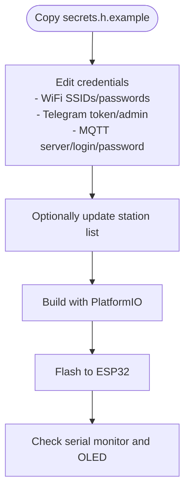

# Getting Started

<cite>
**Referenced Files in This Document**
- [README.md](file://README.md)
- [README.md](file://WebRadio_ESP32_S3/README.md)
- [README.md](file://WebRadio_ESP32_S3/README.ru.md)
- [platformio.ini](file://WebRadio_ESP32_S3/platformio.ini)
- [secrets.h.example](file://WebRadio_ESP32_S3/src/secrets.h.example)
- [main.cpp](file://WebRadio_ESP32_S3/src/main.cpp)
- [README.md](file://WebRadio_android/README.md)
- [Secrets.kt.example](file://WebRadio_android/app/src/main/java/com/dip16/webradio/Secrets.kt.example)
- [README.md](file://WebRadio_web/README.md)
- [README.md](file://WebRadio_web/README.ru.md)
- [.env.example](file://WebRadio_web/.env.example)
- [package.json](file://WebRadio_web/package.json)
- [docker-compose.yml](file://WebRadio_web/docker-compose.yml)
- [Dockerfile](file://WebRadio_web/Dockerfile)
- [README.md](file://WebRadio_python_utils/README.md)
- [README.md](file://WebRadio_python_utils/README.ru.md)
</cite>

## Table of Contents
1. [Introduction](#introduction)
2. [Prerequisites and Supported Platforms](#prerequisites-and-supported-platforms)
3. [System Architecture Overview](#system-architecture-overview)
4. [Step-by-Step Installation](#step-by-step-installation)
5. [Initial Configuration](#initial-configuration)
6. [Verification Checklist](#verification-checklist)
7. [Troubleshooting Guide](#troubleshooting-guide)
8. [User Scenarios and Tailored Guidance](#user-scenarios-and-tailored-guidance)
9. [Performance Considerations](#performance-considerations)
10. [Conclusion](#conclusion)

## Introduction
This guide helps you set up the complete WebRadio ecosystem: an ESP32-based hardware radio, an Android remote, a web interface, and supporting utilities. The system uses MQTT for control and status exchange, with optional Telegram integration for diagnostics and OTA updates.

Key capabilities:
- Play internet radio streams and display metadata on an OLED
- Control via physical buttons, MQTT, and Telegram
- Manage alarms and sleep timers
- Operate from Android or any modern web browser

## Prerequisites and Supported Platforms
- Operating systems
  - Windows, macOS, Linux for development and utilities
  - Android 8+ for the mobile app
  - Modern web browsers for the web interface
- Network
  - Local network with an MQTT broker reachable by all components
- Hardware (for builders)
  - ESP32 board (Wrover recommended), I2S DAC, SSD1306 OLED, tactile buttons, optional relays and FM transmitter
- Software
  - PlatformIO for ESP32 firmware
  - Android Studio for the Android app
  - Node.js and npm for the web interface
  - Python and VLC for utilities (optional)

**Section sources**
- [README.md:11-113](file://README.md#L11-L113)
- [README.md:3-127](file://WebRadio_ESP32_S3/README.md#L3-L127)
- [README.md:21-75](file://WebRadio_web/README.md#L21-L75)
- [README.md:1-43](file://WebRadio_python_utils/README.md#L1-L43)

## System Architecture Overview
The components communicate over your local network using MQTT. The Android app and web interface publish commands to MQTT topics; the ESP32 firmware subscribes and executes actions, publishing status updates back to MQTT topics that the clients subscribe to.

```mermaid
graph TB
subgraph "User Interfaces"
A["Android App"]
B["Web Browser"]
end
subgraph "Backend"
C["Web Server (Node.js)"]
D["MQTT Broker"]
end
subgraph "Hardware"
E["ESP32 Radio"]
end
A <- --> |"MQTT"| D
B <- --> |"HTTP/WebSocket"| C
C <- --> |"MQTT"| D
E <- --> |"MQTT"| D
```

**Diagram sources**
- [README.md:65-91](file://README.md#L65-L91)

**Section sources**
- [README.md:61-91](file://README.md#L61-L91)

## Step-by-Step Installation

### 1) Set up an MQTT Broker
Choose a device on your LAN (e.g., a PC, Raspberry Pi, or VM) to host the broker. The project supports anonymous or password-protected brokers. Ensure the broker is reachable from all devices.

- Recommended broker: Mosquitto
- Ports: 1883 (unencrypted) or 8883 (TLS)
- Verify accessibility: ping/resolve hostname and telnet/nc to port 1883/8883

**Section sources**
- [README.md:96](file://README.md#L96)

### 2) Build and Flash the ESP32 Firmware
- Install prerequisites
  - Visual Studio Code with PlatformIO IDE extension
  - Git
- Clone the repository and open the ESP32 project
- Configure secrets and station list
- Build and upload using PlatformIO

Steps:
- Copy the example secrets file to the secrets file and edit credentials
- Optionally adjust station list in the firmware source
- Build and upload via PlatformIO

Verification:
- Serial monitor shows boot logs and WiFi/MQTT connection attempts
- OLED displays initial status and WiFi RSSI

**Section sources**
- [README.md:97-100](file://README.md#L97-L100)
- [README.md:120-127](file://WebRadio_ESP32_S3/README.md#L120-L127)
- [platformio.ini:14-44](file://WebRadio_ESP32_S3/platformio.ini#L14-L44)
- [secrets.h.example:10-32](file://WebRadio_ESP32_S3/src/secrets.h.example#L10-L32)
- [main.cpp:141-200](file://WebRadio_ESP32_S3/src/main.cpp#L141-L200)

### 3) Set up the Android App
- Open the Android project in Android Studio
- Create the secrets file with your MQTT broker details
- Build and install the app on your device

Verification:
- App connects to MQTT and subscribes to status topics
- UI reflects current station, volume, and state

**Section sources**
- [README.md:102-105](file://README.md#L102-L105)
- [README.md:29-59](file://WebRadio_android/README.md#L29-L59)
- [Secrets.kt.example:8-12](file://WebRadio_android/app/src/main/java/com/dip16/webradio/Secrets.kt.example#L8-L12)

### 4) Set up the Web Interface
- Navigate to the web project directory
- Install dependencies
- Create and configure the environment file
- Start the server

Docker option:
- Use Docker Compose to build and run the service
- Traefik labels included for reverse-proxy routing

Verification:
- Visit the configured URL and enter the secret token when prompted
- WebSocket connects and receives status updates

**Section sources**
- [README.md:106-110](file://README.md#L106-L110)
- [README.md:21-58](file://WebRadio_web/README.md#L21-L58)
- [.env.example:1-3](file://WebRadio_web/.env.example#L1-L3)
- [package.json:15-24](file://WebRadio_web/package.json#L15-L24)
- [docker-compose.yml:4-21](file://WebRadio_web/docker-compose.yml#L4-L21)
- [Dockerfile:1-28](file://WebRadio_web/Dockerfile#L1-L28)

## Initial Configuration

### ESP32 Firmware
- Create secrets file from the example and fill in:
  - WiFi SSID/password arrays
  - Telegram bot token and admin chat ID (optional)
  - MQTT broker server, login, and password
- Adjust station list in the firmware source if desired
- Build and flash via PlatformIO



**Diagram sources**
- [secrets.h.example:10-32](file://WebRadio_ESP32_S3/src/secrets.h.example#L10-L32)
- [main.cpp:141-200](file://WebRadio_ESP32_S3/src/main.cpp#L141-L200)
- [platformio.ini:14-44](file://WebRadio_ESP32_S3/platformio.ini#L14-L44)

**Section sources**
- [README.md:70-80](file://WebRadio_ESP32_S3/README.md#L70-L80)
- [secrets.h.example:10-32](file://WebRadio_ESP32_S3/src/secrets.h.example#L10-L32)
- [main.cpp:141-200](file://WebRadio_ESP32_S3/src/main.cpp#L141-L200)

### Android App
- Create the secrets file under the app’s Java source tree
- Fill in MQTT broker URL, login, and password
- Build and install

**Section sources**
- [README.md:37-56](file://WebRadio_android/README.md#L37-L56)
- [Secrets.kt.example:8-12](file://WebRadio_android/app/src/main/java/com/dip16/webradio/Secrets.kt.example#L8-L12)

### Web Interface
- Copy the example environment file and set:
  - Secret token
  - MQTT broker URL and credentials
- Install dependencies and start the server
- Or use Docker Compose to run in a container

**Section sources**
- [README.md:33-51](file://WebRadio_web/README.md#L33-L51)
- [.env.example:1-3](file://WebRadio_web/.env.example#L1-L3)
- [package.json:15-24](file://WebRadio_web/package.json#L15-L24)
- [docker-compose.yml:4-21](file://WebRadio_web/docker-compose.yml#L4-L21)

## Verification Checklist
- MQTT broker is reachable from all devices
- ESP32 connects to WiFi and MQTT; OLED shows status
- Android app subscribes to status topics and displays current station/volume/state
- Web interface loads, prompts for secret token, and shows live status
- Publishing a command (e.g., change station or volume) triggers visible changes
- Logs indicate successful message routing on MQTT topics

**Section sources**
- [README.md:92-113](file://README.md#L92-L113)
- [README.md:61-91](file://README.md#L61-L91)

## Troubleshooting Guide
- No WiFi connection on ESP32
  - Confirm SSID/password arrays are correct
  - Ensure the AP is broadcasting and reachable
- MQTT authentication fails
  - Verify broker URL, login, and password
  - Test with a generic MQTT client
- Android app cannot connect
  - Confirm broker reachability from the device
  - Check firewall and network ACLs
- Web interface prompts for token repeatedly
  - Ensure the token matches the environment configuration
  - Clear browser credentials and retry
- No status updates in UI
  - Confirm topic subscriptions and device radioName match
  - Check broker permissions and retained messages behavior
- OTA or Telegram not working
  - Validate Telegram token and admin chat ID
  - Ensure the device can reach the broker and internet

**Section sources**
- [README.md:92-113](file://README.md#L92-L113)
- [README.md:61-91](file://README.md#L61-L91)
- [README.md:37-59](file://WebRadio_android/README.md#L37-L59)
- [README.md:33-58](file://WebRadio_web/README.md#L33-L58)

## User Scenarios and Tailored Guidance

### Hardware Builders
- Focus on:
  - Correct wiring of I2S DAC, OLED, and buttons
  - Using the correct environment in PlatformIO (Wrover vs WROOM)
  - Testing audio path and display before integrating MQTT
- Tips:
  - Use the serial monitor during early builds
  - Keep station list minimal until connectivity is verified

**Section sources**
- [README.md:30-55](file://WebRadio_ESP32_S3/README.md#L30-L55)
- [platformio.ini:14-44](file://WebRadio_ESP32_S3/platformio.ini#L14-L44)

### Software Developers
- Focus on:
  - MQTT topic contracts and payloads
  - Extending station lists and adding new controls
  - Integrating with CI/CD and containerized deployments
- Tips:
  - Use Docker Compose for repeatable environments
  - Leverage the Telegram bot for diagnostics and OTA updates

**Section sources**
- [README.md:61-91](file://README.md#L61-L91)
- [README.md:14-28](file://WebRadio_web/README.md#L14-L28)
- [README.md:113-127](file://WebRadio_ESP32_S3/README.md#L113-L127)

### Educators
- Focus on:
  - Demonstrating MQTT messaging patterns
  - Building station lists collaboratively
  - Exploring Python utilities for playlist management
- Tips:
  - Use the Python utilities to curate and sort station lists
  - Introduce students to Docker basics via the web interface deployment

**Section sources**
- [README.md:51-60](file://README.md#L51-L60)
- [README.md:24-48](file://WebRadio_web/README.md#L24-L48)
- [README.md:1-43](file://WebRadio_python_utils/README.md#L1-L43)

## Performance Considerations
- Network stability
  - Ensure low-latency, reliable WiFi for smooth audio and responsive controls
- MQTT load
  - Avoid excessive status publishes; respect update intervals
- Audio quality
  - Use appropriate I2S settings and a quality DAC
- Containerization
  - Run the web interface in Docker for isolation and reproducibility

[No sources needed since this section provides general guidance]

## Conclusion
You now have the essentials to deploy a complete WebRadio system. Start with the MQTT broker, flash the ESP32 firmware, and then bring up the Android app and web interface. Use the verification checklist to confirm connectivity and functionality. For deeper customization, explore the Python utilities and containerized deployment options.

[No sources needed since this section summarizes without analyzing specific files]