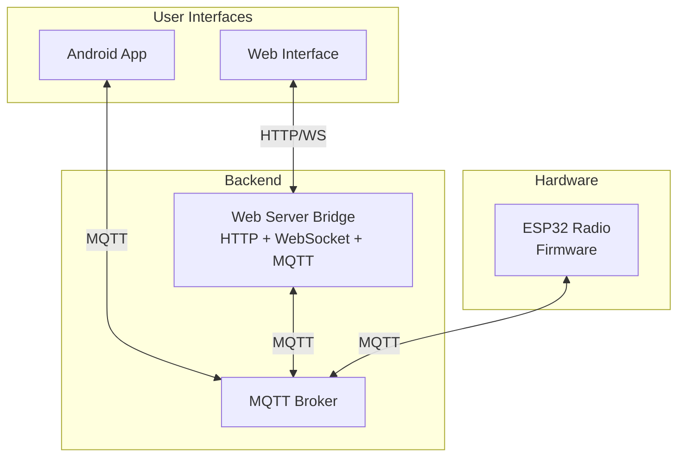
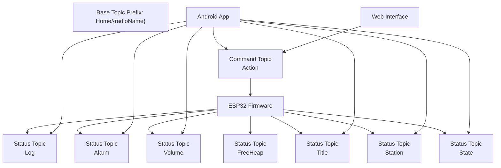
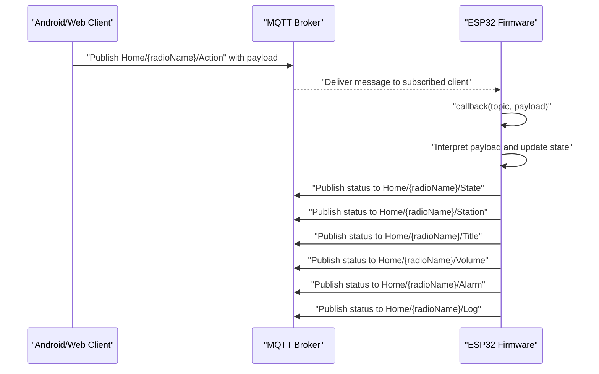
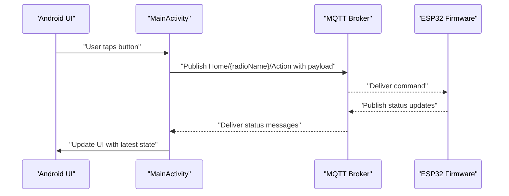
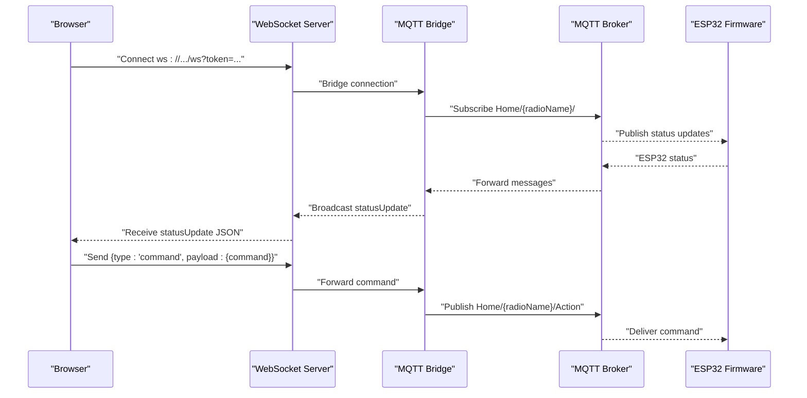
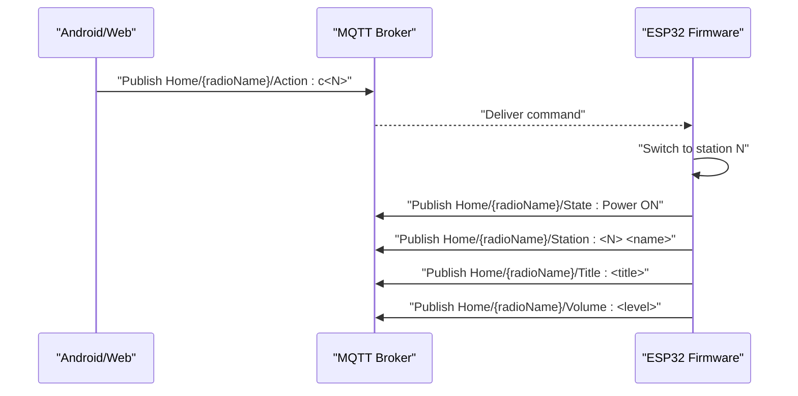
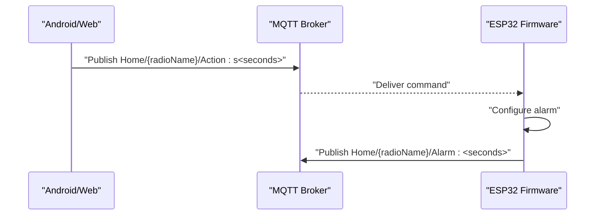
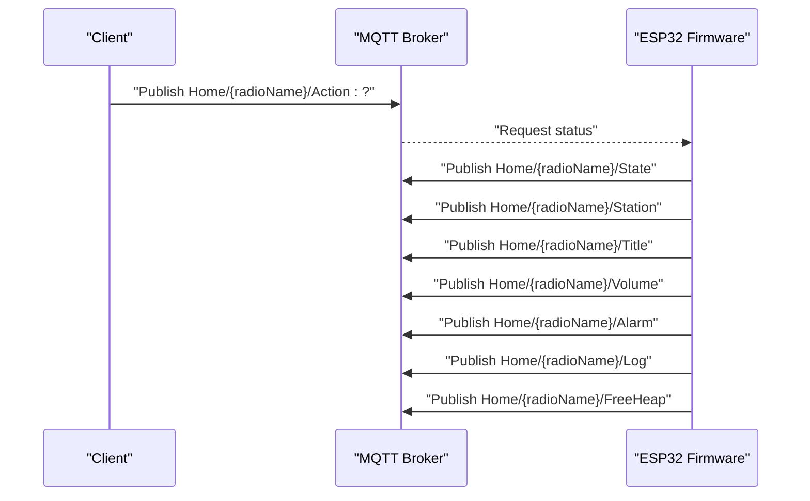
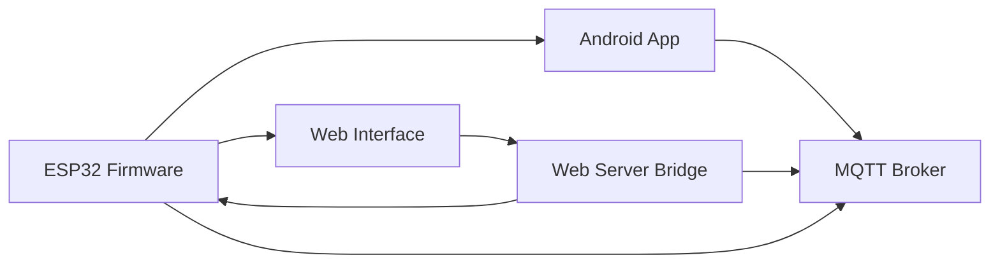

# MQTT Protocol & Topics

<cite>
**Referenced Files in This Document**
- [main.cpp](file://WebRadio_ESP32_S3/src/main.cpp)
- [secrets.h](file://WebRadio_ESP32_S3/src/secrets.h)
- [platformio.ini](file://WebRadio_ESP32_S3/platformio.ini)
- [MainActivity.kt](file://WebRadio_android/app/src/main/java/com/dip16/webradio/MainActivity.kt)
- [Secrets.kt](file://WebRadio_android/app/src/main/java/com/dip16/webradio/Secrets.kt)
- [server.js](file://WebRadio_web/server.js)
- [app.js](file://WebRadio_web/public/app.js)
- [index.html](file://WebRadio_web/public/index.html)
- [package.json](file://WebRadio_web/package.json)
- [README.md](file://README.md)
- [README.md](file://WebRadio_ESP32_S3/README.md)
- [README.md](file://WebRadio_android/README.md)
- [README.md](file://WebRadio_web/README.md)
</cite>

## Table of Contents
1. [Introduction](#introduction)
2. [Project Structure](#project-structure)
3. [Core Components](#core-components)
4. [Architecture Overview](#architecture-overview)
5. [Detailed Component Analysis](#detailed-component-analysis)
6. [Dependency Analysis](#dependency-analysis)
7. [Performance Considerations](#performance-considerations)
8. [Troubleshooting Guide](#troubleshooting-guide)
9. [Conclusion](#conclusion)
10. [Appendices](#appendices)

## Introduction
This document defines the MQTT protocol and topic hierarchy used by the WebRadio system. It covers the complete topic tree, message formats, and communication patterns among the ESP32 hardware, Android app, and web interface. It also documents command topics for controlling the radio (station changes, volume control, power management), status topics for real-time updates, and alarm-related topics. Security, authentication, and access control are addressed, along with connection handling, reconnection logic, and error recovery. Examples of typical message exchanges illustrate common operations such as changing stations, setting alarms, and monitoring status.

## Project Structure
The WebRadio system consists of:
- ESP32 hardware radio (firmware) publishing and subscribing to MQTT topics
- Android app sending commands and receiving status updates via MQTT
- Web interface sending commands via HTTP and receiving real-time status via WebSocket bridged from MQTT
- Central MQTT broker routing messages between components

**Diagram sources**
- [README.md:65-85](file://README.md#L65-L85)
- [server.js:48-97](file://WebRadio_web/server.js#L48-L97)
- [MainActivity.kt:171-246](file://WebRadio_android/app/src/main/java/com/dip16/webradio/MainActivity.kt#L171-L246)
- [main.cpp:275-650](file://WebRadio_ESP32_S3/src/main.cpp#L275-L650)

**Section sources**
- [README.md:61-91](file://README.md#L61-L91)

## Core Components
- ESP32 firmware: Receives commands on the action topic and publishes status updates on multiple status topics. Implements reconnection logic and handles power, volume, station selection, and alarms.
- Android app: Publishes commands to the action topic and subscribes to status topics to reflect real-time state.
- Web interface: Bridges MQTT to WebSocket and exposes HTTP APIs for command submission; subscribes to status topics via the bridge.
- MQTT broker: Central message router for all components.

**Section sources**
- [README.md:89-112](file://WebRadio_ESP32_S3/README.md#L89-L112)
- [README.md:61-89](file://WebRadio_android/README.md#L61-L89)
- [README.md:14-19](file://WebRadio_web/README.md#L14-L19)

## Architecture Overview
The system uses a hierarchical topic structure under a base prefix. The ESP32 firmware supports two device identifiers (WebRadio1 and WebRadio2) depending on the build configuration. The Android app and web interface dynamically select the appropriate device identifier and publish/subscribe accordingly.

**Diagram sources**
- [main.cpp:33-53](file://WebRadio_ESP32_S3/src/main.cpp#L33-L53)
- [MainActivity.kt:257-264](file://WebRadio_android/app/src/main/java/com/dip16/webradio/MainActivity.kt#L257-L264)
- [server.js:58-97](file://WebRadio_web/server.js#L58-L97)

## Detailed Component Analysis

### Topic Hierarchy and Base Prefix
- Base prefix: Home/{radioName}
- {radioName} is either WebRadio1 or WebRadio2 depending on the build configuration (macro ESP_WROVER).
- The Android app and web interface dynamically select the radioName and adjust subscriptions/publishes accordingly.

**Section sources**
- [main.cpp:33-53](file://WebRadio_ESP32_S3/src/main.cpp#L33-L53)
- [platformio.ini:14-31](file://WebRadio_ESP32_S3/platformio.ini#L14-L31)
- [MainActivity.kt:82-85](file://WebRadio_android/app/src/main/java/com/dip16/webradio/MainActivity.kt#L82-L85)
- [server.js:38-38](file://WebRadio_web/server.js#L38-L38)

### Command Topics (Publish by Clients, Subscribe by ESP32)
- Topic: Home/{radioName}/Action
- Payloads:
  - ?: Request current status
  - 1 / 0: Turn on / off
  - b1 / b2 / b3 / b4: Emulate button presses for Power / Sleep / CH+ / CH-
  - vol+ / vol-: Increase / decrease volume
  - c<N>: Turn on and switch to station number N
  - h<url>: Play stream from the specified URL
  - s<seconds>: Set alarm (seconds from midnight)
  - sAlarm OFF: Disable alarm

Notes:
- The ESP32 firmware interprets payloads character-by-character for certain commands (e.g., 'c' for channel, 'h' for URL, 's' for alarm).
- The Android app sends payloads such as "b1", "b2", "b3", "b4", "vol+", "vol-", "s<seconds>", and "sAlarm OFF".
- The web interface sends payloads such as "b1", "vol-", "vol+", "b4", "b3", "b2", and "s<seconds>".

**Section sources**
- [main.cpp:295-649](file://WebRadio_ESP32_S3/src/main.cpp#L295-L649)
- [README.md:93-102](file://WebRadio_ESP32_S3/README.md#L93-L102)
- [README.md:67-78](file://WebRadio_android/README.md#L67-L78)
- [app.js:264-288](file://WebRadio_web/public/app.js#L264-L288)

### Status Topics (Published by ESP32, Subscribed by Clients)
- Topic: Home/{radioName}/State
  - Payload: "Power ON", "Power OFF", "ON SLEEP"
- Topic: Home/{radioName}/Station
  - Payload: "<channel_number> <station_name>"
- Topic: Home/{radioName}/Title
  - Payload: Current track title (empty if unknown)
- Topic: Home/{radioName}/Volume
  - Payload: Integer string representing volume level (0–21)
- Topic: Home/{radioName}/Alarm
  - Payload: Seconds from midnight (e.g., 19800 for 5:30 AM) or "Alarm OFF"
- Topic: Home/{radioName}/Log
  - Payload: General messages and audio stream information
- Topic: Home/{radioName}/FreeHeap
  - Payload: Free heap memory (integer string)

**Section sources**
- [main.cpp:303-360](file://WebRadio_ESP32_S3/src/main.cpp#L303-L360)
- [README.md:104-111](file://WebRadio_ESP32_S3/README.md#L104-L111)
- [MainActivity.kt:268-296](file://WebRadio_android/app/src/main/java/com/dip16/webradio/MainActivity.kt#L268-L296)

### Message Formats and Payload Encoding Standards
- Payloads are UTF-8 encoded strings.
- Numeric values are transmitted as ASCII decimal strings (e.g., "12" for volume 12).
- Time values for alarms are integers representing seconds from midnight.
- Station payloads combine channel number and station name separated by a space.

**Section sources**
- [main.cpp:308-308](file://WebRadio_ESP32_S3/src/main.cpp#L308-L308)
- [MainActivity.kt:298-310](file://WebRadio_android/app/src/main/java/com/dip16/webradio/MainActivity.kt#L298-L310)

### Client Implementations

#### ESP32 Firmware (Arduino/PubSubClient)
- Connects to MQTT broker using credentials from secrets.h.
- Subscribes to Home/{radioName}/Action.
- Publishes to multiple status topics (State, Station, Title, Volume, Alarm, Log, FreeHeap).
- Implements reconnection logic with exponential backoff-like retries.
- Handles incoming commands in the MQTT callback and updates hardware state accordingly.

**Diagram sources**
- [main.cpp:275-650](file://WebRadio_ESP32_S3/src/main.cpp#L275-L650)
- [secrets.h:20-23](file://WebRadio_ESP32_S3/src/secrets.h#L20-L23)

**Section sources**
- [main.cpp:652-690](file://WebRadio_ESP32_S3/src/main.cpp#L652-L690)
- [secrets.h:20-23](file://WebRadio_ESP32_S3/src/secrets.h#L20-L23)

#### Android App (Paho MQTT Client)
- Connects to MQTT broker using credentials from Secrets.kt.
- Subscribes to Home/{radioName}/State, Home/{radioName}/Station, Home/{radioName}/Title, Home/{radioName}/Volume, Home/{radioName}/Alarm, Home/{radioName}/Log.
- Publishes to Home/{radioName}/Action with payloads such as "b1", "b2", "b3", "b4", "vol+", "vol-", "s<seconds>", "sAlarm OFF", and station URLs.
- Manages connection lifecycle with manual reconnect logic when the app resumes.

**Diagram sources**
- [MainActivity.kt:171-246](file://WebRadio_android/app/src/main/java/com/dip16/webradio/MainActivity.kt#L171-L246)
- [MainActivity.kt:257-316](file://WebRadio_android/app/src/main/java/com/dip16/webradio/MainActivity.kt#L257-L316)
- [Secrets.kt:8-11](file://WebRadio_android/app/src/main/java/com/dip16/webradio/Secrets.kt#L8-L11)

**Section sources**
- [MainActivity.kt:171-246](file://WebRadio_android/app/src/main/java/com/dip16/webradio/MainActivity.kt#L171-L246)
- [README.md:61-89](file://WebRadio_android/README.md#L61-L89)

#### Web Interface (HTTP + WebSocket + MQTT Bridge)
- The web server bridges MQTT to WebSocket and exposes HTTP APIs.
- Subscribes to Home/{radioName}/# to receive all status updates.
- Provides HTTP endpoints under /api/radio for station, volume, power, alarm, and generic command posting.
- WebSocket clients authenticate using a secret token and receive real-time status updates.

**Diagram sources**
- [server.js:48-97](file://WebRadio_web/server.js#L48-L97)
- [server.js:224-260](file://WebRadio_web/server.js#L224-L260)
- [app.js:123-178](file://WebRadio_web/public/app.js#L123-L178)

**Section sources**
- [server.js:48-97](file://WebRadio_web/server.js#L48-L97)
- [README.md:14-19](file://WebRadio_web/README.md#L14-L19)

### Typical Message Exchanges

#### Changing Stations
- From Android or Web:
  - Publish "c<N>" to Home/{radioName}/Action where N is the station number.
  - ESP32 responds by publishing updated State, Station, Title, and Volume.

**Diagram sources**
- [main.cpp:497-526](file://WebRadio_ESP32_S3/src/main.cpp#L497-L526)
- [README.md:99-99](file://WebRadio_ESP32_S3/README.md#L99-L99)

#### Setting Alarms
- From Android or Web:
  - Publish "s<seconds>" to Home/{radioName}/Action where seconds is the time from midnight.
  - ESP32 publishes Alarm status reflecting the new setting.

**Diagram sources**
- [main.cpp:542-626](file://WebRadio_ESP32_S3/src/main.cpp#L542-L626)
- [app.js:271-282](file://WebRadio_web/public/app.js#L271-L282)

#### Monitoring Status
- Client publishes "?" to Home/{radioName}/Action to request status.
- ESP32 replies with State, Station, Title, Volume, Alarm, Log, and FreeHeap.

**Diagram sources**
- [main.cpp:301-360](file://WebRadio_ESP32_S3/src/main.cpp#L301-L360)

### Connection Handling, Reconnection Logic, and Error Recovery
- ESP32:
  - Attempts to connect to MQTT with credentials from secrets.h.
  - Retries up to a fixed number of attempts with delays between attempts.
  - Subscribes to the action topic upon successful connection.
- Android:
  - Uses Paho MQTT client with manual reconnect logic when the app resumes.
  - Subscribes to status topics after successful connection.
- Web:
  - The bridge subscribes to all status topics under the base prefix.
  - WebSocket clients reconnect automatically with a fixed interval.
  - HTTP API endpoints are protected by a secret token.

**Section sources**
- [main.cpp:652-690](file://WebRadio_ESP32_S3/src/main.cpp#L652-L690)
- [MainActivity.kt:171-246](file://WebRadio_android/app/src/main/java/com/dip16/webradio/MainActivity.kt#L171-L246)
- [server.js:56-80](file://WebRadio_web/server.js#L56-L80)
- [app.js:139-178](file://WebRadio_web/public/app.js#L139-L178)

### Security, Authentication, and Access Control
- ESP32 credentials:
  - MQTT_SERVER, MQTT_LOGIN, MQTT_PASS are defined in secrets.h.
- Android credentials:
  - MQTT_BROKER_URL, MQTT_LOGIN, MQTT_PASSWORD are defined in Secrets.kt.
- Web interface:
  - SECRET_TOKEN is required for WebSocket and HTTP API access.
  - The server enforces token-based authentication for API routes.
  - Helmet is used to set security headers for the web server.

**Section sources**
- [secrets.h:20-23](file://WebRadio_ESP32_S3/src/secrets.h#L20-L23)
- [Secrets.kt:8-11](file://WebRadio_android/app/src/main/java/com/dip16/webradio/Secrets.kt#L8-L11)
- [server.js:34-45](file://WebRadio_web/server.js#L34-L45)
- [server.js:102-113](file://WebRadio_web/server.js#L102-L113)
- [README.md:69-75](file://WebRadio_web/README.md#L69-L75)

### Performance Optimization, Message Queuing, and Network Reliability
- ESP32:
  - Uses PubSubClient with clean session and manual reconnection.
  - Publishes status updates at intervals to balance responsiveness and bandwidth.
- Android:
  - Uses Paho MQTT client; automatic reconnect disabled to allow manual control.
- Web:
  - WebSocket provides efficient real-time updates.
  - HTTP API endpoints validate payloads and respond with structured JSON.
  - Rate limiting is applied to API endpoints to prevent abuse.

**Section sources**
- [MainActivity.kt:180-187](file://WebRadio_android/app/src/main/java/com/dip16/webradio/MainActivity.kt#L180-L187)
- [server.js:20-29](file://WebRadio_web/server.js#L20-L29)
- [server.js:123-134](file://WebRadio_web/server.js#L123-L134)

## Dependency Analysis
The following diagram shows the primary dependencies among components and their MQTT interactions.

**Diagram sources**
- [README.md:65-85](file://README.md#L65-L85)
- [server.js:48-66](file://WebRadio_web/server.js#L48-L66)
- [MainActivity.kt:171-246](file://WebRadio_android/app/src/main/java/com/dip16/webradio/MainActivity.kt#L171-L246)
- [main.cpp:275-650](file://WebRadio_ESP32_S3/src/main.cpp#L275-L650)

**Section sources**
- [package.json:15-24](file://WebRadio_web/package.json#L15-L24)

## Performance Considerations
- Keep payloads minimal (strings for commands, numeric strings for volumes).
- Use appropriate QoS levels if needed; current implementation does not specify QoS.
- Avoid excessive status publishes; ESP32 already limits update intervals.
- Ensure reliable network connectivity and consider broker clustering for high availability.

## Troubleshooting Guide
Common issues and resolutions:
- Connection failures:
  - Verify MQTT credentials and broker URL in secrets.h and Secrets.kt.
  - Confirm the broker is reachable from the device/network.
- No status updates:
  - Ensure the client subscribes to the correct base topic prefix and radioName.
  - Trigger a status request by publishing "?" to Home/{radioName}/Action.
- Alarm not setting:
  - Confirm payload format "s<seconds>" and that seconds are within 0–86400.
- Web interface authentication:
  - Enter the SECRET_TOKEN when prompted by the browser.
  - Ensure the token matches the server configuration.

**Section sources**
- [secrets.h:20-23](file://WebRadio_ESP32_S3/src/secrets.h#L20-L23)
- [Secrets.kt:8-11](file://WebRadio_android/app/src/main/java/com/dip16/webradio/Secrets.kt#L8-L11)
- [server.js:102-113](file://WebRadio_web/server.js#L102-L113)
- [app.js:123-137](file://WebRadio_web/public/app.js#L123-L137)

## Conclusion
The WebRadio system implements a robust MQTT-based control plane with clear topic semantics and consistent payload formats. The ESP32 firmware, Android app, and web interface integrate seamlessly through a shared MQTT broker, enabling reliable remote control and real-time status monitoring. Security is strengthened through credential management and token-based access for the web interface. Proper connection handling and reconnection logic ensure resilience across network interruptions.

## Appendices

### Appendix A: Complete Topic Reference
- Base: Home/{radioName}
- Commands:
  - Home/{radioName}/Action
- Status:
  - Home/{radioName}/State
  - Home/{radioName}/Station
  - Home/{radioName}/Title
  - Home/{radioName}/Volume
  - Home/{radioName}/Alarm
  - Home/{radioName}/Log
  - Home/{radioName}/FreeHeap

**Section sources**
- [main.cpp:33-53](file://WebRadio_ESP32_S3/src/main.cpp#L33-L53)
- [README.md:104-111](file://WebRadio_ESP32_S3/README.md#L104-L111)
- [README.md:80-89](file://WebRadio_android/README.md#L80-L89)

### Appendix B: Client Configuration References
- ESP32 secrets.h:
  - MQTT_SERVER, MQTT_LOGIN, MQTT_PASS
- Android Secrets.kt:
  - MQTT_BROKER_URL, MQTT_LOGIN, MQTT_PASSWORD
- Web .env:
  - SECRET_TOKEN, MQTT_BROKER_URL, MQTT_USER, MQTT_PASSWORD

**Section sources**
- [secrets.h:20-23](file://WebRadio_ESP32_S3/src/secrets.h#L20-L23)
- [Secrets.kt:8-11](file://WebRadio_android/app/src/main/java/com/dip16/webradio/Secrets.kt#L8-L11)
- [README.md:40-51](file://WebRadio_web/README.md#L40-L51)