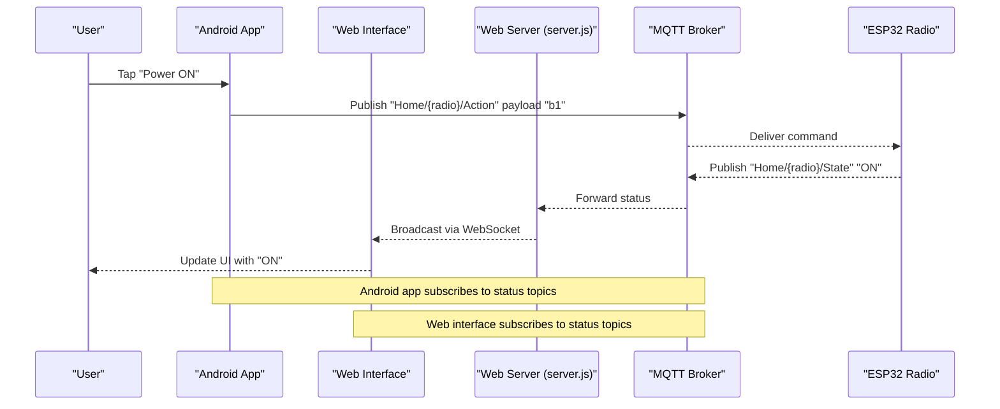
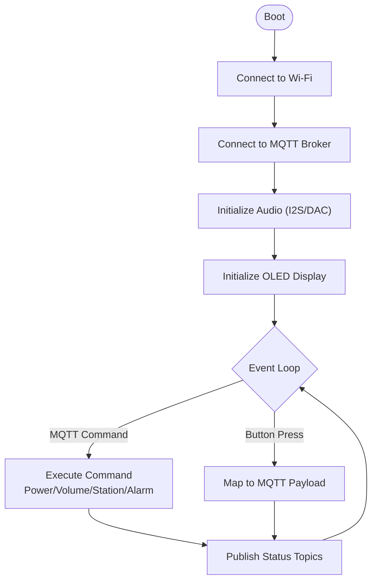
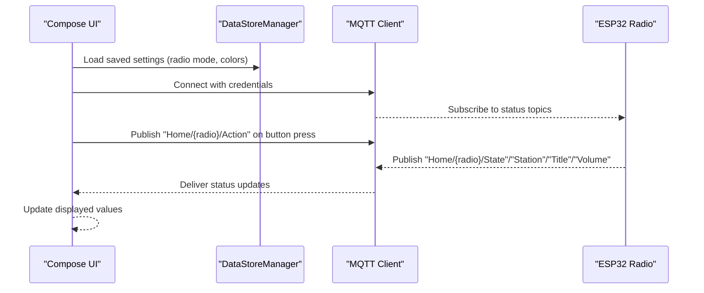
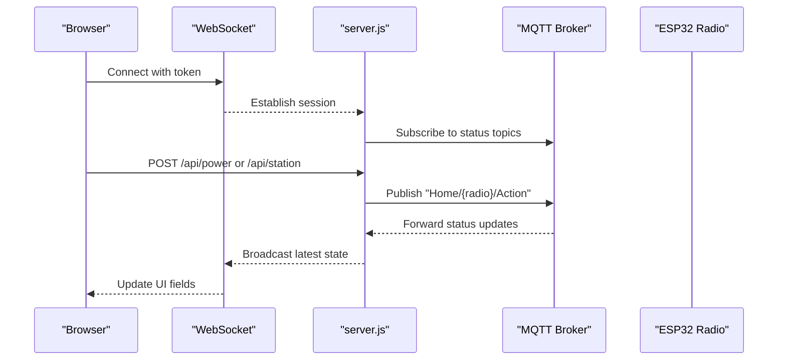
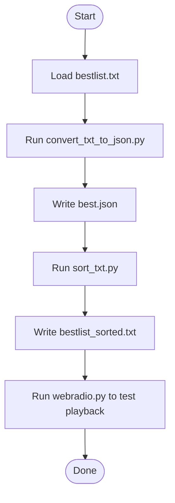
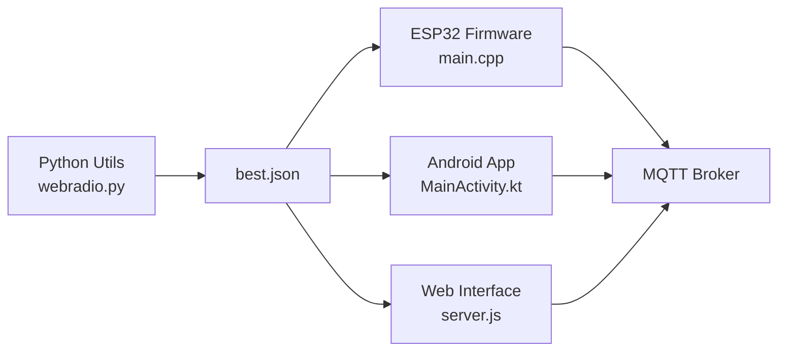

# Component Introductions

<cite>
**Referenced Files in This Document**
- [README.md](file://README.md)
- [README.md](file://WebRadio_ESP32_S3/README.md)
- [README.md](file://WebRadio_android/README.md)
- [README.md](file://WebRadio_web/README.md)
- [README.md](file://WebRadio_python_utils/README.md)
- [main.cpp](file://WebRadio_ESP32_S3/src/main.cpp)
- [server.js](file://WebRadio_web/server.js)
- [index.html](file://WebRadio_web/public/index.html)
- [MainActivity.kt](file://WebRadio_android/app/src/main/java/com/dip16/webradio/MainActivity.kt)
- [DataStoreManager.kt](file://WebRadio_android/app/src/main/java/com/dip16/webradio/DataStoreManager.kt)
- [webradio.py](file://WebRadio_python_utils/webradio.py)
- [convert_txt_to_json.py](file://WebRadio_python_utils/convert_txt_to_json.py)
- [best.json](file://WebRadio_python_utils/best.json)
- [bestlist_sorted.txt](file://WebRadio_ESP32_S3/bestlist_sorted.txt)
</cite>

## Table of Contents
1. [Introduction](#introduction)
2. [Project Structure](#project-structure)
3. [Core Components](#core-components)
4. [Architecture Overview](#architecture-overview)
5. [Detailed Component Analysis](#detailed-component-analysis)
6. [Dependency Analysis](#dependency-analysis)
7. [Performance Considerations](#performance-considerations)
8. [Troubleshooting Guide](#troubleshooting-guide)
9. [Conclusion](#conclusion)
10. [Appendices](#appendices)

## Introduction
This document introduces the four main components of the WebRadio IoT project and explains how they work together to deliver a complete, local-network-controlled internet radio system. Each component targets different user needs and technical backgrounds:
- ESP32 firmware: the embedded, hardware-centric player with audio streaming, display, and physical controls
- Android application: a modern, native remote with real-time status and intuitive controls
- Web interface: a browser-based remote with real-time controls and responsive design
- Python utilities: station list management tools for organizing and validating radio sources

These components share a common communication backbone: an MQTT broker for device control and status updates, with the web interface bridging HTTP and WebSocket traffic to MQTT.

## Project Structure
The repository is organized into four top-level components, each with its own README, source code, and configuration assets. The system’s control plane relies on MQTT topics for bidirectional communication between user interfaces and the ESP32 device.

```mermaid
graph TB
subgraph "User Interfaces"
ANDR["Android App<br/>Jetpack Compose UI"]
WEB["Web Interface<br/>HTML/CSS/JS + WebSocket"]
end
subgraph "Backend"
BRK["MQTT Broker"]
HTTP["Web Server<br/>Express + WebSocket Bridge"]
end
subgraph "Hardware"
ESP["ESP32 Radio<br/>Audio + Display + Buttons"]
end
ANDR <- --> BRK
WEB <- --> HTTP
HTTP <- --> BRK
ESP <- --> BRK
```

**Diagram sources**
- [README.md:65-91](file://README.md#L65-L91)
- [server.js:33-97](file://WebRadio_web/server.js#L33-L97)
- [main.cpp:33-53](file://WebRadio_ESP32_S3/src/main.cpp#L33-L53)

**Section sources**
- [README.md:7-113](file://README.md#L7-L113)

## Core Components
Below is a concise overview of each component, highlighting unique features, capabilities, and complementary roles.

- ESP32 Firmware
  - Streams internet radio via I2S DAC, displays status on an SSD1306 OLED, and supports physical buttons for power, sleep, and station selection.
  - Remote control via MQTT and optional Telegram bot for status and OTA updates.
  - Alarms and sleep timer with persistent storage; robust reconnection logic for WiFi and audio streams.
  - Topics vary by device variant (WebRadio1/WebRadio2) to support multiple radios.

- Android Application
  - Native Android app with Jetpack Compose UI, real-time status display, and MQTT-based control.
  - Manages presets, volume, power, sleep, and alarms; persists user preferences with DataStore.
  - Multi-device support to control different radios by name.

- Web Interface
  - Browser-based remote with real-time status and controls; responsive layout for desktop and mobile.
  - Uses Express.js and WebSocket to bridge HTTP requests to MQTT, with token-based authentication and security headers.

- Python Utilities
  - Command-line player using VLC for testing and development.
  - Tools to convert plain station lists to JSON and to sort/remove duplicates, enabling reliable station catalogs for all players.

**Section sources**
- [README.md:7-29](file://WebRadio_ESP32_S3/README.md#L7-L29)
- [README.md:7-15](file://WebRadio_android/README.md#L7-L15)
- [README.md:7-13](file://WebRadio_web/README.md#L7-L13)
- [README.md:7-43](file://WebRadio_python_utils/README.md#L7-L43)

## Architecture Overview
The system uses MQTT for lightweight, real-time messaging between user interfaces and the ESP32 device. The web server acts as a bridge, translating HTTP/WebSocket commands into MQTT publish actions and forwarding MQTT messages to connected clients.



**Diagram sources**
- [README.md:65-91](file://README.md#L65-L91)
- [server.js:84-97](file://WebRadio_web/server.js#L84-L97)
- [MainActivity.kt:171-200](file://WebRadio_android/app/src/main/java/com/dip16/webradio/MainActivity.kt#L171-L200)

**Section sources**
- [README.md:61-113](file://README.md#L61-L113)
- [server.js:33-97](file://WebRadio_web/server.js#L33-L97)
- [MainActivity.kt:171-200](file://WebRadio_android/app/src/main/java/com/dip16/webradio/MainActivity.kt#L171-L200)

## Detailed Component Analysis

### ESP32 Firmware
- Capabilities
  - Audio streaming via I2S DAC, OLED status display (station, title, volume, RSSI, state), and physical controls.
  - MQTT control and status publishing; Telegram bot for diagnostics and OTA updates.
  - Automation: alarms and sleep timer with non-volatile storage.
- User Interaction Patterns
  - Physical buttons emulate power, sleep, channel up/down, and volume adjustments.
  - MQTT topics carry commands and status; the device publishes state updates for UIs to consume.
- Learning Curve
  - Moderate for embedded programming; requires understanding of Arduino/PlatformIO, I2S/DAC wiring, and MQTT topic conventions.
- Starting Point
  - Recommended after assembling hardware and installing PlatformIO; begin with the included station list and secrets configuration.



**Diagram sources**
- [main.cpp:33-53](file://WebRadio_ESP32_S3/src/main.cpp#L33-L53)
- [main.cpp:141-200](file://WebRadio_ESP32_S3/src/main.cpp#L141-L200)

**Section sources**
- [README.md:7-29](file://WebRadio_ESP32_S3/README.md#L7-L29)
- [main.cpp:33-53](file://WebRadio_ESP32_S3/src/main.cpp#L33-L53)

### Android Application
- Capabilities
  - Real-time status display and control of power, volume, channels, and alarms.
  - Persistent settings via DataStore; multi-device selection.
- User Interaction Patterns
  - Tap buttons to send MQTT commands; dropdowns/selectors for presets and alarms.
  - Connection status shown; UI updates reactively to incoming MQTT messages.
- Learning Curve
  - Low to moderate for Kotlin/Jetpack Compose; primarily involves understanding MQTT topics and UI state management.
- Starting Point
  - Recommended for users who prefer native apps and want a polished mobile control experience.



**Diagram sources**
- [MainActivity.kt:102-133](file://WebRadio_android/app/src/main/java/com/dip16/webradio/MainActivity.kt#L102-L133)
- [DataStoreManager.kt:16-42](file://WebRadio_android/app/src/main/java/com/dip16/webradio/DataStoreManager.kt#L16-L42)
- [MainActivity.kt:171-200](file://WebRadio_android/app/src/main/java/com/dip16/webradio/MainActivity.kt#L171-L200)

**Section sources**
- [README.md:7-15](file://WebRadio_android/README.md#L7-L15)
- [DataStoreManager.kt:16-42](file://WebRadio_android/app/src/main/java/com/dip16/webradio/DataStoreManager.kt#L16-L42)
- [MainActivity.kt:171-200](file://WebRadio_android/app/src/main/java/com/dip16/webradio/MainActivity.kt#L171-L200)

### Web Interface
- Capabilities
  - Real-time status display and controls for power, volume, channels, and alarms.
  - Responsive design and token-protected API/WebSocket endpoints.
- User Interaction Patterns
  - Click buttons to send commands; select presets from a wheel; set alarms via time picker.
  - First-time access prompts for a secret token; subsequent visits auto-remember.
- Learning Curve
  - Low for end users; moderate for operators deploying with Docker and securing endpoints.
- Starting Point
  - Ideal for users who prefer browser-based control or need a quick remote without installing an app.



**Diagram sources**
- [index.html:18-56](file://WebRadio_web/public/index.html#L18-L56)
- [server.js:84-97](file://WebRadio_web/server.js#L84-L97)
- [server.js:115-200](file://WebRadio_web/server.js#L115-L200)

**Section sources**
- [README.md:7-13](file://WebRadio_web/README.md#L7-L13)
- [index.html:18-56](file://WebRadio_web/public/index.html#L18-L56)
- [server.js:33-97](file://WebRadio_web/server.js#L33-L97)

### Python Utilities
- Capabilities
  - webradio.py: CLI player using VLC to test and iterate on station lists.
  - convert_txt_to_json.py: Convert plain station URLs to JSON format for players.
  - sort_txt.py: Deduplicate and sort station lists for reliability.
- User Interaction Patterns
  - Run scripts from the command line; edit best.json or bestlist.txt as needed.
- Learning Curve
  - Very low; suitable for non-programmers managing station catalogs.
- Starting Point
  - Recommended when curating station lists or testing playback locally before integrating with the Android app or web interface.



**Diagram sources**
- [convert_txt_to_json.py:1-18](file://WebRadio_python_utils/convert_txt_to_json.py#L1-L18)
- [webradio.py:22-50](file://WebRadio_python_utils/webradio.py#L22-L50)
- [bestlist_sorted.txt:1-80](file://WebRadio_ESP32_S3/bestlist_sorted.txt#L1-L80)

**Section sources**
- [README.md:7-43](file://WebRadio_python_utils/README.md#L7-L43)
- [convert_txt_to_json.py:1-18](file://WebRadio_python_utils/convert_txt_to_json.py#L1-L18)
- [webradio.py:22-50](file://WebRadio_python_utils/webradio.py#L22-L50)
- [bestlist_sorted.txt:1-80](file://WebRadio_ESP32_S3/bestlist_sorted.txt#L1-L80)

## Dependency Analysis
The components are loosely coupled through MQTT and HTTP/WebSocket, enabling independent development and deployment. The ESP32 firmware depends on local libraries for audio, display, and MQTT; the Android app depends on the Paho MQTT client; the web interface depends on Express, WebSocket, and MQTT; and the Python utilities depend on VLC and JSON.



**Diagram sources**
- [main.cpp:33-53](file://WebRadio_ESP32_S3/src/main.cpp#L33-L53)
- [MainActivity.kt:171-200](file://WebRadio_android/app/src/main/java/com/dip16/webradio/MainActivity.kt#L171-L200)
- [server.js:33-97](file://WebRadio_web/server.js#L33-L97)
- [webradio.py:22-50](file://WebRadio_python_utils/webradio.py#L22-L50)
- [best.json:1-200](file://WebRadio_python_utils/best.json#L1-L200)

**Section sources**
- [README.md:61-113](file://README.md#L61-L113)
- [server.js:33-97](file://WebRadio_web/server.js#L33-L97)
- [MainActivity.kt:171-200](file://WebRadio_android/app/src/main/java/com/dip16/webradio/MainActivity.kt#L171-L200)
- [main.cpp:33-53](file://WebRadio_ESP32_S3/src/main.cpp#L33-L53)
- [webradio.py:22-50](file://WebRadio_python_utils/webradio.py#L22-L50)
- [best.json:1-200](file://WebRadio_python_utils/best.json#L1-L200)

## Performance Considerations
- MQTT overhead is minimal for control messages; ensure the broker is on the same LAN for low latency.
- Audio streaming quality depends on network stability; the ESP32 firmware handles reconnections gracefully.
- The web interface uses WebSocket for real-time updates; token protection prevents abuse.
- Python utilities are lightweight; JSON parsing scales with list size but remains fast for typical station catalogs.

[No sources needed since this section provides general guidance]

## Troubleshooting Guide
- MQTT connectivity
  - Verify broker URL, credentials, and firewall settings; check subscription logs on the web server and device status topics.
- Android app
  - Confirm Secrets.kt credentials; ensure the app subscribes to the correct radio name topics.
- Web interface
  - Enter the correct secret token on first visit; confirm WebSocket connection and API responses.
- Python utilities
  - Validate JSON formatting; ensure VLC is installed and accessible; confirm station URLs are reachable.

**Section sources**
- [server.js:33-97](file://WebRadio_web/server.js#L33-L97)
- [MainActivity.kt:171-200](file://WebRadio_android/app/src/main/java/com/dip16/webradio/MainActivity.kt#L171-L200)
- [README.md:60-75](file://WebRadio_web/README.md#L60-L75)
- [README.md:7-43](file://WebRadio_python_utils/README.md#L7-L43)

## Conclusion
The WebRadio project combines a capable ESP32-based player with modern, cross-platform control surfaces and practical station management tools. Choose the Android app for a native mobile experience, the web interface for quick browser access, or the Python utilities for catalog maintenance. Together, they form a flexible, extensible IoT radio solution.

[No sources needed since this section summarizes without analyzing specific files]

## Appendices
- Quick-start steps for each component are outlined in the respective README files and the project overview.

**Section sources**
- [README.md:92-113](file://README.md#L92-L113)