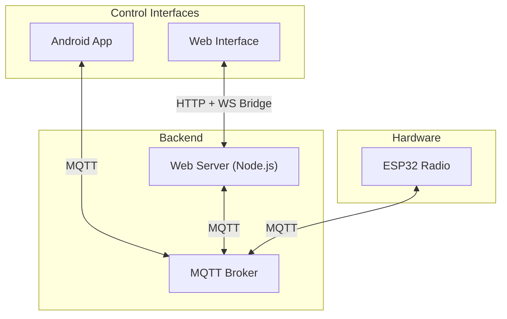

# Getting Started Guide

<cite>
**Referenced Files in This Document**
- [README.md](file://README.md)
- [README.md](file://WebRadio_ESP32_S3/README.md)
- [README.md](file://WebRadio_ESP32_S3/README.ru.md)
- [platformio.ini](file://WebRadio_ESP32_S3/platformio.ini)
- [secrets.h.example](file://WebRadio_ESP32_S3/src/secrets.h.example)
- [README.md](file://WebRadio_android/README.md)
- [Secrets.kt.example](file://WebRadio_android/app/src/main/java/com/dip16/webradio/Secrets.kt.example)
- [README.md](file://WebRadio_web/README.md)
- [README.md](file://WebRadio_web/README.ru.md)
- [.env.example](file://WebRadio_web/.env.example)
- [package.json](file://WebRadio_web/package.json)
- [docker-compose.yml](file://WebRadio_web/docker-compose.yml)
- [server.js](file://WebRadio_web/server.js)
- [README.md](file://WebRadio_python_utils/README.md)
- [README.md](file://WebRadio_python_utils/README.ru.md)
</cite>

## Table of Contents
1. [Introduction](#introduction)
2. [Project Structure](#project-structure)
3. [Prerequisites and Hardware](#prerequisites-and-hardware)
4. [Step-by-Step Setup](#step-by-step-setup)
5. [Credential Configuration Examples](#credential-configuration-examples)
6. [Verification Checklist](#verification-checklist)
7. [Troubleshooting Guide](#troubleshooting-guide)
8. [Conclusion](#conclusion)

## Introduction
This guide helps you set up the complete WebRadio system: ESP32 firmware, Android app, web interface, and Python utilities. The system uses an MQTT broker for communication between the control interfaces (Android app and web interface) and the ESP32 radio. You will install prerequisites, configure credentials, compile and flash firmware, deploy the web interface, and prepare the Python utilities.

## Project Structure
The repository is organized into four main components:
- ESP32 firmware for the radio device
- Android app for remote control
- Web interface for browser-based control
- Python utilities for station list management

**Diagram sources**
- [README.md:65-91](file://README.md#L65-L91)
- [server.js:47-97](file://WebRadio_web/server.js#L47-L97)

**Section sources**
- [README.md:7-112](file://README.md#L7-L112)

## Prerequisites and Hardware
- Operating systems: Windows, macOS, or Linux
- Network: Local Wi-Fi and a device to host the MQTT broker (e.g., a PC, Raspberry Pi, or VM)
- MQTT broker: Install and run a broker such as Mosquitto on your local network
- ESP32 development:
  - Visual Studio Code with PlatformIO IDE extension
  - Arduino framework for ESP32
- Android development:
  - Android Studio (latest stable)
- Web interface:
  - Node.js and npm
  - Docker and Docker Compose (optional but recommended)
- Python utilities:
  - Python 3.x
  - VLC media player (required by the Python player)

Notes:
- The ESP32 firmware uses PlatformIO for building and flashing.
- The Android app requires a local MQTT broker reachable from your phone.
- The web interface can run locally or be containerized with Docker.

**Section sources**
- [README.md:96-112](file://README.md#L96-L112)
- [README.md:56-69](file://WebRadio_ESP32_S3/README.md#L56-L69)
- [README.md:20-27](file://WebRadio_android/README.md#L20-L27)
- [README.md:25-27](file://WebRadio_web/README.md#L25-L27)
- [README.md:1-43](file://WebRadio_python_utils/README.md#L1-L43)

## Step-by-Step Setup

### 1) Set up the MQTT Broker
- Install and run an MQTT broker (e.g., Mosquitto) on a machine in your LAN.
- Ensure the broker is reachable from the ESP32, Android device, and web server.
- If using Docker, you can run the broker in a container; otherwise, install it directly on your OS.

Verification tip:
- Use an MQTT client (e.g., mosquitto_pub/sub) to publish and subscribe on test topics.

**Section sources**
- [README.md:96-96](file://README.md#L96-L96)

### 2) ESP32 Firmware: Compile and Flash
- Install Visual Studio Code with the PlatformIO IDE extension.
- Open the ESP32 project folder in VS Code.
- Prepare credentials:
  - Copy the example secrets file to the secrets file and edit it with your Wi-Fi, Telegram, and MQTT details.
  - The firmware expects a station list in the source file; you can adjust it as needed.
- Build and upload the firmware using PlatformIO.

Key files and locations:
- Secrets template: [secrets.h.example:1-32](file://WebRadio_ESP32_S3/src/secrets.h.example#L1-L32)
- PlatformIO configuration: [platformio.ini:1-71](file://WebRadio_ESP32_S3/platformio.ini#L1-L71)
- Firmware source (station list and topics): [main.cpp:141-200](file://WebRadio_ESP32_S3/src/main.cpp#L141-L200)

Notes:
- The firmware supports two hardware variants via macros; ensure the correct environment is selected in PlatformIO.
- After flashing, monitor serial output to confirm Wi-Fi and MQTT connectivity.

**Section sources**
- [README.md:70-80](file://WebRadio_ESP32_S3/README.md#L70-L80)
- [README.md:120-127](file://WebRadio_ESP32_S3/README.md#L120-L127)
- [platformio.ini:11-35](file://WebRadio_ESP32_S3/platformio.ini#L11-L35)
- [secrets.h.example:10-32](file://WebRadio_ESP32_S3/src/secrets.h.example#L10-L32)
- [main.cpp:141-200](file://WebRadio_ESP32_S3/src/main.cpp#L141-L200)

### 3) Android App: Install and Configure
- Open the Android project in Android Studio.
- Create the secrets file with your MQTT broker details.
- Build and install the app on your Android device.

Key files and locations:
- Secrets template: [Secrets.kt.example:1-12](file://WebRadio_android/app/src/main/java/com/dip16/webradio/Secrets.kt.example#L1-L12)
- App README with MQTT topics and payloads: [README.md:61-90](file://WebRadio_android/README.md#L61-L90)

Notes:
- The app subscribes to status topics and publishes commands to the device’s action topic.
- Multi-device support allows switching between two radios by changing the radio name.

**Section sources**
- [README.md:29-59](file://WebRadio_android/README.md#L29-L59)
- [README.md:61-90](file://WebRadio_android/README.md#L61-L90)
- [Secrets.kt.example:8-12](file://WebRadio_android/app/src/main/java/com/dip16/webradio/Secrets.kt.example#L8-L12)

### 4) Web Interface: Deploy and Configure
- Option A: Run locally
  - Install dependencies with npm.
  - Create the environment file from the example and set credentials.
  - Start the server with the provided Node.js entry point.
- Option B: Run with Docker (recommended)
  - Build and start the service with Docker Compose.
  - The container exposes the web interface and bridges MQTT to WebSocket.

Key files and locations:
- Environment example: [.env.example:1-3](file://WebRadio_web/.env.example#L1-L3)
- Dependencies and scripts: [package.json:15-24](file://WebRadio_web/package.json#L15-L24)
- Docker Compose: [docker-compose.yml:1-25](file://WebRadio_web/docker-compose.yml#L1-L25)
- Server bootstrap and MQTT bridge: [server.js:33-97](file://WebRadio_web/server.js#L33-L97)

Notes:
- The first visit prompts for a secret token; paste the token from your environment file.
- The server subscribes to all status topics under the configured MQTT prefix and exposes an API secured by the same token.

**Section sources**
- [README.md:21-58](file://WebRadio_web/README.md#L21-L58)
- [README.md:60-67](file://WebRadio_web/README.md#L60-L67)
- [.env.example:1-3](file://WebRadio_web/.env.example#L1-L3)
- [package.json:15-24](file://WebRadio_web/package.json#L15-L24)
- [docker-compose.yml:1-25](file://WebRadio_web/docker-compose.yml#L1-L25)
- [server.js:33-97](file://WebRadio_web/server.js#L33-L97)

### 5) Python Utilities: Prepare Station Lists
- Use the provided scripts to manage station lists:
  - Convert a text list to JSON for players
  - Sort and remove duplicates from a list
  - Play stations from a JSON list using VLC

Key files and locations:
- Script descriptions: [README.md:5-43](file://WebRadio_python_utils/README.md#L5-L43)

Notes:
- Ensure VLC is installed so the player can start and stop streams.
- The scripts operate on text and JSON files in the utilities directory.

**Section sources**
- [README.md:5-43](file://WebRadio_python_utils/README.md#L5-L43)
- [README.md:5-43](file://WebRadio_python_utils/README.ru.md#L5-L43)

## Credential Configuration Examples
Below are the minimal steps to configure credentials for each component. Replace placeholders with your actual values.

- ESP32 firmware
  - Copy the example secrets file to the secrets file and edit:
    - Wi-Fi SSID/password arrays
    - Telegram bot token and admin chat ID
    - MQTT server, login, and password
  - Reference: [secrets.h.example:10-32](file://WebRadio_ESP32_S3/src/secrets.h.example#L10-L32)

- Android app
  - Create the secrets file and set:
    - MQTT broker URL
    - MQTT login
    - MQTT password
  - Reference: [Secrets.kt.example:8-12](file://WebRadio_android/app/src/main/java/com/dip16/webradio/Secrets.kt.example#L8-L12)

- Web interface
  - Create the environment file from the example and set:
    - Secret token
    - MQTT broker URL
    - MQTT user and password
  - Reference: [.env.example:1-3](file://WebRadio_web/.env.example#L1-L3)

Notes:
- Keep secrets out of version control.
- For Docker deployments, ensure the environment variables are loaded via the Compose file.

**Section sources**
- [secrets.h.example:10-32](file://WebRadio_ESP32_S3/src/secrets.h.example#L10-L32)
- [Secrets.kt.example:8-12](file://WebRadio_android/app/src/main/java/com/dip16/webradio/Secrets.kt.example#L8-L12)
- [.env.example:1-3](file://WebRadio_web/.env.example#L1-L3)

## Verification Checklist
After completing setup, verify that all components are communicating:

- ESP32
  - Confirm Wi-Fi connection and MQTT subscription logs in the serial monitor.
  - Check that the device responds to status requests and basic commands.

- Android App
  - Launch the app, connect to the broker, and verify it receives status updates.
  - Try sending a few commands (power, volume, station) and observe the device reacting.

- Web Interface
  - Visit the site and enter the secret token when prompted.
  - Confirm real-time status updates and successful command publishing.

- MQTT Broker
  - Verify published commands appear on the action topic and received status messages on status topics.

- Python Utilities
  - Run the conversion and sorting scripts to manage station lists.
  - Test the player script to ensure VLC starts/stops streams.

**Section sources**
- [README.md:92-112](file://README.md#L92-L112)
- [server.js:84-97](file://WebRadio_web/server.js#L84-L97)

## Troubleshooting Guide
Common issues and resolutions:

- ESP32 fails to connect to Wi-Fi
  - Verify SSID and password arrays in the secrets file.
  - Ensure the device is within range and the network is reachable.

- ESP32 cannot reach the MQTT broker
  - Confirm the broker URL, port, and credentials in the secrets file.
  - Check firewall and network ACLs blocking the broker.

- Android app cannot connect to MQTT
  - Validate broker URL and credentials in the app’s secrets file.
  - Ensure the device can reach the broker IP/port from the phone.

- Web interface shows “offline” or no updates
  - Confirm the secret token matches the environment variable.
  - Check that the server subscribes to the correct MQTT prefix and topics.
  - For Docker, verify the broker URL points to the host network.

- Docker Compose does not start the web service
  - Ensure Docker and Compose are installed and running.
  - Confirm the environment file exists and is mounted by the service.

- Python player cannot start VLC
  - Install VLC and ensure it is available in PATH.
  - Run the player script from a terminal to see VLC output.

**Section sources**
- [README.md:92-112](file://README.md#L92-L112)
- [server.js:33-97](file://WebRadio_web/server.js#L33-L97)
- [README.md:60-67](file://WebRadio_web/README.md#L60-L67)

## Conclusion
You now have the ESP32 firmware, Android app, web interface, and Python utilities configured and communicating via MQTT. Start with the broker, flash the ESP32, configure the Android app and web interface, and finally prepare your station lists with the Python utilities. Use the verification checklist to confirm everything is working, and consult the troubleshooting section if you encounter issues.