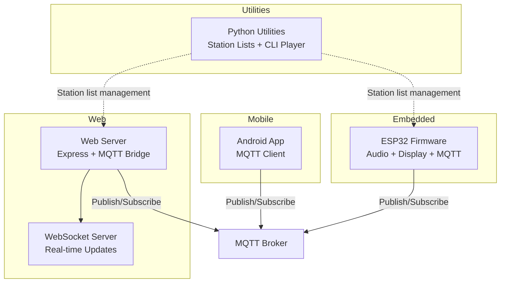
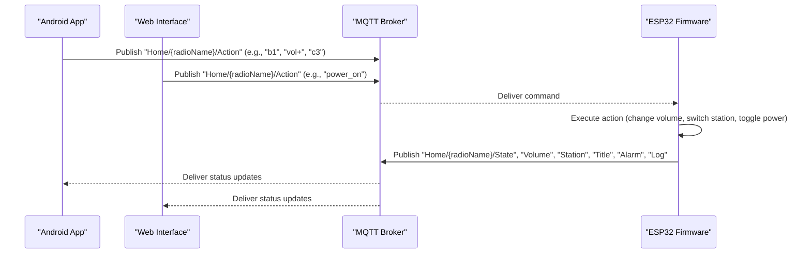
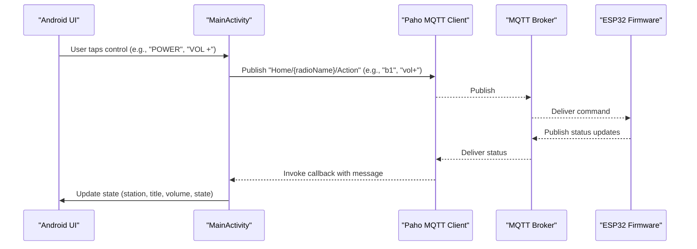
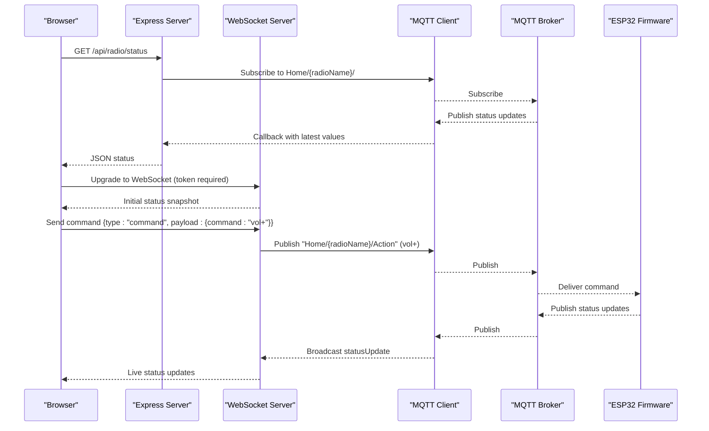
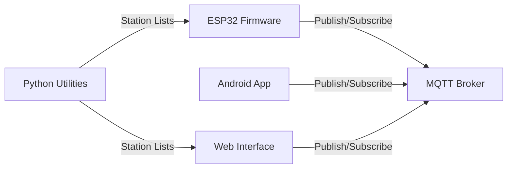

# Project Overview

<cite>
**Referenced Files in This Document**
- [README.md](file://README.md)
- [WebRadio_ESP32_S3/README.md](file://WebRadio_ESP32_S3/README.md)
- [WebRadio_ESP32_S3/src/main.cpp](file://WebRadio_ESP32_S3/src/main.cpp)
- [WebRadio_ESP32_S3/platformio.ini](file://WebRadio_ESP32_S3/platformio.ini)
- [WebRadio_android/README.md](file://WebRadio_android/README.md)
- [WebRadio_android/app/src/main/java/com/dip16/webradio/MainActivity.kt](file://WebRadio_android/app/src/main/java/com/dip16/webradio/MainActivity.kt)
- [WebRadio_web/README.md](file://WebRadio_web/README.md)
- [WebRadio_web/server.js](file://WebRadio_web/server.js)
- [WebRadio_web/package.json](file://WebRadio_web/package.json)
- [WebRadio_python_utils/README.md](file://WebRadio_python_utils/README.md)
- [WebRadio_python_utils/webradio.py](file://WebRadio_python_utils/webradio.py)
- [WebRadio_python_utils/best.json](file://WebRadio_python_utils/best.json)
</cite>

## Table of Contents
1. [Introduction](#introduction)
2. [Project Structure](#project-structure)
3. [Core Components](#core-components)
4. [Architecture Overview](#architecture-overview)
5. [Detailed Component Analysis](#detailed-component-analysis)
6. [Dependency Analysis](#dependency-analysis)
7. [Performance Considerations](#performance-considerations)
8. [Troubleshooting Guide](#troubleshooting-guide)
9. [Conclusion](#conclusion)
10. [Appendices](#appendices)

## Introduction
WebRadio is a do-it-yourself (DIY) IoT internet radio system that delivers a multi-interface, real-time audio experience. It combines a hardware radio player (ESP32) with a native Android app, a web interface, and Python utilities to provide flexible control and management across platforms. The system’s core value proposition lies in offering a unified, low-latency control plane powered by MQTT, enabling users to operate the radio from anywhere on the local network while maintaining a responsive, real-time status feed.

Key benefits:
- Unified control across Android, web, and physical buttons
- Reliable real-time status updates via MQTT
- Extensible station list management with Python utilities
- Educational value spanning embedded systems, IoT communication, and full-stack development

Target audience:
- Makers and hobbyists building embedded audio projects
- Developers learning MQTT and real-time messaging
- Students exploring cross-platform IoT applications

Prerequisites:
- Basic familiarity with local networking and MQTT brokers
- Understanding of embedded development (for firmware customization)
- Familiarity with Android development (for app customization)
- Node.js and Docker basics (for web interface deployment)
- Python fundamentals (for station list management)

## Project Structure
The repository is organized into four main components, each with its own README and build/run instructions:

- WebRadio_ESP32_S3: ESP32 firmware with audio streaming, display, and MQTT control
- WebRadio_android: Android app for remote control and status display
- WebRadio_web: Web interface with HTTP API and WebSocket bridge to MQTT
- WebRadio_python_utils: Python scripts for station list management and testing



**Diagram sources**
- [README.md:61-91](file://README.md#L61-L91)
- [WebRadio_ESP32_S3/README.md:56-69](file://WebRadio_ESP32_S3/README.md#L56-L69)
- [WebRadio_web/README.md:14-19](file://WebRadio_web/README.md#L14-L19)
- [WebRadio_android/README.md:20-27](file://WebRadio_android/README.md#L20-L27)

**Section sources**
- [README.md:7-113](file://README.md#L7-L113)

## Core Components
- ESP32 Firmware: Streams internet radio, drives OLED display, handles physical buttons, and communicates over MQTT. It publishes status and subscribes to control commands.
- Android App: Provides a Jetpack Compose UI to control power, volume, channels, alarms, and to switch between multiple radio devices. It connects to the MQTT broker and subscribes to status topics.
- Web Interface: A Node.js/Express server with WebSocket support that bridges MQTT and HTTP. It exposes a REST API and a WebSocket endpoint for real-time updates.
- Python Utilities: Tools to manage station lists (convert, sort, and maintain favorites) and a simple CLI player using VLC for testing.

Technology stack rationale:
- ESP32: Low-cost, Wi-Fi + Bluetooth, strong community, and excellent audio libraries
- MQTT: Lightweight, reliable pub/sub for real-time control and status
- Android (Kotlin + Jetpack Compose): Modern, reactive UI with robust MQTT client support
- Node.js + Express + WebSocket: Simple, scalable backend with real-time capabilities
- Python: Practical tooling for data preparation and quick testing

**Section sources**
- [WebRadio_ESP32_S3/README.md:56-69](file://WebRadio_ESP32_S3/README.md#L56-L69)
- [WebRadio_android/README.md:20-27](file://WebRadio_android/README.md#L20-L27)
- [WebRadio_web/README.md:14-19](file://WebRadio_web/README.md#L14-L19)
- [WebRadio_python_utils/README.md:1-43](file://WebRadio_python_utils/README.md#L1-L43)

## Architecture Overview
The system uses a central MQTT broker to mediate communication between user interfaces and the ESP32 radio. The Android app and web interface publish control commands to a device-specific action topic and subscribe to status topics to reflect real-time state. The ESP32 firmware subscribes to the action topic, executes commands, and publishes status updates back to the broker.

```mermaid
graph TB
subgraph "User Interfaces"
A["Android App"]
B["Web Browser"]
end
subgraph "Backend"
C["Web Server"]
D["MQTT Broker"]
end
subgraph "Hardware"
E["ESP32 Radio"]
end
A <- --> |"MQTT"| D
B <- --> |"HTTP/WebSocket"| C
C <- --> |"MQTT"| D
E <- --> |"MQTT"| D
subgraph "Topics"
T1["Home/{radioName}/Action"]
T2["Home/{radioName}/State"]
T3["Home/{radioName}/Station"]
T4["Home/{radioName}/Title"]
T5["Home/{radioName}/Volume"]
T6["Home/{radioName}/Alarm"]
T7["Home/{radioName}/Log"]
end
D --> T1
D --> T2
D --> T3
D --> T4
D --> T5
D --> T6
D --> T7
```

**Diagram sources**
- [README.md:61-91](file://README.md#L61-L91)
- [WebRadio_ESP32_S3/src/main.cpp:33-53](file://WebRadio_ESP32_S3/src/main.cpp#L33-L53)
- [WebRadio_android/README.md:61-89](file://WebRadio_android/README.md#L61-L89)
- [WebRadio_web/server.js:38](file://WebRadio_web/server.js#L38)

## Detailed Component Analysis

### ESP32 Firmware
Responsibilities:
- Audio streaming via I2S and external DAC
- OLED display for station, title, volume, and status
- Physical button control (power, sleep, channel up/down)
- MQTT control and status publishing
- Alarm and sleep timer automation
- NTP time synchronization

Key MQTT topics:
- Incoming: Home/{radioName}/Action
- Outgoing: Home/{radioName}/State, Station, Title, Volume, Alarm, Log

Implementation highlights:
- Uses PubSubClient for MQTT connectivity and Arduino framework for peripherals
- Integrates Audio library for streaming and U8g2 for display rendering
- EncButton library for debounced button handling
- TimeAlarms and NTPClient for scheduling and time sync



**Diagram sources**
- [WebRadio_ESP32_S3/src/main.cpp:274-650](file://WebRadio_ESP32_S3/src/main.cpp#L274-L650)
- [WebRadio_android/README.md:65-89](file://WebRadio_android/README.md#L65-L89)
- [WebRadio_web/server.js:123-134](file://WebRadio_web/server.js#L123-L134)

**Section sources**
- [WebRadio_ESP32_S3/README.md:56-69](file://WebRadio_ESP32_S3/README.md#L56-L69)
- [WebRadio_ESP32_S3/src/main.cpp:33-53](file://WebRadio_ESP32_S3/src/main.cpp#L33-L53)

### Android Application
Responsibilities:
- Real-time status display (station, title, volume, state)
- Control actions: power, channel up/down, volume up/down, alarms
- Multi-device support (switch between radioName variants)
- Persistent settings storage using Jetpack DataStore

Communication:
- Publishes to Home/{radioName}/Action
- Subscribes to Home/{radioName}/State, Station, Title, Volume, Alarm, Log



**Diagram sources**
- [WebRadio_android/README.md:61-89](file://WebRadio_android/README.md#L61-L89)
- [WebRadio_android/app/src/main/java/com/dip16/webradio/MainActivity.kt:171-246](file://WebRadio_android/app/src/main/java/com/dip16/webradio/MainActivity.kt#L171-L246)

**Section sources**
- [WebRadio_android/README.md:20-27](file://WebRadio_android/README.md#L20-L27)
- [WebRadio_android/app/src/main/java/com/dip16/webradio/MainActivity.kt:257-296](file://WebRadio_android/app/src/main/java/com/dip16/webradio/MainActivity.kt#L257-L296)

### Web Interface
Responsibilities:
- Real-time status display and playback controls
- REST API for power, station, volume, and alarm commands
- WebSocket endpoint for live updates
- Security via secret token and Helmet headers

Communication:
- Bridges HTTP API to MQTT and WebSocket to MQTT
- Subscribes to all Home/{radioName}/# topics
- Publishes to Home/{radioName}/Action



**Diagram sources**
- [WebRadio_web/server.js:34-97](file://WebRadio_web/server.js#L34-L97)
- [WebRadio_web/server.js:115-203](file://WebRadio_web/server.js#L115-L203)
- [WebRadio_web/server.js:224-260](file://WebRadio_web/server.js#L224-L260)

**Section sources**
- [WebRadio_web/README.md:14-19](file://WebRadio_web/README.md#L14-L19)
- [WebRadio_web/server.js:34-97](file://WebRadio_web/server.js#L34-L97)

### Python Utilities
Responsibilities:
- Manage station lists: convert text to JSON, sort and deduplicate entries
- Command-line player using VLC for testing and verification

Usage:
- webradio.py: Randomly selects and plays stations from best.json
- convert_txt_to_json.py: Converts bestlist.txt to best.json
- sort_txt.py: Produces bestlist_sorted.txt with duplicates removed

**Section sources**
- [WebRadio_python_utils/README.md:1-43](file://WebRadio_python_utils/README.md#L1-L43)
- [WebRadio_python_utils/webradio.py:1-125](file://WebRadio_python_utils/webradio.py#L1-L125)
- [WebRadio_python_utils/best.json:1-200](file://WebRadio_python_utils/best.json#L1-L200)

## Dependency Analysis
Inter-component dependencies and integration points:
- MQTT broker is the central integration point for all components
- ESP32 firmware defines topic naming conventions and payloads
- Android and web clients adhere to the same topic contract
- Python utilities consume and produce station list formats used by the other components



**Diagram sources**
- [README.md:61-91](file://README.md#L61-L91)
- [WebRadio_ESP32_S3/src/main.cpp:33-53](file://WebRadio_ESP32_S3/src/main.cpp#L33-L53)
- [WebRadio_web/server.js:38](file://WebRadio_web/server.js#L38)

**Section sources**
- [README.md:61-91](file://README.md#L61-L91)

## Performance Considerations
- MQTT: Lightweight pub/sub minimizes latency for control and status updates
- ESP32: Audio streaming and display updates are handled asynchronously; ensure adequate buffering and avoid blocking operations in callbacks
- Android: Use coroutines and reactive UI patterns to keep the interface responsive during MQTT operations
- Web: WebSocket reduces polling overhead; cache status updates client-side to minimize DOM churn
- Python utilities: Batch operations on station lists to reduce I/O overhead

## Troubleshooting Guide
Common issues and resolutions:
- MQTT connectivity problems:
  - Verify broker URL, credentials, and network reachability
  - Confirm topic subscriptions and payloads match expectations
- Android app disconnections:
  - Ensure persistent subscriptions and reconnection logic
  - Check DataStore initialization and settings persistence
- Web interface authentication:
  - Provide the correct SECRET_TOKEN when prompted
  - Confirm environment variables are loaded correctly
- ESP32 stability:
  - Monitor free heap and watchdog timers
  - Validate audio stream URLs and network conditions

**Section sources**
- [WebRadio_ESP32_S3/src/main.cpp:652-690](file://WebRadio_ESP32_S3/src/main.cpp#L652-L690)
- [WebRadio_web/server.js:34-97](file://WebRadio_web/server.js#L34-L97)
- [WebRadio_android/app/src/main/java/com/dip16/webradio/MainActivity.kt:171-246](file://WebRadio_android/app/src/main/java/com/dip16/webradio/MainActivity.kt#L171-L246)

## Conclusion
WebRadio demonstrates a cohesive, multi-interface IoT audio system that balances simplicity and extensibility. By leveraging MQTT for control and status, it enables seamless integration across embedded, mobile, and web environments. The project offers practical insights into embedded audio, real-time messaging, and full-stack development, making it an excellent educational resource and a functional foundation for further customization.

## Appendices
- Getting started checklist:
  - Set up an MQTT broker on a local device
  - Build and flash ESP32 firmware with Wi-Fi and MQTT credentials
  - Configure Android app credentials and deploy
  - Install and run the web interface with Docker
  - Prepare station lists with Python utilities

**Section sources**
- [README.md:92-113](file://README.md#L92-L113)