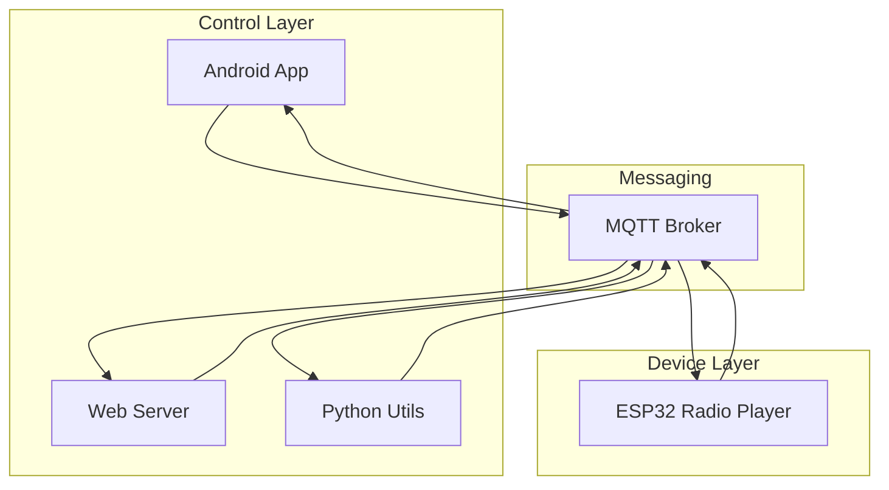
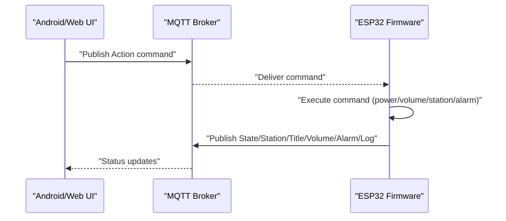
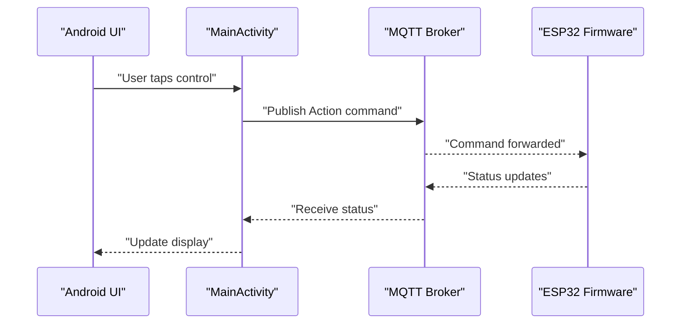
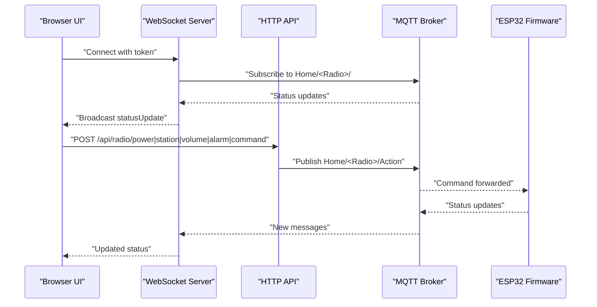
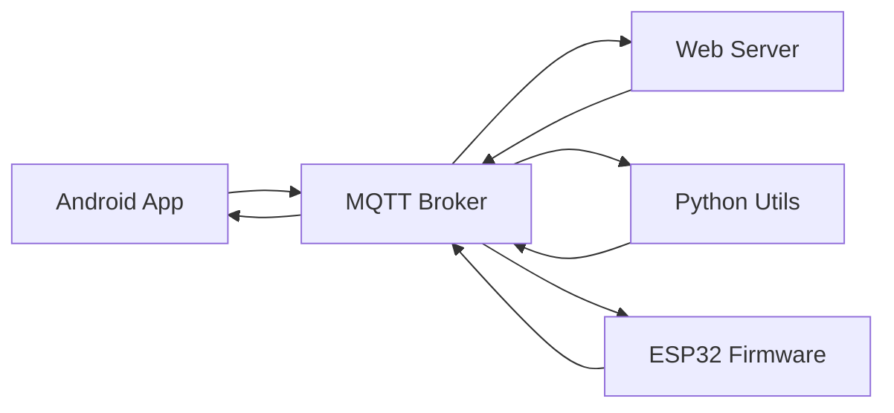
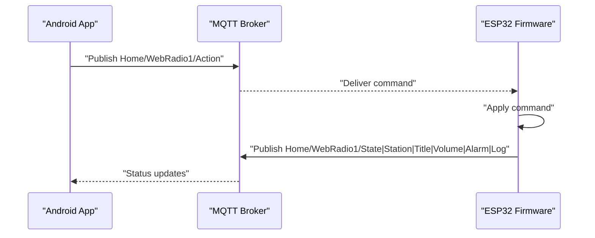
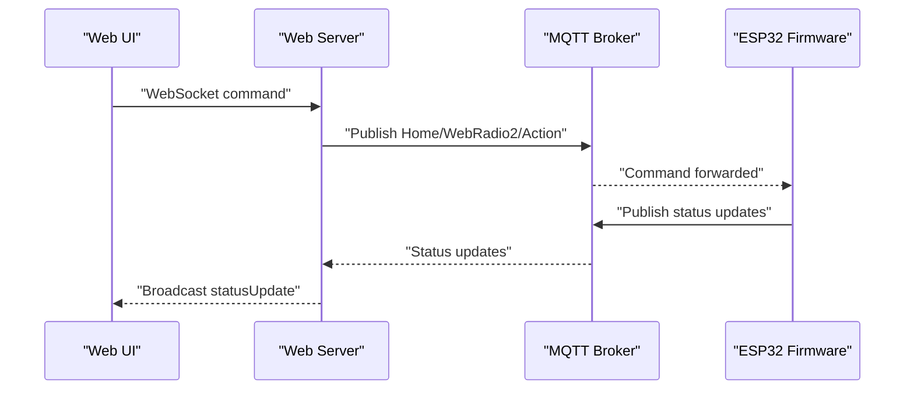

# System Architecture & Components

<cite>
**Referenced Files in This Document**
- [main.cpp](file://WebRadio_ESP32_S3/src/main.cpp)
- [secrets.h](file://WebRadio_ESP32_S3/src/secrets.h)
- [platformio.ini](file://WebRadio_ESP32_S3/platformio.ini)
- [MainActivity.kt](file://WebRadio_android/app/src/main/java/com/dip16/webradio/MainActivity.kt)
- [Secrets.kt](file://WebRadio_android/app/src/main/java/com/dip16/webradio/Secrets.kt)
- [server.js](file://WebRadio_web/server.js)
- [package.json](file://WebRadio_web/package.json)
- [index.html](file://WebRadio_web/public/index.html)
- [app.js](file://WebRadio_web/public/app.js)
- [webradio.py](file://WebRadio_python_utils/webradio.py)
- [README.md](file://WebRadio_python_utils/README.md)
</cite>

## Table of Contents
1. [Introduction](#introduction)
2. [Project Structure](#project-structure)
3. [Core Components](#core-components)
4. [Architecture Overview](#architecture-overview)
5. [Detailed Component Analysis](#detailed-component-analysis)
6. [Dependency Analysis](#dependency-analysis)
7. [Performance Considerations](#performance-considerations)
8. [Troubleshooting Guide](#troubleshooting-guide)
9. [Conclusion](#conclusion)
10. [Appendices](#appendices)

## Introduction
This document explains the WebRadio system’s four-component architecture and how it delivers seamless internet radio functionality across devices. The system is built around a publish/subscribe messaging model using MQTT, enabling distributed control and monitoring of an ESP32-based hardware radio player from Android, a web interface, and Python utilities. The architecture emphasizes modularity, scalability, and extensibility through standardized topic hierarchies and message patterns.

## Project Structure
The repository is organized into four primary components:
- ESP32 firmware: Runs on the embedded device, controls audio playback, displays status, and interacts with MQTT.
- Android application: Provides a mobile UI to control the radio and receive status updates via MQTT.
- Web interface: A Node.js/Express server with WebSocket bridging that exposes a browser-based UI and RESTful API.
- Python utilities: Command-line tools for managing station lists and basic playback.

```mermaid
graph TB
subgraph "Embedded"
ESP32["ESP32 Firmware<br/>main.cpp"]
end
subgraph "Mobile"
ANDR["Android App<br/>MainActivity.kt"]
end
subgraph "Web"
WEB["Web Server<br/>server.js"]
UI["Web UI<br/>index.html + app.js"]
end
subgraph "Utilities"
PY["Python Utils<br/>webradio.py"]
end
MQTT["MQTT Broker"]
ESP32 <- --> MQTT
ANDR <- --> MQTT
WEB <- --> MQTT
UI <- --> WEB
PY -.->|"Station Lists"| WEB
```

**Diagram sources**
- [main.cpp:275-650](file://WebRadio_ESP32_S3/src/main.cpp#L275-L650)
- [MainActivity.kt:171-331](file://WebRadio_android/app/src/main/java/com/dip16/webradio/MainActivity.kt#L171-L331)
- [server.js:47-97](file://WebRadio_web/server.js#L47-L97)
- [index.html:1-61](file://WebRadio_web/public/index.html#L1-L61)
- [app.js:122-178](file://WebRadio_web/public/app.js#L122-L178)
- [webradio.py:1-125](file://WebRadio_python_utils/webradio.py#L1-L125)

**Section sources**
- [platformio.ini:14-71](file://WebRadio_ESP32_S3/platformio.ini#L14-L71)
- [package.json:15-24](file://WebRadio_web/package.json#L15-L24)

## Core Components
- ESP32 Firmware (embedded controller)
  - Subscribes to action commands and publishes status telemetry.
  - Controls audio playback, volume, station selection, and alarm scheduling.
  - Uses MQTT topics under a configurable base path.

- Android Application (mobile UI)
  - Connects to MQTT, subscribes to status topics, and publishes control commands.
  - Provides buttons for power, channel/volume adjustment, sleep, and alarm configuration.

- Web Interface (Node.js/Express + WebSocket)
  - Bridges MQTT to WebSocket and HTTP API.
  - Serves a responsive UI that mirrors the embedded state and accepts commands.
  - Secures endpoints with a shared secret token.

- Python Utilities (CLI tools)
  - Manages station lists and provides a simple VLC-based player for testing and maintenance.

**Section sources**
- [main.cpp:275-650](file://WebRadio_ESP32_S3/src/main.cpp#L275-L650)
- [MainActivity.kt:171-331](file://WebRadio_android/app/src/main/java/com/dip16/webradio/MainActivity.kt#L171-L331)
- [server.js:47-97](file://WebRadio_web/server.js#L47-L97)
- [webradio.py:1-125](file://WebRadio_python_utils/webradio.py#L1-L125)

## Architecture Overview
The system follows a distributed, event-driven architecture centered on MQTT. Each component acts as either a publisher or subscriber, enabling loose coupling and independent scaling.



**Diagram sources**
- [main.cpp:652-690](file://WebRadio_ESP32_S3/src/main.cpp#L652-L690)
- [MainActivity.kt:171-246](file://WebRadio_android/app/src/main/java/com/dip16/webradio/MainActivity.kt#L171-L246)
- [server.js:47-97](file://WebRadio_web/server.js#L47-L97)
- [webradio.py:1-125](file://WebRadio_python_utils/webradio.py#L1-L125)

## Detailed Component Analysis

### ESP32 Firmware
Responsibilities:
- Establishes MQTT connection and subscribes to action topic.
- Publishes status updates to telemetry topics (state, station, title, volume, alarm, heap, log).
- Processes incoming commands to control power, volume, channel selection, and alarm.
- Integrates audio playback, display, and time/alarm management.

Key MQTT Topics (per device):
- Base: Home/<RadioName>/...
- Action: Home/<RadioName>/Action
- Telemetry: Home/<RadioName>/State, Station, Title, Volume, Alarm, FreeHeap, Log

Command handling:
- Power on/off, channel up/down, volume up/down, explicit station selection, alarm configuration, and status requests.



**Diagram sources**
- [main.cpp:275-650](file://WebRadio_ESP32_S3/src/main.cpp#L275-L650)

**Section sources**
- [main.cpp:275-650](file://WebRadio_ESP32_S3/src/main.cpp#L275-L650)
- [secrets.h:20-23](file://WebRadio_ESP32_S3/src/secrets.h#L20-L23)
- [platformio.ini:14-44](file://WebRadio_ESP32_S3/platformio.ini#L14-L44)

### Android Application
Responsibilities:
- Connects to MQTT broker and subscribes to status topics.
- Sends control commands to the action topic.
- Displays real-time status and allows user interaction.

Communication:
- Connects using provided credentials and manages subscriptions dynamically.
- Publishes commands like power toggle, volume adjust, channel change, and alarm settings.



**Diagram sources**
- [MainActivity.kt:171-331](file://WebRadio_android/app/src/main/java/com/dip16/webradio/MainActivity.kt#L171-L331)
- [Secrets.kt:8-11](file://WebRadio_android/app/src/main/java/com/dip16/webradio/Secrets.kt#L8-L11)

**Section sources**
- [MainActivity.kt:171-331](file://WebRadio_android/app/src/main/java/com/dip16/webradio/MainActivity.kt#L171-L331)
- [Secrets.kt:8-11](file://WebRadio_android/app/src/main/java/com/dip16/webradio/Secrets.kt#L8-L11)

### Web Interface (Node.js/Express + WebSocket)
Responsibilities:
- Bridges MQTT to WebSocket and HTTP API.
- Serves a browser-based UI that reflects the radio’s state.
- Exposes REST endpoints for power, station, volume, alarm, and arbitrary commands.

Security:
- Requires a shared secret token for WebSocket and API access.
- Uses Helmet for security headers and rate limiting for API endpoints.



**Diagram sources**
- [server.js:47-97](file://WebRadio_web/server.js#L47-L97)
- [index.html:1-61](file://WebRadio_web/public/index.html#L1-L61)
- [app.js:122-178](file://WebRadio_web/public/app.js#L122-L178)

**Section sources**
- [server.js:47-97](file://WebRadio_web/server.js#L47-L97)
- [package.json:15-24](file://WebRadio_web/package.json#L15-L24)
- [index.html:1-61](file://WebRadio_web/public/index.html#L1-L61)
- [app.js:122-178](file://WebRadio_web/public/app.js#L122-L178)

### Python Utilities
Responsibilities:
- Manage station lists and provide a simple CLI player using VLC.
- Useful for preparing station data consumed by other components.

**Section sources**
- [webradio.py:1-125](file://WebRadio_python_utils/webradio.py#L1-L125)
- [README.md:1-43](file://WebRadio_python_utils/README.md#L1-L43)

## Dependency Analysis
Inter-component dependencies and integration points:
- All components depend on a shared MQTT broker for messaging.
- The web server bridges MQTT to WebSocket and HTTP API, centralizing command routing.
- The Android app and web UI both publish to the action topic and subscribe to status topics.
- The ESP32 firmware publishes telemetry and reacts to commands.



**Diagram sources**
- [main.cpp:652-690](file://WebRadio_ESP32_S3/src/main.cpp#L652-L690)
- [MainActivity.kt:171-246](file://WebRadio_android/app/src/main/java/com/dip16/webradio/MainActivity.kt#L171-L246)
- [server.js:47-97](file://WebRadio_web/server.js#L47-L97)
- [webradio.py:1-125](file://WebRadio_python_utils/webradio.py#L1-L125)

**Section sources**
- [main.cpp:652-690](file://WebRadio_ESP32_S3/src/main.cpp#L652-L690)
- [MainActivity.kt:171-246](file://WebRadio_android/app/src/main/java/com/dip16/webradio/MainActivity.kt#L171-L246)
- [server.js:47-97](file://WebRadio_web/server.js#L47-L97)
- [webradio.py:1-125](file://WebRadio_python_utils/webradio.py#L1-L125)

## Performance Considerations
- MQTT batching and throttling: The ESP32 publishes telemetry periodically to reduce load; the web server batches updates and broadcasts only when values change.
- Network resilience: Automatic reconnection and exponential backoff are implemented in both Android and web clients.
- Audio streaming: The ESP32 uses efficient audio libraries and handles buffering and dropouts gracefully.
- Scalability: Adding more radios is achieved by extending the topic hierarchy with a new radio name; clients can subscribe selectively.

[No sources needed since this section provides general guidance]

## Troubleshooting Guide
Common issues and resolutions:
- MQTT connectivity failures:
  - Verify broker URL, credentials, and network reachability.
  - Check client logs for connection errors and reconnection attempts.
- Topic mismatch:
  - Ensure clients subscribe to the correct base path (Home/<Radio>/...).
- Authentication problems:
  - Confirm the shared secret token for WebSocket and API access.
- Embedded device stability:
  - Monitor free heap and log topics for resource pressure.
  - Validate station URLs and network conditions affecting audio streams.

**Section sources**
- [main.cpp:652-690](file://WebRadio_ESP32_S3/src/main.cpp#L652-L690)
- [MainActivity.kt:171-246](file://WebRadio_android/app/src/main/java/com/dip16/webradio/MainActivity.kt#L171-L246)
- [server.js:68-80](file://WebRadio_web/server.js#L68-L80)

## Conclusion
The WebRadio system demonstrates a robust, distributed architecture leveraging MQTT for reliable inter-device communication. Its modular design enables independent development and deployment of components while maintaining a unified control surface. The chosen technologies—ESP32, Android, Node.js/Express, and Python—provide a scalable foundation for adding new radios, UIs, and automation features.

[No sources needed since this section summarizes without analyzing specific files]

## Appendices

### MQTT Topic Hierarchy and Message Flow Patterns
- Base topic: Home/<RadioName>/...
- Action topic: Home/<RadioName>/Action
- Status topics:
  - State: Power ON/OFF, Sleep mode indicators
  - Station: Channel number and name
  - Title: Current stream title
  - Volume: Numeric volume level
  - Alarm: Seconds since midnight or “Alarm OFF”
  - FreeHeap: Device memory metrics
  - Log: Operational logs and diagnostics

Message flow patterns:
- Commands: Short strings or numeric payloads published to Action.
- Status: Periodic or event-driven updates published to status topics.
- Discovery: Clients can publish a status request (“?”) to retrieve current state.

**Section sources**
- [main.cpp:35-53](file://WebRadio_ESP32_S3/src/main.cpp#L35-L53)
- [MainActivity.kt:257-296](file://WebRadio_android/app/src/main/java/com/dip16/webradio/MainActivity.kt#L257-L296)
- [server.js:84-97](file://WebRadio_web/server.js#L84-L97)

### Component Interaction Diagrams

#### Android to ESP32 via MQTT


**Diagram sources**
- [MainActivity.kt:312-316](file://WebRadio_android/app/src/main/java/com/dip16/webradio/MainActivity.kt#L312-L316)
- [main.cpp:275-650](file://WebRadio_ESP32_S3/src/main.cpp#L275-L650)

#### Web UI to ESP32 via MQTT Bridge


**Diagram sources**
- [app.js:181-196](file://WebRadio_web/public/app.js#L181-L196)
- [server.js:123-134](file://WebRadio_web/server.js#L123-L134)
- [main.cpp:275-650](file://WebRadio_ESP32_S3/src/main.cpp#L275-L650)

### Scalability and Extensibility
- Modular component design:
  - Each component can be developed, tested, and deployed independently.
  - New radios are added by extending the topic hierarchy with a new radio name.
- Horizontal scaling:
  - Multiple ESP32 units can coexist under the same broker with distinct topic bases.
- Software extensibility:
  - Additional clients (e.g., another Android app, a dashboard, or a voice assistant) can integrate using the same MQTT contract.
  - Web UI can be extended with new controls and integrations without changing the broker protocol.

**Section sources**
- [platformio.ini:14-44](file://WebRadio_ESP32_S3/platformio.ini#L14-L44)
- [server.js:38-38](file://WebRadio_web/server.js#L38-L38)