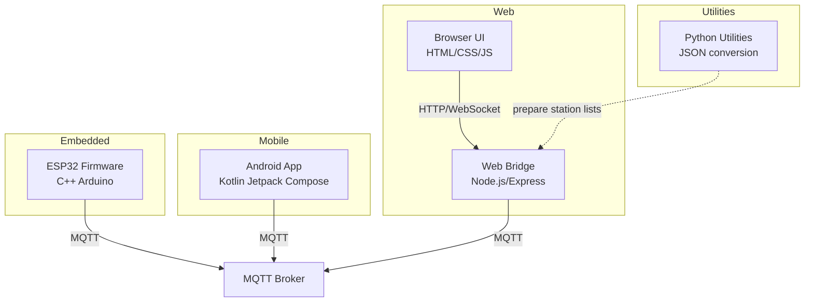
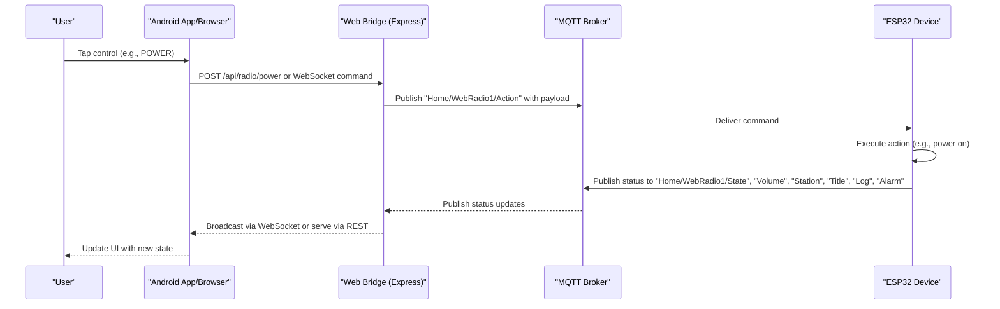
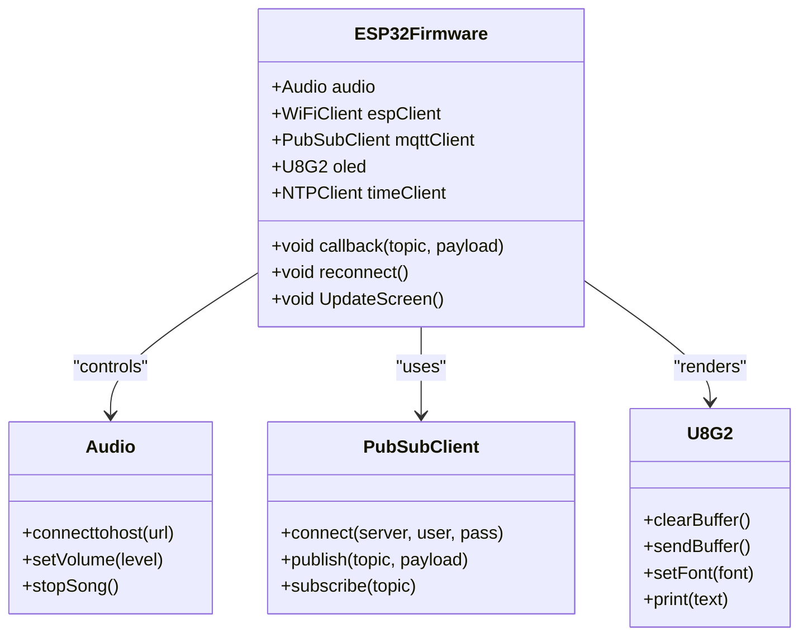
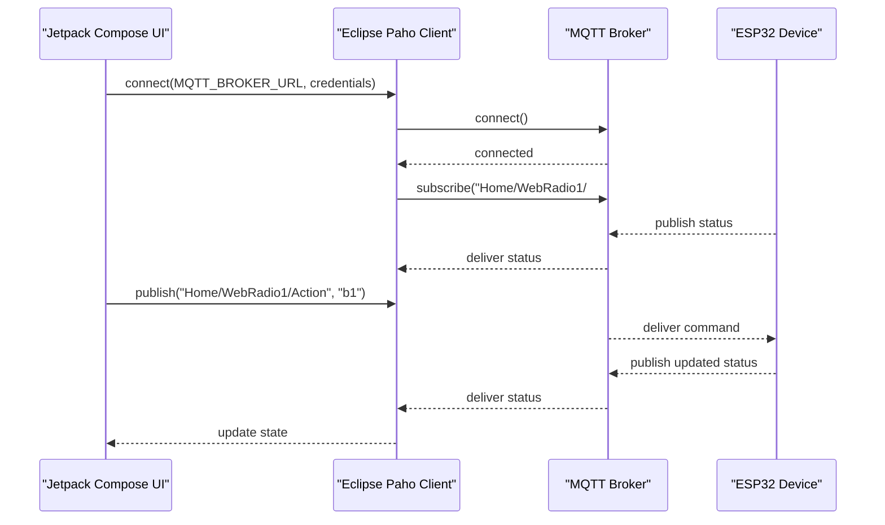
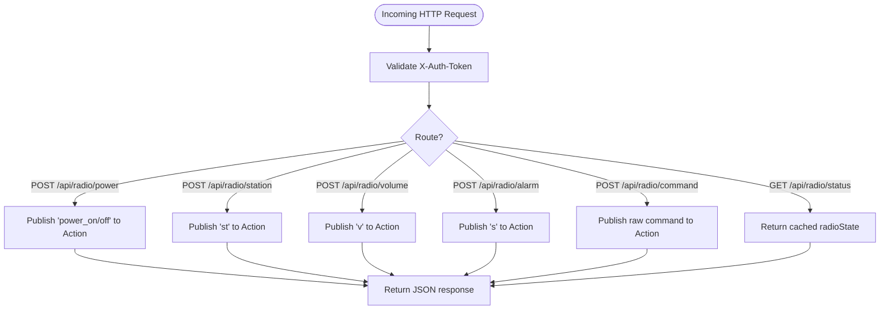
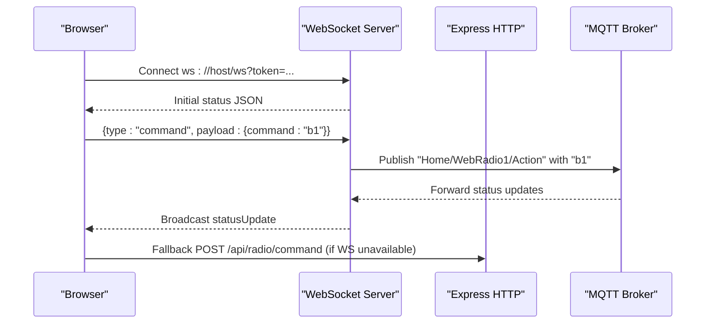
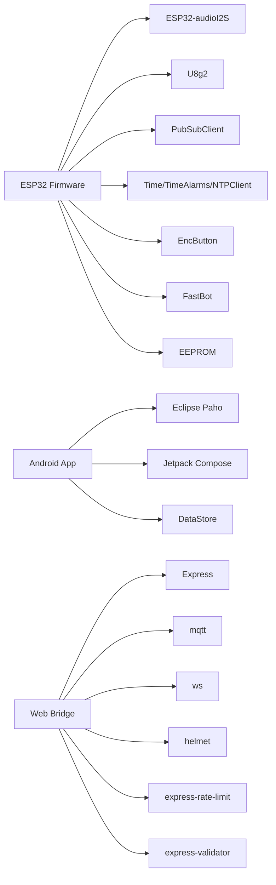

# Technology Stack & Design Decisions

<cite>
**Referenced Files in This Document**
- [main.cpp](file://WebRadio_ESP32_S3/src/main.cpp)
- [platformio.ini](file://WebRadio_ESP32_S3/platformio.ini)
- [secrets.h.example](file://WebRadio_ESP32_S3/src/secrets.h.example)
- [build.gradle.kts](file://WebRadio_android/app/build.gradle.kts)
- [libs.versions.toml](file://WebRadio_android/gradle/libs.versions.toml)
- [Secrets.kt.example](file://WebRadio_android/app/src/main/java/com/dip16/webradio/Secrets.kt.example)
- [MainActivity.kt](file://WebRadio_android/app/src/main/java/com/dip16/webradio/MainActivity.kt)
- [server.js](file://WebRadio_web/server.js)
- [package.json](file://WebRadio_web/package.json)
- [Dockerfile](file://WebRadio_web/Dockerfile)
- [index.html](file://WebRadio_web/public/index.html)
- [app.js](file://WebRadio_web/public/app.js)
- [convert_txt_to_json.py](file://WebRadio_python_utils/convert_txt_to_json.py)
</cite>

## Table of Contents
1. [Introduction](#introduction)
2. [Project Structure](#project-structure)
3. [Core Components](#core-components)
4. [Architecture Overview](#architecture-overview)
5. [Detailed Component Analysis](#detailed-component-analysis)
6. [Dependency Analysis](#dependency-analysis)
7. [Performance Considerations](#performance-considerations)
8. [Troubleshooting Guide](#troubleshooting-guide)
9. [Conclusion](#conclusion)

## Introduction
This document explains the technology stack and design decisions for the multi-device WebRadio ecosystem. It covers the rationale for choosing C++ for ESP32, Kotlin for Android, JavaScript/Node.js for the web bridge, and Python for utilities. It also documents key libraries and frameworks, MQTT protocol selection, development environments, cross-platform considerations, and version compatibility strategies.

## Project Structure
The project is organized into four primary platforms:
- ESP32 firmware (C++/Arduino) for embedded audio playback and display
- Android app (Kotlin/Compose) for mobile control
- Web bridge (Node.js/Express) for browser control and MQTT bridging
- Python utilities for data preparation and maintenance

**Diagram sources**
- [main.cpp:1-120](file://WebRadio_ESP32_S3/src/main.cpp#L1-L120)
- [platformio.ini:36-44](file://WebRadio_ESP32_S3/platformio.ini#L36-L44)
- [build.gradle.kts:52-74](file://WebRadio_android/app/build.gradle.kts#L52-L74)
- [server.js:1-120](file://WebRadio_web/server.js#L1-L120)
- [package.json:15-24](file://WebRadio_web/package.json#L15-L24)
- [index.html:1-61](file://WebRadio_web/public/index.html#L1-L61)
- [app.js:1-120](file://WebRadio_web/public/app.js#L1-L120)
- [convert_txt_to_json.py:1-18](file://WebRadio_python_utils/convert_txt_to_json.py#L1-L18)

**Section sources**
- [main.cpp:1-120](file://WebRadio_ESP32_S3/src/main.cpp#L1-L120)
- [platformio.ini:1-71](file://WebRadio_ESP32_S3/platformio.ini#L1-L71)
- [build.gradle.kts:1-74](file://WebRadio_android/app/build.gradle.kts#L1-L74)
- [server.js:1-120](file://WebRadio_web/server.js#L1-L120)
- [package.json:1-26](file://WebRadio_web/package.json#L1-L26)
- [index.html:1-61](file://WebRadio_web/public/index.html#L1-L61)
- [app.js:1-120](file://WebRadio_web/public/app.js#L1-L120)
- [convert_txt_to_json.py:1-18](file://WebRadio_python_utils/convert_txt_to_json.py#L1-L18)

## Core Components
- ESP32 firmware: Audio playback via ESP32-audioI2S, display via U8g2, MQTT control via PubSubClient, and time/alarm via Time/TimeAlarms/NTPClient.
- Android app: Jetpack Compose UI with MQTT client for remote control and status updates.
- Web bridge: Node.js/Express server exposing REST APIs and WebSocket endpoints, bridging MQTT topics to HTTP/WebSocket clients.
- Python utilities: JSON conversion helpers for station lists.

**Section sources**
- [main.cpp:1-120](file://WebRadio_ESP32_S3/src/main.cpp#L1-L120)
- [platformio.ini:36-44](file://WebRadio_ESP32_S3/platformio.ini#L36-L44)
- [build.gradle.kts:52-74](file://WebRadio_android/app/build.gradle.kts#L52-L74)
- [server.js:1-120](file://WebRadio_web/server.js#L1-L120)
- [package.json:15-24](file://WebRadio_web/package.json#L15-L24)
- [convert_txt_to_json.py:1-18](file://WebRadio_python_utils/convert_txt_to_json.py#L1-L18)

## Architecture Overview
The system uses MQTT as the central bus for device-to-device and device-to-application communication. The ESP32 publishes status and subscribes to control commands. The Android app and web UI both subscribe to status topics and publish commands to the same topics. The web bridge exposes HTTP and WebSocket endpoints that authenticate and forward commands to MQTT.

**Diagram sources**
- [server.js:115-203](file://WebRadio_web/server.js#L115-L203)
- [MainActivity.kt:257-316](file://WebRadio_android/app/src/main/java/com/dip16/webradio/MainActivity.kt#L257-L316)
- [main.cpp:274-470](file://WebRadio_ESP32_S3/src/main.cpp#L274-L470)

**Section sources**
- [server.js:115-203](file://WebRadio_web/server.js#L115-L203)
- [MainActivity.kt:257-316](file://WebRadio_android/app/src/main/java/com/dip16/webradio/MainActivity.kt#L257-L316)
- [main.cpp:274-470](file://WebRadio_ESP32_S3/src/main.cpp#L274-L470)

## Detailed Component Analysis

### ESP32 Firmware (C++ Arduino)
- Programming language: C++ via Arduino framework on ESP32.
- Libraries:
  - ESP32-audioI2S: High-performance I2S audio streaming.
  - U8g2: OLED display rendering with hardware I2C.
  - PubSubClient: MQTT client for publish/subscribe messaging.
  - Time/TimeAlarms/NTPClient: Timekeeping and scheduled alarms.
  - EncButton: Debounced rotary encoder and button handling.
  - FastBot: Telegram bot integration for alerts.
  - EEPROM: Non-volatile storage for alarm configuration.
- Roles:
  - Audio playback control and volume ramping.
  - Status publishing (State, Volume, Station, Title, Log, Alarm).
  - Command subscription and action execution.
  - Local display of station, volume, RSSI, and sleep mode.
- MQTT topics:
  - Subscribes to "Home/WebRadio1/Action" (or WebRadio2 variant).
  - Publishes to "Home/WebRadio1/Log", "Home/WebRadio1/State", "Home/WebRadio1/Station", "Home/WebRadio1/Title", "Home/WebRadio1/Volume", "Home/WebRadio1/Alarm".

**Diagram sources**
- [main.cpp:61-73](file://WebRadio_ESP32_S3/src/main.cpp#L61-L73)
- [main.cpp:138-139](file://WebRadio_ESP32_S3/src/main.cpp#L138-L139)
- [platformio.ini:36-44](file://WebRadio_ESP32_S3/platformio.ini#L36-L44)

**Section sources**
- [main.cpp:1-120](file://WebRadio_ESP32_S3/src/main.cpp#L1-L120)
- [platformio.ini:36-44](file://WebRadio_ESP32_S3/platformio.ini#L36-L44)
- [secrets.h.example:10-32](file://WebRadio_ESP32_S3/src/secrets.h.example#L10-L32)

### Android App (Kotlin + Jetpack Compose)
- Programming language: Kotlin.
- UI framework: Jetpack Compose for declarative UI.
- MQTT client: Eclipse Paho client for publish/subscribe.
- Data persistence: DataStore for preferences.
- Roles:
  - Subscribe to status topics ("Home/WebRadio1/State", "Volume", "Station", "Title", "Log", "Alarm").
  - Publish control commands to "Home/WebRadio1/Action".
  - Provide alarm and mode selection UIs.
- Authentication: Uses MQTT credentials via Secrets.kt.

**Diagram sources**
- [MainActivity.kt:171-246](file://WebRadio_android/app/src/main/java/com/dip16/webradio/MainActivity.kt#L171-L246)
- [MainActivity.kt:257-316](file://WebRadio_android/app/src/main/java/com/dip16/webradio/MainActivity.kt#L257-L316)
- [Secrets.kt.example:8-12](file://WebRadio_android/app/src/main/java/com/dip16/webradio/Secrets.kt.example#L8-L12)

**Section sources**
- [build.gradle.kts:52-74](file://WebRadio_android/app/build.gradle.kts#L52-L74)
- [libs.versions.toml:17-36](file://WebRadio_android/gradle/libs.versions.toml#L17-L36)
- [MainActivity.kt:171-316](file://WebRadio_android/app/src/main/java/com/dip16/webradio/MainActivity.kt#L171-L316)
- [Secrets.kt.example:8-12](file://WebRadio_android/app/src/main/java/com/dip16/webradio/Secrets.kt.example#L8-L12)

### Web Bridge (Node.js/Express)
- Programming language: JavaScript (Node.js).
- Frameworks/libraries:
  - Express: HTTP server and routing.
  - MQTT (mqtt): Client for bridging to broker.
  - Helmet: Security headers.
  - express-rate-limit: API rate limiting.
  - express-validator: Request validation.
  - ws: WebSocket server for real-time updates.
- Roles:
  - Exposes REST endpoints for power, station, volume, alarm, and generic commands.
  - Authenticates via X-Auth-Token header.
  - Bridges MQTT topics to WebSocket clients.
  - Serves static frontend assets.
- Dockerization: Node.js Alpine image with non-root user.

**Diagram sources**
- [server.js:115-203](file://WebRadio_web/server.js#L115-L203)
- [server.js:212-238](file://WebRadio_web/server.js#L212-L238)
- [package.json:15-24](file://WebRadio_web/package.json#L15-L24)

**Section sources**
- [server.js:1-120](file://WebRadio_web/server.js#L1-L120)
- [server.js:115-203](file://WebRadio_web/server.js#L115-L203)
- [server.js:212-267](file://WebRadio_web/server.js#L212-L267)
- [package.json:15-24](file://WebRadio_web/package.json#L15-L24)
- [Dockerfile:1-28](file://WebRadio_web/Dockerfile#L1-L28)

### Web Frontend (HTML/CSS/JS)
- Technologies: HTML, CSS, vanilla JavaScript.
- Features:
  - WebSocket connection to the server with token-based authentication.
  - Real-time status updates and UI synchronization.
  - Preset station wheel with genre-aware coloring.
  - Command dispatch via WebSocket or HTTP fallback.
- Static hosting: Served by Express from the public directory.

**Diagram sources**
- [app.js:123-178](file://WebRadio_web/public/app.js#L123-L178)
- [app.js:181-196](file://WebRadio_web/public/app.js#L181-L196)
- [server.js:224-260](file://WebRadio_web/server.js#L224-L260)

**Section sources**
- [index.html:1-61](file://WebRadio_web/public/index.html#L1-L61)
- [app.js:1-120](file://WebRadio_web/public/app.js#L1-L120)
- [app.js:123-260](file://WebRadio_web/public/app.js#L123-L260)
- [server.js:224-260](file://WebRadio_web/server.js#L224-L260)

### Python Utilities
- Purpose: Prepare and transform station list data for consumption by the system.
- Example: Convert a text list of URLs into a structured JSON with name and url fields.

**Section sources**
- [convert_txt_to_json.py:1-18](file://WebRadio_python_utils/convert_txt_to_json.py#L1-L18)

## Dependency Analysis
- Embedded (ESP32):
  - ESP32-audioI2S: Audio pipeline and I2S driver.
  - U8g2: Display abstraction and rendering.
  - PubSubClient: MQTT transport and protocol.
  - Time/TimeAlarms/NTPClient: Time synchronization and alarms.
  - EncButton: Input handling.
  - FastBot: Telegram notifications.
  - EEPROM: Persistent alarm configuration.
- Mobile (Android):
  - Eclipse Paho client: MQTT connectivity.
  - Jetpack Compose: Modern UI toolkit.
  - DataStore: Preferences persistence.
- Web:
  - Express: HTTP server and routing.
  - mqtt: MQTT client.
  - ws: WebSocket server.
  - helmet, express-rate-limit, express-validator: Security and validation.
- Utilities:
  - Standard library JSON for data transformation.

**Diagram sources**
- [platformio.ini:36-44](file://WebRadio_ESP32_S3/platformio.ini#L36-L44)
- [build.gradle.kts:52-74](file://WebRadio_android/app/build.gradle.kts#L52-L74)
- [package.json:15-24](file://WebRadio_web/package.json#L15-L24)

**Section sources**
- [platformio.ini:36-44](file://WebRadio_ESP32_S3/platformio.ini#L36-L44)
- [build.gradle.kts:52-74](file://WebRadio_android/app/build.gradle.kts#L52-L74)
- [package.json:15-24](file://WebRadio_web/package.json#L15-L24)

## Performance Considerations
- ESP32:
  - I2S audio streaming minimizes CPU overhead for continuous playback.
  - Hardware I2C for OLED reduces CPU load and improves responsiveness.
  - Careful MQTT publish intervals and status updates to avoid flooding the broker.
- Android:
  - Jetpack Compose recomposition is scoped to necessary state changes.
  - MQTT callbacks executed on background threads; UI updates on main thread handlers.
- Web:
  - WebSocket provides low-latency, bidirectional updates.
  - Rate limiting protects the API from abuse.
  - Express validator prevents malformed payloads from reaching MQTT.

[No sources needed since this section provides general guidance]

## Troubleshooting Guide
- MQTT connectivity:
  - Verify broker URL, credentials, and topic prefixes match across devices.
  - Check broker logs and network reachability.
- ESP32:
  - Confirm I2S pin assignments and audio codec initialization.
  - Validate WiFi credentials and NTP synchronization.
- Android:
  - Ensure Secrets.kt is configured and not committed to source control.
  - Confirm MQTT client reconnection logic and background lifecycle handling.
- Web:
  - Authenticate via X-Auth-Token header for REST endpoints.
  - Use token-authenticated WebSocket URL for live updates.
  - Review rate limit and security headers impact.

**Section sources**
- [secrets.h.example:16-32](file://WebRadio_ESP32_S3/src/secrets.h.example#L16-L32)
- [Secrets.kt.example:8-12](file://WebRadio_android/app/src/main/java/com/dip16/webradio/Secrets.kt.example#L8-L12)
- [server.js:103-110](file://WebRadio_web/server.js#L103-L110)
- [server.js:224-238](file://WebRadio_web/server.js#L224-L238)

## Conclusion
The chosen stack balances real-time responsiveness, cross-platform accessibility, and maintainability. C++/Arduino on ESP32 delivers robust audio and display control; Kotlin/Compose offers a modern mobile experience; Node.js/Express bridges MQTT to HTTP/WebSocket for browser control; and Python utilities streamline data preparation. MQTT provides a unified, lightweight communication backbone suitable for constrained IoT devices and diverse client platforms.