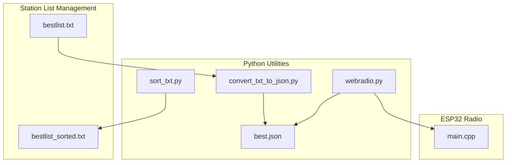
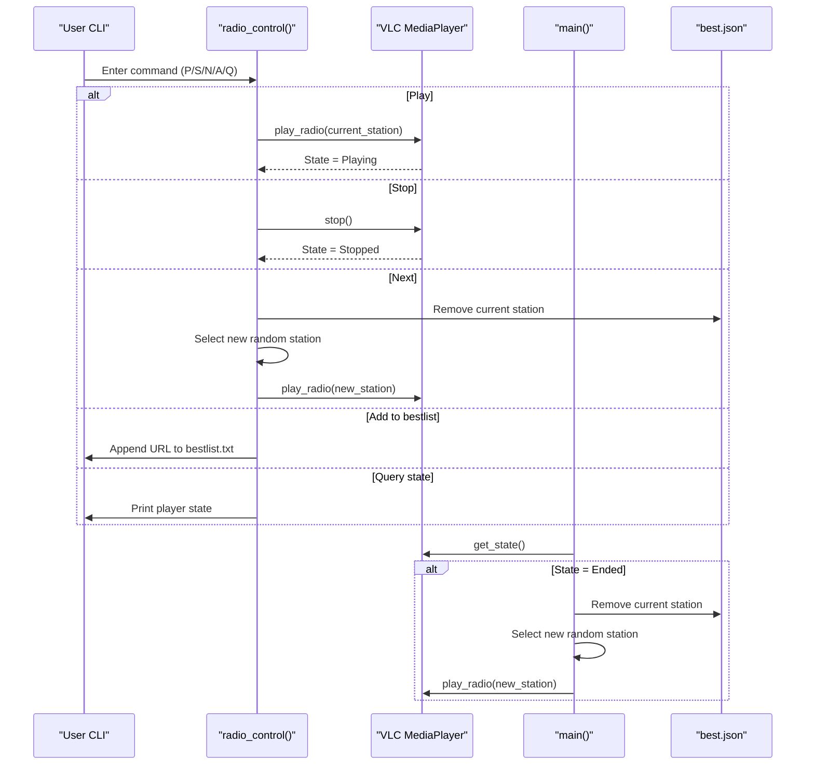
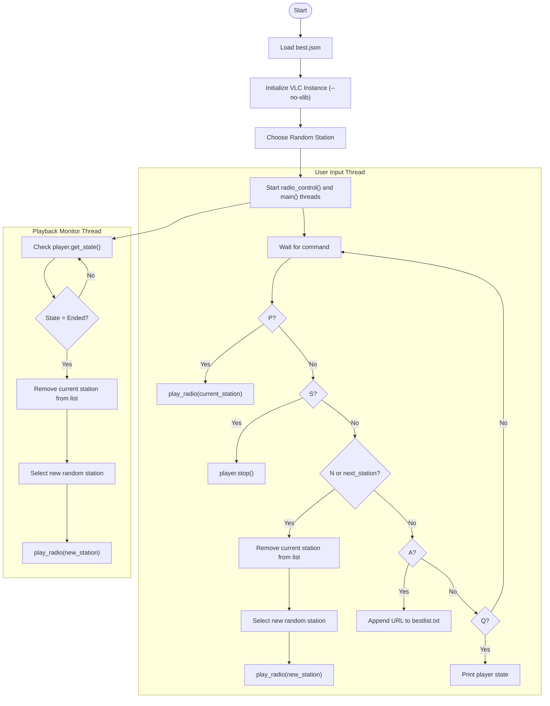
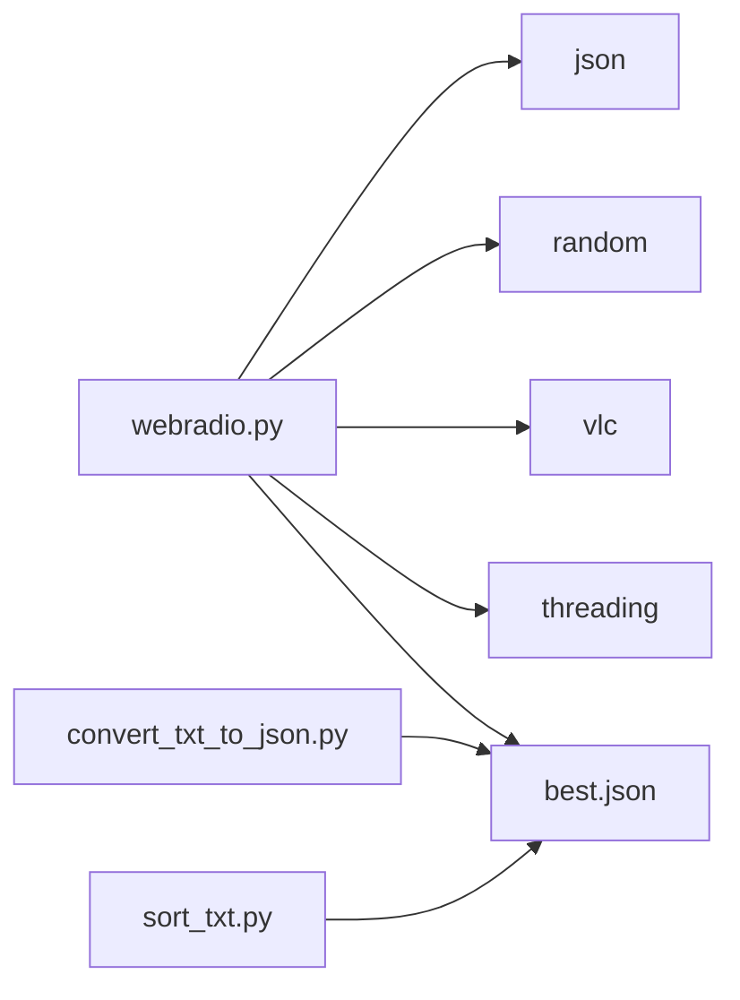

# Command-Line Radio Player

<cite>
**Referenced Files in This Document**
- [webradio.py](file://WebRadio_python_utils/webradio.py)
- [best.json](file://WebRadio_python_utils/best.json)
- [convert_txt_to_json.py](file://WebRadio_python_utils/convert_txt_to_json.py)
- [sort_txt.py](file://WebRadio_python_utils/sort_txt.py)
- [README.md](file://README.md)
- [main.cpp](file://WebRadio_ESP32_S3/src/main.cpp)
</cite>

## Table of Contents
1. [Introduction](#introduction)
2. [Project Structure](#project-structure)
3. [Core Components](#core-components)
4. [Architecture Overview](#architecture-overview)
5. [Detailed Component Analysis](#detailed-component-analysis)
6. [Dependency Analysis](#dependency-analysis)
7. [Performance Considerations](#performance-considerations)
8. [Troubleshooting Guide](#troubleshooting-guide)
9. [Conclusion](#conclusion)
10. [Appendices](#appendices)

## Introduction
This document explains the command-line radio player utility implemented in Python, focusing on the webradio.py module. It covers VLC media player integration, thread-based operation, and the interactive command interface. It also documents the station selection logic, random playlist cycling, automatic station removal when streams end, the JSON-based station database format, VLC instance configuration, error handling mechanisms, usage examples, troubleshooting common VLC issues, and integration with the best.json station list. Finally, it addresses the threading implementation for concurrent playback and user input handling.

## Project Structure
The command-line radio player resides in the WebRadio_python_utils directory alongside station list conversion and sorting utilities. The primary runtime script is webradio.py, which loads a JSON station list, initializes a VLC instance, and runs two threads: one for user input and another for continuous playback monitoring.

**Diagram sources**
- [webradio.py](file://WebRadio_python_utils/webradio.py)
- [best.json](file://WebRadio_python_utils/best.json)
- [convert_txt_to_json.py](file://WebRadio_python_utils/convert_txt_to_json.py)
- [sort_txt.py](file://WebRadio_python_utils/sort_txt.py)
- [main.cpp](file://WebRadio_ESP32_S3/src/main.cpp)

**Section sources**
- [README.md](file://README.md)

## Core Components
- webradio.py: Loads the station list from best.json, initializes a VLC instance with --no-xlib, and manages playback via two threads: one for user input and one for continuous monitoring of playback state.
- best.json: A JSON-formatted station database containing name and url pairs for radio streams.
- convert_txt_to_json.py: Converts a plain-text list of URLs into the JSON format used by the player.
- sort_txt.py: Sorts and deduplicates a plain-text station list.

Key runtime behaviors:
- Random station selection from the loaded list.
- Interactive commands: P (Play), S (Stop), N (Next), A (Add to bestlist), Q (Query state).
- Automatic station removal when a stream ends.
- Threaded operation for concurrent user input and playback monitoring.

**Section sources**
- [webradio.py](file://WebRadio_python_utils/webradio.py)
- [best.json](file://WebRadio_python_utils/best.json)
- [convert_txt_to_json.py](file://WebRadio_python_utils/convert_txt_to_json.py)
- [sort_txt.py](file://WebRadio_python_utils/sort_txt.py)

## Architecture Overview
The command-line player integrates with VLC to stream internet radio. It maintains a JSON station list, selects a station randomly, and starts playback. Two threads operate concurrently:
- User input thread: Reads commands from stdin and applies actions.
- Playback monitor thread: Continuously checks the player state and triggers station cycling when a stream ends.

**Diagram sources**
- [webradio.py](file://WebRadio_python_utils/webradio.py)

## Detailed Component Analysis

### webradio.py Implementation
- JSON loading: Loads the station list from best.json into memory.
- VLC initialization: Creates a VLC instance with --no-xlib to avoid GUI dependencies.
- Playback function: Creates a Media from the station URL and starts playback.
- Random station selection: Chooses a station at startup and during Next actions.
- Interactive control loop: Processes user commands and updates state accordingly.
- Automatic station removal: Removes the current station from the list when the stream ends or when Next is triggered.
- Threading: Starts two threads—one for user input and one for continuous playback monitoring.

Command set:
- P: Play the current station.
- S: Stop playback.
- N: Switch to a new random station and remove the old one.
- A: Append the current station URL to bestlist.txt.
- Q: Query the current player state.

Error handling:
- Exceptions during playback are caught and printed to stderr.

Thread synchronization:
- Uses a global flag next_station to coordinate between threads when a stream ends.

**Diagram sources**
- [webradio.py](file://WebRadio_python_utils/webradio.py)

**Section sources**
- [webradio.py](file://WebRadio_python_utils/webradio.py)

### best.json Station Database Format
- Structure: An array of objects with name and url keys.
- Purpose: Provides the station list for the player to select and stream.
- Integration: Loaded by webradio.py at startup and updated dynamically when stations are removed.

Example structure:
- name: Human-readable station identifier.
- url: Streaming URL for the radio station.

**Section sources**
- [best.json](file://WebRadio_python_utils/best.json)

### Station List Conversion and Sorting Utilities
- convert_txt_to_json.py: Converts a plain-text list of URLs into a JSON array of name/url pairs.
- sort_txt.py: Sorts and deduplicates a plain-text list.

These utilities support preparing and maintaining station lists for use with the player.

**Section sources**
- [convert_txt_to_json.py](file://WebRadio_python_utils/convert_txt_to_json.py)
- [sort_txt.py](file://WebRadio_python_utils/sort_txt.py)

### ESP32 Radio Integration (Context)
While the command-line player operates independently, the ESP32 firmware demonstrates how the broader system handles station selection, playback, and MQTT-based control. It includes a large station list and robust state reporting, complementing the Python player’s capabilities.

**Section sources**
- [main.cpp](file://WebRadio_ESP32_S3/src/main.cpp)

## Dependency Analysis
- webradio.py depends on:
  - json: For loading best.json.
  - random: For selecting random stations.
  - vlc: For media playback.
  - threading: For concurrent user input and playback monitoring.
- best.json is the external data dependency for station configuration.
- convert_txt_to_json.py and sort_txt.py are auxiliary tools for station list maintenance.

**Diagram sources**
- [webradio.py](file://WebRadio_python_utils/webradio.py)
- [best.json](file://WebRadio_python_utils/best.json)
- [convert_txt_to_json.py](file://WebRadio_python_utils/convert_txt_to_json.py)
- [sort_txt.py](file://WebRadio_python_utils/sort_txt.py)

**Section sources**
- [webradio.py](file://WebRadio_python_utils/webradio.py)

## Performance Considerations
- Thread overhead: Two threads are minimal and suitable for a CLI utility. Ensure the input thread does not block the playback monitor thread.
- Network latency: Stream buffering and network conditions affect startup time and stability; the monitor thread removes failing stations to mitigate repeated failures.
- JSON parsing: Loading best.json once at startup avoids repeated I/O overhead.
- VLC resource usage: Using --no-xlib reduces GUI overhead, which is appropriate for a headless CLI environment.

## Troubleshooting Guide
Common VLC issues and resolutions:
- No audio output:
  - Verify audio drivers and system audio configuration.
  - Ensure the terminal has permission to access audio devices.
- VLC fails to initialize:
  - Confirm VLC installation and availability in PATH.
  - Test VLC manually with a known working URL.
- Streams end unexpectedly:
  - The monitor thread automatically removes the station and selects a new one.
  - If the list becomes empty, the program will raise an error when trying to select a random station.
- GUI conflicts:
  - The --no-xlib option prevents GUI creation, which is intended for CLI use.

Operational tips:
- Use the Q command to check the current player state.
- Use the A command to append problematic stations to bestlist.txt for later review.
- Periodically refresh best.json using convert_txt_to_json.py and sort_txt.py to keep the list healthy.

**Section sources**
- [webradio.py](file://WebRadio_python_utils/webradio.py)

## Conclusion
The command-line radio player provides a straightforward, thread-based solution for streaming internet radio using VLC. It integrates with a JSON station database, supports interactive control, and automatically manages station cycling and removal. The design is simple yet robust, leveraging threading for concurrent user input and playback monitoring while keeping the interface minimal and accessible.

## Appendices

### Usage Examples
- Start the player: Run the Python script to load best.json and begin playback.
- Play current station: Press P.
- Stop playback: Press S.
- Switch to next station: Press N or wait for the stream to end.
- Add current station to bestlist: Press A.
- Query player state: Press Q.

### Integration Notes
- best.json is the canonical station list for the player.
- convert_txt_to_json.py and sort_txt.py help maintain and prepare station lists.
- The ESP32 firmware demonstrates complementary station management and MQTT-based control, useful for understanding the broader ecosystem.