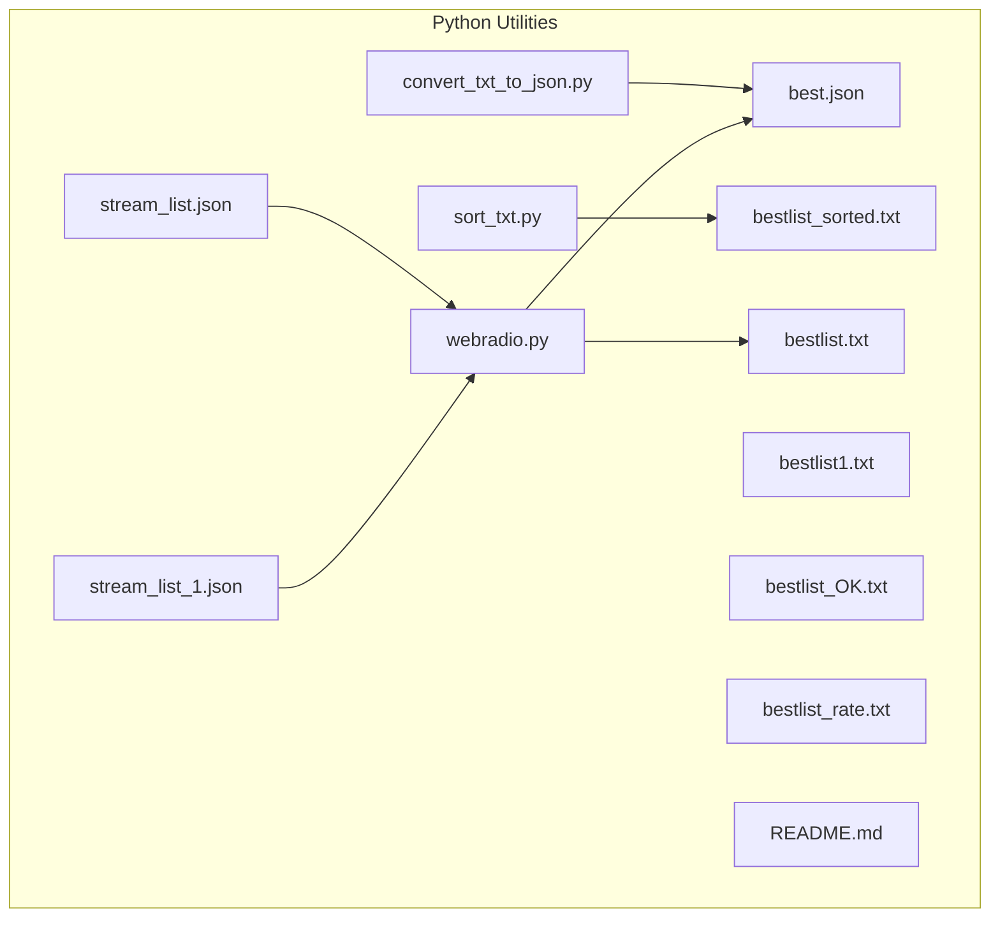
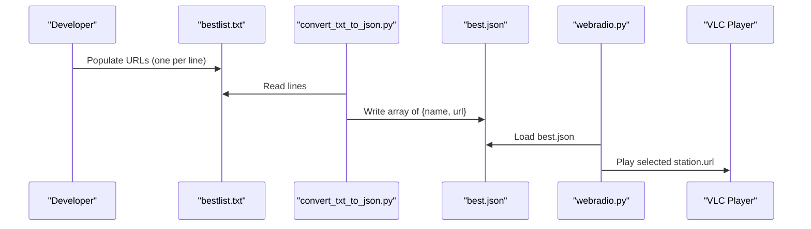
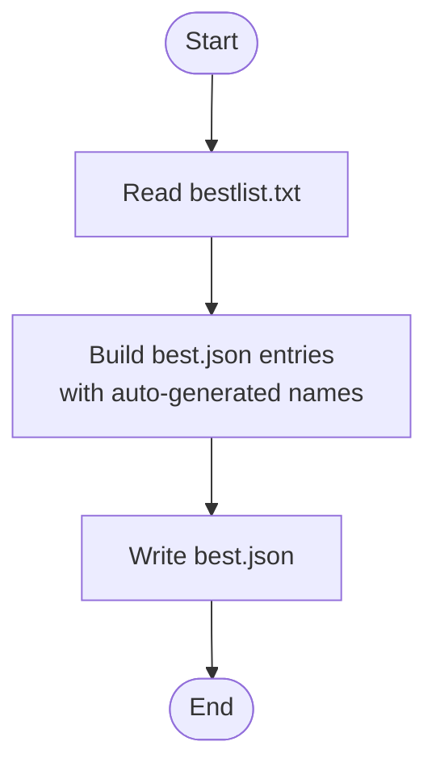
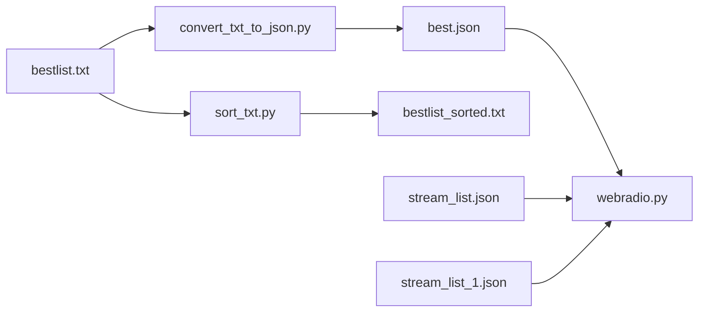

# Data Formats and Schemas

<cite>
**Referenced Files in This Document**
- [best.json](file://WebRadio_python_utils/best.json)
- [stream_list.json](file://WebRadio_python_utils/stream_list.json)
- [stream_list_1.json](file://WebRadio_python_utils/stream_list_1.json)
- [bestlist.txt](file://WebRadio_python_utils/bestlist.txt)
- [bestlist_sorted.txt](file://WebRadio_python_utils/bestlist_sorted.txt)
- [bestlist1.txt](file://WebRadio_python_utils/bestlist1.txt)
- [bestlist_OK.txt](file://WebRadio_python_utils/bestlist_OK.txt)
- [bestlist_rate.txt](file://WebRadio_python_utils/bestlist_rate.txt)
- [convert_txt_to_json.py](file://WebRadio_python_utils/convert_txt_to_json.py)
- [sort_txt.py](file://WebRadio_python_utils/sort_txt.py)
- [webradio.py](file://WebRadio_python_utils/webradio.py)
- [README.md](file://WebRadio_python_utils/README.md)
</cite>

## Table of Contents
1. [Introduction](#introduction)
2. [Project Structure](#project-structure)
3. [Core Components](#core-components)
4. [Architecture Overview](#architecture-overview)
5. [Detailed Component Analysis](#detailed-component-analysis)
6. [Dependency Analysis](#dependency-analysis)
7. [Performance Considerations](#performance-considerations)
8. [Troubleshooting Guide](#troubleshooting-guide)
9. [Conclusion](#conclusion)
10. [Appendices](#appendices)

## Introduction
This document describes the data formats and schemas used by the Python utilities for managing radio station lists. It covers:
- JSON schemas for station lists (best.json, stream_list.json)
- Text-based station list formats (bestlist.txt, bestlist_sorted.txt) and their use cases
- Expected schema for station entries, URL validation requirements, and metadata fields
- Examples of properly formatted data, common schema violations, and validation error messages
- Data versioning, backward compatibility considerations, and migration strategies
- Tools and scripts for validating data integrity and automated schema checking

## Project Structure
The Python utilities directory contains:
- JSON station lists: best.json, stream_list.json, stream_list_1.json
- Text-based station lists: bestlist.txt, bestlist_sorted.txt, bestlist1.txt, bestlist_OK.txt, bestlist_rate.txt
- Utility scripts: convert_txt_to_json.py, sort_txt.py, webradio.py
- Documentation: README.md

**Diagram sources**
- [best.json](file://WebRadio_python_utils/best.json)
- [stream_list.json](file://WebRadio_python_utils/stream_list.json)
- [stream_list_1.json](file://WebRadio_python_utils/stream_list_1.json)
- [bestlist.txt](file://WebRadio_python_utils/bestlist.txt)
- [bestlist_sorted.txt](file://WebRadio_python_utils/bestlist_sorted.txt)
- [bestlist1.txt](file://WebRadio_python_utils/bestlist1.txt)
- [bestlist_OK.txt](file://WebRadio_python_utils/bestlist_OK.txt)
- [bestlist_rate.txt](file://WebRadio_python_utils/bestlist_rate.txt)
- [convert_txt_to_json.py](file://WebRadio_python_utils/convert_txt_to_json.py)
- [sort_txt.py](file://WebRadio_python_utils/sort_txt.py)
- [webradio.py](file://WebRadio_python_utils/webradio.py)
- [README.md](file://WebRadio_python_utils/README.md)

**Section sources**
- [README.md](file://WebRadio_python_utils/README.md)

## Core Components
- best.json: JSON array of station objects with fields name and url. Used by the player.
- stream_list.json: JSON array of station objects with localized names and URLs.
- stream_list_1.json: Large JSON array of station objects with diverse names and URLs.
- bestlist.txt: Plain text list of URLs, one per line. Converted to best.json via convert_txt_to_json.py.
- bestlist_sorted.txt: Sorted and deduplicated plain text list of URLs.
- bestlist1.txt, bestlist_OK.txt, bestlist_rate.txt: Additional text lists for curated or filtered station sets.

Validation and usage:
- The player loads best.json and selects a random station to play.
- The conversion script reads bestlist.txt and writes best.json with auto-generated names.
- The sorting script removes duplicates and sorts URLs to produce bestlist_sorted.txt.

**Section sources**
- [best.json](file://WebRadio_python_utils/best.json)
- [stream_list.json](file://WebRadio_python_utils/stream_list.json)
- [stream_list_1.json](file://WebRadio_python_utils/stream_list_1.json)
- [bestlist.txt](file://WebRadio_python_utils/bestlist.txt)
- [bestlist_sorted.txt](file://WebRadio_python_utils/bestlist_sorted.txt)
- [bestlist1.txt](file://WebRadio_python_utils/bestlist1.txt)
- [bestlist_OK.txt](file://WebRadio_python_utils/bestlist_OK.txt)
- [bestlist_rate.txt](file://WebRadio_python_utils/bestlist_rate.txt)
- [convert_txt_to_json.py](file://WebRadio_python_utils/convert_txt_to_json.py)
- [sort_txt.py](file://WebRadio_python_utils/sort_txt.py)
- [webradio.py](file://WebRadio_python_utils/webradio.py)

## Architecture Overview
The data pipeline connects text-based lists to JSON for consumption by the player.

**Diagram sources**
- [convert_txt_to_json.py](file://WebRadio_python_utils/convert_txt_to_json.py)
- [best.json](file://WebRadio_python_utils/best.json)
- [webradio.py](file://WebRadio_python_utils/webradio.py)

## Detailed Component Analysis

### JSON Schema: best.json
- Root type: Array
- Elements: Objects with two required fields
  - name: string
  - url: string (valid URL)
- Validation rules
  - name must be present and non-empty
  - url must be present and a syntactically valid URL
  - No additional fields are permitted
- Typical usage
  - Loaded by the player to select and play a random station

Examples of proper entries:
- See [best.json](file://WebRadio_python_utils/best.json)

Common violations:
- Missing name or url
- url is not a valid URL
- Extra fields not defined in the schema

Validation error messages:
- When loading fails due to invalid JSON or missing keys, Python JSON parsing raises errors during load.

Backward compatibility:
- The schema is minimal and stable. Adding optional fields later requires updating consumers.

Migration strategy:
- If extending schema, maintain existing fields and append new ones; update convert_txt_to_json.py to populate new fields.

**Section sources**
- [best.json](file://WebRadio_python_utils/best.json)
- [convert_txt_to_json.py](file://WebRadio_python_utils/convert_txt_to_json.py)
- [webradio.py](file://WebRadio_python_utils/webradio.py)

### JSON Schema: stream_list.json
- Root type: Array
- Elements: Objects with two required fields
  - name: string (localized)
  - url: string (valid URL)
- Validation rules
  - name must be present and non-empty
  - url must be present and a syntactically valid URL
- Typical usage
  - Used by components that require localized station names

Examples of proper entries:
- See [stream_list.json](file://WebRadio_python_utils/stream_list.json)

Common violations:
- Missing name or url
- url is not a valid URL
- Non-localized or inconsistent naming

Validation error messages:
- JSON parsing errors or missing keys during load.

**Section sources**
- [stream_list.json](file://WebRadio_python_utils/stream_list.json)

### JSON Schema: stream_list_1.json
- Root type: Array
- Elements: Objects with two required fields
  - name: string (often localized)
  - url: string (valid URL)
- Validation rules
  - name must be present and non-empty
  - url must be present and a syntactically valid URL
- Typical usage
  - Large catalog of stations for selection and filtering

Examples of proper entries:
- See [stream_list_1.json](file://WebRadio_python_utils/stream_list_1.json)

Common violations:
- Missing name or url
- url is not a valid URL
- Encoding issues in names

Validation error messages:
- JSON parsing errors or missing keys during load.

**Section sources**
- [stream_list_1.json](file://WebRadio_python_utils/stream_list_1.json)

### Text Schema: bestlist.txt
- Format: Plain text, one URL per line
- Validation rules
  - Each non-empty line must be a valid URL
  - Empty lines are allowed and ignored by consumers
- Typical usage
  - Source for converting to best.json

Examples of proper entries:
- See [bestlist.txt](file://WebRadio_python_utils/bestlist.txt)

Common violations:
- Non-URL text
- Empty lines mixed with URLs
- Duplicate URLs (use bestlist_sorted.txt to deduplicate)

Validation error messages:
- During conversion to JSON, invalid URLs cause parsing errors.

**Section sources**
- [bestlist.txt](file://WebRadio_python_utils/bestlist.txt)
- [convert_txt_to_json.py](file://WebRadio_python_utils/convert_txt_to_json.py)

### Text Schema: bestlist_sorted.txt
- Format: Plain text, one URL per line
- Validation rules
  - Each non-empty line must be a valid URL
  - Duplicates removed; lines sorted lexicographically
- Typical usage
  - Deduplicated and sorted list for reliable consumption

Examples of proper entries:
- See [bestlist_sorted.txt](file://WebRadio_python_utils/bestlist_sorted.txt)

Common violations:
- Non-URL text
- Unsorted order
- Presence of duplicates

Validation error messages:
- Sorting script does not validate URLs; conversion to JSON may fail.

**Section sources**
- [bestlist_sorted.txt](file://WebRadio_python_utils/bestlist_sorted.txt)
- [sort_txt.py](file://WebRadio_python_utils/sort_txt.py)

### Additional Text Lists
- bestlist1.txt: Curated set of URLs for initial population
- bestlist_OK.txt: Filtered set with potential malformed lines (see anomalies)
- bestlist_rate.txt: Subset used for rating or selection

Validation considerations:
- These files may contain malformed lines; prefer bestlist_sorted.txt for production use.

**Section sources**
- [bestlist1.txt](file://WebRadio_python_utils/bestlist1.txt)
- [bestlist_OK.txt](file://WebRadio_python_utils/bestlist_OK.txt)
- [bestlist_rate.txt](file://WebRadio_python_utils/bestlist_rate.txt)

### URL Validation Requirements
- Valid URL syntax: scheme (http/https), host, optional port/path/query
- No trailing whitespace or extra characters around URLs
- For bestlist_OK.txt, observe malformed lines that mix adjacent URLs without separators

Validation checks:
- Convert text to JSON: invalid URLs cause JSON parse errors
- Runtime playback: invalid URLs cause player initialization failures

**Section sources**
- [convert_txt_to_json.py](file://WebRadio_python_utils/convert_txt_to_json.py)
- [webradio.py](file://WebRadio_python_utils/webradio.py)
- [bestlist_OK.txt](file://WebRadio_python_utils/bestlist_OK.txt)

### Metadata Fields
- name: Human-readable station identifier
- url: Stream URL for audio playback

Constraints:
- name must be non-empty
- url must be a valid URL

Extensibility:
- Current schema does not define additional metadata fields; future versions may add optional fields (e.g., bitrate, codec, country) requiring consumer updates.

**Section sources**
- [best.json](file://WebRadio_python_utils/best.json)
- [stream_list.json](file://WebRadio_python_utils/stream_list.json)
- [stream_list_1.json](file://WebRadio_python_utils/stream_list_1.json)

### Data Versioning and Migration
- Current state: Minimal JSON schema with name and url
- Backward compatibility: Consumers expect name and url; adding optional fields maintains compatibility
- Migration steps:
  - Define new fields in converters and producers
  - Update consumers to handle new fields gracefully
  - Maintain existing fields to avoid breaking existing clients

**Section sources**
- [convert_txt_to_json.py](file://WebRadio_python_utils/convert_txt_to_json.py)
- [webradio.py](file://WebRadio_python_utils/webradio.py)

### Tools and Scripts for Validation and Automation
- convert_txt_to_json.py
  - Reads bestlist.txt
  - Creates best.json with auto-generated names
  - Validates URLs by attempting JSON write
- sort_txt.py
  - Reads bestlist.txt
  - Removes duplicates and sorts lines
  - Writes bestlist_sorted.txt
- webradio.py
  - Loads best.json
  - Randomly selects a station and plays via VLC
  - Adds current station URL to bestlist.txt when requested

**Diagram sources**
- [convert_txt_to_json.py](file://WebRadio_python_utils/convert_txt_to_json.py)

**Section sources**
- [convert_txt_to_json.py](file://WebRadio_python_utils/convert_txt_to_json.py)
- [sort_txt.py](file://WebRadio_python_utils/sort_txt.py)
- [webradio.py](file://WebRadio_python_utils/webradio.py)

## Dependency Analysis
- webradio.py depends on best.json for station data
- convert_txt_to_json.py depends on bestlist.txt for input
- sort_txt.py depends on bestlist.txt for input and produces bestlist_sorted.txt

**Diagram sources**
- [bestlist.txt](file://WebRadio_python_utils/bestlist.txt)
- [convert_txt_to_json.py](file://WebRadio_python_utils/convert_txt_to_json.py)
- [best.json](file://WebRadio_python_utils/best.json)
- [bestlist_sorted.txt](file://WebRadio_python_utils/bestlist_sorted.txt)
- [sort_txt.py](file://WebRadio_python_utils/sort_txt.py)
- [webradio.py](file://WebRadio_python_utils/webradio.py)
- [stream_list.json](file://WebRadio_python_utils/stream_list.json)
- [stream_list_1.json](file://WebRadio_python_utils/stream_list_1.json)

**Section sources**
- [webradio.py](file://WebRadio_python_utils/webradio.py)
- [convert_txt_to_json.py](file://WebRadio_python_utils/convert_txt_to_json.py)
- [sort_txt.py](file://WebRadio_python_utils/sort_txt.py)

## Performance Considerations
- JSON loading: best.json is small; loading cost is negligible
- Sorting: bestlist_sorted.txt reduces duplicates and improves lookup performance
- URL validation: early detection prevents runtime failures

## Troubleshooting Guide
Common issues and resolutions:
- JSON load errors
  - Cause: Malformed JSON or missing fields
  - Resolution: Ensure name and url are present and valid; re-run conversion
- URL errors during playback
  - Cause: Invalid or unreachable URL
  - Resolution: Validate URL; use bestlist_sorted.txt; test URL externally
- Duplicate URLs
  - Cause: bestlist.txt contains duplicates
  - Resolution: Run sort_txt.py to produce bestlist_sorted.txt
- Mixed or malformed lines in bestlist_OK.txt
  - Cause: Adjacent URLs concatenated without separators
  - Resolution: Clean the file or switch to bestlist_sorted.txt

Validation error messages:
- JSON parsing errors when loading best.json
- Player initialization errors when url is invalid

**Section sources**
- [best.json](file://WebRadio_python_utils/best.json)
- [bestlist_OK.txt](file://WebRadio_python_utils/bestlist_OK.txt)
- [sort_txt.py](file://WebRadio_python_utils/sort_txt.py)
- [webradio.py](file://WebRadio_python_utils/webradio.py)

## Conclusion
The Python utilities define clear, minimal schemas for station lists:
- JSON arrays with name and url fields
- Text lists for ingestion and maintenance
- Scripts for conversion, sorting, and playback
Adhering to these schemas ensures reliable operation and easy maintenance. Extending the schema should preserve backward compatibility and update all producers and consumers accordingly.

## Appendices

### Appendix A: Field Definitions and Types
- name: string (non-empty)
- url: string (valid URL)

**Section sources**
- [best.json](file://WebRadio_python_utils/best.json)
- [stream_list.json](file://WebRadio_python_utils/stream_list.json)
- [stream_list_1.json](file://WebRadio_python_utils/stream_list_1.json)

### Appendix B: Example References
- Proper JSON entries: [best.json](file://WebRadio_python_utils/best.json)
- Proper text entries: [bestlist.txt](file://WebRadio_python_utils/bestlist.txt), [bestlist_sorted.txt](file://WebRadio_python_utils/bestlist_sorted.txt)
- Malformed text entries: [bestlist_OK.txt](file://WebRadio_python_utils/bestlist_OK.txt)