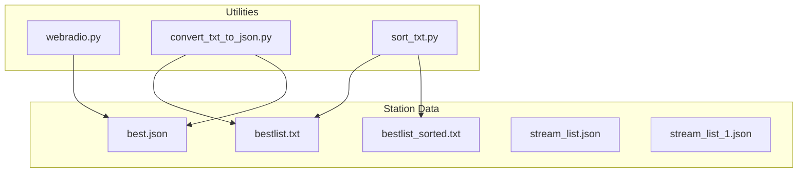
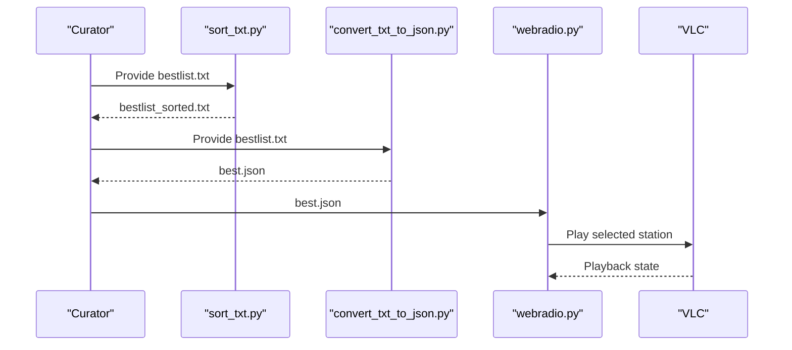
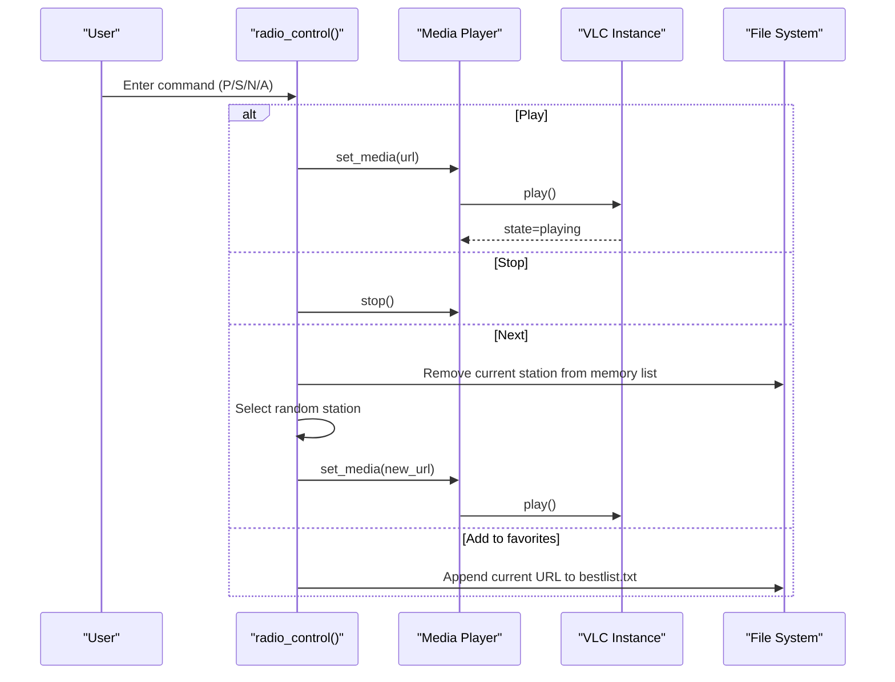
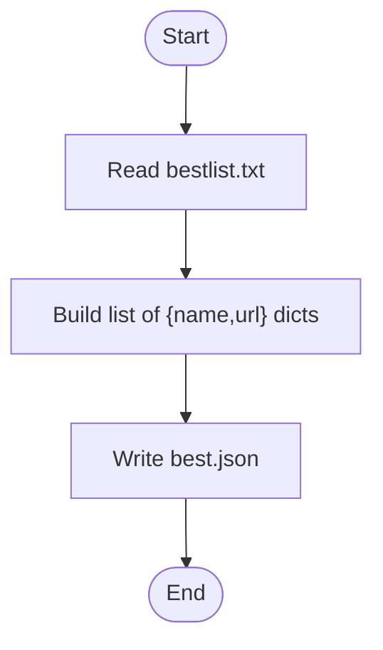
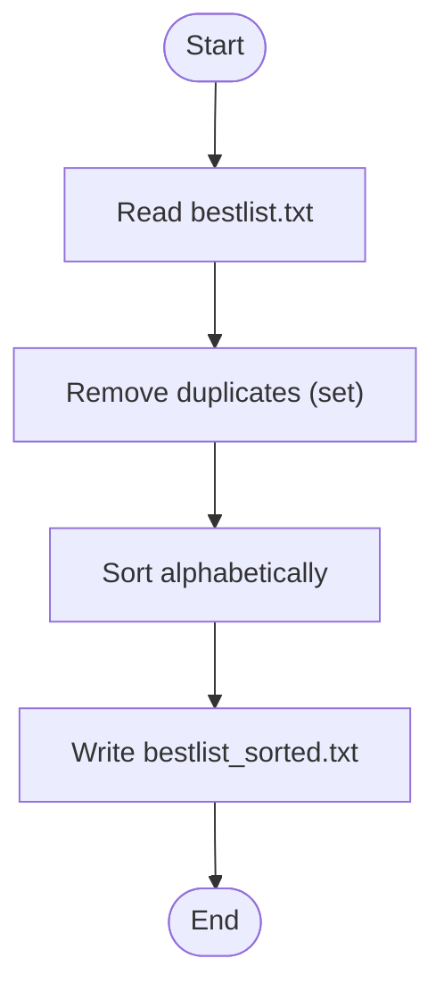
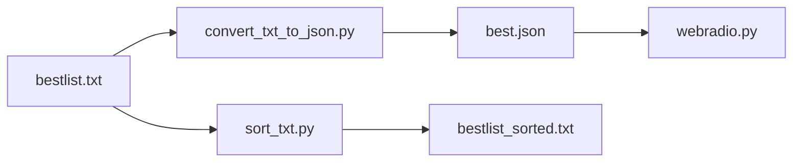

# Python Utilities

<cite>
**Referenced Files in This Document**
- [webradio.py](file://WebRadio_python_utils/webradio.py)
- [convert_txt_to_json.py](file://WebRadio_python_utils/convert_txt_to_json.py)
- [sort_txt.py](file://WebRadio_python_utils/sort_txt.py)
- [README.md](file://WebRadio_python_utils/README.md)
- [bestlist.txt](file://WebRadio_python_utils/bestlist.txt)
- [bestlist_sorted.txt](file://WebRadio_python_utils/bestlist_sorted.txt)
- [best.json](file://WebRadio_python_utils/best.json)
- [bestlist1.txt](file://WebRadio_python_utils/bestlist1.txt)
- [bestlist_OK.txt](file://WebRadio_python_utils/bestlist_OK.txt)
- [bestlist_rate.txt](file://WebRadio_python_utils/bestlist_rate.txt)
- [stream_list.json](file://WebRadio_python_utils/stream_list.json)
- [stream_list_1.json](file://WebRadio_python_utils/stream_list_1.json)
</cite>

## Table of Contents
1. [Introduction](#introduction)
2. [Project Structure](#project-structure)
3. [Core Components](#core-components)
4. [Architecture Overview](#architecture-overview)
5. [Detailed Component Analysis](#detailed-component-analysis)
6. [Dependency Analysis](#dependency-analysis)
7. [Performance Considerations](#performance-considerations)
8. [Troubleshooting Guide](#troubleshooting-guide)
9. [Conclusion](#conclusion)
10. [Appendices](#appendices)

## Introduction
This document describes the Python utilities used to manage and operate the WebRadio project’s station lists and playback. It covers:
- Command-line radio player with VLC integration
- Station list conversion from text to JSON
- Sorting and deduplication of station lists
- Data formats and schemas
- Usage examples, command-line arguments, and integration workflows
- Batch processing, error handling, and validation guidance
- Extension and integration tips

## Project Structure
The utilities live under the WebRadio_python_utils directory and include:
- Player script: webradio.py
- Converter script: convert_txt_to_json.py
- Sorter script: sort_txt.py
- Supporting data files: bestlist.txt, bestlist_sorted.txt, best.json, stream_list.json, stream_list_1.json, plus several bestlist_* variants
- Documentation: README.md

**Diagram sources**
- [webradio.py](file://WebRadio_python_utils/webradio.py)
- [convert_txt_to_json.py](file://WebRadio_python_utils/convert_txt_to_json.py)
- [sort_txt.py](file://WebRadio_python_utils/sort_txt.py)
- [bestlist.txt](file://WebRadio_python_utils/bestlist.txt)
- [bestlist_sorted.txt](file://WebRadio_python_utils/bestlist_sorted.txt)
- [best.json](file://WebRadio_python_utils/best.json)
- [stream_list.json](file://WebRadio_python_utils/stream_list.json)
- [stream_list_1.json](file://WebRadio_python_utils/stream_list_1.json)

**Section sources**
- [README.md](file://WebRadio_python_utils/README.md)

## Core Components
- webradio.py: A command-line radio player that loads a JSON station list, selects a random station, and plays it via VLC. It supports interactive controls for play, stop, next, and adding the current station to a favorites list.
- convert_txt_to_json.py: Reads a plain-text list of station URLs and writes a JSON list suitable for the player and other components.
- sort_txt.py: Reads a station list, removes duplicates, sorts entries, and writes a new sorted list.

**Section sources**
- [webradio.py](file://WebRadio_python_utils/webradio.py)
- [convert_txt_to_json.py](file://WebRadio_python_utils/convert_txt_to_json.py)
- [sort_txt.py](file://WebRadio_python_utils/sort_txt.py)
- [README.md](file://WebRadio_python_utils/README.md)

## Architecture Overview
The utilities form a small pipeline:
- Text-based station lists are curated and normalized
- They are converted to JSON for structured consumption
- The player consumes JSON to provide playback
- Sorting ensures deduplication and ordering

**Diagram sources**
- [sort_txt.py](file://WebRadio_python_utils/sort_txt.py)
- [convert_txt_to_json.py](file://WebRadio_python_utils/convert_txt_to_json.py)
- [webradio.py](file://WebRadio_python_utils/webradio.py)

## Detailed Component Analysis

### webradio.py: Command-Line Radio Player with VLC Integration
Purpose:
- Load a JSON station list
- Randomly select a station
- Play via VLC without GUI
- Interactive control loop for play, stop, next, and add-to-favorites

Key behaviors:
- Loads best.json at startup
- Initializes VLC instance and media player
- play_radio(station) sets media and starts playback
- radio_control() handles user input and playback transitions
- main() thread monitors playback state and auto-switches on end

Command-line interface:
- No arguments; runs interactively
- Interactive commands:
  - P: Play current station
  - S: Stop playback
  - N: Switch to a new random station
  - A: Append current station URL to bestlist.txt

Playback control:
- Uses VLC state checks to detect end-of-stream and trigger next selection
- Removes the last played station from the in-memory list before selecting the next

Error handling:
- Basic exception handling around media creation and playback
- Prints error messages on failure

Integration notes:
- Expects best.json to exist in the working directory
- Writes bestlist.txt in append mode for favorites

**Diagram sources**
- [webradio.py](file://WebRadio_python_utils/webradio.py)

**Section sources**
- [webradio.py](file://WebRadio_python_utils/webradio.py)
- [README.md](file://WebRadio_python_utils/README.md)

### convert_txt_to_json.py: Station List Converter
Purpose:
- Convert a plain-text list of station URLs into a JSON array of station objects

Behavior:
- Reads bestlist.txt line by line
- Builds a list of dictionaries with keys "name" and "url"
- Writes best.json with indentation for readability

Data model:
- Output JSON is an array of objects with:
  - name: string (auto-generated label)
  - url: string (station URL)

Usage:
- python convert_txt_to_json.py

Validation:
- Ensures each line is stripped of whitespace before use
- Does not validate URL format or reachability

Batch processing:
- Single pass over the input file; efficient for typical sizes

**Diagram sources**
- [convert_txt_to_json.py](file://WebRadio_python_utils/convert_txt_to_json.py)

**Section sources**
- [convert_txt_to_json.py](file://WebRadio_python_utils/convert_txt_to_json.py)
- [bestlist.txt](file://WebRadio_python_utils/bestlist.txt)
- [best.json](file://WebRadio_python_utils/best.json)

### sort_txt.py: Sorting and Deduplication Tool
Purpose:
- Remove duplicate station URLs
- Sort entries alphabetically
- Write a clean bestlist_sorted.txt

Behavior:
- Reads bestlist.txt
- Converts lines to a set to remove duplicates
- Sorts the set
- Writes to bestlist_sorted.txt

Usage:
- python sort_txt.py

Validation:
- No URL validation; relies on stable string comparison

Batch processing:
- Single pass read and write; suitable for large lists

**Diagram sources**
- [sort_txt.py](file://WebRadio_python_utils/sort_txt.py)

**Section sources**
- [sort_txt.py](file://WebRadio_python_utils/sort_txt.py)
- [bestlist.txt](file://WebRadio_python_utils/bestlist.txt)
- [bestlist_sorted.txt](file://WebRadio_python_utils/bestlist_sorted.txt)

## Dependency Analysis
- webradio.py depends on:
  - best.json (station list)
  - VLC runtime/libraries
  - Threading for concurrent control and playback monitoring
- convert_txt_to_json.py depends on:
  - bestlist.txt (input)
  - best.json (output)
- sort_txt.py depends on:
  - bestlist.txt (input)
  - bestlist_sorted.txt (output)

**Diagram sources**
- [convert_txt_to_json.py](file://WebRadio_python_utils/convert_txt_to_json.py)
- [sort_txt.py](file://WebRadio_python_utils/sort_txt.py)
- [webradio.py](file://WebRadio_python_utils/webradio.py)
- [bestlist.txt](file://WebRadio_python_utils/bestlist.txt)
- [bestlist_sorted.txt](file://WebRadio_python_utils/bestlist_sorted.txt)
- [best.json](file://WebRadio_python_utils/best.json)

**Section sources**
- [webradio.py](file://WebRadio_python_utils/webradio.py)
- [convert_txt_to_json.py](file://WebRadio_python_utils/convert_txt_to_json.py)
- [sort_txt.py](file://WebRadio_python_utils/sort_txt.py)

## Performance Considerations
- Sorting and deduplication:
  - Using a set for deduplication reduces overhead compared to repeated membership checks
  - Sorting is linearithmic in the number of unique entries
- JSON conversion:
  - Single-pass read/write; minimal memory footprint for typical station lists
- Player:
  - Random selection is O(n) for list removal; consider an immutable copy or queue for very large lists
  - VLC initialization occurs once; media switching is lightweight
- I/O:
  - All scripts perform straightforward file I/O; ensure adequate disk throughput for large files

## Troubleshooting Guide
Common issues and resolutions:
- VLC not installed or not accessible:
  - Ensure VLC is installed and available in PATH
  - The player initializes VLC with a non-Xlib flag; verify system audio permissions
- Empty or malformed best.json:
  - Verify convert_txt_to_json.py ran successfully
  - Confirm bestlist.txt contains valid URLs (one per line)
- Duplicate or unsorted entries:
  - Run sort_txt.py to normalize bestlist.txt
- Playback stops unexpectedly:
  - The player auto-switches on end-of-stream; confirm network connectivity and URL validity
- Adding to favorites fails:
  - Ensure bestlist.txt is writable in the working directory

Validation tips:
- Use bestlist_OK.txt and bestlist_rate.txt as reference samples to compare against your input
- For large lists, consider validating a subset of URLs before full conversion

**Section sources**
- [webradio.py](file://WebRadio_python_utils/webradio.py)
- [convert_txt_to_json.py](file://WebRadio_python_utils/convert_txt_to_json.py)
- [sort_txt.py](file://WebRadio_python_utils/sort_txt.py)
- [bestlist_OK.txt](file://WebRadio_python_utils/bestlist_OK.txt)
- [bestlist_rate.txt](file://WebRadio_python_utils/bestlist_rate.txt)

## Conclusion
The Python utilities provide a streamlined workflow for managing WebRadio station lists:
- Normalize and deduplicate station URLs
- Convert to a structured JSON format
- Play stations via VLC with simple interactive controls
They are designed for simplicity and ease of integration into larger systems. Extending them involves adding validation, rate-limiting, or richer metadata while preserving the existing data formats.

## Appendices

### Data Formats and Schemas

- bestlist.txt
  - Plain text, one URL per line
  - Used as input for conversion and sorting

- bestlist_sorted.txt
  - Plain text, one URL per line, sorted and deduplicated

- best.json
  - JSON array of station objects
  - Schema:
    - Array of objects with:
      - name: string
      - url: string

- stream_list.json and stream_list_1.json
  - JSON arrays of station objects with localized names and URLs
  - Similar schema to best.json

Examples of representative entries:
- best.json entry:
  - {"name": "Radio 0", "url": "http://example.com/stream"}
- stream_list.json entry:
  - {"name": "Радио SP12", "url": "https://example.com/stream"}

**Section sources**
- [best.json](file://WebRadio_python_utils/best.json)
- [stream_list.json](file://WebRadio_python_utils/stream_list.json)
- [stream_list_1.json](file://WebRadio_python_utils/stream_list_1.json)
- [bestlist.txt](file://WebRadio_python_utils/bestlist.txt)
- [bestlist_sorted.txt](file://WebRadio_python_utils/bestlist_sorted.txt)

### Usage Examples and Workflows

- Convert a station list to JSON:
  - python convert_txt_to_json.py
  - Produces best.json from bestlist.txt

- Sort and deduplicate a station list:
  - python sort_txt.py
  - Produces bestlist_sorted.txt from bestlist.txt

- Play stations interactively:
  - python webradio.py
  - Controls:
    - P: Play
    - S: Stop
    - N: Next
    - A: Add current station to bestlist.txt

- Integration workflow:
  - Curate bestlist.txt
  - Run sort_txt.py to produce bestlist_sorted.txt
  - Run convert_txt_to_json.py to produce best.json
  - Run webradio.py to play stations

**Section sources**
- [README.md](file://WebRadio_python_utils/README.md)
- [convert_txt_to_json.py](file://WebRadio_python_utils/convert_txt_to_json.py)
- [sort_txt.py](file://WebRadio_python_utils/sort_txt.py)
- [webradio.py](file://WebRadio_python_utils/webradio.py)

### Extending the Utilities
- Add URL validation:
  - Validate URLs before writing best.json
- Add rate limiting:
  - Limit requests per minute to avoid throttling
- Enhance metadata:
  - Extend station objects with genre, country, bitrate, etc.
- Batch processing:
  - Process multiple input files concurrently
- Logging:
  - Replace print statements with structured logging
- Persistence:
  - Store playback history and favorites in a database or structured file