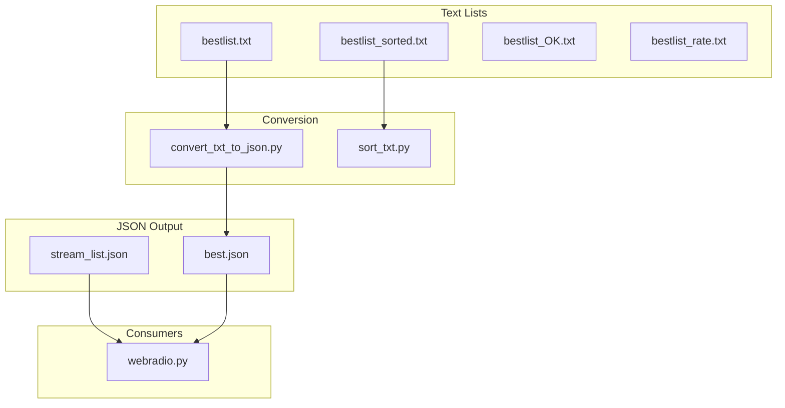
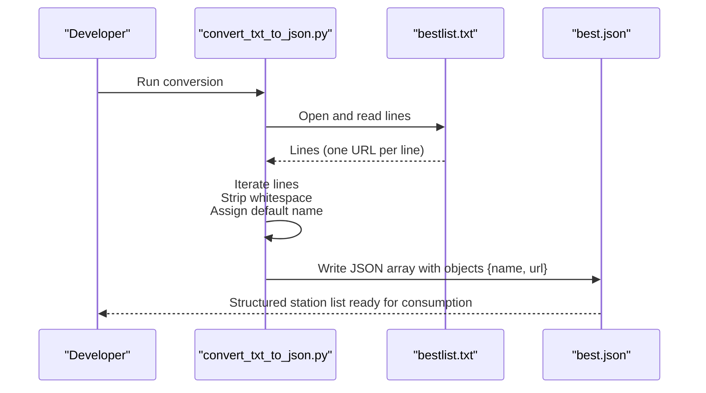
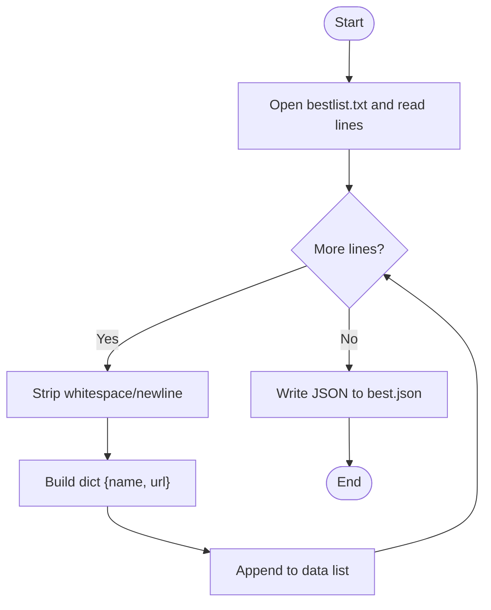

# Station List Converter

<cite>
**Referenced Files in This Document**
- [convert_txt_to_json.py](file://WebRadio_python_utils/convert_txt_to_json.py)
- [README.md](file://WebRadio_python_utils/README.md)
- [bestlist.txt](file://WebRadio_python_utils/bestlist.txt)
- [bestlist_sorted.txt](file://WebRadio_python_utils/bestlist_sorted.txt)
- [best.json](file://WebRadio_python_utils/best.json)
- [sort_txt.py](file://WebRadio_python_utils/sort_txt.py)
- [bestlist_OK.txt](file://WebRadio_python_utils/bestlist_OK.txt)
- [bestlist_rate.txt](file://WebRadio_python_utils/bestlist_rate.txt)
- [stream_list.json](file://WebRadio_python_utils/stream_list.json)
- [webradio.py](file://WebRadio_python_utils/webradio.py)
</cite>

## Table of Contents
1. [Introduction](#introduction)
2. [Project Structure](#project-structure)
3. [Core Components](#core-components)
4. [Architecture Overview](#architecture-overview)
5. [Detailed Component Analysis](#detailed-component-analysis)
6. [Dependency Analysis](#dependency-analysis)
7. [Performance Considerations](#performance-considerations)
8. [Troubleshooting Guide](#troubleshooting-guide)
9. [Conclusion](#conclusion)
10. [Appendices](#appendices)

## Introduction
This document explains the station list conversion utility that transforms plain-text station lists into a structured JSON format suitable for the WebRadio ecosystem. It focuses on the convert_txt_to_json.py script, detailing input and output formats, transformation logic, JSON schema requirements, and integration with the broader station management workflow. It also covers batch processing considerations, error handling for malformed input, and guidance for customizing conversion rules and extending support for different input formats.

## Project Structure
The station list conversion utility resides in the WebRadio_python_utils directory. The key files involved in the conversion process and related workflows are:
- convert_txt_to_json.py: The conversion script that reads a plain-text list and writes a JSON array.
- bestlist.txt: Source text file containing one station URL per line.
- best.json: Target JSON file containing an array of station objects.
- sort_txt.py: Utility to deduplicate and sort the text list.
- bestlist_sorted.txt: Deduplicated and sorted version of the station list.
- bestlist_OK.txt, bestlist_rate.txt: Additional curated or rated lists used in station management.
- stream_list.json: An example of a JSON station list used elsewhere in the project.
- webradio.py: Player script that consumes best.json to play stations.

**Diagram sources**
- [convert_txt_to_json.py](file://WebRadio_python_utils/convert_txt_to_json.py)
- [sort_txt.py](file://WebRadio_python_utils/sort_txt.py)
- [bestlist.txt](file://WebRadio_python_utils/bestlist.txt)
- [bestlist_sorted.txt](file://WebRadio_python_utils/bestlist_sorted.txt)
- [best.json](file://WebRadio_python_utils/best.json)
- [stream_list.json](file://WebRadio_python_utils/stream_list.json)
- [webradio.py](file://WebRadio_python_utils/webradio.py)

**Section sources**
- [README.md](file://WebRadio_python_utils/README.md)
- [convert_txt_to_json.py](file://WebRadio_python_utils/convert_txt_to_json.py)
- [sort_txt.py](file://WebRadio_python_utils/sort_txt.py)

## Core Components
- convert_txt_to_json.py: Reads bestlist.txt line by line, builds a list of dictionaries with keys name and url, and writes the result to best.json.
- bestlist.txt: Plain-text file where each line is a station URL. Used as the primary input for conversion.
- best.json: JSON array of station objects with name and url fields. Consumed by the player and other components.
- sort_txt.py: Deduplicates and sorts bestlist.txt, writing bestlist_sorted.txt.
- webradio.py: Loads best.json and plays stations; demonstrates the expected JSON schema.

Key behaviors:
- Input: bestlist.txt with one URL per line.
- Transformation: Iterates lines, strips whitespace/newlines, assigns a default name based on index, and creates a dictionary per entry.
- Output: best.json as a JSON array of objects with name and url.

**Section sources**
- [convert_txt_to_json.py](file://WebRadio_python_utils/convert_txt_to_json.py)
- [bestlist.txt](file://WebRadio_python_utils/bestlist.txt)
- [best.json](file://WebRadio_python_utils/best.json)
- [webradio.py](file://WebRadio_python_utils/webradio.py)

## Architecture Overview
The conversion pipeline transforms unstructured text into a structured JSON array consumed by downstream components.

**Diagram sources**
- [convert_txt_to_json.py](file://WebRadio_python_utils/convert_txt_to_json.py)
- [bestlist.txt](file://WebRadio_python_utils/bestlist.txt)
- [best.json](file://WebRadio_python_utils/best.json)

## Detailed Component Analysis

### convert_txt_to_json.py
Purpose:
- Convert a plain-text station list into a JSON array of station objects.

Processing logic:
- Opens bestlist.txt and reads all lines.
- Iterates over lines, stripping trailing newline/carriage return characters.
- Creates a dictionary with keys name and url for each line.
- Writes the resulting list to best.json with indentation and UTF-8 encoding.

JSON schema requirements:
- Array of objects with:
  - name: string
  - url: string (valid URL)

Validation requirements:
- Each line must be a single URL.
- The script does not validate URLs; downstream consumers (e.g., the player) handle playback.

Batch processing:
- Processes all lines in the input file in a single pass.
- No built-in batching or chunking.

Error handling:
- No explicit exception handling for missing files, invalid JSON, or malformed lines.
- If bestlist.txt is missing, the script will raise a file-not-found error.
- If a line is empty, it will still produce an entry with an empty url.

Extensibility:
- The script can be adapted to accept command-line arguments for input/output filenames.
- The naming convention can be customized by changing the default name assignment logic.

**Diagram sources**
- [convert_txt_to_json.py](file://WebRadio_python_utils/convert_txt_to_json.py)

**Section sources**
- [convert_txt_to_json.py](file://WebRadio_python_utils/convert_txt_to_json.py)
- [bestlist.txt](file://WebRadio_python_utils/bestlist.txt)
- [best.json](file://WebRadio_python_utils/best.json)

### Input/Output Formats and Examples

Input format (bestlist.txt):
- Plain text, one URL per line.
- Example entries:
  - http://example.com/stream
  - https://secure.example.com/live

Output format (best.json):
- JSON array of objects with keys name and url.
- Example entries:
  - {"name": "Radio 0", "url": "http://example.com/stream"}
  - {"name": "Radio 1", "url": "https://secure.example.com/live"}

Integration with webradio.py:
- The player loads best.json and selects a random station to play.
- It expects each object to have name and url fields.

**Section sources**
- [bestlist.txt](file://WebRadio_python_utils/bestlist.txt)
- [best.json](file://WebRadio_python_utils/best.json)
- [webradio.py](file://WebRadio_python_utils/webradio.py)

### Related Utilities

sort_txt.py:
- Deduplicates and sorts bestlist.txt.
- Writes bestlist_sorted.txt with unique, alphabetically ordered URLs.

bestlist_OK.txt, bestlist_rate.txt:
- Alternative curated lists used in station management workflows.

stream_list.json:
- Another example of a JSON station list used elsewhere in the project.

These files demonstrate the variety of input formats and the flexibility of the system.

**Section sources**
- [sort_txt.py](file://WebRadio_python_utils/sort_txt.py)
- [bestlist_sorted.txt](file://WebRadio_python_utils/bestlist_sorted.txt)
- [bestlist_OK.txt](file://WebRadio_python_utils/bestlist_OK.txt)
- [bestlist_rate.txt](file://WebRadio_python_utils/bestlist_rate.txt)
- [stream_list.json](file://WebRadio_python_utils/stream_list.json)

## Dependency Analysis
The conversion utility depends on:
- bestlist.txt: Source of station URLs.
- Python’s json module: For writing the JSON output.
- Standard file I/O: For reading and writing text and JSON files.

Downstream consumers depend on:
- best.json: Expected to be a JSON array of station objects with name and url.

**Diagram sources**
- [convert_txt_to_json.py](file://WebRadio_python_utils/convert_txt_to_json.py)
- [bestlist.txt](file://WebRadio_python_utils/bestlist.txt)
- [best.json](file://WebRadio_python_utils/best.json)
- [webradio.py](file://WebRadio_python_utils/webradio.py)

**Section sources**
- [convert_txt_to_json.py](file://WebRadio_python_utils/convert_txt_to_json.py)
- [webradio.py](file://WebRadio_python_utils/webradio.py)

## Performance Considerations
- Time complexity: O(n) for reading n lines and writing the JSON array.
- Memory usage: Stores all station entries in memory during processing.
- Disk I/O: Single-pass read and write operations; minimal overhead.
- Recommendations:
  - For very large lists, consider streaming or chunked processing if memory becomes a constraint.
  - Ensure the input file is well-formed to avoid unnecessary retries or reprocessing.

[No sources needed since this section provides general guidance]

## Troubleshooting Guide
Common issues and resolutions:
- Missing input file:
  - Symptom: File not found error when running the script.
  - Resolution: Ensure bestlist.txt exists in the working directory.
- Empty lines or blank URLs:
  - Behavior: Entries with empty urls are written to best.json.
  - Resolution: Clean the input file to remove blank lines before conversion.
- Malformed URLs:
  - Behavior: The script does not validate URLs; downstream playback may fail.
  - Resolution: Validate URLs externally or use sort_txt.py to deduplicate and sort, then review bestlist_sorted.txt.
- Encoding issues:
  - Behavior: Non-ASCII characters may cause errors when writing JSON.
  - Resolution: The script uses UTF-8 encoding; ensure the input file is saved in UTF-8.
- JSON schema mismatch:
  - Behavior: If downstream components expect different fields, the player may not load the list correctly.
  - Resolution: Extend the script to include additional fields or rename fields to match the consumer’s expectations.

**Section sources**
- [convert_txt_to_json.py](file://WebRadio_python_utils/convert_txt_to_json.py)
- [bestlist.txt](file://WebRadio_python_utils/bestlist.txt)
- [best.json](file://WebRadio_python_utils/best.json)
- [webradio.py](file://WebRadio_python_utils/webradio.py)

## Conclusion
The convert_txt_to_json.py script provides a straightforward mechanism to transform plain-text station lists into a structured JSON array. Its simplicity enables quick integration with the WebRadio player and other components. By understanding the input/output formats, JSON schema, and potential pitfalls, developers can reliably automate station list updates and extend the script to accommodate evolving input formats.

[No sources needed since this section summarizes without analyzing specific files]

## Appendices

### JSON Schema Definition
- Array of objects with:
  - name: string
  - url: string

Example structure:
- [
  - {"name": "Radio 0", "url": "http://example.com/stream"},
  - {"name": "Radio 1", "url": "https://secure.example.com/live"}
- ]

**Section sources**
- [best.json](file://WebRadio_python_utils/best.json)
- [webradio.py](file://WebRadio_python_utils/webradio.py)

### Extending the Script for Different Input Formats
Potential enhancements:
- Accept command-line arguments for input and output filenames.
- Support CSV or TSV input with configurable column mapping.
- Add URL validation and filtering.
- Allow custom naming rules (e.g., derive name from URL host or metadata).
- Add logging and progress reporting for large files.
- Integrate with external APIs to enrich station metadata.

[No sources needed since this section provides general guidance]