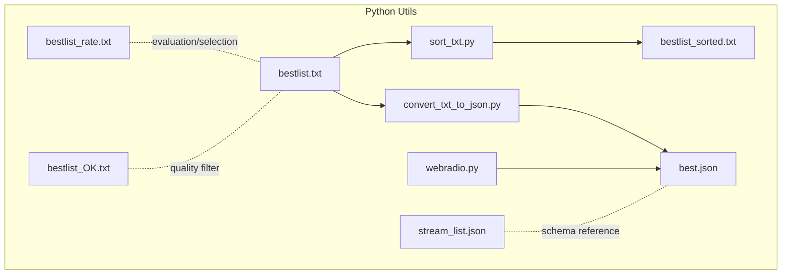
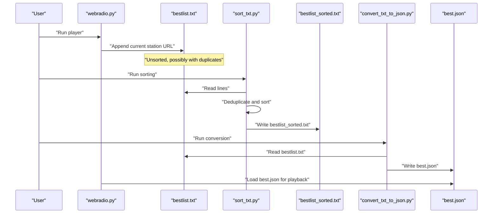
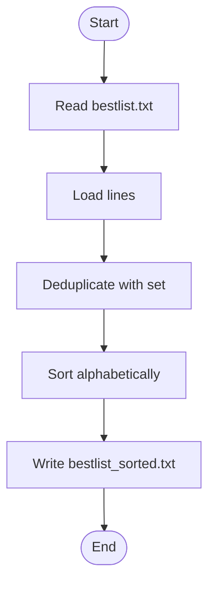
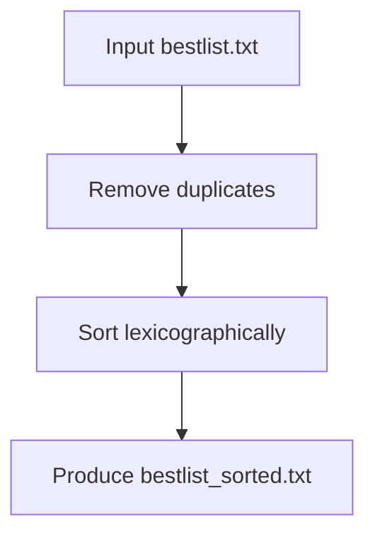
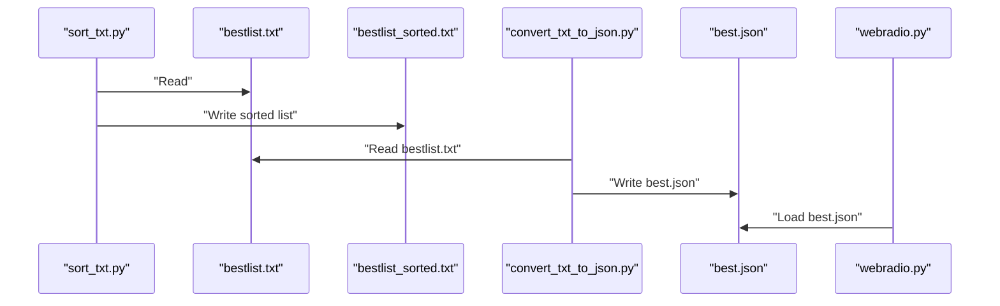
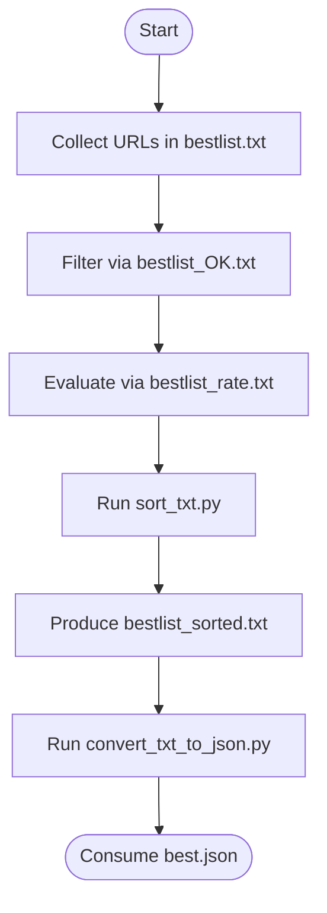
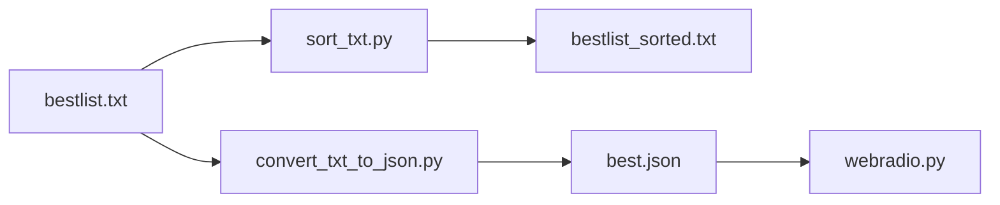
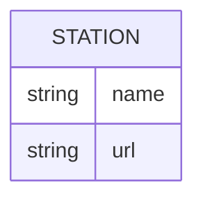

# Station Sorting Utility

<cite>
**Referenced Files in This Document**
- [sort_txt.py](file://WebRadio_python_utils/sort_txt.py)
- [README.md](file://WebRadio_python_utils/README.md)
- [convert_txt_to_json.py](file://WebRadio_python_utils/convert_txt_to_json.py)
- [webradio.py](file://WebRadio_python_utils/webradio.py)
- [bestlist.txt](file://WebRadio_python_utils/bestlist.txt)
- [bestlist_sorted.txt](file://WebRadio_python_utils/bestlist_sorted.txt)
- [bestlist_rate.txt](file://WebRadio_python_utils/bestlist_rate.txt)
- [bestlist_OK.txt](file://WebRadio_python_utils/bestlist_OK.txt)
- [best.json](file://WebRadio_python_utils/best.json)
- [stream_list.json](file://WebRadio_python_utils/stream_list.json)
</cite>

## Table of Contents
1. [Introduction](#introduction)
2. [Project Structure](#project-structure)
3. [Core Components](#core-components)
4. [Architecture Overview](#architecture-overview)
5. [Detailed Component Analysis](#detailed-component-analysis)
6. [Dependency Analysis](#dependency-analysis)
7. [Performance Considerations](#performance-considerations)
8. [Troubleshooting Guide](#troubleshooting-guide)
9. [Conclusion](#conclusion)
10. [Appendices](#appendices)

## Introduction
This document explains the station sorting utility used to organize and maintain internet radio station lists for the WebRadio ecosystem. It focuses on the sort_txt.py implementation that deduplicates and alphabetically sorts station URLs, and documents the roles of supporting files (bestlist_rate.txt, bestlist_OK.txt) in the station management workflow. It also covers input/output formats, batch sorting operations, duplicate detection, and how the sorted lists integrate with downstream tools such as the JSON conversion utility and the player.

## Project Structure
The station sorting utility resides in the WebRadio Python utilities directory. The key files involved in sorting and list management are:
- sort_txt.py: Reads bestlist.txt, removes duplicates, sorts lines, and writes bestlist_sorted.txt
- bestlist.txt: Source list of station URLs collected during runtime
- bestlist_sorted.txt: Output of the sorting operation
- bestlist_rate.txt: A curated or rated subset of station URLs used for evaluation
- bestlist_OK.txt: A quality-filtered subset of station URLs considered acceptable
- convert_txt_to_json.py: Converts bestlist.txt into best.json for the player
- webradio.py: Adds stations to bestlist.txt and loads best.json for playback
- best.json: JSON dataset consumed by the player
- stream_list.json: Sample JSON structure for streams

**Diagram sources**
- [sort_txt.py](file://WebRadio_python_utils/sort_txt.py)
- [convert_txt_to_json.py](file://WebRadio_python_utils/convert_txt_to_json.py)
- [webradio.py](file://WebRadio_python_utils/webradio.py)
- [bestlist.txt](file://WebRadio_python_utils/bestlist.txt)
- [bestlist_sorted.txt](file://WebRadio_python_utils/bestlist_sorted.txt)
- [bestlist_rate.txt](file://WebRadio_python_utils/bestlist_rate.txt)
- [bestlist_OK.txt](file://WebRadio_python_utils/bestlist_OK.txt)
- [best.json](file://WebRadio_python_utils/best.json)
- [stream_list.json](file://WebRadio_python_utils/stream_list.json)

**Section sources**
- [README.md](file://WebRadio_python_utils/README.md)

## Core Components
- sort_txt.py
  - Purpose: Deduplicate and sort station URLs from bestlist.txt into bestlist_sorted.txt
  - Behavior: Reads lines, deduplicates via set conversion, sorts, and writes output
  - Batch operation: Single pass over the input file
- bestlist.txt
  - Purpose: Source of station URLs collected during runtime
  - Format: One URL per line
- bestlist_sorted.txt
  - Purpose: Sorted and deduplicated station list for stable presentation
  - Format: One URL per line, alphabetically ordered
- bestlist_rate.txt
  - Purpose: Curated or rated subset used for evaluation and selection
  - Format: One URL per line
- bestlist_OK.txt
  - Purpose: Quality-filtered subset of acceptable stations
  - Format: One URL per line
- convert_txt_to_json.py
  - Purpose: Convert bestlist.txt into best.json with numeric names and URLs
  - Output: best.json suitable for the player
- webradio.py
  - Purpose: Loads best.json, plays stations, and appends current station to bestlist.txt
- best.json
  - Purpose: Player-ready JSON dataset
  - Schema: Array of objects with "name" and "url"
- stream_list.json
  - Purpose: Reference JSON structure for streams

**Section sources**
- [sort_txt.py](file://WebRadio_python_utils/sort_txt.py)
- [bestlist.txt](file://WebRadio_python_utils/bestlist.txt)
- [bestlist_sorted.txt](file://WebRadio_python_utils/bestlist_sorted.txt)
- [bestlist_rate.txt](file://WebRadio_python_utils/bestlist_rate.txt)
- [bestlist_OK.txt](file://WebRadio_python_utils/bestlist_OK.txt)
- [convert_txt_to_json.py](file://WebRadio_python_utils/convert_txt_to_json.py)
- [webradio.py](file://WebRadio_python_utils/webradio.py)
- [best.json](file://WebRadio_python_utils/best.json)
- [stream_list.json](file://WebRadio_python_utils/stream_list.json)

## Architecture Overview
The sorting utility participates in a three-stage pipeline:
1. Collection: Stations are appended to bestlist.txt via the player
2. Sorting: sort_txt.py deduplicates and sorts bestlist.txt into bestlist_sorted.txt
3. Consumption: convert_txt_to_json.py transforms bestlist.txt into best.json for playback

**Diagram sources**
- [webradio.py](file://WebRadio_python_utils/webradio.py)
- [sort_txt.py](file://WebRadio_python_utils/sort_txt.py)
- [convert_txt_to_json.py](file://WebRadio_python_utils/convert_txt_to_json.py)
- [bestlist.txt](file://WebRadio_python_utils/bestlist.txt)
- [bestlist_sorted.txt](file://WebRadio_python_utils/bestlist_sorted.txt)
- [best.json](file://WebRadio_python_utils/best.json)

## Detailed Component Analysis

### sort_txt.py Implementation
- Input: bestlist.txt
- Processing:
  - Read all lines
  - Deduplicate using a set (eliminates repeated URLs)
  - Sort lines lexicographically
- Output: bestlist_sorted.txt
- Batch sorting: Single-pass read, set conversion, and write loop

**Diagram sources**
- [sort_txt.py](file://WebRadio_python_utils/sort_txt.py)
- [bestlist.txt](file://WebRadio_python_utils/bestlist.txt)
- [bestlist_sorted.txt](file://WebRadio_python_utils/bestlist_sorted.txt)

**Section sources**
- [sort_txt.py](file://WebRadio_python_utils/sort_txt.py)

### Input File Formats and Purposes
- bestlist.txt
  - Role: Source list for sorting and conversion
  - Content: One station URL per line
  - Typical use: Collected during playback sessions
- bestlist_sorted.txt
  - Role: Stable, sorted representation of station URLs
  - Content: One station URL per line, sorted
  - Typical use: Reference list for quality checks and downstream processing
- bestlist_rate.txt
  - Role: Curated or rated subset for evaluation
  - Content: One station URL per line
  - Typical use: Used to assess quality or popularity before inclusion
- bestlist_OK.txt
  - Role: Quality-filtered subset of acceptable stations
  - Content: One station URL per line
  - Typical use: Used to exclude problematic streams and keep a clean database

**Section sources**
- [bestlist.txt](file://WebRadio_python_utils/bestlist.txt)
- [bestlist_sorted.txt](file://WebRadio_python_utils/bestlist_sorted.txt)
- [bestlist_rate.txt](file://WebRadio_python_utils/bestlist_rate.txt)
- [bestlist_OK.txt](file://WebRadio_python_utils/bestlist_OK.txt)

### Sorting Criteria and Ranking Methodology
- Sorting criterion: Lexicographic ordering of station URLs
- Ranking methodology: No explicit ranking score is computed; URLs are ranked solely by alphabetical order
- Duplicate detection: Implemented via set conversion during sorting

**Diagram sources**
- [sort_txt.py](file://WebRadio_python_utils/sort_txt.py)
- [bestlist.txt](file://WebRadio_python_utils/bestlist.txt)
- [bestlist_sorted.txt](file://WebRadio_python_utils/bestlist_sorted.txt)

**Section sources**
- [sort_txt.py](file://WebRadio_python_utils/sort_txt.py)

### Output File Generation and Integration
- bestlist_sorted.txt
  - Generated by sort_txt.py
  - Used as a stable reference for station management
- best.json
  - Generated by convert_txt_to_json.py from bestlist.txt
  - Consumed by webradio.py for playback
- Integration points:
  - webradio.py reads best.json for playback
  - convert_txt_to_json.py reads bestlist.txt and writes best.json
  - sort_txt.py produces bestlist_sorted.txt for maintenance tasks

**Diagram sources**
- [sort_txt.py](file://WebRadio_python_utils/sort_txt.py)
- [convert_txt_to_json.py](file://WebRadio_python_utils/convert_txt_to_json.py)
- [webradio.py](file://WebRadio_python_utils/webradio.py)
- [bestlist.txt](file://WebRadio_python_utils/bestlist.txt)
- [bestlist_sorted.txt](file://WebRadio_python_utils/bestlist_sorted.txt)
- [best.json](file://WebRadio_python_utils/best.json)

**Section sources**
- [convert_txt_to_json.py](file://WebRadio_python_utils/convert_txt_to_json.py)
- [webradio.py](file://WebRadio_python_utils/webradio.py)

### Filtering Mechanisms
- Duplicate detection: Built-in during sorting via set conversion
- Quality filtering: Managed externally via bestlist_OK.txt and bestlist_rate.txt
  - bestlist_OK.txt: Maintains a curated list of acceptable URLs
  - bestlist_rate.txt: Provides a rated subset for evaluation and selection
- Practical workflow:
  - Collect URLs in bestlist.txt
  - Optionally filter via bestlist_OK.txt and bestlist_rate.txt
  - Run sort_txt.py to produce bestlist_sorted.txt
  - Convert bestlist.txt to best.json for playback

**Diagram sources**
- [bestlist.txt](file://WebRadio_python_utils/bestlist.txt)
- [bestlist_OK.txt](file://WebRadio_python_utils/bestlist_OK.txt)
- [bestlist_rate.txt](file://WebRadio_python_utils/bestlist_rate.txt)
- [sort_txt.py](file://WebRadio_python_utils/sort_txt.py)
- [bestlist_sorted.txt](file://WebRadio_python_utils/bestlist_sorted.txt)
- [convert_txt_to_json.py](file://WebRadio_python_utils/convert_txt_to_json.py)
- [best.json](file://WebRadio_python_utils/best.json)

**Section sources**
- [bestlist_OK.txt](file://WebRadio_python_utils/bestlist_OK.txt)
- [bestlist_rate.txt](file://WebRadio_python_utils/bestlist_rate.txt)
- [sort_txt.py](file://WebRadio_python_utils/sort_txt.py)

### Customization and Extensibility
- Sorting customization:
  - To change sorting behavior, modify sort_txt.py to implement alternative comparison keys or scoring
- Rating integration:
  - To incorporate external ratings, extend sort_txt.py to read a rating dataset and sort by score
- Quality filtering:
  - Maintain bestlist_OK.txt and bestlist_rate.txt as curated subsets
  - Periodically update these files to reflect quality changes
- Batch operations:
  - Use sort_txt.py as part of automated pipelines to regenerate bestlist_sorted.txt after updates to bestlist.txt

**Section sources**
- [sort_txt.py](file://WebRadio_python_utils/sort_txt.py)
- [bestlist_OK.txt](file://WebRadio_python_utils/bestlist_OK.txt)
- [bestlist_rate.txt](file://WebRadio_python_utils/bestlist_rate.txt)

## Dependency Analysis
The sorting utility depends on the presence of bestlist.txt and produces bestlist_sorted.txt. The JSON conversion utility depends on bestlist.txt to produce best.json. The player consumes best.json.

**Diagram sources**
- [sort_txt.py](file://WebRadio_python_utils/sort_txt.py)
- [convert_txt_to_json.py](file://WebRadio_python_utils/convert_txt_to_json.py)
- [webradio.py](file://WebRadio_python_utils/webradio.py)
- [bestlist.txt](file://WebRadio_python_utils/bestlist.txt)
- [bestlist_sorted.txt](file://WebRadio_python_utils/bestlist_sorted.txt)
- [best.json](file://WebRadio_python_utils/best.json)

**Section sources**
- [sort_txt.py](file://WebRadio_python_utils/sort_txt.py)
- [convert_txt_to_json.py](file://WebRadio_python_utils/convert_txt_to_json.py)
- [webradio.py](file://WebRadio_python_utils/webradio.py)

## Performance Considerations
- Time complexity:
  - sort_txt.py: O(n log n) due to sorting; deduplication is O(n)
- Space complexity:
  - sort_txt.py: O(n) for storing lines and deduplicated set
- Recommendations:
  - Keep bestlist.txt reasonably sized to avoid long sort times
  - Consider incremental sorting if the list grows very large
  - Use bestlist_OK.txt and bestlist_rate.txt to pre-filter before sorting

[No sources needed since this section provides general guidance]

## Troubleshooting Guide
- Symptom: bestlist_sorted.txt not updating
  - Cause: sort_txt.py not executed or bestlist.txt unchanged
  - Resolution: Re-run sort_txt.py after updating bestlist.txt
- Symptom: Duplicate URLs present
  - Cause: Missing deduplication step
  - Resolution: Ensure sort_txt.py runs to remove duplicates
- Symptom: Player does not load new stations
  - Cause: best.json not regenerated from bestlist.txt
  - Resolution: Run convert_txt_to_json.py to update best.json
- Symptom: Quality issues with stations
  - Cause: Unfiltered URLs in bestlist.txt
  - Resolution: Maintain and apply bestlist_OK.txt and bestlist_rate.txt before sorting

**Section sources**
- [sort_txt.py](file://WebRadio_python_utils/sort_txt.py)
- [convert_txt_to_json.py](file://WebRadio_python_utils/convert_txt_to_json.py)
- [webradio.py](file://WebRadio_python_utils/webradio.py)
- [bestlist_OK.txt](file://WebRadio_python_utils/bestlist_OK.txt)
- [bestlist_rate.txt](file://WebRadio_python_utils/bestlist_rate.txt)

## Conclusion
The station sorting utility provides a simple yet effective mechanism to deduplicate and sort station URLs, ensuring a stable and organized database for downstream consumption. By combining sort_txt.py with bestlist_OK.txt and bestlist_rate.txt, teams can maintain high-quality station lists. Integrating with convert_txt_to_json.py and webradio.py completes the pipeline from collection to playback.

[No sources needed since this section summarizes without analyzing specific files]

## Appendices

### Data Model for best.json

**Diagram sources**
- [best.json](file://WebRadio_python_utils/best.json)
- [stream_list.json](file://WebRadio_python_utils/stream_list.json)