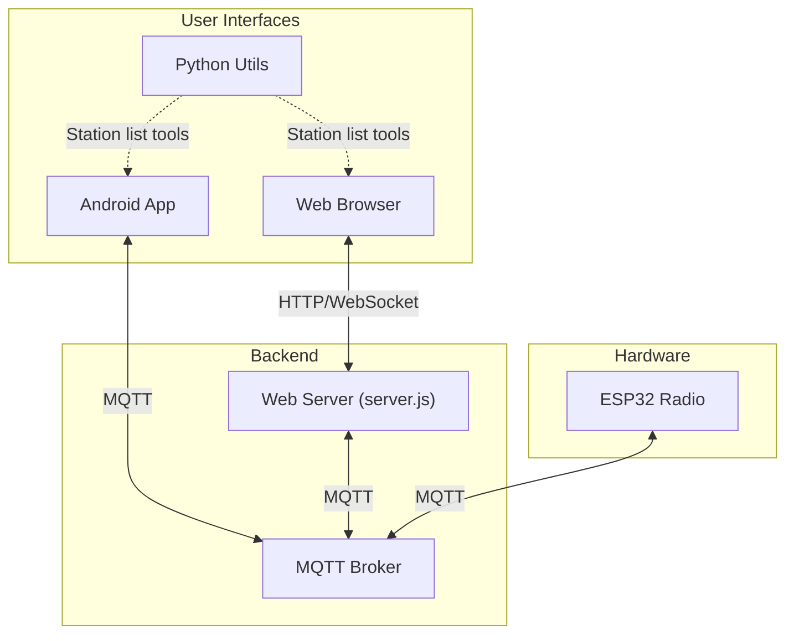
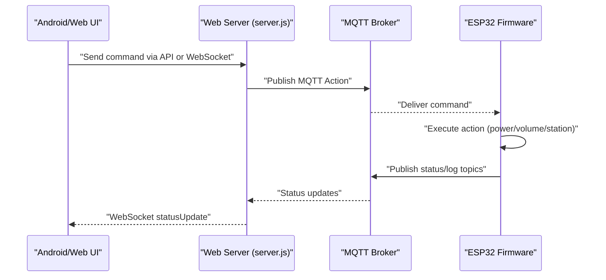
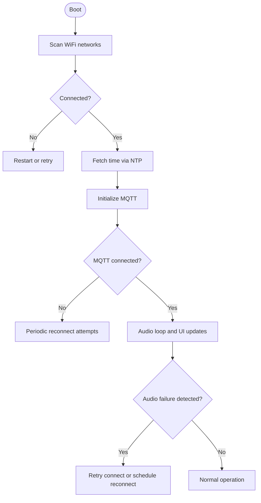
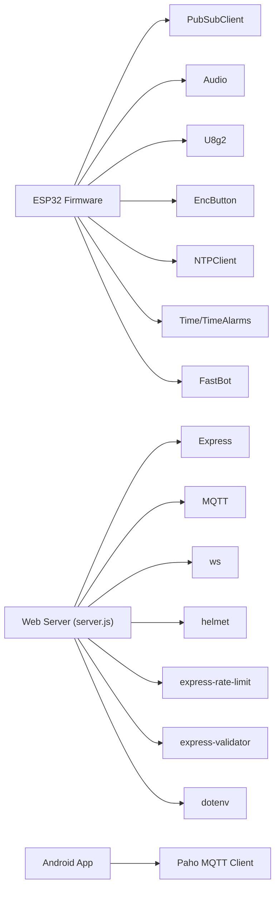

# Troubleshooting & FAQ

<cite>
**Referenced Files in This Document**
- [README.md](file://README.md)
- [WebRadio_ESP32_S3/README.md](file://WebRadio_ESP32_S3/README.md)
- [WebRadio_ESP32_S3/src/main.cpp](file://WebRadio_ESP32_S3/src/main.cpp)
- [WebRadio_ESP32_S3/src/secrets.h.example](file://WebRadio_ESP32_S3/src/secrets.h.example)
- [WebRadio_web/README.md](file://WebRadio_web/README.md)
- [WebRadio_web/server.js](file://WebRadio_web/server.js)
- [WebRadio_web/.env.example](file://WebRadio_web/.env.example)
- [WebRadio_web/package.json](file://WebRadio_web/package.json)
- [WebRadio_android/README.md](file://WebRadio_android/README.md)
- [WebRadio_android/app/src/main/java/com/dip16/webradio/Secrets.kt.example](file://WebRadio_android/app/src/main/java/com/dip16/webradio/Secrets.kt.example)
- [WebRadio_python_utils/README.md](file://WebRadio_python_utils/README.md)
</cite>

## Table of Contents
1. [Introduction](#introduction)
2. [Project Structure](#project-structure)
3. [Core Components](#core-components)
4. [Architecture Overview](#architecture-overview)
5. [Detailed Component Analysis](#detailed-component-analysis)
6. [Dependency Analysis](#dependency-analysis)
7. [Performance Considerations](#performance-considerations)
8. [Troubleshooting Guide](#troubleshooting-guide)
9. [FAQ](#faq)
10. [Conclusion](#conclusion)
11. [Appendices](#appendices)

## Introduction
This document provides comprehensive troubleshooting and FAQ guidance for the WebRadio system. It covers hardware, software, network, and configuration issues across all components: ESP32 firmware, Android app, web interface, and Python utilities. It includes systematic debugging approaches, log analysis tips, diagnostic commands, error interpretation, performance tuning, and escalation steps.

## Project Structure
The system comprises:
- ESP32 firmware: Streams audio, controls via MQTT, exposes status, supports buttons and optional Telegram OTA.
- Android app: Publishes MQTT commands and subscribes to status topics.
- Web interface: Bridges MQTT to WebSocket/API, authenticates via token, and hosts static UI.
- Python utilities: Manage station lists and provide a CLI player.

**Diagram sources**
- [README.md:65-85](file://README.md#L65-L85)
- [WebRadio_web/server.js:47-97](file://WebRadio_web/server.js#L47-L97)
- [WebRadio_ESP32_S3/README.md:89-112](file://WebRadio_ESP32_S3/README.md#L89-L112)
- [WebRadio_android/README.md:65-89](file://WebRadio_android/README.md#L65-L89)

**Section sources**
- [README.md:61-113](file://README.md#L61-L113)

## Core Components
- ESP32 firmware: Handles WiFi, NTP, audio streaming, MQTT, OLED display, buttons, relays, alarms, and Telegram bot. It publishes status and logs, and subscribes to control topics.
- Android app: Sends MQTT commands and receives status updates for a chosen radio device.
- Web interface: Exposes REST API and WebSocket secured by a secret token; bridges MQTT to WebSocket.
- Python utilities: Manage station lists and provide a CLI player.

**Section sources**
- [WebRadio_ESP32_S3/README.md:70-127](file://WebRadio_ESP32_S3/README.md#L70-L127)
- [WebRadio_web/README.md:14-75](file://WebRadio_web/README.md#L14-L75)
- [WebRadio_android/README.md:20-108](file://WebRadio_android/README.md#L20-L108)
- [WebRadio_python_utils/README.md:1-43](file://WebRadio_python_utils/README.md#L1-L43)

## Architecture Overview
The system relies on MQTT for control/status and HTTP/WebSocket for the web UI. The ESP32 connects to WiFi and NTP, streams audio, and publishes telemetry. The web server subscribes to MQTT topics and forwards updates to WebSocket clients. The Android app subscribes to status topics and publishes commands.

**Diagram sources**
- [WebRadio_web/server.js:123-134](file://WebRadio_web/server.js#L123-L134)
- [WebRadio_web/server.js:240-260](file://WebRadio_web/server.js#L240-L260)
- [WebRadio_ESP32_S3/src/main.cpp:274-650](file://WebRadio_ESP32_S3/src/main.cpp#L274-L650)

## Detailed Component Analysis

### ESP32 Firmware Troubleshooting
Common symptoms and diagnostics:
- No WiFi connection: Firmware prints connection attempts and eventually restarts if unsuccessful.
- MQTT disconnects: Periodic reconnection attempts occur; logs indicate failure and state transitions.
- Audio dropouts/failures: Firmware detects “failed”, “403”, “500”, and “dropouts” conditions and retries or schedules reconnects.
- Display anomalies: Screen shows indicators for failures, reconnect countdown, and sleep mode.
- Volume ramp and sleep timer: Firmware manages volume transitions and sleep behavior.

Diagnostic commands and logs:
- Observe serial output during boot and runtime for WiFi, NTP, MQTT, and audio info.
- Monitor MQTT topics for status and logs:
  - Incoming: Home/<device>/Action
  - Outgoing: Home/<device>/Log, Home/<device>/Station, Home/<device>/Title, Home/<device>/State, Home/<device>/Volume, Home/<device>/Alarm, Home/<device>/FreeHeap

**Diagram sources**
- [WebRadio_ESP32_S3/src/main.cpp:1117-1308](file://WebRadio_ESP32_S3/src/main.cpp#L1117-L1308)
- [WebRadio_ESP32_S3/src/main.cpp:1447-1472](file://WebRadio_ESP32_S3/src/main.cpp#L1447-L1472)
- [WebRadio_ESP32_S3/src/main.cpp:1650-1672](file://WebRadio_ESP32_S3/src/main.cpp#L1650-L1672)

**Section sources**
- [WebRadio_ESP32_S3/src/main.cpp:1117-1308](file://WebRadio_ESP32_S3/src/main.cpp#L1117-L1308)
- [WebRadio_ESP32_S3/src/main.cpp:1447-1635](file://WebRadio_ESP32_S3/src/main.cpp#L1447-L1635)
- [WebRadio_ESP32_S3/src/main.cpp:1650-1835](file://WebRadio_ESP32_S3/src/main.cpp#L1650-L1835)
- [WebRadio_ESP32_S3/README.md:89-112](file://WebRadio_ESP32_S3/README.md#L89-L112)

### Android App Troubleshooting
Symptoms:
- Cannot connect to MQTT: Incorrect broker URL/login/password or firewall blocking.
- UI not updating: App subscribes to device-specific status topics; mismatched radioName causes no updates.
- Commands not applied: Payload mismatch or wrong topic.

Diagnostics:
- Verify Secrets.kt credentials and radioName match the device topics.
- Confirm MQTT broker accessibility from the device hosting the app.
- Use MQTT explorer or mosquitto_sub to subscribe to Home/{radioName}/# and confirm messages.

**Section sources**
- [WebRadio_android/README.md:65-89](file://WebRadio_android/README.md#L65-L89)
- [WebRadio_android/app/src/main/java/com/dip16/webradio/Secrets.kt.example:8-12](file://WebRadio_android/app/src/main/java/com/dip16/webradio/Secrets.kt.example#L8-L12)

### Web Interface Troubleshooting
Symptoms:
- Unauthorized access prompts: SECRET_TOKEN mismatch or missing token in WebSocket URL.
- MQTT offline: Broker unreachable or credentials invalid.
- UI not updating: Broker not publishing to subscribed topics.

Diagnostics:
- Confirm SECRET_TOKEN in .env and that the browser accepted it.
- Verify MQTT_BROKER_URL, MQTT_USER, MQTT_PASSWORD in .env.
- Check server logs for MQTT connection errors and subscription outcomes.
- Use browser dev tools Network tab to inspect WebSocket handshake and API responses.

**Section sources**
- [WebRadio_web/README.md:60-75](file://WebRadio_web/README.md#L60-L75)
- [WebRadio_web/server.js:33-54](file://WebRadio_web/server.js#L33-L54)
- [WebRadio_web/server.js:68-80](file://WebRadio_web/server.js#L68-L80)
- [WebRadio_web/.env.example:1-3](file://WebRadio_web/.env.example#L1-L3)

### Python Utilities Troubleshooting
Symptoms:
- VLC not installed or not accessible.
- Station list conversion fails due to malformed input.

Diagnostics:
- Ensure VLC is installed and accessible in PATH.
- Validate bestlist.txt format and run sort_txt.py to remove duplicates and sort.
- Convert bestlist.txt to best.json using convert_txt_to_json.py.

**Section sources**
- [WebRadio_python_utils/README.md:7-43](file://WebRadio_python_utils/README.md#L7-L43)

## Dependency Analysis
- ESP32 firmware depends on Arduino framework, PubSubClient, Audio, U8g2, EncButton, NTPClient, Time, TimeAlarms, FastBot, EEPROM.
- Web server depends on Express, MQTT, ws, helmet, express-rate-limit, dotenv, cors, express-validator.
- Android app depends on Paho MQTT client and Jetpack Compose.

**Diagram sources**
- [WebRadio_ESP32_S3/src/main.cpp:1-15](file://WebRadio_ESP32_S3/src/main.cpp#L1-L15)
- [WebRadio_web/package.json:15-24](file://WebRadio_web/package.json#L15-L24)

**Section sources**
- [WebRadio_ESP32_S3/src/main.cpp:1-15](file://WebRadio_ESP32_S3/src/main.cpp#L1-L15)
- [WebRadio_web/package.json:15-24](file://WebRadio_web/package.json#L15-L24)

## Performance Considerations
Audio quality and latency:
- Use AAC or MP3 streams supported by the Audio library; firmware parses format and bitrate.
- Monitor FreeHeap via Home/<device>/FreeHeap to avoid memory pressure.
- Reduce reconnect retries and stabilize network to minimize dropouts.

Resource utilization:
- Watch FreeHeap and adjust station list size or reduce concurrent tasks.
- Ensure MQTT broker is nearby to reduce latency and packet loss.

Network stability:
- Place ESP32 close to router; monitor RSSI via Telegram /ping or OLED.
- Prefer wired Ethernet for the broker if possible; otherwise ensure strong WiFi.

**Section sources**
- [WebRadio_ESP32_S3/src/main.cpp:1638-1835](file://WebRadio_ESP32_S3/src/main.cpp#L1638-L1835)
- [WebRadio_ESP32_S3/src/main.cpp:1464-1489](file://WebRadio_ESP32_S3/src/main.cpp#L1464-L1489)
- [WebRadio_ESP32_S3/README.md:115-118](file://WebRadio_ESP32_S3/README.md#L115-L118)

## Troubleshooting Guide

### Hardware Problems
- Symptoms: No display, no audio, buttons unresponsive.
- Checks:
  - Confirm I2S wiring and DAC connections.
  - Verify OLED I2C pull-ups and correct pins.
  - Ensure relays and optional FM TX pin wiring match macros.
- Logs: Look for “START”, “WiFi Fail”, “Connect to”, “ERROR” during boot.

**Section sources**
- [WebRadio_ESP32_S3/README.md:38-55](file://WebRadio_ESP32_S3/README.md#L38-L55)
- [WebRadio_ESP32_S3/src/main.cpp:1117-1177](file://WebRadio_ESP32_S3/src/main.cpp#L1117-L1177)

### Software Bugs
- Symptoms: Crashes, stuck loops, incorrect state.
- Checks:
  - Review serial logs for repeated “ERROR” or “Restart!”.
  - Validate secrets.h and Secrets.kt credentials.
- Actions:
  - Re-flash firmware after correcting credentials.
  - Use Telegram /restart to recover from stuck states.

**Section sources**
- [WebRadio_ESP32_S3/src/main.cpp:1635-1635](file://WebRadio_ESP32_S3/src/main.cpp#L1635-L1635)
- [WebRadio_ESP32_S3/src/secrets.h.example:10-32](file://WebRadio_ESP32_S3/src/secrets.h.example#L10-L32)
- [WebRadio_android/app/src/main/java/com/dip16/webradio/Secrets.kt.example:8-12](file://WebRadio_android/app/src/main/java/com/dip16/webradio/Secrets.kt.example#L8-L12)

### Network Connectivity Issues
- ESP32 WiFi:
  - If WiFiFail occurs, firmware restarts; verify ssidList and passwordList.
- MQTT:
  - If reconnect fails repeatedly, check broker URL, credentials, and firewall.
  - Confirm subscription to Home/<device>/# and that broker is reachable.
- Web Interface:
  - SECRET_TOKEN must match .env; WebSocket URL must include token.
  - Broker must be reachable from the server hosting the web app.

**Section sources**
- [WebRadio_ESP32_S3/src/main.cpp:1168-1177](file://WebRadio_ESP32_S3/src/main.cpp#L1168-L1177)
- [WebRadio_web/server.js:56-80](file://WebRadio_web/server.js#L56-L80)
- [WebRadio_web/README.md:60-75](file://WebRadio_web/README.md#L60-L75)

### Configuration Errors
- ESP32:
  - Copy secrets.h.example to secrets.h and fill credentials.
  - Ensure correct ESP_WROVER macro and topics.
- Android:
  - Create Secrets.kt with broker URL, login, and password.
- Web:
  - Create .env from .env.example and set SECRET_TOKEN, MQTT_BROKER_URL, MQTT_USER, MQTT_PASSWORD.

**Section sources**
- [WebRadio_ESP32_S3/README.md:70-80](file://WebRadio_ESP32_S3/README.md#L70-L80)
- [WebRadio_ESP32_S3/src/secrets.h.example:10-32](file://WebRadio_ESP32_S3/src/secrets.h.example#L10-L32)
- [WebRadio_android/README.md:37-57](file://WebRadio_android/README.md#L37-L57)
- [WebRadio_web/README.md:33-51](file://WebRadio_web/README.md#L33-L51)
- [WebRadio_web/.env.example:1-3](file://WebRadio_web/.env.example#L1-L3)

### Log Analysis and Diagnostic Commands
- ESP32 serial logs:
  - Look for WiFi scanning, connection attempts, NTP sync, MQTT connect, and audio info.
- Web server logs:
  - Watch MQTT connect, subscribe, and error events.
- Android:
  - Use MQTT explorer to subscribe to Home/{radioName}/# and verify payloads.

**Section sources**
- [WebRadio_ESP32_S3/src/main.cpp:1117-1308](file://WebRadio_ESP32_S3/src/main.cpp#L1117-L1308)
- [WebRadio_web/server.js:56-80](file://WebRadio_web/server.js#L56-L80)
- [WebRadio_android/README.md:65-89](file://WebRadio_android/README.md#L65-L89)

### Error Codes, Warning Messages, and Meanings
- Audio info keywords:
  - “failed”: Stream request failure; firmware retries and publishes failure log.
  - “403/500”: HTTP error codes indicating access or server issues.
  - “dropouts”: Audio dropout detected; firmware sets indicator.
- MQTT:
  - Connection failures logged; periodic reconnect attempts.
- Web:
  - Unauthorized API/WebSocket responses when SECRET_TOKEN is missing or wrong.

**Section sources**
- [WebRadio_ESP32_S3/src/main.cpp:1650-1672](file://WebRadio_ESP32_S3/src/main.cpp#L1650-L1672)
- [WebRadio_web/server.js:68-80](file://WebRadio_web/server.js#L68-L80)
- [WebRadio_web/server.js:103-110](file://WebRadio_web/server.js#L103-L110)

### Performance Troubleshooting
- Audio quality:
  - Prefer AAC/MP3 streams; monitor format and bitrate.
  - Reduce reconnect frequency by stabilizing network.
- Latency:
  - Minimize broker hops; ensure low-latency LAN.
- Resource utilization:
  - Monitor FreeHeap; reduce station list size or simplify UI logic.

**Section sources**
- [WebRadio_ESP32_S3/src/main.cpp:1638-1835](file://WebRadio_ESP32_S3/src/main.cpp#L1638-L1835)
- [WebRadio_ESP32_S3/src/main.cpp:1464-1489](file://WebRadio_ESP32_S3/src/main.cpp#L1464-L1489)

### Network Troubleshooting (MQTT, Web, Android)
- MQTT:
  - Verify broker URL, credentials, and ACLs.
  - Subscribe to device topics to confirm bidirectional flow.
- Web:
  - Confirm SECRET_TOKEN presence and correctness.
  - Check WebSocket upgrade and API auth headers.
- Android:
  - Validate broker URL and credentials; ensure radioName matches device.

**Section sources**
- [WebRadio_web/server.js:33-54](file://WebRadio_web/server.js#L33-L54)
- [WebRadio_web/server.js:224-238](file://WebRadio_web/server.js#L224-L238)
- [WebRadio_android/README.md:65-89](file://WebRadio_android/README.md#L65-L89)

### Escalation Procedures and Community Support
- Capture:
  - ESP32 serial logs, web server logs, and MQTT traffic.
- Report:
  - Include OS/device model, firmware version, broker details, and reproduction steps.
- Community:
  - Use repository issues for bug reports and feature requests.

**Section sources**
- [README.md:1-113](file://README.md#L1-L113)

### Preventive Maintenance and Best Practices
- Firmware:
  - Keep FreeHeap healthy; avoid excessive allocations.
  - Regularly update firmware via OTA (Telegram).
- Network:
  - Use wired connections for broker; keep firmware and broker updated.
- UI:
  - Rotate SECRET_TOKEN periodically; enforce HTTPS/TLS.
- Station lists:
  - Use Python utilities to sort and deduplicate lists.

**Section sources**
- [WebRadio_ESP32_S3/src/main.cpp:1464-1489](file://WebRadio_ESP32_S3/src/main.cpp#L1464-L1489)
- [WebRadio_ESP32_S3/README.md:113-127](file://WebRadio_ESP32_S3/README.md#L113-L127)
- [WebRadio_web/README.md:69-75](file://WebRadio_web/README.md#L69-L75)
- [WebRadio_python_utils/README.md:24-43](file://WebRadio_python_utils/README.md#L24-L43)

## FAQ

Q1: How do I configure MQTT credentials?
- ESP32: Copy secrets.h.example to secrets.h and edit ssidList/passwordList, BOT_TOKEN, ADMIN_CHAT_ID, MQTT_SERVER, MQTT_LOGIN, MQTT_PASS.
- Android: Create Secrets.kt with MQTT_BROKER_URL, MQTT_LOGIN, MQTT_PASSWORD.
- Web: Create .env from .env.example and set SECRET_TOKEN, MQTT_BROKER_URL, MQTT_USER, MQTT_PASSWORD.

Q2: Why does the web interface ask for a token?
- SECRET_TOKEN must be provided in the WebSocket URL or via browser prompt; it must match the server’s .env.

Q3: The Android app shows no updates.
- Ensure radioName matches the device and broker credentials are correct; verify subscriptions to Home/{radioName}/#.

Q4: How do I fix audio dropouts?
- Improve WiFi signal, reduce network load, choose AAC/MP3 streams, and avoid frequent station switches.

Q5: How can I manage station lists?
- Use sort_txt.py to clean bestlist.txt and convert_txt_to_json.py to generate best.json for players.

Q6: How do I restart the device remotely?
- Use Telegram /restart or publish “?” to Home/<device>/Action to request status.

Q7: What do the MQTT topics mean?
- Home/<device>/Action: Commands (power, volume, station, alarm).
- Home/<device>/Log, /Station, /Title, /State, /Volume, /Alarm, /FreeHeap: Status and logs.

Q8: How do I enable OTA updates?
- Send a .bin file to the Telegram bot; ensure Telegram credentials are configured.

Q9: How do I set alarms?
- Publish “s<seconds_from_midnight>” to Home/<device>/Action; “sAlarm OFF” disables.

Q10: How do I verify MQTT connectivity?
- Subscribe to Home/<device>/# using an MQTT client; watch for incoming messages.

**Section sources**
- [WebRadio_ESP32_S3/src/secrets.h.example:10-32](file://WebRadio_ESP32_S3/src/secrets.h.example#L10-L32)
- [WebRadio_android/app/src/main/java/com/dip16/webradio/Secrets.kt.example:8-12](file://WebRadio_android/app/src/main/java/com/dip16/webradio/Secrets.kt.example#L8-L12)
- [WebRadio_web/.env.example:1-3](file://WebRadio_web/.env.example#L1-L3)
- [WebRadio_web/README.md:60-75](file://WebRadio_web/README.md#L60-L75)
- [WebRadio_ESP32_S3/README.md:89-112](file://WebRadio_ESP32_S3/README.md#L89-L112)
- [WebRadio_android/README.md:65-89](file://WebRadio_android/README.md#L65-L89)
- [WebRadio_python_utils/README.md:24-43](file://WebRadio_python_utils/README.md#L24-L43)

## Conclusion
By systematically validating credentials, network connectivity, and component logs, most issues can be resolved quickly. Use the provided diagnostic flows, maintain secure tokens, and follow best practices for stable operation and longevity.

## Appendices

### Quick Reference: MQTT Topics and Payloads
- Action topic: Home/<device>/Action
  - “?” request status
  - “1” power on, “0” power off
  - “b1/b2/b3/b4” emulate buttons
  - “vol+”/“vol-” volume up/down
  - “c<N>” power on and switch to station N
  - “h<url>” play URL
  - “s<seconds>” set alarm, “sAlarm OFF” disable
- Status topics: Home/<device>/Log, /Station, /Title, /State, /Volume, /Alarm, /FreeHeap

**Section sources**
- [WebRadio_ESP32_S3/README.md:89-112](file://WebRadio_ESP32_S3/README.md#L89-L112)
- [WebRadio_android/README.md:65-89](file://WebRadio_android/README.md#L65-L89)