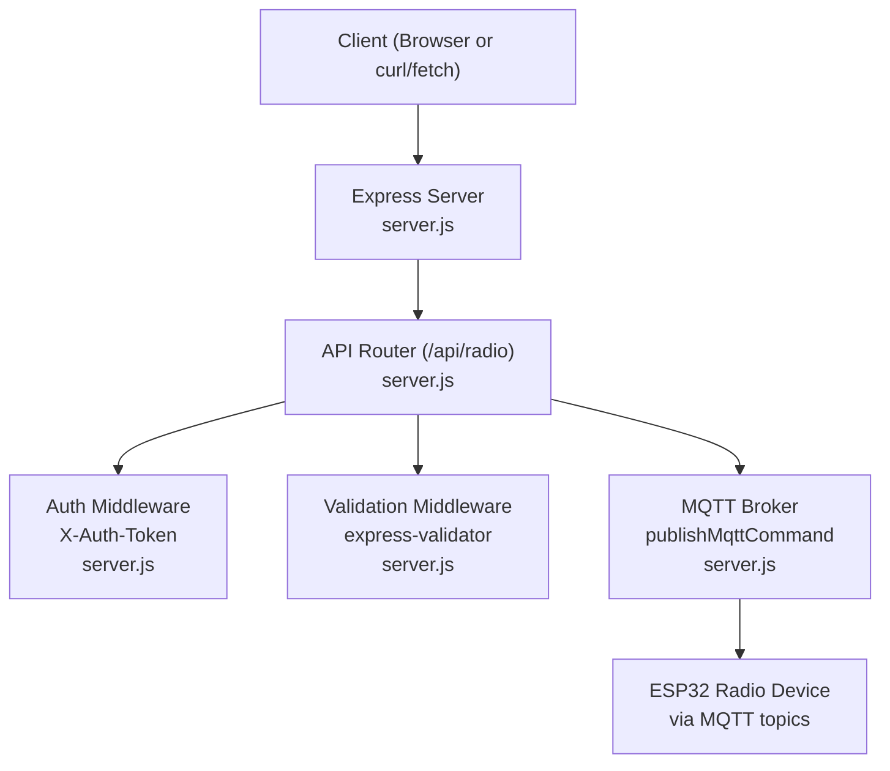
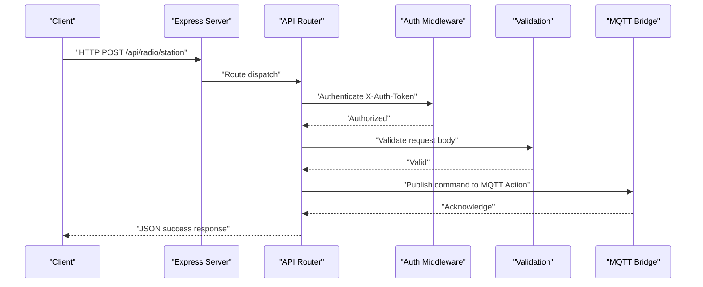
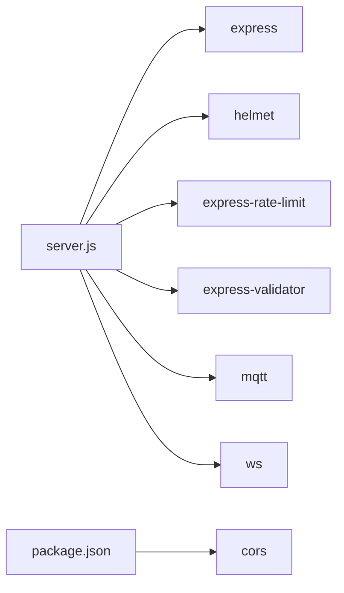

# API Endpoints

<cite>
**Referenced Files in This Document**
- [server.js](file://WebRadio_web/server.js)
- [package.json](file://WebRadio_web/package.json)
- [README.md](file://WebRadio_web/README.md)
- [docker-compose.yml](file://WebRadio_web/docker-compose.yml)
- [Dockerfile](file://WebRadio_web/Dockerfile)
- [app.js](file://WebRadio_web/public/app.js)
- [index.html](file://WebRadio_web/public/index.html)
</cite>

## Table of Contents
1. [Introduction](#introduction)
2. [Project Structure](#project-structure)
3. [Core Components](#core-components)
4. [Architecture Overview](#architecture-overview)
5. [Detailed Component Analysis](#detailed-component-analysis)
6. [Dependency Analysis](#dependency-analysis)
7. [Performance Considerations](#performance-considerations)
8. [Troubleshooting Guide](#troubleshooting-guide)
9. [Conclusion](#conclusion)
10. [Appendices](#appendices)

## Introduction
This document provides comprehensive API documentation for the REST endpoints exposed by the WebRadio web server. It covers authentication using the X-Auth-Token header, input validation schemas, response formats, and HTTP status codes for each endpoint. Practical examples are included using curl and JavaScript fetch. Security considerations, rate limiting behavior, and CORS configuration are also addressed.

## Project Structure
The API is implemented in a Node.js/Express server that bridges HTTP requests to an MQTT bus. The server exposes a single base route for radio control and hosts a static web interface. WebSocket connections are supported for real-time updates and are secured with the same token mechanism.

**Diagram sources**
- [server.js:100-203](file://WebRadio_web/server.js#L100-L203)

**Section sources**
- [server.js:100-203](file://WebRadio_web/server.js#L100-L203)
- [package.json:15-24](file://WebRadio_web/package.json#L15-L24)

## Core Components
- Authentication: All API endpoints require the X-Auth-Token header. The token must match the SECRET_TOKEN environment variable.
- Validation: Each endpoint validates request bodies using express-validator with specific rules.
- MQTT Bridge: Commands are published to the MQTT Action topic; status updates are received from MQTT topics and broadcast to WebSocket clients.
- Rate Limiting: A global rate limiter applies to all API routes.
- CORS: The project includes the cors dependency but does not configure explicit CORS middleware in server.js.

Key implementation references:
- Authentication middleware and route protection: [server.js:102-113](file://WebRadio_web/server.js#L102-L113)
- Validation middleware: [server.js:136-147](file://WebRadio_web/server.js#L136-L147)
- Command publishing to MQTT: [server.js:123-134](file://WebRadio_web/server.js#L123-L134)
- Rate limiting setup: [server.js:20-29](file://WebRadio_web/server.js#L20-L29)
- CORS dependency: [package.json:16](file://WebRadio_web/package.json#L16)

**Section sources**
- [server.js:102-113](file://WebRadio_web/server.js#L102-L113)
- [server.js:136-147](file://WebRadio_web/server.js#L136-L147)
- [server.js:123-134](file://WebRadio_web/server.js#L123-L134)
- [server.js:20-29](file://WebRadio_web/server.js#L20-L29)
- [package.json:16](file://WebRadio_web/package.json#L16)

## Architecture Overview
The API architecture follows a simple pipeline:
- Clients send HTTP requests to /api/radio endpoints with X-Auth-Token.
- Requests are validated and then transformed into MQTT commands.
- Responses are returned immediately after successful MQTT publish; real-time state updates are pushed via WebSocket.

**Diagram sources**
- [server.js:149-158](file://WebRadio_web/server.js#L149-L158)
- [server.js:102-113](file://WebRadio_web/server.js#L102-L113)
- [server.js:136-147](file://WebRadio_web/server.js#L136-L147)
- [server.js:123-134](file://WebRadio_web/server.js#L123-L134)

## Detailed Component Analysis

### Endpoint: GET /api/radio/status
- Purpose: Retrieve the current radio state.
- Authentication: Required (X-Auth-Token).
- Response: JSON object containing success flag, ISO timestamp, and data payload with current state fields.
- Success Response Fields:
  - success: boolean
  - timestamp: string (ISO date-time)
  - data: object with radio state fields (e.g., State, Volume, Station, Title, Log, Alarm)
- HTTP Status Codes:
  - 200 OK on success
  - 401 Unauthorized if token is missing or invalid
- Example curl:
  - curl -H "X-Auth-Token: YOUR_SECRET_TOKEN" https://HOST:PORT/api/radio/status
- Example fetch:
  - fetch("https://HOST:PORT/api/radio/status", { headers: { "X-Auth-Token": "YOUR_SECRET_TOKEN" } })

Notes:
- The data payload reflects the latest MQTT state updates stored in memory.
- No request body is required.

**Section sources**
- [server.js:115-121](file://WebRadio_web/server.js#L115-L121)
- [server.js:102-113](file://WebRadio_web/server.js#L102-L113)

### Endpoint: POST /api/radio/station
- Purpose: Change the active radio station by index.
- Authentication: Required (X-Auth-Token).
- Request Body Schema:
  - station: number (validated as numeric)
- Validation Rules:
  - Must be present and numeric.
- Command Transformation:
  - Input station number is prefixed with "st" (e.g., station 15 becomes "st15").
- MQTT Publish:
  - Published to Home/WebRadio2/Action.
- Success Response Fields:
  - success: boolean
  - command: string (transformed command)
  - station: number (original input)
- Error Response Fields:
  - 422 Unprocessable Entity: errors array with field-specific messages.
  - 500 Internal Server Error: failure to publish to MQTT.
  - 401 Unauthorized: invalid or missing token.
- HTTP Status Codes:
  - 200 OK on success
  - 422 Unprocessable Entity on validation failure
  - 500 Internal Server Error on MQTT publish failure
  - 401 Unauthorized if token is missing or invalid
- Example curl:
  - curl -X POST https://HOST:PORT/api/radio/station -H "Content-Type: application/json" -H "X-Auth-Token: YOUR_SECRET_TOKEN" -d '{"station":15}'
- Example fetch:
  - fetch("https://HOST:PORT/api/radio/station", { method: "POST", headers: { "Content-Type": "application/json", "X-Auth-Token": "YOUR_SECRET_TOKEN" }, body: JSON.stringify({ station: 15 }) })

**Section sources**
- [server.js:149-158](file://WebRadio_web/server.js#L149-L158)
- [server.js:123-134](file://WebRadio_web/server.js#L123-L134)
- [server.js:136-147](file://WebRadio_web/server.js#L136-L147)
- [server.js:102-113](file://WebRadio_web/server.js#L102-L113)

### Endpoint: POST /api/radio/volume
- Purpose: Set the volume level.
- Authentication: Required (X-Auth-Token).
- Request Body Schema:
  - volume: integer (0–21 inclusive)
- Validation Rules:
  - Must be present, integer, and within range 0..21.
- Command Transformation:
  - Input volume is prefixed with "v" (e.g., volume 12 becomes "v12").
- MQTT Publish:
  - Published to Home/WebRadio2/Action.
- Success Response Fields:
  - success: boolean
  - command: string (transformed command)
  - volume: number (original input)
- Error Response Fields:
  - 422 Unprocessable Entity: errors array with field-specific messages.
  - 500 Internal Server Error: failure to publish to MQTT.
  - 401 Unauthorized: invalid or missing token.
- HTTP Status Codes:
  - 200 OK on success
  - 422 Unprocessable Entity on validation failure
  - 500 Internal Server Error on MQTT publish failure
  - 401 Unauthorized if token is missing or invalid
- Example curl:
  - curl -X POST https://HOST:PORT/api/radio/volume -H "Content-Type: application/json" -H "X-Auth-Token: YOUR_SECRET_TOKEN" -d '{"volume":12}'
- Example fetch:
  - fetch("https://HOST:PORT/api/radio/volume", { method: "POST", headers: { "Content-Type": "application/json", "X-Auth-Token": "YOUR_SECRET_TOKEN" }, body: JSON.stringify({ volume: 12 }) })

**Section sources**
- [server.js:160-169](file://WebRadio_web/server.js#L160-L169)
- [server.js:123-134](file://WebRadio_web/server.js#L123-L134)
- [server.js:136-147](file://WebRadio_web/server.js#L136-L147)
- [server.js:102-113](file://WebRadio_web/server.js#L102-L113)

### Endpoint: POST /api/radio/power
- Purpose: Power on/off the radio.
- Authentication: Required (X-Auth-Token).
- Request Body Schema:
  - state: string ("on" or "off")
- Validation Rules:
  - Must be present and one of ["on","off"].
- Command Transformation:
  - Translates to "power_on" or "power_off".
- MQTT Publish:
  - Published to Home/WebRadio2/Action.
- Success Response Fields:
  - success: boolean
  - command: string (transformed command)
  - state: string ("on" or "off")
- Error Response Fields:
  - 422 Unprocessable Entity: errors array with field-specific messages.
  - 500 Internal Server Error: failure to publish to MQTT.
  - 401 Unauthorized: invalid or missing token.
- HTTP Status Codes:
  - 200 OK on success
  - 422 Unprocessable Entity on validation failure
  - 500 Internal Server Error on MQTT publish failure
  - 401 Unauthorized if token is missing or invalid
- Example curl:
  - curl -X POST https://HOST:PORT/api/radio/power -H "Content-Type: application/json" -H "X-Auth-Token: YOUR_SECRET_TOKEN" -d '{"state":"on"}'
- Example fetch:
  - fetch("https://HOST:PORT/api/radio/power", { method: "POST", headers: { "Content-Type": "application/json", "X-Auth-Token": "YOUR_SECRET_TOKEN" }, body: JSON.stringify({ state: "on" }) })

**Section sources**
- [server.js:171-180](file://WebRadio_web/server.js#L171-L180)
- [server.js:123-134](file://WebRadio_web/server.js#L123-L134)
- [server.js:136-147](file://WebRadio_web/server.js#L136-L147)
- [server.js:102-113](file://WebRadio_web/server.js#L102-L113)

### Endpoint: POST /api/radio/alarm
- Purpose: Set or cancel the alarm using a duration in seconds.
- Authentication: Required (X-Auth-Token).
- Request Body Schema:
  - seconds: integer (0–86400 inclusive)
- Validation Rules:
  - Must be present, integer, and within range 0..86400.
- Command Transformation:
  - Input seconds are prefixed with "s" (e.g., seconds 21600 becomes "s21600").
- MQTT Publish:
  - Published to Home/WebRadio2/Action.
- Success Response Fields:
  - success: boolean
  - command: string (transformed command)
  - seconds: number (original input)
- Error Response Fields:
  - 422 Unprocessable Entity: errors array with field-specific messages.
  - 500 Internal Server Error: failure to publish to MQTT.
  - 401 Unauthorized: invalid or missing token.
- HTTP Status Codes:
  - 200 OK on success
  - 422 Unprocessable Entity on validation failure
  - 500 Internal Server Error on MQTT publish failure
  - 401 Unauthorized if token is missing or invalid
- Example curl:
  - curl -X POST https://HOST:PORT/api/radio/alarm -H "Content-Type: application/json" -H "X-Auth-Token: YOUR_SECRET_TOKEN" -d '{"seconds":21600}'
- Example fetch:
  - fetch("https://HOST:PORT/api/radio/alarm", { method: "POST", headers: { "Content-Type": "application/json", "X-Auth-Token": "YOUR_SECRET_TOKEN" }, body: JSON.stringify({ seconds: 21600 }) })

**Section sources**
- [server.js:182-191](file://WebRadio_web/server.js#L182-L191)
- [server.js:123-134](file://WebRadio_web/server.js#L123-L134)
- [server.js:136-147](file://WebRadio_web/server.js#L136-L147)
- [server.js:102-113](file://WebRadio_web/server.js#L102-L113)

### Endpoint: POST /api/radio/command
- Purpose: Send a raw command string to the radio via MQTT.
- Authentication: Required (X-Auth-Token).
- Request Body Schema:
  - command: string (non-empty)
- Validation Rules:
  - Must be present and non-empty.
- MQTT Publish:
  - Published to Home/WebRadio2/Action unchanged.
- Success Response Fields:
  - success: boolean
  - command: string (original input)
- Error Response Fields:
  - 422 Unprocessable Entity: errors array with field-specific messages.
  - 500 Internal Server Error: failure to publish to MQTT.
  - 401 Unauthorized: invalid or missing token.
- HTTP Status Codes:
  - 200 OK on success
  - 422 Unprocessable Entity on validation failure
  - 500 Internal Server Error on MQTT publish failure
  - 401 Unauthorized if token is missing or invalid
- Example curl:
  - curl -X POST https://HOST:PORT/api/radio/command -H "Content-Type: application/json" -H "X-Auth-Token: YOUR_SECRET_TOKEN" -d '{"command":"b1"}'
- Example fetch:
  - fetch("https://HOST:PORT/api/radio/command", { method: "POST", headers: { "Content-Type": "application/json", "X-Auth-Token": "YOUR_SECRET_TOKEN" }, body: JSON.stringify({ command: "b1" }) })

**Section sources**
- [server.js:193-201](file://WebRadio_web/server.js#L193-L201)
- [server.js:123-134](file://WebRadio_web/server.js#L123-L134)
- [server.js:136-147](file://WebRadio_web/server.js#L136-L147)
- [server.js:102-113](file://WebRadio_web/server.js#L102-L113)

## Dependency Analysis
- Express: Provides routing and middleware stack.
- helmet: Adds security headers.
- express-rate-limit: Applies rate limiting to API routes.
- express-validator: Validates request bodies.
- cors: Available dependency; not currently configured in server.js.
- mqtt: Publishes commands to the MQTT Action topic.
- ws: Manages WebSocket connections for real-time updates.

**Diagram sources**
- [server.js:1-8](file://WebRadio_web/server.js#L1-L8)
- [package.json:15-24](file://WebRadio_web/package.json#L15-L24)

**Section sources**
- [server.js:1-8](file://WebRadio_web/server.js#L1-L8)
- [package.json:15-24](file://WebRadio_web/package.json#L15-L24)

## Performance Considerations
- Rate Limiting: A global limiter allows 100 requests per 15 minutes per IP on all API routes. This helps mitigate brute-force attempts and abuse.
- Validation Overhead: Each POST endpoint performs validation before publishing to MQTT. Keep payloads minimal to reduce overhead.
- MQTT Throughput: Publishing frequency depends on client actions; ensure the MQTT broker is responsive to avoid delays in command delivery.
- WebSocket Efficiency: Real-time updates are broadcast to all connected WebSocket clients. Token-protected upgrades prevent unauthorized subscriptions.

Practical tips:
- Batch operations when possible to reduce request count.
- Use WebSocket for frequent status polling to minimize HTTP overhead.

**Section sources**
- [server.js:20-29](file://WebRadio_web/server.js#L20-L29)

## Troubleshooting Guide
Common issues and resolutions:
- 401 Unauthorized
  - Cause: Missing or incorrect X-Auth-Token header.
  - Resolution: Verify SECRET_TOKEN environment variable and include the exact token in the X-Auth-Token header.
  - Reference: [server.js:102-113](file://WebRadio_web/server.js#L102-L113)
- 422 Unprocessable Entity
  - Cause: Request body fails validation (wrong type, out of range, or empty).
  - Resolution: Adjust payload according to each endpoint’s schema and rules.
  - Reference: [server.js:136-147](file://WebRadio_web/server.js#L136-L147)
- 500 Internal Server Error
  - Cause: Failure to publish MQTT command.
  - Resolution: Check MQTT broker connectivity and permissions; retry the request.
  - Reference: [server.js:123-134](file://WebRadio_web/server.js#L123-L134)
- CORS Issues
  - Observation: The server does not explicitly configure CORS middleware; the cors dependency exists but is unused.
  - Behavior: Cross-origin requests may be blocked by browsers unless the client and server share the same origin.
  - Recommendation: Configure CORS middleware in server.js if cross-origin access is required.
  - Reference: [package.json:16](file://WebRadio_web/package.json#L16), [server.js:1-8](file://WebRadio_web/server.js#L1-L8)

**Section sources**
- [server.js:102-113](file://WebRadio_web/server.js#L102-L113)
- [server.js:136-147](file://WebRadio_web/server.js#L136-L147)
- [server.js:123-134](file://WebRadio_web/server.js#L123-L134)
- [package.json:16](file://WebRadio_web/package.json#L16)
- [server.js:1-8](file://WebRadio_web/server.js#L1-L8)

## Conclusion
The WebRadio API provides a secure, validated, and efficient interface for controlling a radio device via MQTT. Authentication via X-Auth-Token ensures access control, while express-validator enforces strict input validation. Rate limiting protects the service from abuse. The WebSocket endpoint complements the HTTP API for real-time updates. CORS is not configured by default; configure it explicitly if cross-origin access is needed.

## Appendices

### Authentication Mechanism
- Header: X-Auth-Token
- Requirement: Must match SECRET_TOKEN environment variable.
- Scope: All /api/radio endpoints and WebSocket upgrade.

References:
- [server.js:102-113](file://WebRadio_web/server.js#L102-L113)
- [README.md:40-51](file://WebRadio_web/README.md#L40-L51)

### Input Validation Schemas
- station: number (numeric)
- volume: integer (0–21)
- power.state: "on" | "off"
- alarm.seconds: integer (0–86400)
- command: string (non-empty)

References:
- [server.js:149-191](file://WebRadio_web/server.js#L149-L191)
- [server.js:193-201](file://WebRadio_web/server.js#L193-L201)

### Response Formats
- Success: JSON with success: true and endpoint-specific fields.
- Errors: JSON with errors array (validation) or message (other failures).
- Status endpoint: Includes a timestamp and a data object reflecting the latest MQTT state.

References:
- [server.js:115-121](file://WebRadio_web/server.js#L115-L121)
- [server.js:136-147](file://WebRadio_web/server.js#L136-L147)
- [server.js:123-134](file://WebRadio_web/server.js#L123-L134)

### Rate Limiting Behavior
- Window: 15 minutes
- Max requests per IP: 100
- Applied to: All routes under /api

References:
- [server.js:20-29](file://WebRadio_web/server.js#L20-L29)

### Security Considerations
- Transport: The project uses helmet for security headers and runs behind a reverse proxy in production.
- Token Storage: Store SECRET_TOKEN securely (e.g., .env with restricted permissions).
- Exposure: Avoid exposing the API port publicly; use reverse proxy and firewall rules.

References:
- [README.md:69-75](file://WebRadio_web/README.md#L69-L75)
- [docker-compose.yml:13-18](file://WebRadio_web/docker-compose.yml#L13-L18)
- [Dockerfile:20-21](file://WebRadio_web/Dockerfile#L20-L21)

### CORS Configuration
- Current state: cors dependency present but not configured in server.js.
- Implication: Cross-origin requests may be blocked by browsers.
- Recommendation: Add explicit CORS configuration if cross-origin access is required.

References:
- [package.json:16](file://WebRadio_web/package.json#L16)
- [server.js:1-8](file://WebRadio_web/server.js#L1-L8)

### Practical Examples

#### curl Examples
- Get status:
  - curl -H "X-Auth-Token: YOUR_SECRET_TOKEN" https://HOST:PORT/api/radio/status
- Change station:
  - curl -X POST https://HOST:PORT/api/radio/station -H "Content-Type: application/json" -H "X-Auth-Token: YOUR_SECRET_TOKEN" -d '{"station":15}'
- Set volume:
  - curl -X POST https://HOST:PORT/api/radio/volume -H "Content-Type: application/json" -H "X-Auth-Token: YOUR_SECRET_TOKEN" -d '{"volume":12}'
- Power on:
  - curl -X POST https://HOST:PORT/api/radio/power -H "Content-Type: application/json" -H "X-Auth-Token: YOUR_SECRET_TOKEN" -d '{"state":"on"}'
- Set alarm:
  - curl -X POST https://HOST:PORT/api/radio/alarm -H "Content-Type: application/json" -H "X-Auth-Token: YOUR_SECRET_TOKEN" -d '{"seconds":21600}'
- Raw command:
  - curl -X POST https://HOST:PORT/api/radio/command -H "Content-Type: application/json" -H "X-Auth-Token: YOUR_SECRET_TOKEN" -d '{"command":"b1"}'

#### JavaScript fetch Examples
- Get status:
  - fetch("https://HOST:PORT/api/radio/status", { headers: { "X-Auth-Token": "YOUR_SECRET_TOKEN" } })
- Change station:
  - fetch("https://HOST:PORT/api/radio/station", { method: "POST", headers: { "Content-Type": "application/json", "X-Auth-Token": "YOUR_SECRET_TOKEN" }, body: JSON.stringify({ station: 15 }) })
- Set volume:
  - fetch("https://HOST:PORT/api/radio/volume", { method: "POST", headers: { "Content-Type": "application/json", "X-Auth-Token": "YOUR_SECRET_TOKEN" }, body: JSON.stringify({ volume: 12 }) })
- Power on:
  - fetch("https://HOST:PORT/api/radio/power", { method: "POST", headers: { "Content-Type": "application/json", "X-Auth-Token": "YOUR_SECRET_TOKEN" }, body: JSON.stringify({ state: "on" }) })
- Set alarm:
  - fetch("https://HOST:PORT/api/radio/alarm", { method: "POST", headers: { "Content-Type": "application/json", "X-Auth-Token": "YOUR_SECRET_TOKEN" }, body: JSON.stringify({ seconds: 21600 }) })
- Raw command:
  - fetch("https://HOST:PORT/api/radio/command", { method: "POST", headers: { "Content-Type": "application/json", "X-Auth-Token": "YOUR_SECRET_TOKEN" }, body: JSON.stringify({ command: "b1" }) })