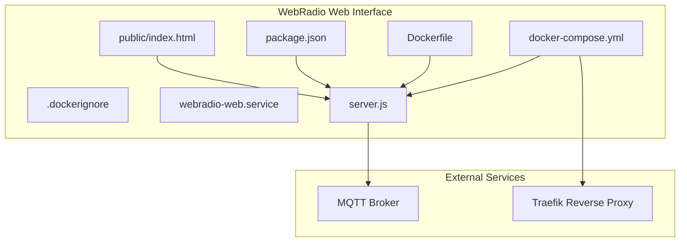
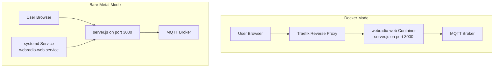
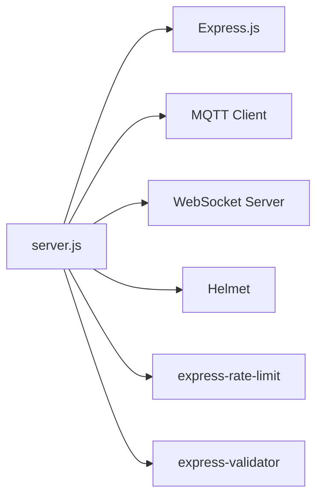

# Deployment Configuration

<cite>
**Referenced Files in This Document**
- [Dockerfile](file://WebRadio_web/Dockerfile)
- [docker-compose.yml](file://WebRadio_web/docker-compose.yml)
- [.dockerignore](file://WebRadio_web/.dockerignore)
- [webradio-web.service](file://WebRadio_web/webradio-web.service)
- [server.js](file://WebRadio_web/server.js)
- [package.json](file://WebRadio_web/package.json)
- [README.md](file://WebRadio_web/README.md)
- [index.html](file://WebRadio_web/public/index.html)
- [secrets.h.example](file://WebRadio_ESP32_S3/src/secrets.h.example)
</cite>

## Table of Contents
1. [Introduction](#introduction)
2. [Project Structure](#project-structure)
3. [Core Components](#core-components)
4. [Architecture Overview](#architecture-overview)
5. [Detailed Component Analysis](#detailed-component-analysis)
6. [Dependency Analysis](#dependency-analysis)
7. [Performance Considerations](#performance-considerations)
8. [Troubleshooting Guide](#troubleshooting-guide)
9. [Conclusion](#conclusion)
10. [Appendices](#appendices)

## Introduction
This document provides comprehensive deployment guidance for the WebRadio web interface, covering Docker containerization, Docker Compose orchestration, and systemd service configuration. It explains the Dockerfile build process, container configuration, and environment variable management. It documents the docker-compose.yml setup for multi-container deployment, service dependencies, and network configuration. It covers the systemd service unit file for production deployments, service management, and automatic startup. It includes environment variable configuration for SECRET_TOKEN, MQTT broker settings, and server ports. It addresses security hardening, resource limits, and monitoring setup. It documents deployment strategies, scaling considerations, and maintenance procedures. It includes troubleshooting guides for common deployment issues and performance optimization techniques.

## Project Structure
The WebRadio web interface is implemented as a Node.js application packaged with Express.js, serving static assets and exposing REST APIs and WebSocket endpoints. It integrates with an MQTT broker for real-time radio state updates and command publishing. The deployment artifacts include:
- Dockerfile for containerization
- docker-compose.yml for orchestration with Traefik
- .dockerignore for build optimization
- systemd service unit file for bare-metal operation
- Application entrypoint and configuration

**Diagram sources**
- [Dockerfile:1-28](file://WebRadio_web/Dockerfile#L1-L28)
- [docker-compose.yml:1-25](file://WebRadio_web/docker-compose.yml#L1-L25)
- [.dockerignore:1-5](file://WebRadio_web/.dockerignore#L1-L5)
- [webradio-web.service:1-14](file://WebRadio_web/webradio-web.service#L1-L14)
- [server.js:1-267](file://WebRadio_web/server.js#L1-L267)
- [package.json:1-26](file://WebRadio_web/package.json#L1-L26)
- [index.html:1-61](file://WebRadio_web/public/index.html#L1-L61)

**Section sources**
- [Dockerfile:1-28](file://WebRadio_web/Dockerfile#L1-L28)
- [docker-compose.yml:1-25](file://WebRadio_web/docker-compose.yml#L1-L25)
- [.dockerignore:1-5](file://WebRadio_web/.dockerignore#L1-L5)
- [webradio-web.service:1-14](file://WebRadio_web/webradio-web.service#L1-L14)
- [server.js:1-267](file://WebRadio_web/server.js#L1-L267)
- [package.json:1-26](file://WebRadio_web/package.json#L1-L26)
- [index.html:1-61](file://WebRadio_web/public/index.html#L1-L61)

## Core Components
- Containerization: The application is built from a Node.js 18 Alpine base image, installs dependencies, switches to a non-root user, exposes port 3000, and runs the Node.js server.
- Orchestration: Docker Compose builds the image, sets container metadata, restart policy, network membership, and Traefik labels for reverse proxy routing and TLS.
- Environment Variables: The server reads SECRET_TOKEN, MQTT_BROKER_URL, MQTT_USER, MQTT_PASSWORD, and MQTT_PREFIX from the environment. A default SECRET_TOKEN is generated if not provided.
- Service Unit: A systemd unit runs the Node.js server directly on the host with automatic restart behavior.
- Static Assets: The Express server serves static files from the public directory.

Key configuration points:
- Port exposure and binding: The server listens on port 3000 and binds to 0.0.0.0.
- MQTT integration: The server connects to an MQTT broker using optional credentials and subscribes to a configurable topic prefix.
- Authentication: Both API and WebSocket endpoints require a shared-secret token.

**Section sources**
- [Dockerfile:1-28](file://WebRadio_web/Dockerfile#L1-L28)
- [docker-compose.yml:1-25](file://WebRadio_web/docker-compose.yml#L1-L25)
- [server.js:31-54](file://WebRadio_web/server.js#L31-L54)
- [server.js:102-110](file://WebRadio_web/server.js#L102-L110)
- [server.js:263-267](file://WebRadio_web/server.js#L263-L267)
- [webradio-web.service:1-14](file://WebRadio_web/webradio-web.service#L1-L14)

## Architecture Overview
The deployment architecture supports two primary modes:
- Docker mode: The web interface runs in a container behind Traefik, which handles TLS termination and routing.
- Bare-metal mode: The web interface runs directly on the host via systemd.

**Diagram sources**
- [docker-compose.yml:1-25](file://WebRadio_web/docker-compose.yml#L1-L25)
- [server.js:31-54](file://WebRadio_web/server.js#L31-L54)
- [webradio-web.service:1-14](file://WebRadio_web/webradio-web.service#L1-L14)

## Detailed Component Analysis

### Dockerfile Build Process
The Dockerfile defines a multi-stage-like build:
- Base image: Node.js 18 Alpine
- Working directory: /usr/src/app
- Dependency installation: Copies package.json and package-lock.json, installs dependencies
- Application copy: Copies the rest of the application code
- Ownership and user: Changes ownership to node:node and switches to non-root user
- Exposed port: 3000
- Command: node server.js

Best practices reflected:
- Non-root user execution
- Minimal base image (Alpine)
- Layer caching via early dependency copy

**Section sources**
- [Dockerfile:1-28](file://WebRadio_web/Dockerfile#L1-L28)

### Docker Compose Orchestration
The docker-compose.yml orchestrates:
- Service definition: Builds from current directory, sets container name, restart policy, and network membership
- Network: Uses an existing external network named root_default
- Hosts: Adds host.docker.internal mapping for Docker Desktop environments
- Traefik labels: Enables Traefik, configures host rule, TLS, entrypoint, certificate resolver, and backend port
- Environment: Loads variables from .env file

Operational notes:
- The service expects an external network named root_default to exist.
- Traefik is configured to route HTTPS traffic to port 3000 of the container.

**Section sources**
- [docker-compose.yml:1-25](file://WebRadio_web/docker-compose.yml#L1-L25)

### Environment Variable Management
The server reads the following environment variables:
- SECRET_TOKEN: Required for API and WebSocket authentication; defaults to a generated value if not provided
- MQTT_BROKER_URL: MQTT broker URL; defaults to localhost if not provided
- MQTT_USER: Optional MQTT username
- MQTT_PASSWORD: Optional MQTT password
- MQTT_PREFIX: Topic prefix for MQTT subscriptions and publications

The application logs a warning if SECRET_TOKEN is not set, advising persistent configuration via .env.

**Section sources**
- [server.js:34-45](file://WebRadio_web/server.js#L34-L45)
- [server.js:35-38](file://WebRadio_web/server.js#L35-L38)
- [README.md:38-51](file://WebRadio_web/README.md#L38-L51)

### Systemd Service Configuration
The systemd unit file:
- Description: WebRadio Web Interface
- After: network.target
- User/Group: user
- WorkingDirectory: home directory path
- ExecStart: node server.js
- Restart: always
- Install: multi-user.target

This enables automatic startup and restart behavior on the host.

**Section sources**
- [webradio-web.service:1-14](file://WebRadio_web/webradio-web.service#L1-L14)

### API and WebSocket Endpoints
The server exposes:
- REST API under /api/radio with authentication via SECRET_TOKEN header
- WebSocket upgrade endpoint protected by SECRET_TOKEN query parameter
- Static asset hosting from the public directory

Security measures:
- Helmet security headers
- Rate limiting for API endpoints
- Shared-secret authentication for API and WebSocket

**Section sources**
- [server.js:100-203](file://WebRadio_web/server.js#L100-L203)
- [server.js:208-260](file://WebRadio_web/server.js#L208-L260)
- [server.js:14-29](file://WebRadio_web/server.js#L14-L29)

### MQTT Integration
The server:
- Connects to the MQTT broker using optional credentials
- Subscribes to topics under the configured MQTT_PREFIX
- Publishes commands to MQTT topics for radio control
- Broadcasts state updates to WebSocket clients

**Section sources**
- [server.js:47-97](file://WebRadio_web/server.js#L47-L97)
- [server.js:123-134](file://WebRadio_web/server.js#L123-L134)
- [server.js:212-222](file://WebRadio_web/server.js#L212-L222)

### Static Frontend Hosting
The Express server serves static assets from the public directory, enabling the web UI to load CSS, JavaScript, and media resources.

**Section sources**
- [server.js:205-206](file://WebRadio_web/server.js#L205-L206)
- [index.html:1-61](file://WebRadio_web/public/index.html#L1-L61)

## Dependency Analysis
The application depends on:
- Express.js for HTTP server and routing
- MQTT client for real-time communication
- WebSocket server for live updates
- Helmet for security headers
- express-rate-limit for rate limiting
- express-validator for request validation

**Diagram sources**
- [server.js:1-9](file://WebRadio_web/server.js#L1-L9)
- [package.json:15-24](file://WebRadio_web/package.json#L15-L24)

**Section sources**
- [package.json:15-24](file://WebRadio_web/package.json#L15-L24)

## Performance Considerations
- Containerization: Use the Alpine base image to reduce footprint and improve startup time.
- Resource limits: Configure CPU and memory limits in Docker Compose to prevent resource contention.
- Reverse proxy offloading: Place Traefik in front of the container to handle TLS termination and compression.
- Static asset caching: Serve static assets with long cache headers to reduce bandwidth usage.
- Rate limiting: The application includes rate limiting for API endpoints; tune thresholds as needed.
- Monitoring: Integrate metrics collection and health checks for the container and service.

[No sources needed since this section provides general guidance]

## Troubleshooting Guide
Common deployment issues and resolutions:
- Container fails to start:
  - Verify the .env file is present and contains SECRET_TOKEN, MQTT_BROKER_URL, and optional MQTT credentials.
  - Confirm the external network root_default exists when using docker-compose.
  - Check Traefik labels and entrypoints for routing and TLS configuration.
- MQTT connectivity problems:
  - Ensure MQTT_BROKER_URL points to the correct broker address and port.
  - Verify MQTT_USER and MQTT_PASSWORD if authentication is required.
  - Confirm the MQTT_PREFIX matches the topics used by the ESP32 device.
- Authentication failures:
  - Ensure the X-AUTH-TOKEN header matches SECRET_TOKEN for API calls.
  - Verify the token query parameter matches SECRET_TOKEN for WebSocket connections.
- Port conflicts:
  - The server listens on port 3000; ensure it is not blocked by the host firewall or another service.
- Static assets not loading:
  - Confirm the public directory is served by Express and accessible within the container.

**Section sources**
- [docker-compose.yml:1-25](file://WebRadio_web/docker-compose.yml#L1-L25)
- [server.js:34-45](file://WebRadio_web/server.js#L34-L45)
- [server.js:102-110](file://WebRadio_web/server.js#L102-L110)
- [server.js:224-238](file://WebRadio_web/server.js#L224-L238)

## Conclusion
This deployment guide outlines a secure, scalable, and maintainable approach to running the WebRadio web interface. It leverages Docker for isolation and reproducibility, Docker Compose for orchestration with Traefik, and systemd for bare-metal deployments. Proper environment variable management, security hardening, and monitoring practices ensure reliable operation. The included troubleshooting steps and performance recommendations support smooth day-to-day operations.

[No sources needed since this section summarizes without analyzing specific files]

## Appendices

### Environment Variables Reference
- SECRET_TOKEN: Secret token for API and WebSocket authentication
- MQTT_BROKER_URL: URL of the MQTT broker
- MQTT_USER: Optional MQTT username
- MQTT_PASSWORD: Optional MQTT password
- MQTT_PREFIX: Topic prefix for MQTT communications

**Section sources**
- [server.js:34-38](file://WebRadio_web/server.js#L34-L38)
- [README.md:38-51](file://WebRadio_web/README.md#L38-L51)

### Deployment Strategies
- Docker mode with Traefik: Recommended for production with automated TLS and routing.
- Bare-metal mode with systemd: Suitable for environments where containers are not preferred.
- Scaling considerations: Use Traefik with multiple replicas behind a load balancer; ensure shared state is managed externally if needed.

[No sources needed since this section provides general guidance]

### Security Hardening Checklist
- Use strong SECRET_TOKEN values
- Enable TLS via Traefik
- Restrict network access to the container or service
- Monitor logs and apply updates regularly
- Validate and sanitize all incoming requests

[No sources needed since this section provides general guidance]