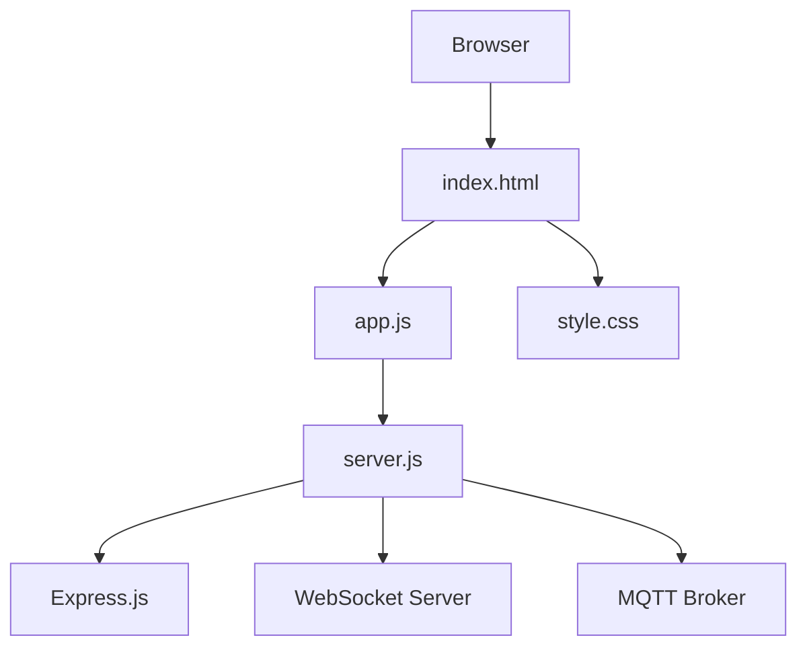
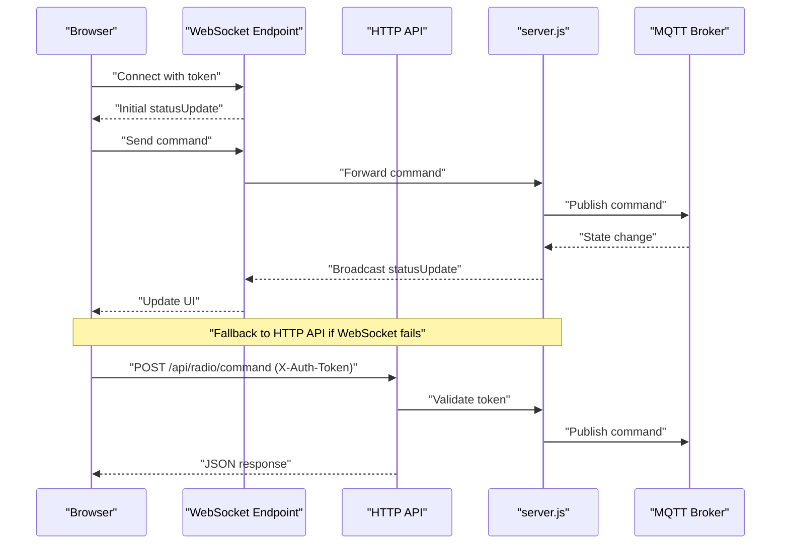
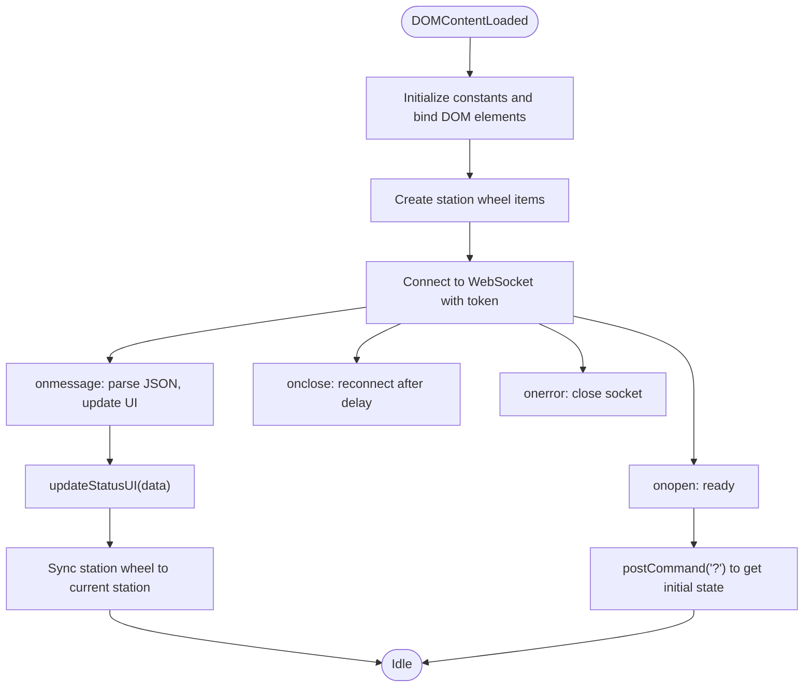
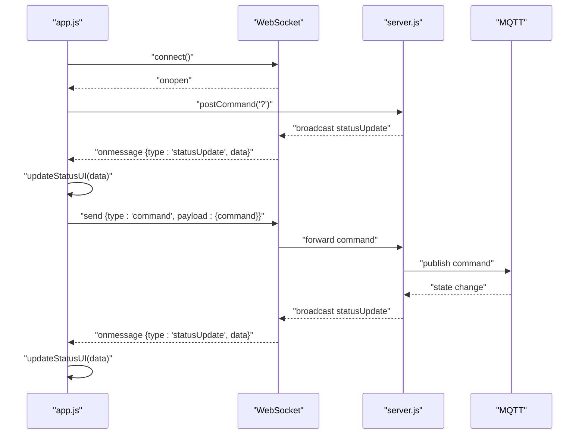
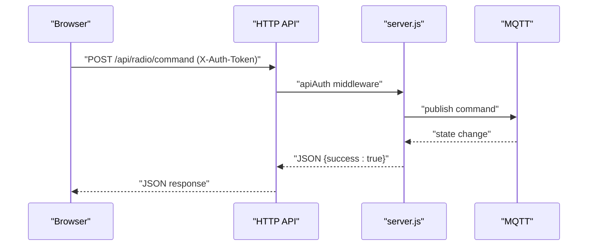
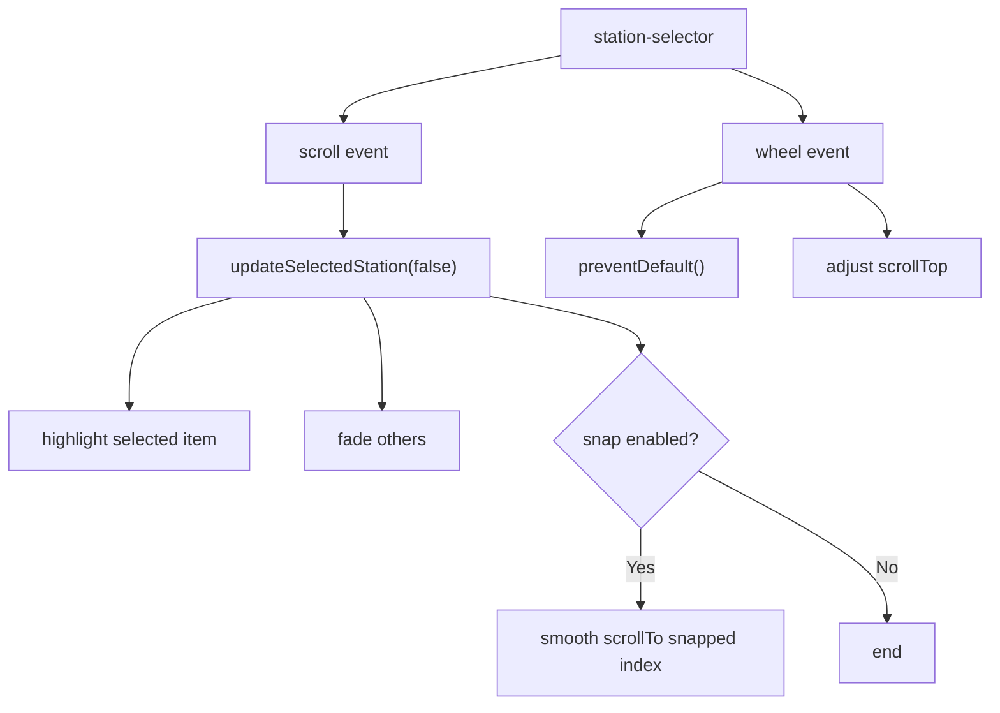
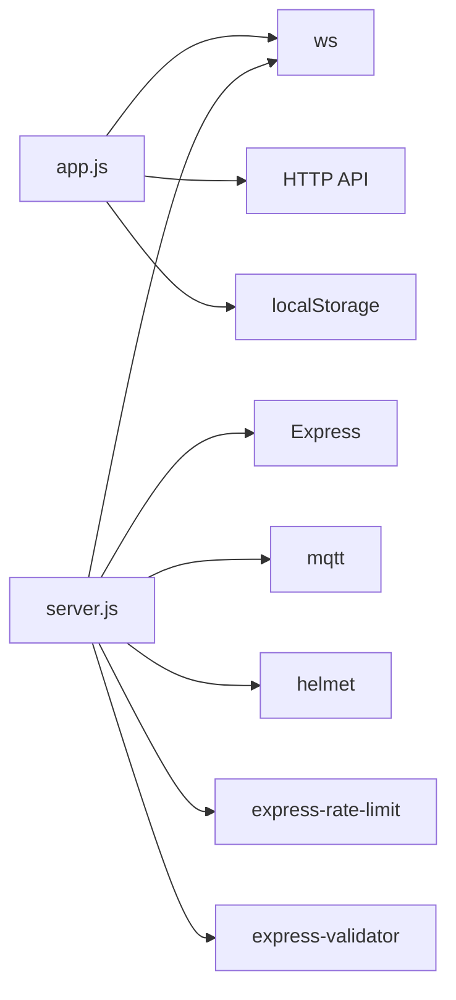

# Frontend Application

<cite>
**Referenced Files in This Document**
- [index.html](file://WebRadio_web/public/index.html)
- [app.js](file://WebRadio_web/public/app.js)
- [style.css](file://WebRadio_web/public/style.css)
- [server.js](file://WebRadio_web/server.js)
- [package.json](file://WebRadio_web/package.json)
- [README.md](file://WebRadio_web/README.md)
- [docker-compose.yml](file://WebRadio_web/docker-compose.yml)
- [Dockerfile](file://WebRadio_web/Dockerfile)
</cite>

## Table of Contents
1. [Introduction](#introduction)
2. [Project Structure](#project-structure)
3. [Core Components](#core-components)
4. [Architecture Overview](#architecture-overview)
5. [Detailed Component Analysis](#detailed-component-analysis)
6. [Dependency Analysis](#dependency-analysis)
7. [Performance Considerations](#performance-considerations)
8. [Troubleshooting Guide](#troubleshooting-guide)
9. [Conclusion](#conclusion)
10. [Appendices](#appendices)

## Introduction
This document explains the client-side JavaScript application that powers the WebRadio web interface. It covers the HTML structure, DOM manipulation, user interface components, JavaScript application architecture, event handling, and real-time updates via WebSocket connections. It also documents the CSS styling approach, responsive design, cross-browser compatibility considerations, and the integration between the frontend and backend APIs, including authentication tokens and communication patterns. UI components covered include station selection, volume controls, power management, and alarm configuration. Accessibility, mobile responsiveness, and progressive enhancement techniques are addressed.

## Project Structure
The frontend application consists of a static HTML page, a small vanilla JavaScript application, and a stylesheet. The backend is a Node.js/Express server that serves the frontend and exposes both HTTP API endpoints and a WebSocket endpoint. The server bridges the frontend to an MQTT bus that controls the ESP32 hardware.

**Diagram sources**
- [index.html:1-61](file://WebRadio_web/public/index.html#L1-L61)
- [app.js:1-366](file://WebRadio_web/public/app.js#L1-L366)
- [style.css:1-285](file://WebRadio_web/public/style.css#L1-L285)
- [server.js:1-267](file://WebRadio_web/server.js#L1-L267)

**Section sources**
- [index.html:1-61](file://WebRadio_web/public/index.html#L1-L61)
- [app.js:1-366](file://WebRadio_web/public/app.js#L1-L366)
- [style.css:1-285](file://WebRadio_web/public/style.css#L1-L285)
- [server.js:1-267](file://WebRadio_web/server.js#L1-L267)

## Core Components
- HTML structure defines the UI layout: status panel, control buttons, station selector wheel, and alarm controls.
- JavaScript manages WebSocket connectivity, event handlers, DOM updates, and fallback HTTP API calls.
- CSS provides responsive grid layouts, button styles, volume icon rendering, and media queries for mobile.
- Backend server exposes authenticated HTTP API endpoints and a token-protected WebSocket endpoint, broadcasting MQTT-derived state to clients.

Key responsibilities:
- DOM elements: status display, control buttons, station wheel, alarm inputs.
- State management: current volume, station number, power state, selected station ID, scroll synchronization.
- Real-time updates: WebSocket messages update UI and synchronize the station wheel.
- API communication: HTTP fallback when WebSocket is unavailable; authentication via X-Auth-Token header.
- UI effects: animated volume bars, selected station highlighting, responsive grids.

**Section sources**
- [index.html:15-58](file://WebRadio_web/public/index.html#L15-L58)
- [app.js:88-121](file://WebRadio_web/public/app.js#L88-L121)
- [app.js:198-261](file://WebRadio_web/public/app.js#L198-L261)
- [style.css:32-285](file://WebRadio_web/public/style.css#L32-L285)
- [server.js:99-203](file://WebRadio_web/server.js#L99-L203)

## Architecture Overview
The frontend connects to the backend via two channels:
- WebSocket: authenticated with a secret token; receives live status updates.
- HTTP API: authenticated with the same secret token via X-Auth-Token header; used as a fallback when WebSocket is unavailable.

The backend subscribes to MQTT topics and broadcasts state updates to WebSocket clients. It also validates and forwards commands to MQTT.

**Diagram sources**
- [app.js:123-178](file://WebRadio_web/public/app.js#L123-L178)
- [app.js:181-196](file://WebRadio_web/public/app.js#L181-L196)
- [server.js:224-238](file://WebRadio_web/server.js#L224-L238)
- [server.js:240-260](file://WebRadio_web/server.js#L240-L260)
- [server.js:123-134](file://WebRadio_web/server.js#L123-L134)

## Detailed Component Analysis

### HTML Structure and DOM Elements
The HTML defines:
- Status container with state, station, volume, title, alarm, and log.
- Control buttons for power, sleep, volume up/down, channel up/down.
- Preset station selector with a wheel and a play button.
- Alarm controls with time picker, set, and cancel buttons.

DOM elements are accessed and manipulated by the JavaScript application to reflect real-time state and user actions.

**Section sources**
- [index.html:18-54](file://WebRadio_web/public/index.html#L18-L54)

### JavaScript Application Architecture
The application initializes on DOMContentLoaded, sets up configuration constants, binds DOM elements, maintains state, establishes WebSocket connectivity, and handles events.

Key areas:
- Configuration: base API path, station count, item height, reconnect interval.
- DOM element bindings: status fields, station selector, control buttons, alarm inputs.
- State: current volume, station number, power state, selected station ID, wheel flags, WebSocket reference.
- WebSocket lifecycle: URL construction with token, connection, message parsing, reconnection, error handling.
- API helpers: command posting via WebSocket or HTTP fallback with token header.
- UI updates: volume icon bars, status display, alarm formatting, station wheel synchronization.
- Event handlers: power, sleep, volume/channel controls, alarm set/cancel, play selected station.
- Station wheel: scroll handling, wheel event, selection highlighting, snapping.

**Diagram sources**
- [app.js:1-366](file://WebRadio_web/public/app.js#L1-L366)

**Section sources**
- [app.js:1-366](file://WebRadio_web/public/app.js#L1-L366)

### WebSocket Integration and Real-Time Updates
- URL construction: selects ws or wss based on protocol, appends token query parameter, stores token in localStorage.
- Connection lifecycle: open, message, close, error; on close triggers automatic reconnection.
- Message handling: parses JSON, filters by type, updates UI via updateStatusUI.
- Command forwarding: sends command payloads to WebSocket; if unavailable, falls back to HTTP API.

**Diagram sources**
- [app.js:123-178](file://WebRadio_web/public/app.js#L123-L178)
- [app.js:181-196](file://WebRadio_web/public/app.js#L181-L196)
- [server.js:240-260](file://WebRadio_web/server.js#L240-L260)

**Section sources**
- [app.js:123-178](file://WebRadio_web/public/app.js#L123-L178)
- [app.js:181-196](file://WebRadio_web/public/app.js#L181-L196)
- [server.js:224-238](file://WebRadio_web/server.js#L224-L238)
- [server.js:240-260](file://WebRadio_web/server.js#L240-L260)

### API Communication Patterns and Authentication
- HTTP API: protected by a secret token via X-Auth-Token header; used as a fallback when WebSocket is unavailable.
- Token handling: stored in localStorage; prompts user on first visit; persists for subsequent sessions.
- Command routing: commands are forwarded to MQTT; responses are JSON with success flag and metadata.

**Diagram sources**
- [app.js:181-196](file://WebRadio_web/public/app.js#L181-L196)
- [server.js:102-113](file://WebRadio_web/server.js#L102-L113)
- [server.js:123-134](file://WebRadio_web/server.js#L123-L134)

**Section sources**
- [app.js:181-196](file://WebRadio_web/public/app.js#L181-L196)
- [server.js:102-113](file://WebRadio_web/server.js#L102-L113)
- [server.js:123-134](file://WebRadio_web/server.js#L123-L134)

### User Interface Components

#### Status Panel
- Displays connection state, current station, volume, title, alarm, and log.
- Toggles online/offline styling based on state.
- Formats alarm duration into HH:MM.

**Section sources**
- [index.html:18-26](file://WebRadio_web/public/index.html#L18-L26)
- [app.js:223-261](file://WebRadio_web/public/app.js#L223-L261)

#### Control Buttons
- Power, Sleep, Volume Up/Down, Channel Up/Down.
- Click handlers send corresponding commands via WebSocket or HTTP fallback.

**Section sources**
- [index.html:29-36](file://WebRadio_web/public/index.html#L29-L36)
- [app.js:264-269](file://WebRadio_web/public/app.js#L264-L269)

#### Preset Station Selector
- Scrollable wheel with 78 station items.
- Selection highlighting and scaling based on distance from center.
- Snapping to nearest item after scrolling.
- Play Selected button sends the chosen station command.

**Diagram sources**
- [app.js:296-333](file://WebRadio_web/public/app.js#L296-L333)
- [app.js:339-343](file://WebRadio_web/public/app.js#L339-L343)

**Section sources**
- [index.html:38-47](file://WebRadio_web/public/index.html#L38-L47)
- [app.js:296-333](file://WebRadio_web/public/app.js#L296-L333)
- [app.js:346-357](file://WebRadio_web/public/app.js#L346-L357)

#### Alarm Controls
- Time picker, Set Alarm, Cancel Alarm.
- Converts time to seconds and sends alarm command; refreshes status afterward.

**Section sources**
- [index.html:49-54](file://WebRadio_web/public/index.html#L49-L54)
- [app.js:271-288](file://WebRadio_web/public/app.js#L271-L288)

### DOM Manipulation Examples
- Creating station items dynamically and appending to the wheel.
- Updating volume icon bars with active state and heights.
- Setting status container class based on connection state.
- Formatting alarm time from seconds to HH:MM.

**Section sources**
- [app.js:346-357](file://WebRadio_web/public/app.js#L346-L357)
- [app.js:199-221](file://WebRadio_web/public/app.js#L199-L221)
- [app.js:223-261](file://WebRadio_web/public/app.js#L223-L261)

### Event Handling Examples
- Button click handlers for power, sleep, volume/channel controls.
- Alarm set/cancel handlers with time validation.
- Play selected station handler with bounds checking.
- Scroll and wheel handlers for station selector.

**Section sources**
- [app.js:264-288](file://WebRadio_web/public/app.js#L264-L288)
- [app.js:290-294](file://WebRadio_web/public/app.js#L290-L294)
- [app.js:335-343](file://WebRadio_web/public/app.js#L335-L343)

### WebSocket Message Handling
- Parsing JSON messages and filtering by type.
- Updating UI fields and synchronizing station wheel.
- Reconnection logic on close and error.

**Section sources**
- [app.js:156-177](file://WebRadio_web/public/app.js#L156-L177)
- [app.js:255-261](file://WebRadio_web/public/app.js#L255-L261)

## Dependency Analysis
The frontend depends on:
- Vanilla JavaScript for DOM manipulation and WebSocket handling.
- CSS for styling and responsive layouts.
- Backend services for real-time state and command dispatch.

Backend dependencies include Express, WebSocket, MQTT, helmet, rate limiter, and express-validator.

**Diagram sources**
- [app.js:123-178](file://WebRadio_web/public/app.js#L123-L178)
- [app.js:181-196](file://WebRadio_web/public/app.js#L181-L196)
- [server.js:1-267](file://WebRadio_web/server.js#L1-L267)
- [package.json:15-24](file://WebRadio_web/package.json#L15-L24)

**Section sources**
- [package.json:15-24](file://WebRadio_web/package.json#L15-L24)
- [server.js:1-267](file://WebRadio_web/server.js#L1-L267)

## Performance Considerations
- Efficient DOM updates: batch UI updates in a single function to minimize reflows.
- Debounced scroll handling: throttle wheel and scroll events to reduce layout thrashing.
- Minimal re-renders: only update changed fields and icons.
- Volume icon rendering: compute bars once per update and reuse DOM nodes.
- Reconnection strategy: exponential backoff can be considered; current fixed interval is simple and predictable.
- Network resilience: fallback to HTTP API when WebSocket is unavailable.

[No sources needed since this section provides general guidance]

## Troubleshooting Guide
Common issues and resolutions:
- No secret token provided: The application prompts for a token on first visit and stores it in localStorage. Ensure the token matches the backend SECRET_TOKEN.
- WebSocket connection lost: The application attempts to reconnect automatically. Verify network connectivity and backend availability.
- Unauthorized API calls: Ensure X-Auth-Token header matches SECRET_TOKEN.
- Station wheel not syncing: The UI syncs based on current station number; verify MQTT state updates and that the backend is broadcasting status updates.
- Alarm not setting: Confirm time input is valid and command is sent; backend converts time to seconds and publishes the alarm command.

**Section sources**
- [app.js:123-137](file://WebRadio_web/public/app.js#L123-L137)
- [app.js:167-177](file://WebRadio_web/public/app.js#L167-L177)
- [server.js:102-113](file://WebRadio_web/server.js#L102-L113)
- [server.js:212-222](file://WebRadio_web/server.js#L212-L222)

## Conclusion
The frontend application provides a responsive, real-time control interface for the WebRadio system. It integrates WebSocket-based live updates with a robust fallback to HTTP API calls, ensuring reliability across environments. The modular JavaScript code, clear DOM manipulation, and thoughtful CSS layouts deliver a smooth user experience on both desktop and mobile devices. Authentication via a shared secret token secures both WebSocket and HTTP endpoints, while the backend’s MQTT bridge enables seamless control of the underlying hardware.

[No sources needed since this section summarizes without analyzing specific files]

## Appendices

### Accessibility Features
- Semantic HTML structure with headings and labels.
- Keyboard-accessible focus order via tab navigation.
- Sufficient color contrast for status indicators and buttons.
- Text alternatives for icons via aria-labels where applicable.

[No sources needed since this section provides general guidance]

### Mobile Responsiveness
- Responsive grids for controls and station selector.
- Media queries adjust layouts for narrow screens.
- Touch-friendly button sizing and spacing.

**Section sources**
- [style.css:240-285](file://WebRadio_web/public/style.css#L240-L285)

### Progressive Enhancement
- Feature detection for WebSocket support; graceful degradation to HTTP API.
- Dynamic station wheel creation ensures functionality even if initial data is partial.
- Local storage for token persistence improves usability without breaking core features.

**Section sources**
- [app.js:123-137](file://WebRadio_web/public/app.js#L123-L137)
- [app.js:181-196](file://WebRadio_web/public/app.js#L181-L196)
- [app.js:346-357](file://WebRadio_web/public/app.js#L346-L357)

### Cross-Browser Compatibility
- Modern CSS Grid and Flexbox with vendor-prefixed fallbacks where necessary.
- Standard DOM APIs and WebSocket supported in modern browsers.
- Edge and Firefox scrollbar hiding handled via standard properties.

**Section sources**
- [style.css:140-152](file://WebRadio_web/public/style.css#L140-L152)

### Deployment Notes
- Dockerized backend with non-root user and security headers.
- Reverse proxy configuration via Traefik labels in docker-compose.

**Section sources**
- [Dockerfile:1-28](file://WebRadio_web/Dockerfile#L1-L28)
- [docker-compose.yml:1-25](file://WebRadio_web/docker-compose.yml#L1-L25)
- [README.md:21-75](file://WebRadio_web/README.md#L21-L75)