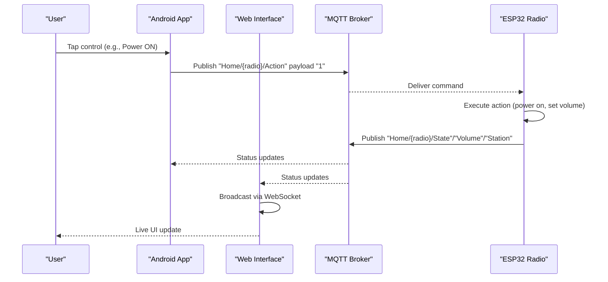
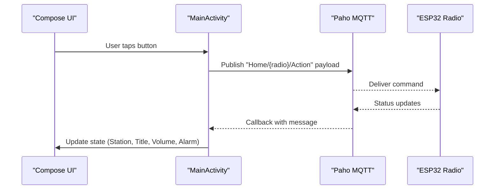
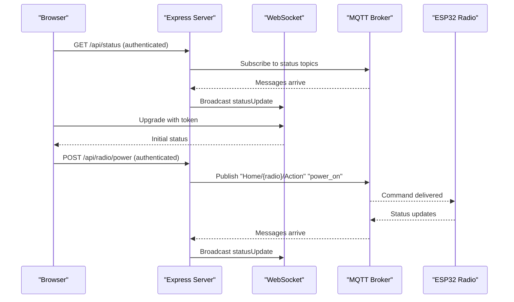
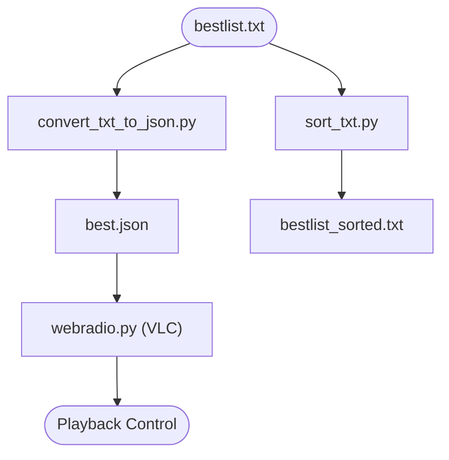
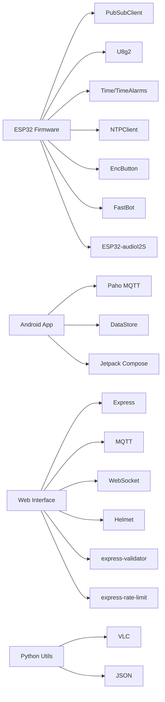

# MCP Development Ecosystem

<cite>
**Referenced Files in This Document**
- [README.md](file://README.md)
- [WebRadio_ESP32_S3/README.md](file://WebRadio_ESP32_S3/README.md)
- [WebRadio_ESP32_S3/src/main.cpp](file://WebRadio_ESP32_S3/src/main.cpp)
- [WebRadio_ESP32_S3/src/secrets.h](file://WebRadio_ESP32_S3/src/secrets.h)
- [WebRadio_ESP32_S3/platformio.ini](file://WebRadio_ESP32_S3/platformio.ini)
- [WebRadio_android/README.md](file://WebRadio_android/README.md)
- [WebRadio_android/app/src/main/java/com/dip16/webradio/MainActivity.kt](file://WebRadio_android/app/src/main/java/com/dip16/webradio/MainActivity.kt)
- [WebRadio_web/README.md](file://WebRadio_web/README.md)
- [WebRadio_web/server.js](file://WebRadio_web/server.js)
- [WebRadio_web/package.json](file://WebRadio_web/package.json)
- [WebRadio_python_utils/README.md](file://WebRadio_python_utils/README.md)
- [WebRadio_python_utils/webradio.py](file://WebRadio_python_utils/webradio.py)
- [WebRadio_python_utils/convert_txt_to_json.py](file://WebRadio_python_utils/convert_txt_to_json.py)
- [WebRadio_python_utils/sort_txt.py](file://WebRadio_python_utils/sort_txt.py)
</cite>

## Table of Contents
1. [Introduction](#introduction)
2. [Project Structure](#project-structure)
3. [Core Components](#core-components)
4. [Architecture Overview](#architecture-overview)
5. [Detailed Component Analysis](#detailed-component-analysis)
6. [Dependency Analysis](#dependency-analysis)
7. [Performance Considerations](#performance-considerations)
8. [Troubleshooting Guide](#troubleshooting-guide)
9. [Conclusion](#conclusion)

## Introduction
This document describes the MCP Development Ecosystem for a DIY IoT Internet Radio project. The system integrates an ESP32-based hardware radio player with Android and web control interfaces, all communicating over MQTT. It also includes Python utilities for managing radio station lists. The ecosystem emphasizes modularity, local network operation, and practical automation features such as alarms and sleep timers.

## Project Structure
The repository is organized into four primary components:
- ESP32 Firmware: Runs on the radio device, handles audio streaming, display, and MQTT/Telegram control.
- Android Remote: A native Android app for remote control and status monitoring.
- Web Interface: A Node.js-based web server with WebSocket bridging to MQTT for browser control.
- Python Utilities: Scripts for managing station lists and testing playback.

```mermaid
graph TB
subgraph "User Interfaces"
ANDR["Android App<br/>MainActivity.kt"]
WEB["Web Interface<br/>server.js"]
end
subgraph "Control Layer"
MQTT["MQTT Broker"]
end
subgraph "Hardware"
ESP["ESP32 Firmware<br/>main.cpp"]
OLED["OLED Display"]
AUDIO["Audio Output"]
BUTTONS["Physical Buttons"]
end
subgraph "Utilities"
PY["Python Utils<br/>webradio.py"]
TXT["Station Lists<br/>bestlist.txt"]
end
ANDR --> MQTT
WEB --> MQTT
MQTT <- --> ESP
ESP --> OLED
ESP --> AUDIO
ESP --> BUTTONS
PY --> TXT
```

**Diagram sources**
- [WebRadio_ESP32_S3/src/main.cpp:1-2103](file://WebRadio_ESP32_S3/src/main.cpp#L1-L2103)
- [WebRadio_android/app/src/main/java/com/dip16/webradio/MainActivity.kt:1-922](file://WebRadio_android/app/src/main/java/com/dip16/webradio/MainActivity.kt#L1-L922)
- [WebRadio_web/server.js:1-267](file://WebRadio_web/server.js#L1-L267)
- [WebRadio_python_utils/webradio.py:1-125](file://WebRadio_python_utils/webradio.py#L1-L125)

**Section sources**
- [README.md:1-113](file://README.md#L1-L113)

## Core Components
- ESP32 Firmware: Implements MQTT command handling, audio streaming via I2S, OLED display updates, and alarm/sleep automation. It supports two hardware variants via build flags and publishes status to MQTT topics.
- Android App: Provides real-time status display and control via MQTT. It manages device selection, alarm configuration, and persistent settings.
- Web Interface: Bridges MQTT to WebSocket and exposes REST APIs for station, volume, power, and alarm control with authentication and rate limiting.
- Python Utilities: Offer station list conversion, sorting, and a CLI player using VLC for testing and maintenance.

**Section sources**
- [WebRadio_ESP32_S3/README.md:1-127](file://WebRadio_ESP32_S3/README.md#L1-L127)
- [WebRadio_android/README.md:1-108](file://WebRadio_android/README.md#L1-L108)
- [WebRadio_web/README.md:1-75](file://WebRadio_web/README.md#L1-L75)
- [WebRadio_python_utils/README.md:1-43](file://WebRadio_python_utils/README.md#L1-L43)

## Architecture Overview
The system uses MQTT for lightweight messaging between control interfaces and the ESP32 radio. The Android app and web interface publish commands to a device-specific action topic and subscribe to status topics. The ESP32 subscribes to the action topic, executes commands, and publishes status updates. The web interface additionally bridges MQTT to WebSocket for live UI updates.



**Diagram sources**
- [WebRadio_ESP32_S3/src/main.cpp:275-650](file://WebRadio_ESP32_S3/src/main.cpp#L275-L650)
- [WebRadio_android/app/src/main/java/com/dip16/webradio/MainActivity.kt:257-316](file://WebRadio_android/app/src/main/java/com/dip16/webradio/MainActivity.kt#L257-L316)
- [WebRadio_web/server.js:84-97](file://WebRadio_web/server.js#L84-L97)

**Section sources**
- [README.md:61-113](file://README.md#L61-L113)

## Detailed Component Analysis

### ESP32 Firmware
The firmware orchestrates audio playback, display updates, and MQTT communication. Key responsibilities include:
- Command parsing from MQTT action topic and executing actions (power, volume, station selection, alarm).
- Publishing status to multiple MQTT topics (State, Station, Title, Volume, Alarm, Log).
- Managing hardware features (relays, FM transmitter, LEDs) and display via OLED.
- Handling reconnection to MQTT and WiFi, and maintaining reliability with automatic retries.

```mermaid
flowchart TD
Start(["MQTT Message Received"]) --> Parse["Parse Payload"]
Parse --> Cmd{"Command Type?"}
Cmd --> |Status "?"| PublishStatus["Publish Current Status"]
Cmd --> |Power "1"/"0"| PowerCmd["Toggle Power"]
Cmd --> |Volume "+"/"-"| VolCmd["Adjust Volume"]
Cmd --> |Channel "cN"| ChanCmd["Switch to Station N"]
Cmd --> |URL "h<url>"| UrlCmd["Play Specific URL"]
Cmd --> |Alarm "s<sec>"/"sAlarm OFF"| AlarmCmd["Set/Disable Alarm"]
PowerCmd --> UpdateDisplay["Update OLED Display"]
VolCmd --> UpdateDisplay
ChanCmd --> UpdateDisplay
UrlCmd --> UpdateDisplay
AlarmCmd --> UpdateDisplay
PublishStatus --> End(["Done"])
UpdateDisplay --> End
```

**Diagram sources**
- [WebRadio_ESP32_S3/src/main.cpp:275-650](file://WebRadio_ESP32_S3/src/main.cpp#L275-L650)

**Section sources**
- [WebRadio_ESP32_S3/src/main.cpp:275-650](file://WebRadio_ESP32_S3/src/main.cpp#L275-L650)
- [WebRadio_ESP32_S3/src/secrets.h:1-23](file://WebRadio_ESP32_S3/src/secrets.h#L1-L23)
- [WebRadio_ESP32_S3/platformio.ini:14-71](file://WebRadio_ESP32_S3/platformio.ini#L14-L71)

### Android Remote Control
The Android app connects to MQTT, subscribes to status topics, and sends commands. It maintains persistent settings for device selection and UI preferences, and provides a responsive Compose UI with real-time feedback.



**Diagram sources**
- [WebRadio_android/app/src/main/java/com/dip16/webradio/MainActivity.kt:257-316](file://WebRadio_android/app/src/main/java/com/dip16/webradio/MainActivity.kt#L257-L316)

**Section sources**
- [WebRadio_android/app/src/main/java/com/dip16/webradio/MainActivity.kt:171-331](file://WebRadio_android/app/src/main/java/com/dip16/webradio/MainActivity.kt#L171-L331)
- [WebRadio_android/README.md:61-108](file://WebRadio_android/README.md#L61-L108)

### Web Interface
The web server exposes REST endpoints for control and broadcasts live status via WebSocket. It authenticates clients using a shared secret token and bridges MQTT messages to WebSocket clients.



**Diagram sources**
- [WebRadio_web/server.js:84-203](file://WebRadio_web/server.js#L84-L203)

**Section sources**
- [WebRadio_web/server.js:33-203](file://WebRadio_web/server.js#L33-L203)
- [WebRadio_web/package.json:15-24](file://WebRadio_web/package.json#L15-L24)
- [WebRadio_web/README.md:21-75](file://WebRadio_web/README.md#L21-L75)

### Python Utilities
The utilities support station list management and local playback testing:
- `convert_txt_to_json.py`: Converts a plain list of URLs into a structured JSON suitable for players.
- `sort_txt.py`: Removes duplicates and sorts station URLs.
- `webradio.py`: A CLI player using VLC for testing and manual control.



**Diagram sources**
- [WebRadio_python_utils/convert_txt_to_json.py:1-18](file://WebRadio_python_utils/convert_txt_to_json.py#L1-L18)
- [WebRadio_python_utils/sort_txt.py:1-9](file://WebRadio_python_utils/sort_txt.py#L1-L9)
- [WebRadio_python_utils/webradio.py:1-125](file://WebRadio_python_utils/webradio.py#L1-L125)

**Section sources**
- [WebRadio_python_utils/README.md:1-43](file://WebRadio_python_utils/README.md#L1-L43)

## Dependency Analysis
- ESP32 Firmware depends on Arduino framework, PubSubClient for MQTT, U8g2 for OLED, Time/TimeAlarms for scheduling, NTPClient for time sync, EncButton for buttons, FastBot for Telegram, and ESP32-audioI2S for audio.
- Android App depends on Paho MQTT client, Jetpack Compose, Kotlin Coroutines, and DataStore for settings.
- Web Interface depends on Express, MQTT client, WebSocket, Helmet for security, express-validator for input validation, and express-rate-limit for protection.
- Python Utilities depend on VLC and JSON libraries.



**Diagram sources**
- [WebRadio_ESP32_S3/platformio.ini:36-71](file://WebRadio_ESP32_S3/platformio.ini#L36-L71)
- [WebRadio_android/app/build.gradle.kts:52-74](file://WebRadio_android/app/build.gradle.kts#L52-L74)
- [WebRadio_web/package.json:15-24](file://WebRadio_web/package.json#L15-L24)
- [WebRadio_python_utils/webradio.py:1-125](file://WebRadio_python_utils/webradio.py#L1-L125)

**Section sources**
- [WebRadio_ESP32_S3/platformio.ini:36-71](file://WebRadio_ESP32_S3/platformio.ini#L36-L71)
- [WebRadio_android/app/build.gradle.kts:52-74](file://WebRadio_android/app/build.gradle.kts#L52-L74)
- [WebRadio_web/package.json:15-24](file://WebRadio_web/package.json#L15-L24)

## Performance Considerations
- MQTT message frequency: The ESP32 publishes status periodically; avoid excessive updates to reduce bandwidth and CPU usage.
- Audio streaming stability: Ensure reliable network connectivity and appropriate buffering; monitor stream dropouts and reconnection behavior.
- OLED rendering: Keep display updates minimal and efficient to preserve responsiveness.
- Web interface scalability: Use rate limiting and secure tokens to mitigate abuse; consider load balancing for production deployments.
- Python utilities: VLC playback is CPU-intensive; run locally and avoid concurrent heavy tasks.

## Troubleshooting Guide
Common issues and resolutions:
- MQTT connection failures:
  - Verify broker URL, credentials, and network reachability.
  - Confirm topic subscriptions and payloads match expected formats.
- Android app disconnections:
  - Check broker availability and app lifecycle (connect/disconnect on activity lifecycle events).
  - Ensure persistent settings are correctly loaded.
- Web interface authentication:
  - Confirm SECRET_TOKEN matches between server and client.
  - Validate WebSocket upgrade token handling.
- ESP32 reconnection loops:
  - Review MQTT reconnect logic and backoff strategy.
  - Check hardware wiring for relays, buttons, and display.
- Python player issues:
  - Ensure VLC is installed and accessible.
  - Validate JSON station list format and URLs.

**Section sources**
- [WebRadio_ESP32_S3/src/main.cpp:652-690](file://WebRadio_ESP32_S3/src/main.cpp#L652-L690)
- [WebRadio_android/app/src/main/java/com/dip16/webradio/MainActivity.kt:171-246](file://WebRadio_android/app/src/main/java/com/dip16/webradio/MainActivity.kt#L171-L246)
- [WebRadio_web/server.js:33-80](file://WebRadio_web/server.js#L33-L80)
- [WebRadio_web/server.js:224-238](file://WebRadio_web/server.js#L224-L238)

## Conclusion
The MCP Development Ecosystem provides a robust, modular solution for an IoT Internet Radio. By leveraging MQTT for control and status, the system enables flexible user interfaces and reliable hardware operation. The included Python utilities streamline station list management, while the Android and web interfaces offer accessible control from mobile and desktop environments. Proper configuration of secrets, topics, and deployment ensures a secure and maintainable setup.