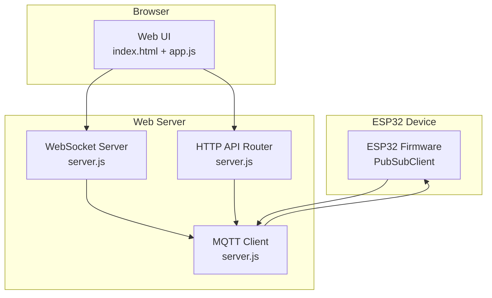
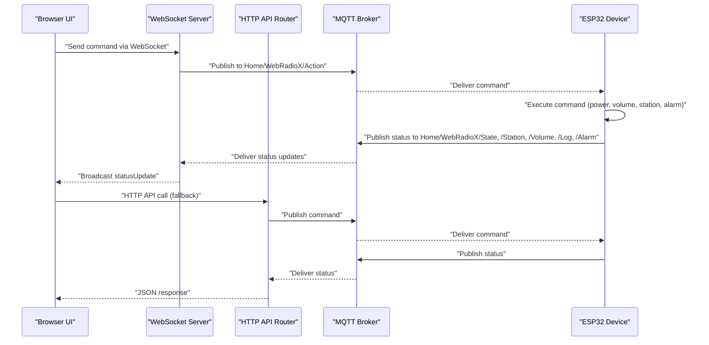
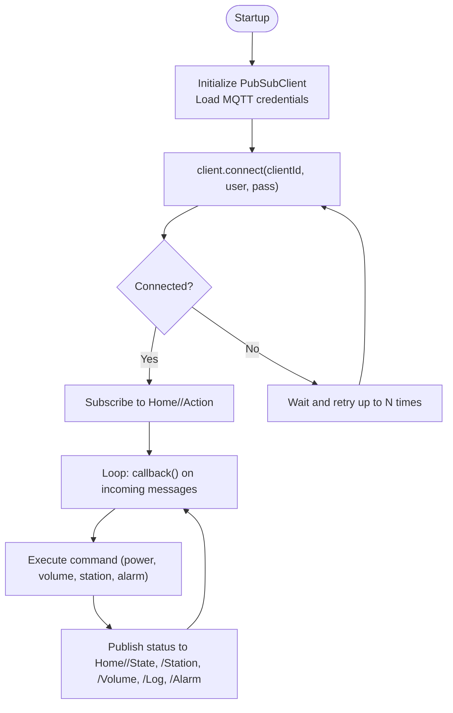
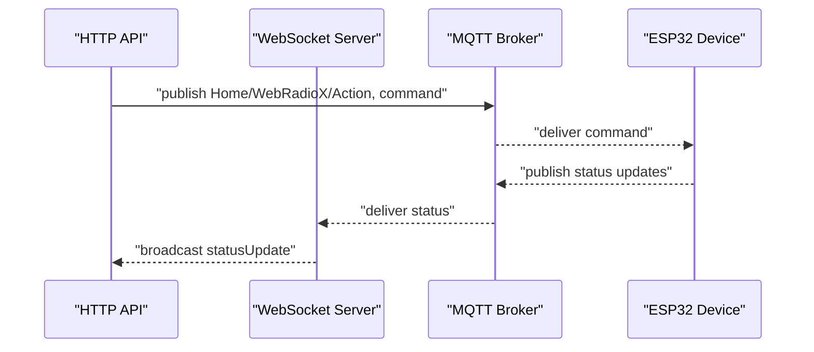
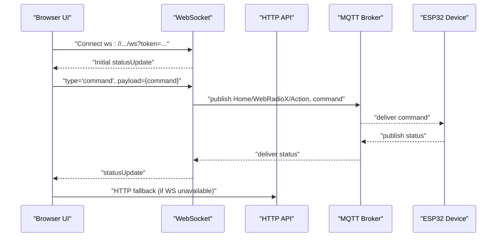
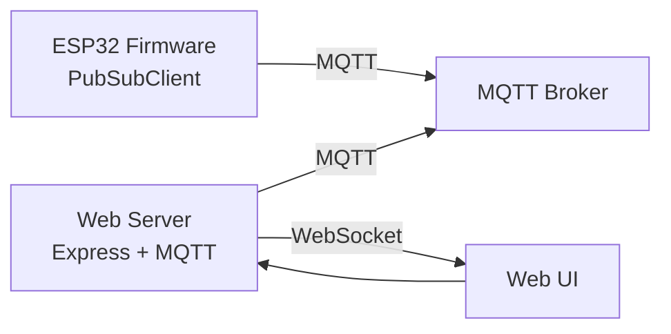

# MQTT Integration

<cite>
**Referenced Files in This Document**
- [main.cpp](file://WebRadio_ESP32_S3/src/main.cpp)
- [secrets.h](file://WebRadio_ESP32_S3/src/secrets.h)
- [README.md](file://WebRadio_ESP32_S3/README.md)
- [platformio.ini](file://WebRadio_ESP32_S3/platformio.ini)
- [server.js](file://WebRadio_web/server.js)
- [index.html](file://WebRadio_web/public/index.html)
- [app.js](file://WebRadio_web/public/app.js)
- [README.md](file://WebRadio_web/README.md)
- [docker-compose.yml](file://WebRadio_web/docker-compose.yml)
- [Dockerfile](file://WebRadio_web/Dockerfile)
</cite>

## Table of Contents
1. [Introduction](#introduction)
2. [Project Structure](#project-structure)
3. [Core Components](#core-components)
4. [Architecture Overview](#architecture-overview)
5. [Detailed Component Analysis](#detailed-component-analysis)
6. [Dependency Analysis](#dependency-analysis)
7. [Performance Considerations](#performance-considerations)
8. [Troubleshooting Guide](#troubleshooting-guide)
9. [Conclusion](#conclusion)
10. [Appendices](#appendices)

## Introduction
This document explains the MQTT integration layer that connects the web interface to the ESP32 device. It covers client configuration, connection establishment, authentication, topic naming conventions, message handling, and real-time synchronization. It also documents error handling, reconnection logic, security considerations, and operational best practices.

## Project Structure
The MQTT integration spans two parts:
- ESP32 firmware (publisher/subscriber) that receives commands and publishes status updates
- Web server (Node.js) that bridges MQTT to WebSocket and HTTP APIs for the browser

**Diagram sources**
- [main.cpp:274-650](file://WebRadio_ESP32_S3/src/main.cpp#L274-L650)
- [server.js:47-97](file://WebRadio_web/server.js#L47-L97)
- [app.js:122-178](file://WebRadio_web/public/app.js#L122-L178)

**Section sources**
- [README.md:89-112](file://WebRadio_ESP32_S3/README.md#L89-L112)
- [README.md:14-20](file://WebRadio_web/README.md#L14-L20)

## Core Components
- ESP32 Pub/Sub client and callbacks
- Web server MQTT client and WebSocket bridge
- Web UI that sends commands and displays live status

Key responsibilities:
- ESP32: subscribe to incoming action topic, execute commands, publish status topics
- Web server: subscribe to status topics, expose HTTP API, forward commands to MQTT, broadcast via WebSocket
- Web UI: authenticate, connect to WebSocket, send commands, render real-time state

**Section sources**
- [main.cpp:274-650](file://WebRadio_ESP32_S3/src/main.cpp#L274-L650)
- [server.js:47-97](file://WebRadio_web/server.js#L47-L97)
- [app.js:122-178](file://WebRadio_web/public/app.js#L122-L178)

## Architecture Overview
The integration follows a publish/subscribe pattern:
- Incoming commands: Web UI → WebSocket/HTTP → MQTT broker → ESP32 Action topic → device executes
- Outgoing status: ESP32 → status topics → MQTT broker → Web server → WebSocket → Web UI

**Diagram sources**
- [server.js:123-134](file://WebRadio_web/server.js#L123-L134)
- [server.js:84-97](file://WebRadio_web/server.js#L84-L97)
- [main.cpp:274-650](file://WebRadio_ESP32_S3/src/main.cpp#L274-L650)

## Detailed Component Analysis

### ESP32 MQTT Client and Topics
- Topic naming depends on device variant (WebRadio1 or WebRadio2) via macros
- Incoming topic: Home/<Device>/Action
- Outgoing status topics: Log, Station, Title, State, FreeHeap, Volume, Alarm
- Authentication: username/password via secrets.h
- Reconnection loop with limited retries

**Diagram sources**
- [main.cpp:652-690](file://WebRadio_ESP32_S3/src/main.cpp#L652-L690)
- [main.cpp:274-650](file://WebRadio_ESP32_S3/src/main.cpp#L274-L650)
- [secrets.h:20-23](file://WebRadio_ESP32_S3/src/secrets.h#L20-L23)

**Section sources**
- [main.cpp:295-649](file://WebRadio_ESP32_S3/src/main.cpp#L295-L649)
- [README.md:89-112](file://WebRadio_ESP32_S3/README.md#L89-L112)
- [secrets.h:20-23](file://WebRadio_ESP32_S3/src/secrets.h#L20-L23)

### Web Server MQTT Bridge and API
- MQTT client connects with username/password from environment
- Subscribes to Home/<Device>/# to receive all status updates
- Exposes HTTP API protected by a secret token
- Bridges commands to MQTT and broadcasts status via WebSocket

**Diagram sources**
- [server.js:47-97](file://WebRadio_web/server.js#L47-L97)
- [server.js:123-134](file://WebRadio_web/server.js#L123-L134)
- [server.js:212-222](file://WebRadio_web/server.js#L212-L222)

**Section sources**
- [server.js:33-54](file://WebRadio_web/server.js#L33-L54)
- [server.js:56-97](file://WebRadio_web/server.js#L56-L97)
- [server.js:102-203](file://WebRadio_web/server.js#L102-L203)

### Web UI Command Flow and Real-Time Updates
- Authenticates via secret token (prompted on first visit)
- Connects to WebSocket with token
- Sends commands via WebSocket or falls back to HTTP API
- Receives statusUpdate events and renders state

**Diagram sources**
- [app.js:122-178](file://WebRadio_web/public/app.js#L122-L178)
- [app.js:180-196](file://WebRadio_web/public/app.js#L180-L196)
- [index.html:18-27](file://WebRadio_web/public/index.html#L18-L27)

**Section sources**
- [app.js:122-178](file://WebRadio_web/public/app.js#L122-L178)
- [app.js:180-196](file://WebRadio_web/public/app.js#L180-L196)
- [index.html:18-27](file://WebRadio_web/public/index.html#L18-L27)

### Topic Naming Conventions and Payload Formats
- Prefix: Home/<Device>/ (Device is WebRadio1 or WebRadio2)
- Action topic: Home/<Device>/Action
- Status topics:
  - State: textual state (e.g., Power ON/OFF, ON SLEEP)
  - Station: "<channel> <name>" (e.g., "1 Silver Rain")
  - Title: current stream title
  - Volume: numeric string (0–21)
  - Log: informational messages and audio details
  - Alarm: seconds from midnight or "Alarm OFF"
- Commands (sent to Action):
  - "?": status request
  - "1"/"0": power on/off
  - "b1"/"b2"/"b3"/"b4": emulate buttons (Power/Sleep/CH+/CH−)
  - "vol+"/"vol-": volume up/down
  - "c<N>": power on and switch to station N
  - "h<url>": play stream from URL
  - "s<seconds>": set alarm
  - "sAlarm OFF": disable alarm

**Section sources**
- [README.md:89-112](file://WebRadio_ESP32_S3/README.md#L89-L112)
- [main.cpp:295-649](file://WebRadio_ESP32_S3/src/main.cpp#L295-L649)
- [server.js:149-201](file://WebRadio_web/server.js#L149-L201)

### Authentication and Security
- MQTT credentials: username/password loaded from secrets.h (ESP32) and environment (web server)
- Web API and WebSocket: protected by SECRET_TOKEN
- Transport: MQTT over TCP/TLS recommended; WebSocket supports wss://
- Containerization: non-root user, security headers, reverse proxy with TLS

**Section sources**
- [secrets.h:20-23](file://WebRadio_ESP32_S3/src/secrets.h#L20-L23)
- [server.js:33-54](file://WebRadio_web/server.js#L33-L54)
- [server.js:102-110](file://WebRadio_web/server.js#L102-L110)
- [README.md:69-75](file://WebRadio_web/README.md#L69-L75)
- [Dockerfile:20-21](file://WebRadio_web/Dockerfile#L20-L21)

### Real-Time Data Synchronization
- Web server maintains an in-memory radioState keyed by topic suffix
- On each MQTT message, it updates radioState and broadcasts statusUpdate to all WebSocket clients
- Web UI listens for statusUpdate and updates the DOM accordingly

**Section sources**
- [server.js:82-97](file://WebRadio_web/server.js#L82-L97)
- [server.js:212-222](file://WebRadio_web/server.js#L212-L222)
- [app.js:223-261](file://WebRadio_web/public/app.js#L223-L261)

## Dependency Analysis
- ESP32 firmware depends on PubSubClient and Arduino framework
- Web server depends on MQTT, WebSocket, Express, Helmet, rate limiter, and express-validator
- Both sides rely on consistent topic naming and command semantics

**Diagram sources**
- [platformio.ini:44](file://WebRadio_ESP32_S3/platformio.ini#L44)
- [server.js:22](file://WebRadio_web/server.js#L22)
- [server.js:5](file://WebRadio_web/server.js#L5)

**Section sources**
- [platformio.ini:36-44](file://WebRadio_ESP32_S3/platformio.ini#L36-L44)
- [server.js:15-24](file://WebRadio_web/server.js#L15-L24)

## Performance Considerations
- MQTT QoS: default at-most-once; ensure idempotent command handling on the device
- Reconnection backoff: exponential or jittered delays can reduce broker load during outages
- WebSocket keepalive: implement ping/pong to detect stale connections
- Rate limiting: HTTP API already includes rate limiting; consider adding per-client limits
- Payload size: keep status payloads small; avoid frequent high-frequency updates

[No sources needed since this section provides general guidance]

## Troubleshooting Guide
Common issues and remedies:
- MQTT connection fails
  - Verify broker URL, credentials, and network reachability
  - Check ESP32 secrets and web server environment variables
  - Inspect MQTT client state logs and reconnection attempts
- No status updates in UI
  - Confirm subscription to Home/<Device>/#
  - Ensure status topics are published after commands
  - Check WebSocket token and connection lifecycle
- Commands not executed
  - Validate command format and topic routing
  - Confirm device is subscribed to Action topic
- Authentication failures
  - Regenerate SECRET_TOKEN and update .env and browser storage
  - Ensure HTTPS for secure token handling

**Section sources**
- [server.js:68-80](file://WebRadio_web/server.js#L68-L80)
- [server.js:56-66](file://WebRadio_web/server.js#L56-L66)
- [main.cpp:652-690](file://WebRadio_ESP32_S3/src/main.cpp#L652-L690)
- [README.md:60-68](file://WebRadio_web/README.md#L60-L68)

## Conclusion
The MQTT integration provides a robust, real-time bridge between the web interface and the ESP32 device. By adhering to consistent topic conventions, securing credentials, and implementing resilient reconnection and broadcasting, the system delivers reliable remote control and status monitoring.

[No sources needed since this section summarizes without analyzing specific files]

## Appendices

### Appendix A: Environment and Secrets
- ESP32 secrets.h: MQTT_SERVER, MQTT_LOGIN, MQTT_PASS
- Web server environment variables: SECRET_TOKEN, MQTT_BROKER_URL, MQTT_USER, MQTT_PASSWORD, MQTT_PREFIX

**Section sources**
- [secrets.h:20-23](file://WebRadio_ESP32_S3/src/secrets.h#L20-L23)
- [server.js:33-38](file://WebRadio_web/server.js#L33-L38)

### Appendix B: Deployment Notes
- Dockerized web service with non-root user and security headers
- Reverse proxy with TLS termination recommended
- Use host.docker.internal for broker connectivity in containers

**Section sources**
- [README.md:21-28](file://WebRadio_web/README.md#L21-L28)
- [README.md:69-75](file://WebRadio_web/README.md#L69-L75)
- [docker-compose.yml:10-11](file://WebRadio_web/docker-compose.yml#L10-L11)