# Server Architecture

<cite>
**Referenced Files in This Document**
- [package.json](file://WebRadio_web/package.json)
- [server.js](file://WebRadio_web/server.js)
- [Dockerfile](file://WebRadio_web/Dockerfile)
- [docker-compose.yml](file://WebRadio_web/docker-compose.yml)
- [README.md](file://WebRadio_web/README.md)
- [index.html](file://WebRadio_web/public/index.html)
- [app.js](file://WebRadio_web/public/app.js)
- [webradio-web.service](file://WebRadio_web/webradio-web.service)
</cite>

## Table of Contents
1. [Introduction](#introduction)
2. [Project Structure](#project-structure)
3. [Core Components](#core-components)
4. [Architecture Overview](#architecture-overview)
5. [Detailed Component Analysis](#detailed-component-analysis)
6. [Security Implementation](#security-implementation)
7. [Middleware Configuration](#middleware-configuration)
8. [API Router Structure](#api-router-structure)
9. [WebSocket Integration](#websocket-integration)
10. [Server Initialization](#server-initialization)
11. [Deployment Architecture](#deployment-architecture)
12. [Performance Considerations](#performance-considerations)
13. [Troubleshooting Guide](#troubleshooting-guide)
14. [Conclusion](#conclusion)

## Introduction

The WebRadio project is a comprehensive web-based remote control system for ESP32-based radio devices. This document provides detailed documentation of the Node.js server architecture, covering Express.js application setup, middleware configuration, security measures, and the complete server initialization process. The system integrates real-time communication through WebSocket connections with MQTT protocol bridging for hardware control.

The architecture follows modern best practices for Node.js applications, utilizing Docker containers for deployment isolation, Traefik as a reverse proxy, and comprehensive security measures including authentication tokens, rate limiting, and security headers.

## Project Structure

The WebRadio web interface follows a modular architecture with clear separation of concerns:

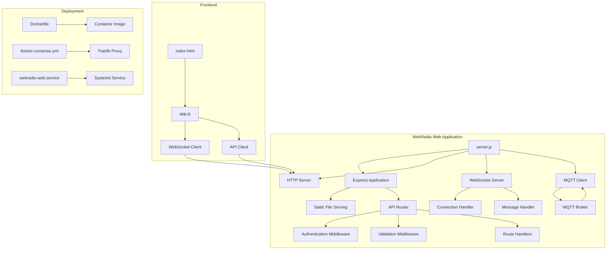

**Diagram sources**
- [server.js:1-267](file://WebRadio_web/server.js#L1-L267)
- [package.json:15-24](file://WebRadio_web/package.json#L15-L24)

**Section sources**
- [server.js:1-267](file://WebRadio_web/server.js#L1-L267)
- [package.json:1-26](file://WebRadio_web/package.json#L1-L26)

## Core Components

The server architecture consists of several interconnected components that work together to provide a robust web-based radio control system:

### Express.js Application Layer
The core Express.js application serves as the foundation for HTTP request handling, static file serving, and API routing. It provides middleware support for security headers, JSON parsing, and rate limiting.

### WebSocket Communication Layer
Real-time bidirectional communication is handled through WebSocket connections, enabling live status updates and immediate command execution. The WebSocket layer includes authentication and automatic reconnection capabilities.

### MQTT Bridge Layer
A critical bridge component connects the web interface to physical radio hardware through MQTT protocol. This layer handles message routing, state synchronization, and command publishing.

### API Router Module
A dedicated router module encapsulates all API endpoints with authentication and input validation middleware, providing a clean separation of concerns for HTTP-based interactions.

### Static File Serving
The application serves a complete web interface built with vanilla HTML, CSS, and JavaScript, hosted directly from the server for optimal performance.

**Section sources**
- [server.js:11-267](file://WebRadio_web/server.js#L11-L267)
- [package.json:15-24](file://WebRadio_web/package.json#L15-L24)

## Architecture Overview

The WebRadio server implements a layered architecture that separates concerns while maintaining efficient communication between components:

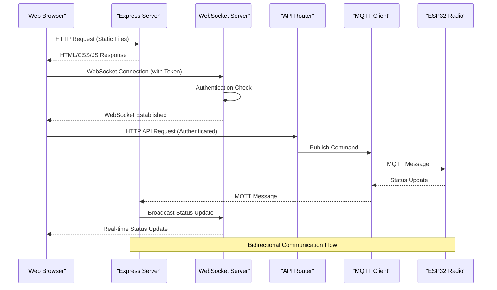

**Diagram sources**
- [server.js:100-203](file://WebRadio_web/server.js#L100-L203)
- [server.js:208-260](file://WebRadio_web/server.js#L208-L260)

The architecture ensures that all client interactions are authenticated and validated, with real-time updates flowing through the WebSocket layer for immediate feedback.

## Detailed Component Analysis

### Express.js Application Configuration

The Express application is configured with essential middleware for security and functionality:

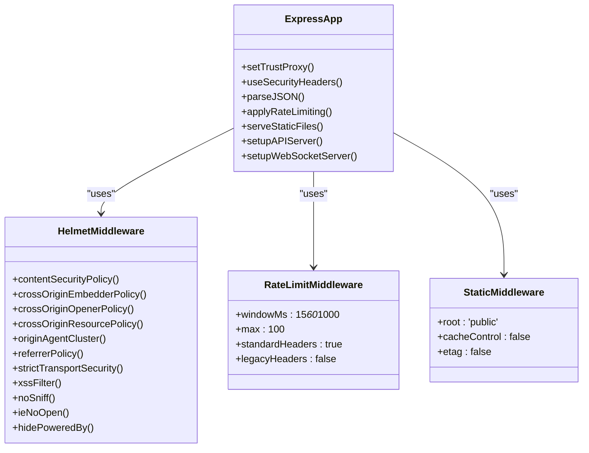

**Diagram sources**
- [server.js:14-29](file://WebRadio_web/server.js#L14-L29)

**Section sources**
- [server.js:11-31](file://WebRadio_web/server.js#L11-L31)

### MQTT Integration Layer

The MQTT client provides seamless integration with the ESP32 radio hardware:

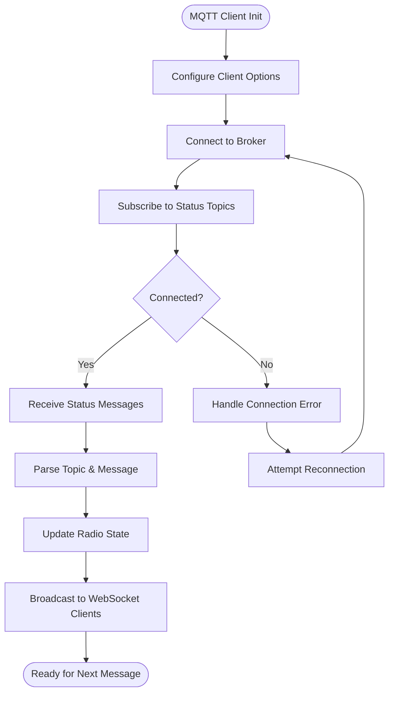

**Diagram sources**
- [server.js:47-97](file://WebRadio_web/server.js#L47-L97)

**Section sources**
- [server.js:47-97](file://WebRadio_web/server.js#L47-L97)

### WebSocket Server Implementation

The WebSocket server provides real-time bidirectional communication with clients:

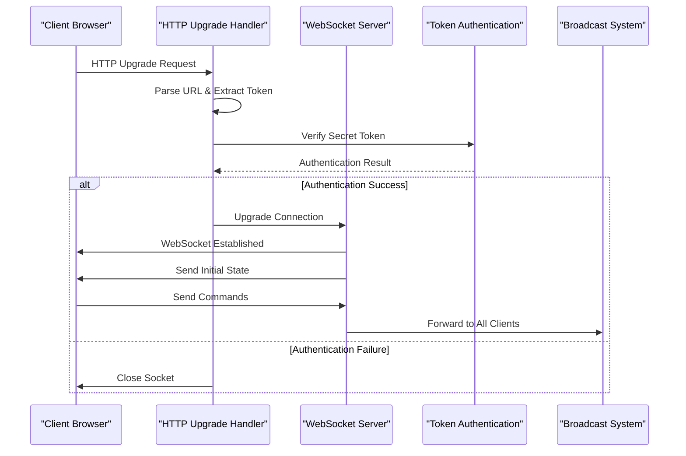

**Diagram sources**
- [server.js:224-238](file://WebRadio_web/server.js#L224-L238)
- [server.js:240-260](file://WebRadio_web/server.js#L240-L260)

**Section sources**
- [server.js:208-260](file://WebRadio_web/server.js#L208-L260)

## Security Implementation

The server implements comprehensive security measures to protect against common web vulnerabilities and unauthorized access:

### Authentication System

All API endpoints and WebSocket connections require authentication through a shared secret token:

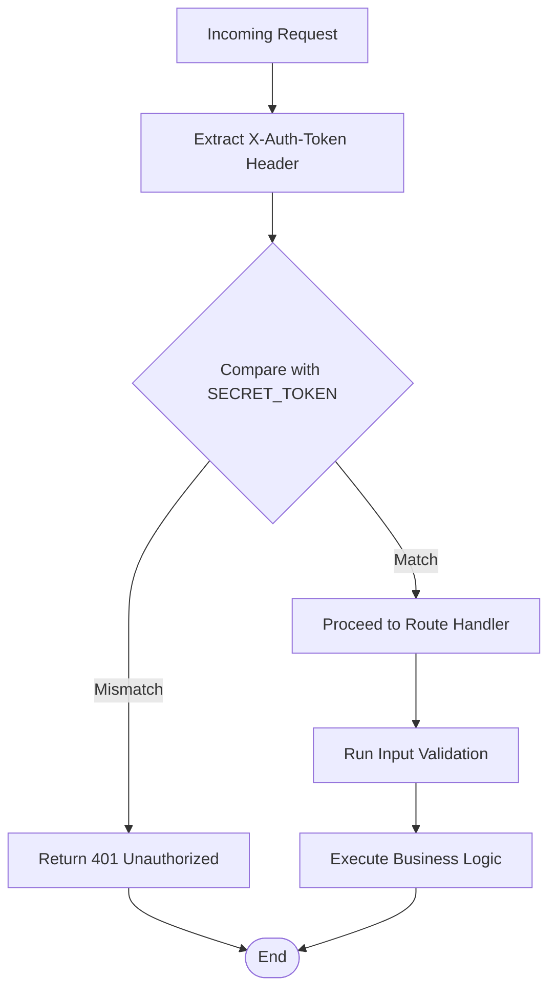

**Diagram sources**
- [server.js:102-110](file://WebRadio_web/server.js#L102-L110)

### Input Validation

The system uses express-validator for comprehensive input validation:

| Field | Validation Rule | Error Message |
|-------|----------------|---------------|
| station | `isNumeric()` | must be a number |
| volume | `isInt({ min: 0, max: 21 })` | must be an integer between 0 and 21 |
| state | `isIn(['on', 'off'])` | must be "on" or "off" |
| seconds | `isInt({ min: 0, max: 86400 })` | must be an integer between 0 and 86400 |
| command | `isString().notEmpty()` | must be a non-empty string |

**Section sources**
- [server.js:102-147](file://WebRadio_web/server.js#L102-L147)
- [server.js:149-201](file://WebRadio_web/server.js#L149-L201)

### Rate Limiting

The server implements rate limiting to prevent brute force attacks:

- **Window Duration**: 15 minutes
- **Request Limit**: 100 requests per IP per window
- **Header Strategy**: Modern headers only (no legacy X-RateLimit headers)

**Section sources**
- [server.js:20-29](file://WebRadio_web/server.js#L20-L29)

### Security Headers

Helmet.js provides comprehensive security headers:

- Content Security Policy (CSP)
- Cross-Origin Embedder Policy (COEP)
- Cross-Origin Opener Policy (COOP)
- Cross-Origin Resource Policy (CORP)
- Referrer Policy
- Strict Transport Security (HSTS)
- XSS Protection
- MIME Sniffing Prevention

**Section sources**
- [server.js:14-15](file://WebRadio_web/server.js#L14-L15)

## Middleware Configuration

The server employs a layered middleware architecture for optimal request processing:

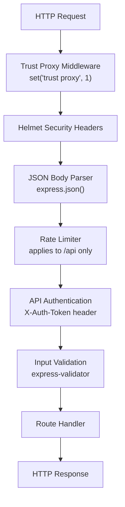

**Diagram sources**
- [server.js:12-29](file://WebRadio_web/server.js#L12-L29)

**Section sources**
- [server.js:12-29](file://WebRadio_web/server.js#L12-L29)

## API Router Structure

The API router provides a modular structure for HTTP endpoints with clear separation of concerns:

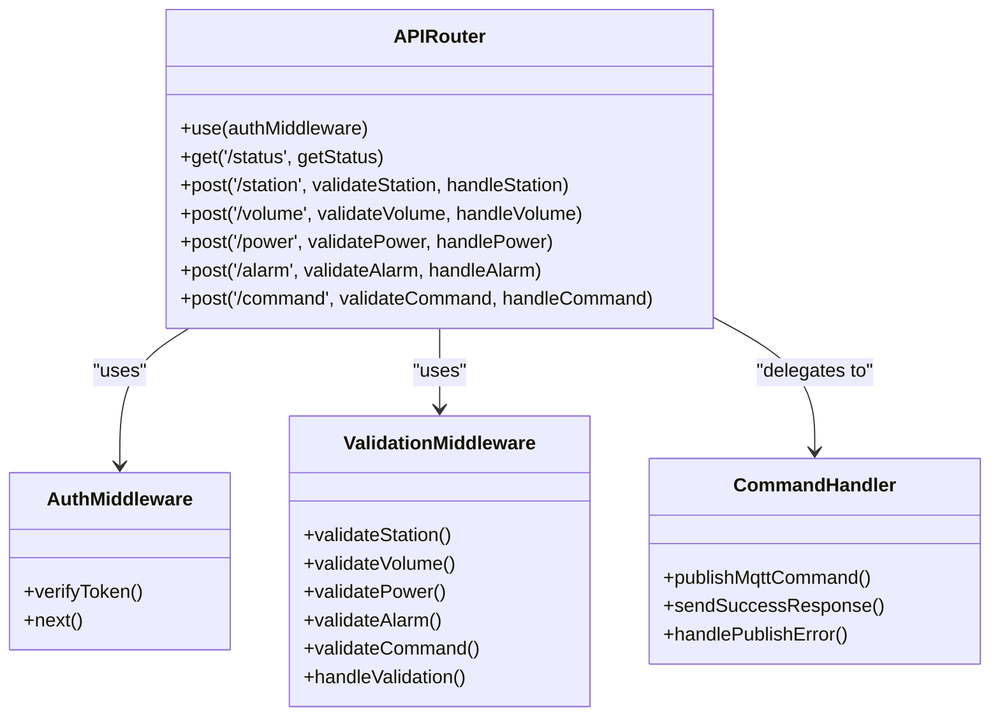

**Diagram sources**
- [server.js:100-203](file://WebRadio_web/server.js#L100-L203)

**Section sources**
- [server.js:100-203](file://WebRadio_web/server.js#L100-L203)

### API Endpoint Specifications

| Endpoint | Method | Description | Authentication | Validation |
|----------|--------|-------------|----------------|------------|
| `/api/radio/status` | GET | Retrieve current radio status | Required | None |
| `/api/radio/station` | POST | Select radio station | Required | Numeric station ID |
| `/api/radio/volume` | POST | Set volume level | Required | Integer 0-21 |
| `/api/radio/power` | POST | Power on/off control | Required | "on"/"off" |
| `/api/radio/alarm` | POST | Set alarm timer | Required | Integer 0-86400 |
| `/api/radio/command` | POST | Execute custom command | Required | Non-empty string |

**Section sources**
- [server.js:115-201](file://WebRadio_web/server.js#L115-L201)

## WebSocket Integration

The WebSocket implementation provides real-time bidirectional communication with robust authentication and error handling:

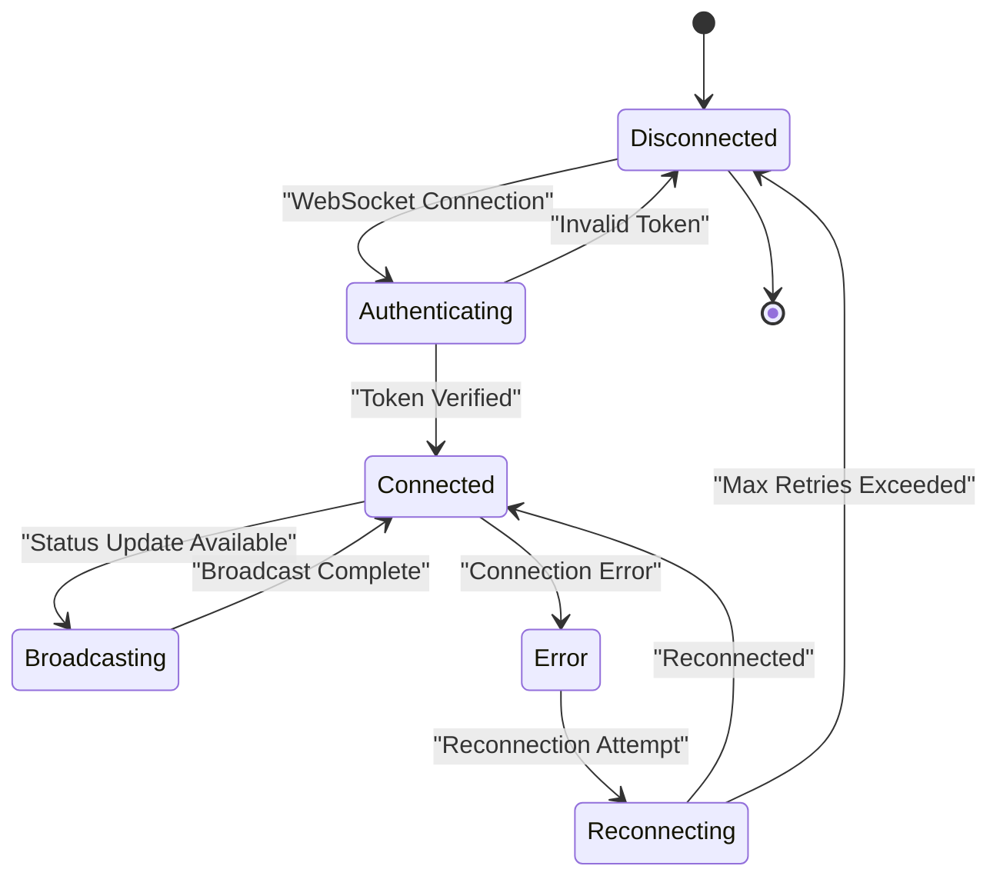

**Diagram sources**
- [server.js:224-260](file://WebRadio_web/server.js#L224-L260)

### WebSocket Client Implementation

The frontend WebSocket client includes sophisticated connection management:

- **Automatic Reconnection**: 5-second retry intervals
- **Token Management**: Local storage persistence
- **Protocol Detection**: Automatic HTTP/HTTPS and WS/WSS selection
- **Graceful Degradation**: Falls back to HTTP API when WebSocket unavailable

**Section sources**
- [app.js:122-178](file://WebRadio_web/public/app.js#L122-L178)
- [app.js:180-196](file://WebRadio_web/public/app.js#L180-L196)

## Server Initialization

The server initialization process follows a structured sequence for optimal startup:

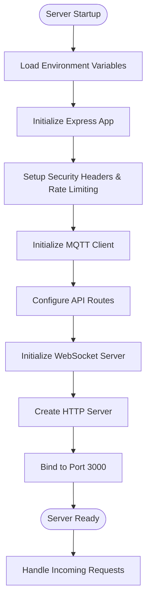

**Diagram sources**
- [server.js:31-38](file://WebRadio_web/server.js#L31-L38)
- [server.js:262-267](file://WebRadio_web/server.js#L262-L267)

**Section sources**
- [server.js:31-38](file://WebRadio_web/server.js#L31-L38)
- [server.js:262-267](file://WebRadio_web/server.js#L262-L267)

### Network Binding Configuration

The server binds to all network interfaces (`0.0.0.0`) for maximum accessibility, with Docker containerization providing network isolation and port exposure.

**Section sources**
- [server.js:263-264](file://WebRadio_web/server.js#L263-L264)

## Deployment Architecture

The deployment architecture utilizes Docker containers with Traefik as a reverse proxy for production environments:

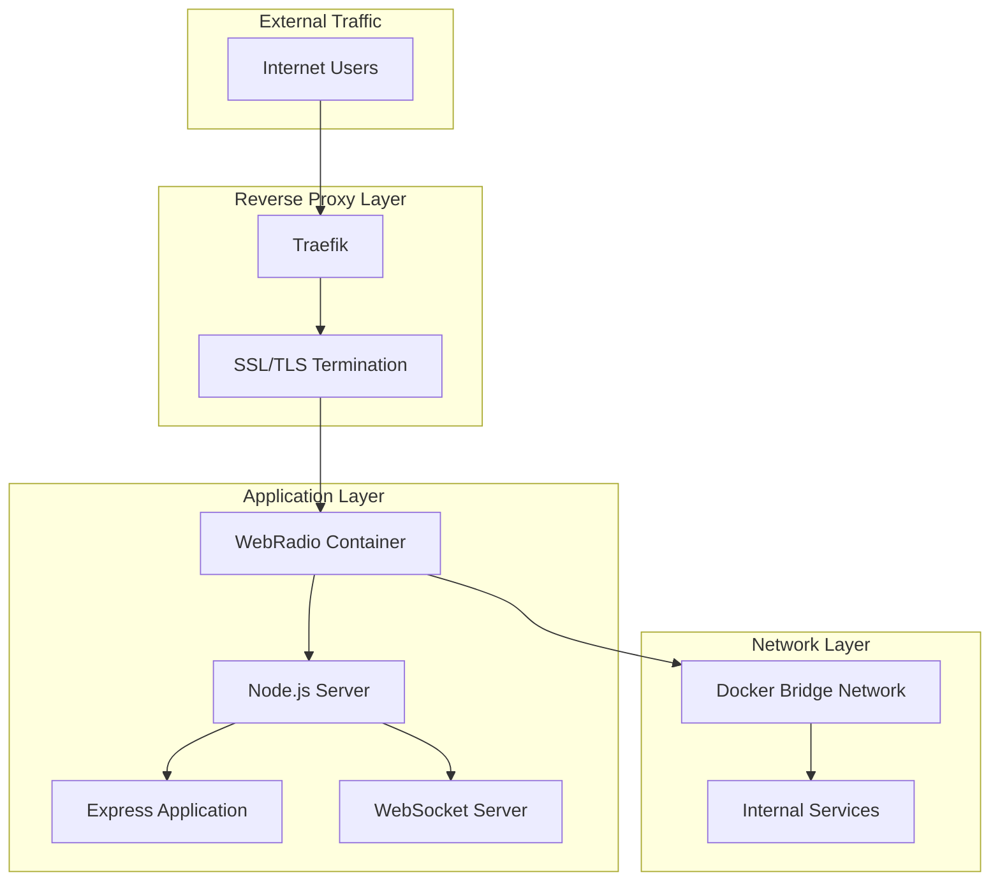

**Diagram sources**
- [docker-compose.yml:1-25](file://WebRadio_web/docker-compose.yml#L1-L25)
- [Dockerfile:1-28](file://WebRadio_web/Dockerfile#L1-L28)

### Container Configuration

The Docker configuration provides enhanced security and isolation:

- **Base Image**: Node.js 18 Alpine Linux
- **Non-root User**: Runs as `node` user for security
- **Port Exposure**: 3000/tcp for application traffic
- **File Permissions**: Proper ownership and permissions
- **Build Optimization**: Multi-stage build for minimal footprint

**Section sources**
- [Dockerfile:1-28](file://WebRadio_web/Dockerfile#L1-L28)

### Systemd Service Configuration

For direct server deployments, a systemd service provides reliable process management:

- **Automatic Restart**: Always restart failed processes
- **User Context**: Run under specific user/group
- **Working Directory**: Proper application directory
- **Environment**: Inherits system environment variables

**Section sources**
- [webradio-web.service:1-14](file://WebRadio_web/webradio-web.service#L1-L14)

## Performance Considerations

The server architecture incorporates several performance optimization techniques:

### Connection Pooling and Resource Management

- **WebSocket Connection Limits**: Efficient client connection management
- **MQTT Connection Reuse**: Single persistent connection to broker
- **Memory Management**: Proper cleanup of event listeners and timeouts

### Caching Strategies

- **Static Asset Caching**: Browser-side caching for HTML, CSS, and JavaScript
- **State Caching**: In-memory radio state for immediate response
- **Broadcast Optimization**: Efficient WebSocket message broadcasting

### Scalability Considerations

- **Horizontal Scaling**: Stateless design allows multiple instances
- **Load Balancing**: Traefik handles load distribution
- **Database Independence**: No database dependencies for stateless operation

## Troubleshooting Guide

Common issues and their solutions:

### Authentication Problems

**Issue**: 401 Unauthorized responses from API endpoints
**Solution**: Verify `X-Auth-Token` header matches `SECRET_TOKEN` environment variable

**Issue**: WebSocket connection rejected
**Solution**: Ensure token parameter in URL query string matches `SECRET_TOKEN`

### MQTT Connection Issues

**Issue**: Radio state shows "Offline" despite hardware connectivity
**Solution**: Check MQTT broker URL, credentials, and network connectivity

**Issue**: Commands not reaching hardware
**Solution**: Verify MQTT topic prefix and broker authentication

### WebSocket Connection Problems

**Issue**: Automatic reconnection loops
**Solution**: Check token persistence in browser local storage and network connectivity

**Issue**: Mixed content warnings
**Solution**: Ensure consistent HTTP/HTTPS protocol across all connections

**Section sources**
- [server.js:40-45](file://WebRadio_web/server.js#L40-L45)
- [server.js:68-80](file://WebRadio_web/server.js#L68-L80)

## Conclusion

The WebRadio server architecture demonstrates a comprehensive approach to building secure, scalable, and maintainable Node.js applications. The implementation successfully balances real-time communication needs with robust security measures, providing an excellent foundation for IoT-based web control systems.

Key architectural strengths include:

- **Modular Design**: Clear separation of concerns between HTTP, WebSocket, and MQTT layers
- **Security Focus**: Comprehensive authentication, validation, and security headers
- **Real-time Capabilities**: Efficient WebSocket implementation with automatic reconnection
- **Production Ready**: Docker containerization with Traefik reverse proxy
- **Developer Experience**: Well-documented configuration and deployment processes

The architecture provides a solid foundation for extending functionality, adding monitoring capabilities, and scaling to support multiple concurrent users while maintaining security and performance standards.