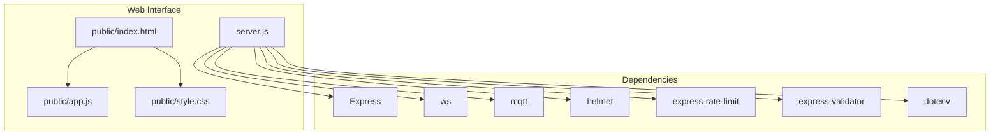
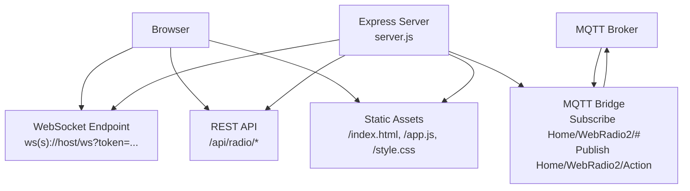
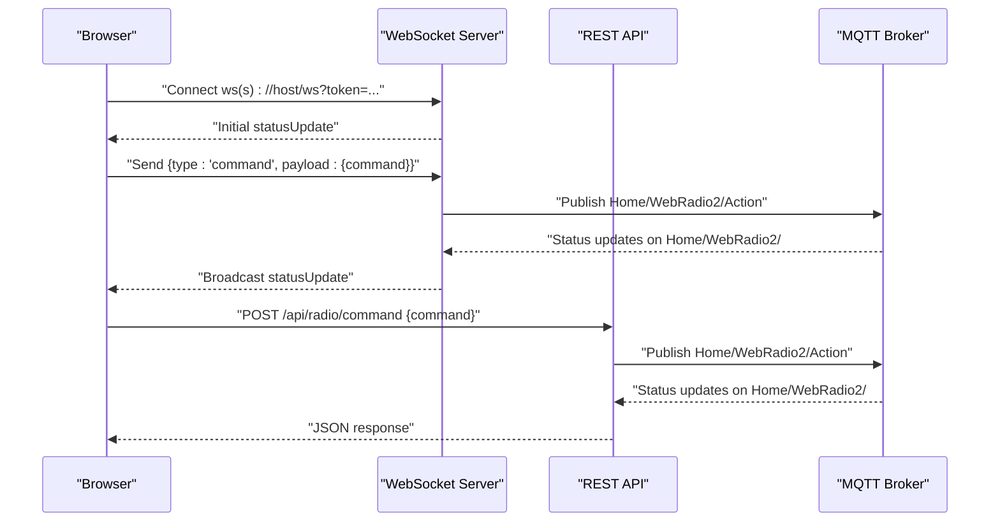
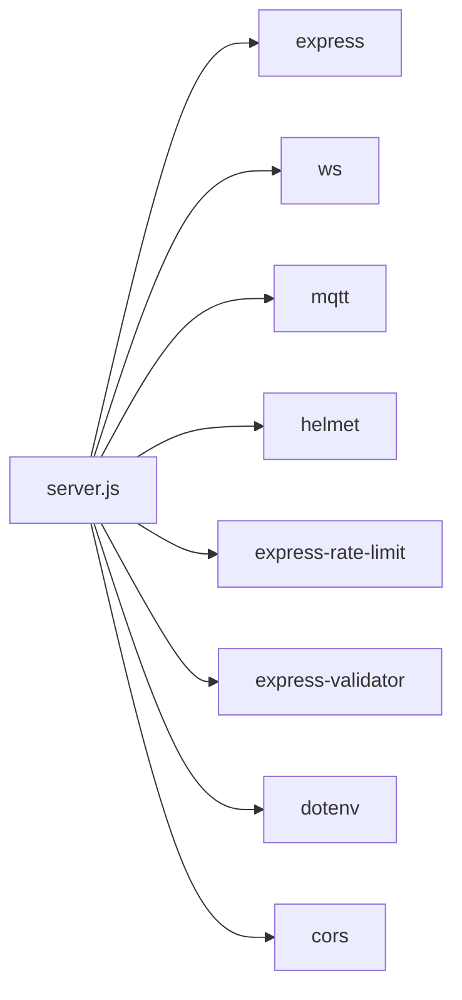

# Web Interface

<cite>
**Referenced Files in This Document**
- [server.js](file://WebRadio_web/server.js)
- [package.json](file://WebRadio_web/package.json)
- [index.html](file://WebRadio_web/public/index.html)
- [app.js](file://WebRadio_web/public/app.js)
- [style.css](file://WebRadio_web/public/style.css)
- [Dockerfile](file://WebRadio_web/Dockerfile)
- [docker-compose.yml](file://WebRadio_web/docker-compose.yml)
- [webradio-web.service](file://WebRadio_web/webradio-web.service)
- [README.md](file://WebRadio_web/README.md)
- [.dockerignore](file://WebRadio_web/.dockerignore)
</cite>

## Table of Contents
1. [Introduction](#introduction)
2. [Project Structure](#project-structure)
3. [Core Components](#core-components)
4. [Architecture Overview](#architecture-overview)
5. [Detailed Component Analysis](#detailed-component-analysis)
6. [Dependency Analysis](#dependency-analysis)
7. [Performance Considerations](#performance-considerations)
8. [Troubleshooting Guide](#troubleshooting-guide)
9. [Conclusion](#conclusion)
10. [Appendices](#appendices)

## Introduction
This document explains the web interface component of the Webradio project. It covers the Node.js/Express server architecture, WebSocket integration, and static frontend hosting. It documents the server.js implementation including HTTP server setup, WebSocket bridge creation, MQTT integration, and security middleware. It also describes the frontend JavaScript application, HTML structure, and CSS styling, and explains the real-time communication patterns between the web interface and the MQTT broker. Finally, it includes Express server configuration, routing, and API endpoints, along with Docker deployment configuration and systemd service setup. Guidance is provided for browser compatibility, responsive design, cross-platform accessibility, customization, extension, and production deployment.

## Project Structure
The web interface is organized into a small, focused set of files:
- Backend server: server.js (Express app, HTTP server, WebSocket server, MQTT bridge, API routes)
- Frontend assets: public/index.html, public/app.js, public/style.css
- Packaging and deployment: package.json, Dockerfile, docker-compose.yml, webradio-web.service
- Documentation: README.md, .dockerignore

**Diagram sources**
- [server.js:1-267](file://WebRadio_web/server.js#L1-L267)
- [package.json:15-24](file://WebRadio_web/package.json#L15-L24)
- [index.html:1-61](file://WebRadio_web/public/index.html#L1-L61)
- [app.js:1-366](file://WebRadio_web/public/app.js#L1-L366)
- [style.css:1-285](file://WebRadio_web/public/style.css#L1-L285)

**Section sources**
- [README.md:14-20](file://WebRadio_web/README.md#L14-L20)
- [package.json:15-24](file://WebRadio_web/package.json#L15-L24)

## Core Components
- Express server with security middleware and static asset serving
- WebSocket server with token-based authentication and real-time updates
- MQTT client bridge that subscribes to status topics and publishes commands
- REST API with token-protected endpoints for radio control
- Frontend HTML/CSS/JavaScript for user interaction and real-time UI updates

Key implementation highlights:
- Security: helmet, rate limiting, token-based API and WebSocket access
- Real-time: WebSocket broadcast of MQTT-derived state; fallback HTTP commands
- MQTT bridge: subscription to Home/WebRadio2/#; publishing actions to Home/WebRadio2/Action
- Frontend: station wheel, volume visualization, alarm controls, responsive layout

**Section sources**
- [server.js:14-29](file://WebRadio_web/server.js#L14-L29)
- [server.js:47-97](file://WebRadio_web/server.js#L47-L97)
- [server.js:102-203](file://WebRadio_web/server.js#L102-L203)
- [server.js:208-260](file://WebRadio_web/server.js#L208-L260)
- [app.js:122-178](file://WebRadio_web/public/app.js#L122-L178)
- [style.css:240-285](file://WebRadio_web/public/style.css#L240-L285)

## Architecture Overview
The system integrates a browser-based UI with an MQTT-based radio controller. The backend exposes:
- An HTTP server serving static assets
- A WebSocket endpoint secured by a shared secret token
- A REST API secured by the same token
- An MQTT client that subscribes to status topics and publishes control commands

**Diagram sources**
- [server.js:208-260](file://WebRadio_web/server.js#L208-L260)
- [server.js:99-203](file://WebRadio_web/server.js#L99-L203)
- [server.js:47-97](file://WebRadio_web/server.js#L47-L97)
- [index.html:12-12](file://WebRadio_web/public/index.html#L12-L12)

## Detailed Component Analysis

### Express Server and Security Middleware
- Security headers: helmet applied globally
- Body parsing: JSON body parser enabled
- Rate limiting: express-rate-limit applied to /api routes
- Environment configuration: SECRET_TOKEN, MQTT_BROKER_URL, MQTT_USER, MQTT_PASSWORD, MQTT_PREFIX
- Static hosting: express.static('public') serves index.html, app.js, style.css

Operational behavior:
- Logs warnings if SECRET_TOKEN is not set
- Subscribes to MQTT_PREFIX/# on connect
- Handles MQTT errors and close events by updating state and broadcasting

**Section sources**
- [server.js:14-29](file://WebRadio_web/server.js#L14-L29)
- [server.js:33-45](file://WebRadio_web/server.js#L33-L45)
- [server.js:205-206](file://WebRadio_web/server.js#L205-L206)

### WebSocket Bridge and Real-Time Updates
- WebSocket server created with ws module
- Upgrade handler validates token from query parameter
- Broadcasts status updates to all connected clients
- On connection, sends initial state snapshot
- Accepts command messages from clients and forwards to MQTT

Frontend integration:
- WebSocket URL constructed from current protocol and host
- Token persisted in localStorage; prompts user on first visit
- Automatic reconnection on close

**Section sources**
- [server.js:208-238](file://WebRadio_web/server.js#L208-L238)
- [server.js:212-222](file://WebRadio_web/server.js#L212-L222)
- [server.js:240-260](file://WebRadio_web/server.js#L240-L260)
- [app.js:122-178](file://WebRadio_web/public/app.js#L122-L178)

### MQTT Integration
- Client connects with dynamic clientId and optional credentials
- Subscribes to Home/WebRadio2/#
- On receiving messages, updates internal state map keyed by topic suffix
- Broadcasts updates to WebSocket clients
- Publishes commands to Home/WebRadio2/Action

Command mapping:
- Station selection: st<number>
- Volume: v<number> (0–21)
- Power: power_on or power_off
- Alarm: s<number> (seconds)
- Arbitrary command: arbitrary string

**Section sources**
- [server.js:47-97](file://WebRadio_web/server.js#L47-L97)
- [server.js:123-134](file://WebRadio_web/server.js#L123-L134)
- [server.js:149-201](file://WebRadio_web/server.js#L149-L201)

### REST API Endpoints
Protected by SECRET_TOKEN header:
- GET /api/radio/status: returns current state snapshot
- POST /api/radio/station: body { station: number }
- POST /api/radio/volume: body { volume: integer 0..21 }
- POST /api/radio/power: body { state: "on"|"off" }
- POST /api/radio/alarm: body { seconds: integer 0..86400 }
- POST /api/radio/command: body { command: string }

Validation uses express-validator; rate limiting applies to /api.

**Section sources**
- [server.js:102-110](file://WebRadio_web/server.js#L102-L110)
- [server.js:115-121](file://WebRadio_web/server.js#L115-L121)
- [server.js:149-201](file://WebRadio_web/server.js#L149-L201)

### Frontend Application (HTML/CSS/JS)
- HTML: basic page structure with status display, controls, station selector, and alarm controls
- CSS: responsive grid layouts, volume icon bars, status container coloring, media queries
- JavaScript:
  - Configures API base path, station count, item height, reconnect interval
  - Maintains UI state and updates DOM from MQTT-derived data
  - WebSocket connection with token prompt and reconnection loop
  - Command dispatch via WebSocket (preferred) or HTTP fallback
  - Station wheel with visual selection and snapping
  - Volume visualization with bars proportional to 0–21 scale
  - Alarm time conversion and display formatting

**Section sources**
- [index.html:1-61](file://WebRadio_web/public/index.html#L1-L61)
- [style.css:1-285](file://WebRadio_web/public/style.css#L1-L285)
- [app.js:1-366](file://WebRadio_web/public/app.js#L1-L366)

### Real-Time Communication Patterns
- MQTT-to-UI: MQTT client receives topic updates; server broadcasts via WebSocket; client updates UI
- UI-to-MQTT: Client sends command messages over WebSocket; server publishes to MQTT Action topic
- Fallback: If WebSocket is unavailable, client falls back to HTTP API with token header

**Diagram sources**
- [server.js:208-260](file://WebRadio_web/server.js#L208-L260)
- [server.js:47-97](file://WebRadio_web/server.js#L47-L97)
- [app.js:181-196](file://WebRadio_web/public/app.js#L181-L196)

## Dependency Analysis
Runtime dependencies include Express, ws, mqtt, helmet, express-rate-limit, express-validator, dotenv, and cors. The Dockerfile builds a minimal Alpine-based image, installs dependencies, switches to a non-root user, and exposes port 3000.

**Diagram sources**
- [package.json:15-24](file://WebRadio_web/package.json#L15-L24)
- [server.js:1-8](file://WebRadio_web/server.js#L1-L8)

**Section sources**
- [package.json:15-24](file://WebRadio_web/package.json#L15-L24)
- [Dockerfile:1-28](file://WebRadio_web/Dockerfile#L1-L28)

## Performance Considerations
- WebSocket is preferred for real-time updates; HTTP fallback reduces overhead
- Rate limiting protects API endpoints from abuse
- Minimal DOM updates: batched state updates and selective element updates
- Responsive design minimizes layout thrashing on small screens
- MQTT subscriptions scoped to a single prefix reduce traffic

[No sources needed since this section provides general guidance]

## Troubleshooting Guide
Common issues and resolutions:
- Authentication failures:
  - Verify SECRET_TOKEN is set in environment and matches the prompt value
  - Ensure X-Auth-Token header is present for API calls
- MQTT connectivity:
  - Confirm MQTT_BROKER_URL, MQTT_USER, and MQTT_PASSWORD are correct
  - Check broker availability and network routing (use host.docker.internal when running in Docker)
- WebSocket connection:
  - Ensure token is provided and stored in localStorage
  - Verify server logs for upgrade rejection messages
- API errors:
  - Validate request payloads against validation rules
  - Check rate limit thresholds if receiving 429 responses

**Section sources**
- [server.js:40-45](file://WebRadio_web/server.js#L40-L45)
- [server.js:68-80](file://WebRadio_web/server.js#L68-L80)
- [server.js:230-237](file://WebRadio_web/server.js#L230-L237)
- [server.js:136-147](file://WebRadio_web/server.js#L136-L147)

## Conclusion
The web interface provides a secure, responsive, and real-time control surface for the ESP32 WebRadio. Its architecture cleanly separates concerns: Express handles HTTP and security, ws manages real-time bidirectional updates, and mqtt bridges the UI to the radio’s MQTT topics. The frontend offers intuitive controls and a polished user experience, while Docker and systemd configurations simplify deployment and maintenance.

[No sources needed since this section summarizes without analyzing specific files]

## Appendices

### Express Server Configuration and Routing
- Port: 3000
- Static route: '/' -> serve public/*
- API base: '/api/radio'
- Security middleware: helmet, rate limit on /api
- Authentication: SECRET_TOKEN header for API; token query param for WebSocket

**Section sources**
- [server.js:31](file://WebRadio_web/server.js#L31)
- [server.js:205-206](file://WebRadio_web/server.js#L205-L206)
- [server.js:102-110](file://WebRadio_web/server.js#L102-L110)
- [server.js:224-238](file://WebRadio_web/server.js#L224-L238)

### API Definitions
- GET /api/radio/status
  - Description: Retrieve current radio state snapshot
  - Response: { success: boolean, timestamp: ISODate, data: object }
- POST /api/radio/station
  - Body: { station: number }
  - Response: { success: boolean, command: string, station: number }
- POST /api/radio/volume
  - Body: { volume: integer 0..21 }
  - Response: { success: boolean, command: string, volume: number }
- POST /api/radio/power
  - Body: { state: "on"|"off" }
  - Response: { success: boolean, command: string, state: string }
- POST /api/radio/alarm
  - Body: { seconds: integer 0..86400 }
  - Response: { success: boolean, command: string, seconds: number }
- POST /api/radio/command
  - Body: { command: string }
  - Response: { success: boolean, command: string }

Validation rules:
- station: numeric
- volume: integer 0..21
- power: "on" or "off"
- alarm: integer 0..86400
- command: non-empty string

**Section sources**
- [server.js:115-121](file://WebRadio_web/server.js#L115-L121)
- [server.js:149-201](file://WebRadio_web/server.js#L149-L201)
- [server.js:136-147](file://WebRadio_web/server.js#L136-L147)

### Frontend UI Elements and Interactions
- Status area: displays State, Station, Volume, Title, Alarm, Log
- Controls: POWER, VOL -, VOL +, CH -, CH +, SLEEP
- Station selector: wheel with 78 presets, visual selection, snapping
- Alarm controls: time picker, Set Alarm, Cancel Alarm
- Responsive design: adjusts grids and layouts for small screens

**Section sources**
- [index.html:18-54](file://WebRadio_web/public/index.html#L18-L54)
- [style.css:57-74](file://WebRadio_web/public/style.css#L57-L74)
- [style.css:106-111](file://WebRadio_web/public/style.css#L106-L111)
- [style.css:131-196](file://WebRadio_web/public/style.css#L131-L196)
- [style.css:198-213](file://WebRadio_web/public/style.css#L198-L213)
- [style.css:240-285](file://WebRadio_web/public/style.css#L240-L285)

### Deployment Configuration

#### Docker
- Base image: node:18-alpine
- Working directory: /usr/src/app
- Non-root user: node
- Exposed port: 3000
- Entrypoint: node server.js

**Section sources**
- [Dockerfile:1-28](file://WebRadio_web/Dockerfile#L1-L28)

#### Docker Compose (Traefik)
- Service: webradio
- Build from current directory
- Networks: external network root_default
- Extra hosts: host.docker.internal:host-gateway
- Labels: Traefik router and TLS configuration
- Environment: env_file .env

**Section sources**
- [docker-compose.yml:1-25](file://WebRadio_web/docker-compose.yml#L1-L25)

#### Systemd Service
- Description: WebRadio Web Interface
- After: network.target
- ExecStart: /usr/bin/node server.js
- Restart: always
- User/Group: user
- WorkingDirectory: /home/user/apps/webradio

**Section sources**
- [webradio-web.service:1-14](file://WebRadio_web/webradio-web.service#L1-L14)

### Browser Compatibility and Accessibility
- Modern browsers support WebSocket and fetch APIs used by the interface
- Responsive CSS ensures usability on phones and tablets
- No framework dependencies simplify compatibility
- Accessible form controls and focusable buttons

**Section sources**
- [style.css:240-285](file://WebRadio_web/public/style.css#L240-L285)
- [app.js:181-196](file://WebRadio_web/public/app.js#L181-L196)

### Customization and Extension
- Customize appearance by editing style.css selectors and media queries
- Add new controls by extending app.js event handlers and UI elements
- Extend API endpoints by adding new routes under /api/radio with token protection
- Integrate additional MQTT topics by adjusting subscription prefix and state mapping
- Persist user preferences in localStorage or extend backend storage

**Section sources**
- [style.css:1-285](file://WebRadio_web/public/style.css#L1-L285)
- [app.js:263-294](file://WebRadio_web/public/app.js#L263-L294)
- [server.js:99-203](file://WebRadio_web/server.js#L99-L203)
- [server.js:47-66](file://WebRadio_web/server.js#L47-L66)

### Production Deployment Checklist
- Set SECRET_TOKEN in environment
- Configure MQTT_BROKER_URL, MQTT_USER, MQTT_PASSWORD
- Use HTTPS with a reverse proxy (Traefik example included)
- Monitor logs and health endpoints
- Back up configuration and state regularly

**Section sources**
- [README.md:38-58](file://WebRadio_web/README.md#L38-L58)
- [docker-compose.yml:13-18](file://WebRadio_web/docker-compose.yml#L13-L18)