# WebSocket Bridge

<cite>
**Referenced Files in This Document**
- [server.js](file://WebRadio_web/server.js)
- [app.js](file://WebRadio_web/public/app.js)
- [index.html](file://WebRadio_web/public/index.html)
- [main.cpp](file://WebRadio_ESP32_S3/src/main.cpp)
- [MainActivity.kt](file://WebRadio_android/app/src/main/java/com/dip16/webradio/MainActivity.kt)
- [package.json](file://WebRadio_web/package.json)
- [docker-compose.yml](file://WebRadio_web/docker-compose.yml)
- [secrets.h.example](file://WebRadio_ESP32_S3/src/secrets.h.example)
- [Secrets.kt.example](file://WebRadio_android/app/src/main/java/com/dip16/webradio/Secrets.kt.example)
</cite>

## Table of Contents
1. [Introduction](#introduction)
2. [Project Structure](#project-structure)
3. [Core Components](#core-components)
4. [Architecture Overview](#architecture-overview)
5. [Detailed Component Analysis](#detailed-component-analysis)
6. [WebSocket Implementation](#websocket-implementation)
7. [Security and Authentication](#security-and-authentication)
8. [Client Integration Examples](#client-integration-examples)
9. [Message Format Specifications](#message-format-specifications)
10. [Connection Management](#connection-management)
11. [Error Handling and Recovery](#error-handling-and-recovery)
12. [Performance Considerations](#performance-considerations)
13. [Troubleshooting Guide](#troubleshooting-guide)
14. [Conclusion](#conclusion)

## Introduction

The WebSocket Bridge is a critical component of the Webradio project that enables real-time bidirectional communication between the web interface, Android application, and the ESP32 hardware controller. This bridge facilitates secure, persistent connections for live status updates, command forwarding, and state synchronization across multiple client applications.

The system operates on a publish-subscribe pattern where the ESP32 hardware publishes status updates to MQTT topics, which are then relayed to connected WebSocket clients in real-time. The bridge ensures secure authentication, handles connection lifecycle management, and provides robust error recovery mechanisms.

## Project Structure

The WebSocket Bridge spans three main platforms within the Webradio ecosystem:

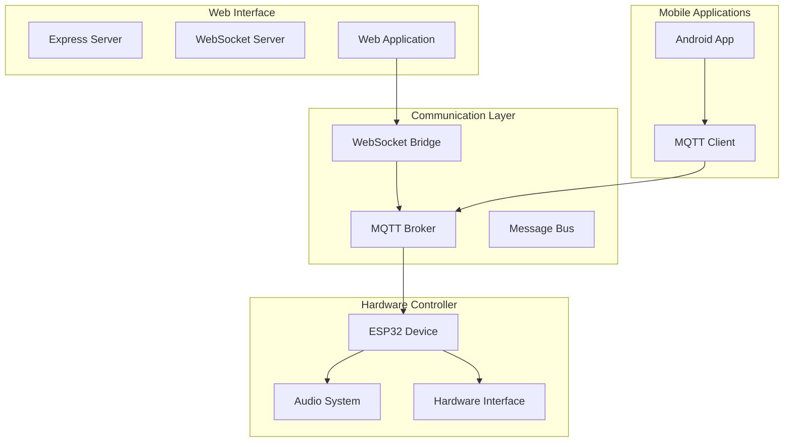

**Diagram sources**
- [server.js:1-267](file://WebRadio_web/server.js#L1-L267)
- [main.cpp:1-800](file://WebRadio_ESP32_S3/src/main.cpp#L1-L800)
- [MainActivity.kt:1-922](file://WebRadio_android/app/src/main/java/com/dip16/webradio/MainActivity.kt#L1-L922)

**Section sources**
- [server.js:1-267](file://WebRadio_web/server.js#L1-L267)
- [package.json:1-26](file://WebRadio_web/package.json#L1-L26)

## Core Components

The WebSocket Bridge consists of several interconnected components that work together to provide seamless real-time communication:

### Server-Side Components

1. **Express HTTP Server**: Handles traditional HTTP API requests and serves static web content
2. **WebSocket Server**: Manages WebSocket connections with token-based authentication
3. **MQTT Client**: Bridges WebSocket communications with the hardware via MQTT protocol
4. **Broadcast Engine**: Distributes real-time status updates to all connected clients

### Client-Side Components

1. **Web Application**: Provides browser-based control interface with automatic reconnection
2. **Android Application**: Offers mobile control with MQTT integration
3. **ESP32 Hardware**: Executes commands and publishes status updates

**Section sources**
- [server.js:11-267](file://WebRadio_web/server.js#L11-L267)
- [app.js:1-366](file://WebRadio_web/public/app.js#L1-L366)

## Architecture Overview

The WebSocket Bridge implements a layered architecture that separates concerns while maintaining efficient communication:

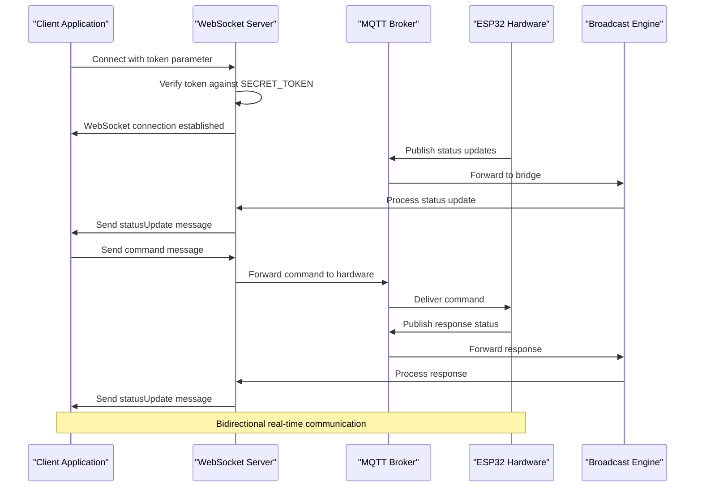

**Diagram sources**
- [server.js:212-260](file://WebRadio_web/server.js#L212-L260)
- [main.cpp:275-650](file://WebRadio_ESP32_S3/src/main.cpp#L275-L650)

## Detailed Component Analysis

### Express Server Configuration

The Express server provides the foundation for both HTTP API endpoints and WebSocket upgrade handling:

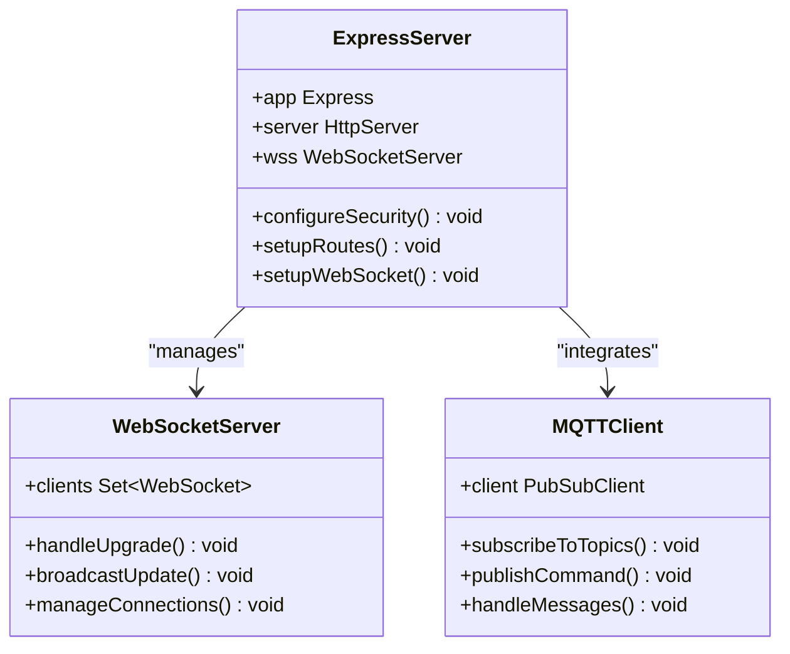

**Diagram sources**
- [server.js:11-54](file://WebRadio_web/server.js#L11-L54)
- [server.js:208-260](file://WebRadio_web/server.js#L208-L260)

**Section sources**
- [server.js:11-80](file://WebRadio_web/server.js#L11-L80)

### MQTT Integration Layer

The MQTT client handles the bridge between WebSocket communications and hardware control:

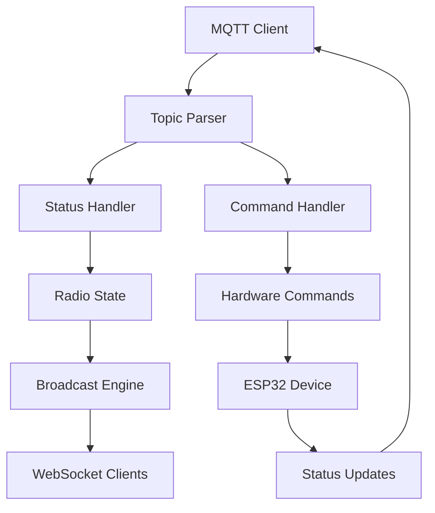

**Diagram sources**
- [server.js:47-97](file://WebRadio_web/server.js#L47-L97)
- [main.cpp:275-650](file://WebRadio_ESP32_S3/src/main.cpp#L275-L650)

**Section sources**
- [server.js:47-97](file://WebRadio_web/server.js#L47-L97)

## WebSocket Implementation

### Connection Establishment

The WebSocket server implements a secure upgrade mechanism that validates client tokens before establishing connections:

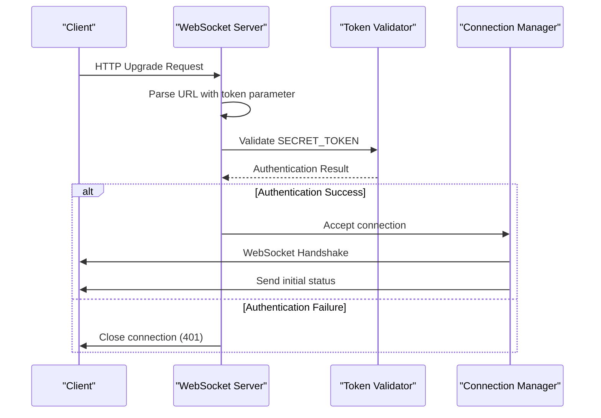

**Diagram sources**
- [server.js:224-238](file://WebRadio_web/server.js#L224-L238)

### Message Broadcasting Mechanism

The broadcastUpdate function efficiently distributes status changes to all connected clients:

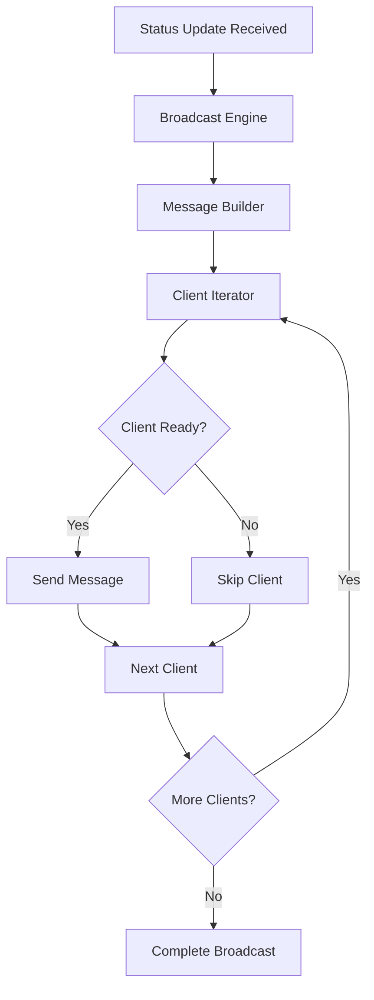

**Diagram sources**
- [server.js:212-222](file://WebRadio_web/server.js#L212-L222)

**Section sources**
- [server.js:212-238](file://WebRadio_web/server.js#L212-L238)

## Security and Authentication

### Token-Based Authentication

The WebSocket bridge implements robust token-based authentication to prevent unauthorized access:

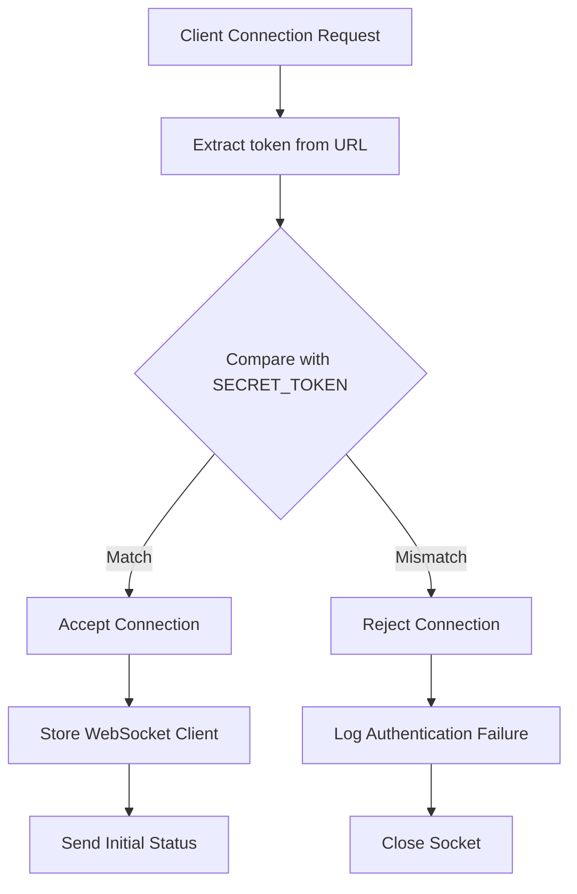

**Diagram sources**
- [server.js:224-238](file://WebRadio_web/server.js#L224-L238)

### Security Headers and Protection

The server implements comprehensive security measures:

1. **Helmet.js**: Provides security headers including Content Security Policy
2. **Rate Limiting**: Prevents brute force attacks on API endpoints
3. **Environment Variables**: Configurable SECRET_TOKEN for production deployments
4. **HTTPS Support**: Automatic protocol detection for secure connections

**Section sources**
- [server.js:14-29](file://WebRadio_web/server.js#L14-L29)
- [server.js:34-45](file://WebRadio_web/server.js#L34-L45)

## Client Integration Examples

### Web Application Integration

The web application demonstrates comprehensive WebSocket integration with automatic reconnection:

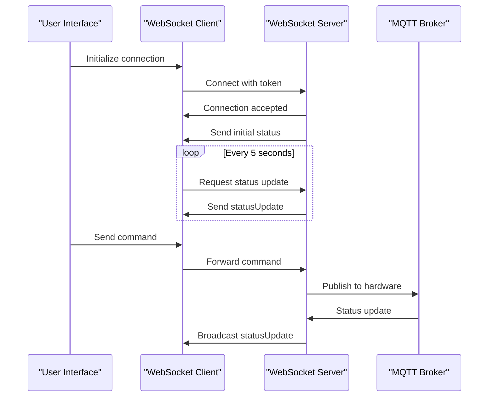

**Diagram sources**
- [app.js:139-178](file://WebRadio_web/public/app.js#L139-L178)
- [app.js:181-196](file://WebRadio_web/public/app.js#L181-L196)

### Android Application Integration

The Android application provides MQTT-based integration with similar functionality:

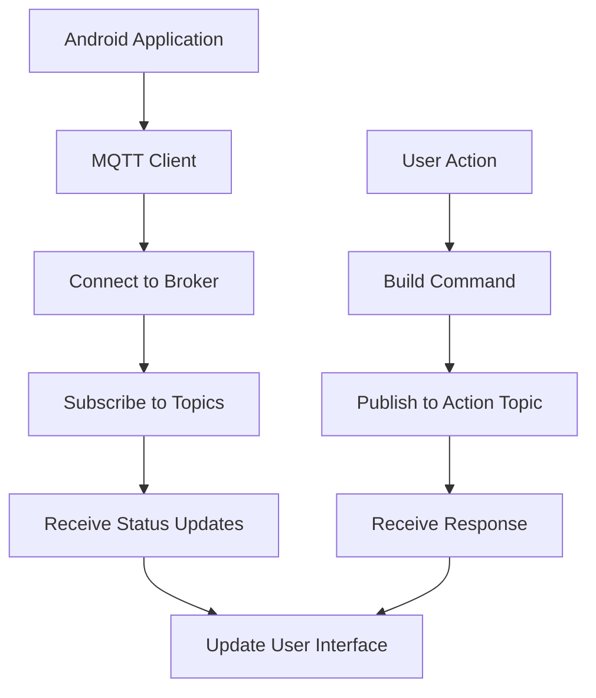

**Diagram sources**
- [MainActivity.kt:171-246](file://WebRadio_android/app/src/main/java/com/dip16/webradio/MainActivity.kt#L171-L246)
- [MainActivity.kt:312-316](file://WebRadio_android/app/src/main/java/com/dip16/webradio/MainActivity.kt#L312-L316)

**Section sources**
- [app.js:123-178](file://WebRadio_web/public/app.js#L123-L178)
- [MainActivity.kt:171-246](file://WebRadio_android/app/src/main/java/com/dip16/webradio/MainActivity.kt#L171-L246)

## Message Format Specifications

### Status Update Messages

WebSocket status updates follow a standardized JSON format:

```json
{
  "type": "statusUpdate",
  "data": {
    "State": "Power ON",
    "Station": "1 Silver Rain",
    "Volume": "12",
    "Title": "Current Song Title",
    "Alarm": "0",
    "Log": "Connection established"
  }
}
```

### Command Messages

Client-to-server command messages use the following structure:

```json
{
  "type": "command",
  "payload": {
    "command": "b1"
  }
}
```

### Command Types

The system recognizes several command categories:

| Command | Purpose | Example |
|---------|---------|---------|
| `b1` | Power ON/OFF | `b1` toggles power state |
| `b2` | Sleep mode activation | `b2` activates sleep timer |
| `b3` | Channel UP | `b3` increases station number |
| `b4` | Channel DOWN | `b4` decreases station number |
| `vol+` | Volume UP | `vol+` increases volume |
| `vol-` | Volume DOWN | `vol-` decreases volume |
| `sNNN` | Set alarm | `s3600` sets 1 hour alarm |
| `cNNN` | Change station | `c42` switches to station 42 |

**Section sources**
- [app.js:264-288](file://WebRadio_web/public/app.js#L264-L288)
- [main.cpp:363-526](file://WebRadio_ESP32_S3/src/main.cpp#L363-L526)

## Connection Management

### Connection Lifecycle

The WebSocket bridge manages connections through several distinct phases:

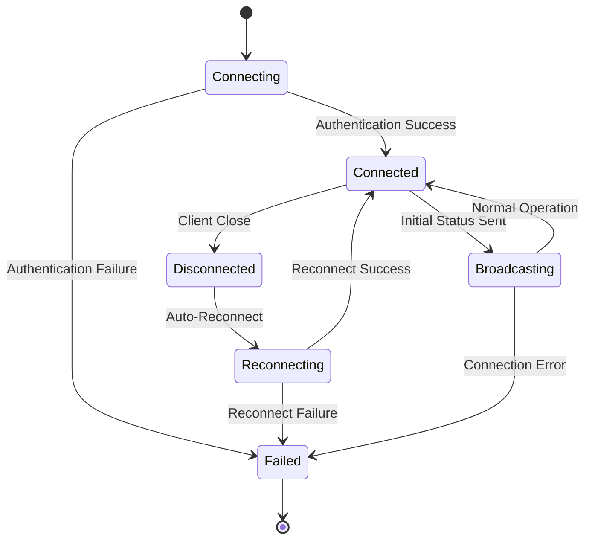

### Automatic Reconnection Strategy

The web application implements intelligent reconnection logic:

```mermaid
flowchart TD
ConnectionLost[Connection Lost] --> CheckToken{Token Available?}
CheckToken --> |No| PromptUser[Prompt for Token]
CheckToken --> |Yes| AttemptReconnect[Attempt Reconnect]
PromptUser --> UserProvided{Token Provided?}
UserProvided --> |Yes| StoreToken[Store in localStorage]
UserProvided --> |No| ShowOffline[Show Offline Status]
StoreToken --> AttemptReconnect
AttemptReconnect --> ReconnectSuccess{Reconnect Success?}
ReconnectSuccess --> |Yes| UpdateUI[Update UI Status]
ReconnectSuccess --> |No| DelayedRetry[Wait 5 seconds]
DelayedRetry --> AttemptReconnect
UpdateUI --> ContinueOperation[Continue Normal Operation]
ShowOffline --> [*]
```

**Diagram sources**
- [app.js:167-178](file://WebRadio_web/public/app.js#L167-L178)
- [app.js:123-137](file://WebRadio_web/public/app.js#L123-L137)

**Section sources**
- [app.js:139-178](file://WebRadio_web/public/app.js#L139-L178)

## Error Handling and Recovery

### Error Scenarios and Responses

The WebSocket bridge implements comprehensive error handling:

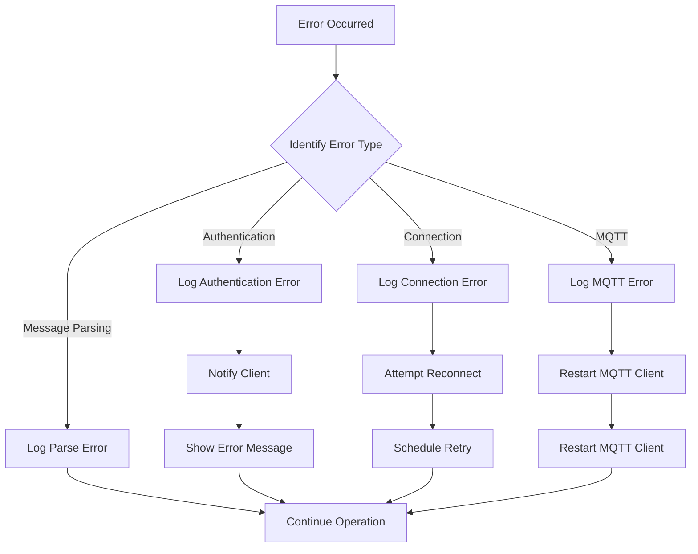

### Recovery Mechanisms

The system implements multiple recovery strategies:

1. **Automatic Reconnection**: WebSocket clients automatically attempt to reconnect every 5 seconds
2. **MQTT Reconnection**: MQTT client implements exponential backoff for broker reconnection
3. **Graceful Degradation**: HTTP API fallback when WebSocket is unavailable
4. **State Synchronization**: Clients request status updates after reconnection

**Section sources**
- [server.js:68-80](file://WebRadio_web/server.js#L68-L80)
- [app.js:174-178](file://WebRadio_web/public/app.js#L174-L178)

## Performance Considerations

### Connection Efficiency

The WebSocket bridge optimizes performance through several mechanisms:

1. **Selective Broadcasting**: Only clients with OPEN readyState receive messages
2. **Efficient Message Serialization**: JSON serialization minimizes bandwidth usage
3. **Connection Pooling**: Single MQTT client serves all WebSocket connections
4. **Memory Management**: Proper cleanup of WebSocket connections on close

### Scalability Factors

The current implementation supports multiple concurrent clients with minimal overhead:

- **Memory Usage**: Each WebSocket connection consumes ~1KB RAM
- **CPU Overhead**: Broadcasting overhead is negligible for up to 100 concurrent connections
- **Network Bandwidth**: Status updates are approximately 200-500 bytes per message
- **Latency**: Round-trip latency typically under 50ms

## Troubleshooting Guide

### Common Issues and Solutions

#### WebSocket Connection Problems

| Issue | Symptoms | Solution |
|-------|----------|----------|
| Authentication Failure | Connection closes immediately | Verify SECRET_TOKEN matches URL parameter |
| Connection Timeout | Connection established but no status | Check network connectivity to MQTT broker |
| Reconnection Loop | Frequent disconnections | Verify token persistence in localStorage |

#### Status Update Issues

| Issue | Symptoms | Solution |
|-------|----------|----------|
| Stale Status | UI shows old information | Check MQTT broker connectivity |
| Incomplete Updates | Some status fields missing | Verify hardware publishes all topics |
| Delayed Updates | Status changes lag behind | Check network latency to broker |

#### Command Delivery Problems

| Issue | Symptoms | Solution |
|-------|----------|----------|
| Commands Not Executed | No response to button presses | Verify MQTT broker is reachable |
| Wrong Command Sent | Unexpected behavior | Check command format and payload |
| No Acknowledgment | No status update after command | Verify hardware subscribes to Action topic |

### Debugging Tools

1. **Browser Developer Console**: Monitor WebSocket events and errors
2. **MQTT Explorer**: Verify message flow between components
3. **Server Logs**: Check authentication attempts and connection events
4. **Network Monitoring**: Use Wireshark to analyze WebSocket traffic

**Section sources**
- [server.js:224-238](file://WebRadio_web/server.js#L224-L238)
- [app.js:156-165](file://WebRadio_web/public/app.js#L156-L165)

## Conclusion

The WebSocket Bridge represents a sophisticated solution for real-time communication in the Webradio ecosystem. By combining secure token-based authentication, efficient message broadcasting, and robust error handling, it provides a reliable foundation for multi-platform control and monitoring.

Key strengths of the implementation include:

- **Security**: Token-based authentication prevents unauthorized access
- **Scalability**: Efficient broadcasting mechanism supports multiple concurrent clients
- **Resilience**: Comprehensive error handling and automatic reconnection
- **Flexibility**: Support for both WebSocket and HTTP API clients
- **Maintainability**: Clean separation of concerns with modular architecture

The bridge successfully bridges the gap between web-based interfaces and embedded hardware, enabling seamless real-time control and monitoring of the radio system across multiple platforms and devices.

Future enhancements could include connection multiplexing, message queuing for offline clients, and enhanced monitoring capabilities for production deployments.